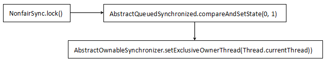
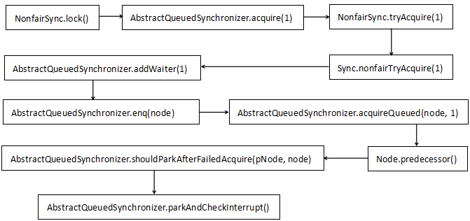
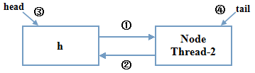

[TOC]


# java ReentrantLock实现原理深入探究

## **前言**

这篇文章被归到Java基础分类中，其实真的一点都不基础。网上写ReentrantLock的使用、ReentrantLock和synchronized的区别的文章很多，研究ReentrantLock并且能讲清楚ReentrantLock的原理的文章很少，本文就来研究一下ReentrantLock的实现原理。研究ReentrantLock的实现原理需要比较好的Java基础以及阅读代码的能力，有些朋友看不懂没关系，可以以后看，相信你一定会有所收获。

最后说一句，ReentrantLock是基于AQS实现的，这在下面会讲到，AQS的基础又是CAS，如果不是很熟悉CAS的朋友，可以看一下这篇文章[Unsafe与CAS](http://www.cnblogs.com/xrq730/p/4976007.html)。

 

## **AbstractQueuedSynchronizer**

ReentrantLock实现的前提就是AbstractQueuedSynchronizer，简称AQS，是java.util.concurrent的核心，CountDownLatch、FutureTask、Semaphore、ReentrantLock等都有一个内部类是这个抽象类的子类。先用两张表格介绍一下AQS。第一个讲的是Node，由于**AQS是基于FIFO队列的实现**，因此必然存在一个个节点，Node就是一个节点，Node里面有：

| **属    性**             | **定    义**                                                 |
| ------------------------ | ------------------------------------------------------------ |
| Node SHARED = new Node() | 表示Node处于共享模式                                         |
| Node EXCLUSIVE = null    | 表示Node处于独占模式                                         |
| int CANCELLED = 1        | 因为超时或者中断，Node被设置为取消状态，被取消的Node不应该去竞争锁，只能保持取消状态不变，不能转换为其他状态，处于这种状态的Node会被踢出队列，被GC回收 |
| int SIGNAL = -1          | 表示这个Node的继任Node被阻塞了，到时需要通知它               |
| int CONDITION = -2       | 表示这个Node在条件队列中，因为等待某个条件而被阻塞           |
| int PROPAGATE = -3       | 使用在共享模式头Node有可能处于这种状态， 表示锁的下一次获取可以无条件传播 |
| int waitStatus           | 0，新Node会处于这种状态                                      |
| Node prev                | 队列中某个Node的前驱Node                                     |
| Node next                | 队列中某个Node的后继Node                                     |
| Thread thread            | 这个Node持有的线程，表示等待锁的线程                         |
| Node nextWaiter          | 表示下一个等待condition的Node                                |

看完了Node，下面再看一下AQS中有哪些变量和方法：

| **属性/方法**                                              | **含    义**                                                 |
| ---------------------------------------------------------- | ------------------------------------------------------------ |
| Thread exclusiveOwnerThread                                | 这个是AQS父类AbstractOwnableSynchronizer的属性，表示独占模式同步器的当前拥有者 |
| Node                                                       | 上面已经介绍过了，FIFO队列的基本单位                         |
| Node head                                                  | FIFO队列中的头Node                                           |
| Node tail                                                  | FIFO队列中的尾Node                                           |
| int state                                                  | 同步状态，0表示未锁                                          |
| int getState()                                             | 获取同步状态                                                 |
| setState(int newState)                                     | 设置同步状态                                                 |
| boolean compareAndSetState(int expect, int update)         | 利用CAS进行State的设置                                       |
| long spinForTimeoutThreshold = 1000L                       | 线程自旋等待的时间                                           |
| Node enq(final Node node)                                  | 插入一个Node到FIFO队列中                                     |
| Node addWaiter(Node mode)                                  | 为当前线程和指定模式创建并扩充一个等待队列                   |
| void setHead(Node node)                                    | 设置队列的头Node                                             |
| void unparkSuccessor(Node node)                            | 如果存在的话，唤起Node持有的线程                             |
| void doReleaseShared()                                     | 共享模式下做释放锁的动作                                     |
| void cancelAcquire(Node node)                              | 取消正在进行的Node获取锁的尝试                               |
| boolean shouldParkAfterFailedAcquire(Node pred, Node node) | 在尝试获取锁失败后是否应该禁用当前线程并等待                 |
| void selfInterrupt()                                       | 中断当前线程本身                                             |
| boolean parkAndCheckInterrupt()                            | 禁用当前线程进入等待状态并中断线程本身                       |
| boolean acquireQueued(final Node node, int arg)            | 队列中的线程获取锁                                           |
| tryAcquire(int arg)                                        | 尝试获得锁（**由AQS的子类实现它**）                          |
| tryRelease(int arg)                                        | 尝试释放锁（**由AQS的子类实现它**）                          |
| isHeldExclusively()                                        | 是否独自持有锁                                               |
| acquire(int arg)                                           | 获取锁                                                       |
| release(int arg)                                           | 释放锁                                                       |
| compareAndSetHead(Node update)                             | 利用CAS设置头Node                                            |
| compareAndSetTail(Node expect, Node update)                | 利用CAS设置尾Node                                            |
| compareAndSetWaitStatus(Node node, int expect, int update) | 利用CAS设置某个Node中的等待状态                              |

上面列出了AQS中最主要的一些方法和属性。**整个AQS是典型的模板模式的应用**，设计得十分精巧，对于FIFO队列的各种操作在AQS中已经实现了，**AQS的子类一般只需要重写tryAcquire(int arg)和tryRelease(int arg)两个方法即可**。

 

## ReentrantLock的实现

### lock()

ReentrantLock中有一个抽象类Sync： 

```java
private final Sync sync;

    /**
     * Base of synchronization control for this lock. Subclassed
     * into fair and nonfair versions below. Uses AQS state to
     * represent the number of holds on the lock.
     */
    abstract static class Sync extends AbstractQueuedSynchronizer {
    ...
    }
```

ReentrantLock根据传入构造方法的布尔型参数实例化出Sync的实现类FairSync和NonfairSync，分别表示公平的Sync和非公平的Sync。由于ReentrantLock我们用的比较多的是非公平锁，所以看下非公平锁是如何实现的。假设线程1调用了ReentrantLock的lock()方法，那么线程1将会独占锁，整个调用链十分简单：



第一个获取锁的线程就做了两件事情：

**1、设置AbstractQueuedSynchronizer的state为1**

**2、设置AbstractOwnableSynchronizer的thread为当前线程**

这两步做完之后就表示线程1独占了锁。然后线程2也要尝试获取同一个锁，在线程1没有释放锁的情况下必然是行不通的，所以线程2就要阻塞。那么，线程2如何被阻塞？看下线程2的方法调用链，这就比较复杂了：



调用链看到确实非常长，没关系，结合代码分析一下，其实ReentrantLock没有那么复杂，我们一点点来扒代码：

```
final void lock() {
    if (compareAndSetState(0, 1))
        setExclusiveOwnerThread(Thread.currentThread());
    else
        acquire(1);
}
```

首先线程2尝试利用CAS去判断state是不是0，是0就设置为1，当然这一步操作肯定是失败的，因为线程1已经将state设置成了1，所以第2行必定是false，因此线程2走第5行的acquire方法：

```java
public final void acquire(int arg) {
    if (!tryAcquire(arg) &&
        acquireQueued(addWaiter(Node.EXCLUSIVE), arg))
        selfInterrupt();
}
```

从字面上就很好理解这个if的意思，先走第一个判断条件尝试获取一次锁，如果获取的结果为false即失败，走第二个判断条件添加FIFO等待队列。所以先看一下tryAcquire方法做了什么，这个方法最终调用到的是Sync的nonfairTryAcquire方法：

```java
final boolean nonfairTryAcquire(int acquires) {
    final Thread current = Thread.currentThread();
    int c = getState();
    if (c == 0) {
        if (compareAndSetState(0, acquires)) {
            setExclusiveOwnerThread(current);
            return true;
        }
    }
    else if (current == getExclusiveOwnerThread()) {
        int nextc = c + acquires;
        if (nextc < 0) // overflow
            throw new Error("Maximum lock count exceeded");
        setState(nextc);
        return true;
    }
    return false;
}
```


由于state是volatile的，所以state对线程2具有可见性，线程2拿到最新的state，再次判断一下能否持有锁（可能线程1同步代码执行得比较快，这会儿已经释放了锁），不可以就返回false。

注意一下第10~第16行，这段代码的作用是让某个线程可以多次调用同一个ReentrantLock，每调用一次给state+1，由于某个线程已经持有了锁，所以这里不会有竞争，因此不需要利用CAS设置state（**相当于一个偏向锁**）。从这段代码可以看到，nextc每次加1，当nextc<0的时候抛出error，那么同一个锁最多能重入Integer.MAX_VALUE次，也就是2147483647。

然后就走到if的第二个判断里面了，先走AQS的addWaiter方法：

```
private Node addWaiter(Node mode) {
    Node node = new Node(Thread.currentThread(), mode);
    // Try the fast path of enq; backup to full enq on failure
    Node pred = tail;
    if (pred != null) {
        node.prev = pred;
        if (compareAndSetTail(pred, node)) {
            pred.next = node;
            return node;
        }
    }
    enq(node);
    return node;
}
```

先创建一个当前线程的Node，模式为独占模式（因为传入的mode是一个NULL），再判断一下队列上有没有节点，没有就创建一个队列，因此走enq方法：

```
private Node enq(final Node node) {
    for (;;) {
        Node t = tail;
        if (t == null) { // Must initialize
            Node h = new Node(); // Dummy header
            h.next = node;
            node.prev = h;
            if (compareAndSetHead(h)) {
                tail = node;
                return h;
            }
        }
        else {
            node.prev = t;
            if (compareAndSetTail(t, node)) {
                t.next = node;
                return t;
            }
        }
    }
}
```

这个方法其实画一张图应该比较好理解，形成一个队列之后应该是这样的：



每一步都用图表示出来了，由于线程2所在的Node是第一个要等待的Node，因此FIFO队列上肯定没有内容，tail为null，走的就是第4行~第10行的代码逻辑。这里用了CAS设置头Node，当然有可能线程2设置头Node的时候CPU切换了，线程3已经把头Node设置好了形成了上图所示的一个队列，这时线程2再循环一次获取tail，由于tail是volatile的，所以对线程2可见，线程2看见tail不为null，就走到了13行的else里面去往尾Node后面添加自身。整个过程下来，形成了一个双向队列。最后走AQS的acquireQueued(node, 1)：

```
final boolean acquireQueued(final Node node, int arg) {
    try {
        boolean interrupted = false;
        for (;;) {
            final Node p = node.predecessor();
            if (p == head && tryAcquire(arg)) {
                setHead(node);
                p.next = null; // help GC
                return interrupted;
            }
            if (shouldParkAfterFailedAcquire(p, node) &&
                parkAndCheckInterrupt())
                interrupted = true;
        }
    } catch (RuntimeException ex) {
        cancelAcquire(node);
        throw ex;
    }
}
```

此时再做判断，由于线程2是双向队列的真正的第一个Node（前面还有一个h），所以第5行~第10行再次判断一下线程2能不能获取锁（可能这段时间内线程1已经执行完了把锁释放了，state从1变为了0），如果还是不行，先调用AQS的shouldParkAfterFailedAcquire(p, node)方法：

```
private static boolean shouldParkAfterFailedAcquire(Node pred, Node node) {
    int s = pred.waitStatus;
    if (s < 0)
        /*
         * This node has already set status asking a release
         * to signal it, so it can safely park
         */
        return true;
    if (s > 0) {
        /*
         * Predecessor was cancelled. Skip over predecessors and
         * indicate retry.
         */
    do {
    node.prev = pred = pred.prev;
    } while (pred.waitStatus > 0);
    pred.next = node;
}
    else
        /*
         * Indicate that we need a signal, but don't park yet. Caller
         * will need to retry to make sure it cannot acquire before
         * parking.
         */
         compareAndSetWaitStatus(pred, 0, Node.SIGNAL);
    return false;
}
```

吐槽一下先，这段代码的代码格式真糟糕（看来JDK的开发大牛们也有写得不好的地方），这个waitStatus是h的waitStatus，很明显是0，所以此时把h的waitStatus设置为Noed.SIGNAL即-1并返回false。既然返回了false，上面的acquireQueued的11行if自然不成立，再走一次for循环，还是先尝试获取锁，不成功，继续走shouldParkAfterFailedAcquire，此时waitStatus为-1，小于0，走第三行的判断，返回true。然后走acquireQueued的11行if的第二个判断条件parkAndCheckInterrupt：

```
private final boolean parkAndCheckInterrupt() {
    LockSupport.park(this);
    return Thread.interrupted();
}
public static void park(Object blocker) {
    Thread t = Thread.currentThread();
    setBlocker(t, blocker);
    unsafe.park(false, 0L);
    setBlocker(t, null);
}
```

最后一步，调用LockSupport的park方法阻塞住了当前的线程。至此，使用ReentrantLock让线程1独占锁、线程2进入FIFO队列并阻塞的完整流程已经整理出来了。

lock()的操作明了之后，就要探究一下unlock()的时候代码又做了什么了，接着看下一部分。

 

### unlock()

unlock()的时候做了什么,就不画流程图了，直接看一下代码流程，比较简单，调用ReentrantLock的unlock方法：

```
public void unlock() {
    sync.release(1);
}
```

走AQS的release：

```
public final boolean release(int arg) {
    if (tryRelease(arg)) {
        Node h = head;
        if (h != null && h.waitStatus != 0)
           unparkSuccessor(h);
        return true;
    }
    return false;
}
```


先调用Sync的tryRelease尝试释放锁：


```
 1 protected final boolean tryRelease(int releases) {
 2     int c = getState() - releases;
 3     if (Thread.currentThread() != getExclusiveOwnerThread())
 4         throw new IllegalMonitorStateException();
 5     boolean free = false;
 6     if (c == 0) {
 7         free = true;
 8         setExclusiveOwnerThread(null);
 9     }
10     setState(c);
11     return free;
12 }
```


首先，只有当c==0的时候才会让free=true，这和上面一个线程多次调用lock方法累加state是对应的，调用了多少次的lock()方法自然必须调用同样次数的unlock()方法才行，这样才把一个锁给全部解开。

当一条线程对同一个ReentrantLock全部解锁之后，AQS的state自然就是0了，AbstractOwnableSynchronizer的exclusiveOwnerThread将被设置为null，这样就表示没有线程占有锁，方法返回true。代码继续往下走，上面的release方法的第四行，h不为null成立，h的waitStatus为-1，不等于0也成立，所以走第5行的unparkSuccessor方法：


```
 1 private void unparkSuccessor(Node node) {
 2     /*
 3      * Try to clear status in anticipation of signalling.  It is
 4      * OK if this fails or if status is changed by waiting thread.
 5      */
 6     compareAndSetWaitStatus(node, Node.SIGNAL, 0);
 7 
 8     /*
 9      * Thread to unpark is held in successor, which is normally
10      * just the next node.  But if cancelled or apparently null,
11      * traverse backwards from tail to find the actual
12      * non-cancelled successor.
13      */
14     Node s = node.next;
15     if (s == null || s.waitStatus > 0) {
16         s = null;
17         for (Node t = tail; t != null && t != node; t = t.prev)
18             if (t.waitStatus <= 0)
19                 s = t;
20    }
21     if (s != null)
22         LockSupport.unpark(s.thread);
23 }
```


s即h的下一个Node，这个Node里面的线程就是线程2，由于这个Node不等于null，所以走21行，线程2被unPark了，得以运行。有一个很重要的问题是：锁被解了怎样保证整个FIFO队列减少一个Node呢？这是一个很巧妙的设计，又回到了AQS的acquireQueued方法了：


```
 1 final boolean acquireQueued(final Node node, int arg) {
 2     try {
 3         boolean interrupted = false;
 4         for (;;) {
 5             final Node p = node.predecessor();
 6             if (p == head && tryAcquire(arg)) {
 7                 setHead(node);
 8                 p.next = null; // help GC
 9                 return interrupted;
10             }
11             if (shouldParkAfterFailedAcquire(p, node) &&
12                 parkAndCheckInterrupt())
13                 interrupted = true;
14         }
15     } catch (RuntimeException ex) {
16         cancelAcquire(node);
17         throw ex;
18     }
19 }
```


**被阻塞的线程2是被阻塞在第12行，注意这里并没有return语句，也就是说，阻塞完成线程2依然会进行for循环**。然后，阻塞完成了，线程2所在的Node的前驱Node是p，线程2尝试tryAcquire，成功，然后线程2就成为了head节点了，把p的next设置为null，这样原头Node里面的所有对象都不指向任何块内存空间，h属于栈内存的内容，方法结束被自动回收，这样随着方法的调用完毕，原头Node也没有任何的引用指向它了，这样它就被GC自动回收了。此时，遇到一个return语句，acquireQueued方法结束，后面的Node也是一样的原理。

这里有一个细节，看一下setHead方法：

```
private void setHead(Node node) {
    head = node;
    node.thread = null;
    node.prev = null;
}
```

setHead方法里面的前驱Node是Null，也没有线程，那么为什么不用一个在等待的线程作为Head Node呢？

因为一个线程随时有可能因为中断而取消，而取消的话，Node自然就要被GC了，那GC前必然要把头Node的后继Node变为一个新的头而且要应对多种情况，这样就很麻烦。用一个没有thread的Node作为头，相当于起了一个引导作用，因为head没有线程，自然也不会被取消。

再看一下上面unparkSuccessor的14行~20行，就是为了防止head的下一个node被取消的情况，这样，就从尾到头遍历，找出离head最近的一个node，对这个node进行unPark操作。

 

## **ReentrantLock其他方法的实现**

如果能理解ReentrantLock的实现方式，那么你会发现ReentrantLock中其余一些方法的实现还是很简单的，从JDK API关于ReentrantLock方法的介绍这部分，举几个例子：

1、int getHoldCount()

```
final int getHoldCount() {
    return isHeldExclusively() ? getState() : 0;
}
```

获取ReentrantLock的lock()方法被调用了几次，就是state的当前值

2、Thread getOwner()

```
final Thread getOwner() {
    return getState() == 0 ? null : getExclusiveOwnerThread();
}
```

获取当前占有锁的线程，就是AbstractOwnableSynchronizer中exclusiveOwnerThread的值

3、Collection<Thread> getQueuedThreads()

```
public final Collection<Thread> getQueuedThreads() {
    ArrayList<Thread> list = new ArrayList<Thread>();
    for (Node p = tail; p != null; p = p.prev) {
        Thread t = p.thread;
        if (t != null)
            list.add(t);
    }
    return list;
}
```

从尾到头遍历一下，添加进ArrayList中

4、int getQueuedLength()

```
public final int getQueueLength() {
    int n = 0;
    for (Node p = tail; p != null; p = p.prev) {
        if (p.thread != null)
            ++n;
    }
    return n;
}
```


从尾到头遍历一下，累加n。当然这个方法和上面那个方法可能是不准确的，因为遍历的时候可能别的线程又往队列尾部添加了Node。

其余方法也都差不多，可以自己去看一下。

 


<https://www.cnblogs.com/xrq730/p/4979021.html>