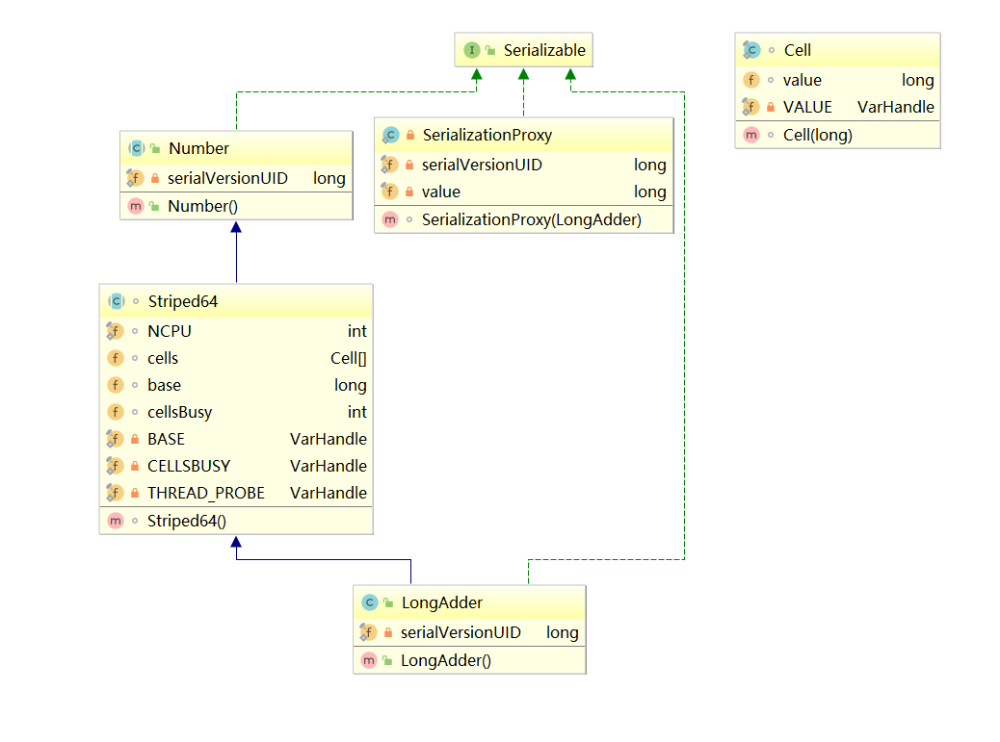
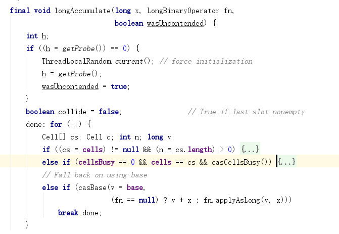
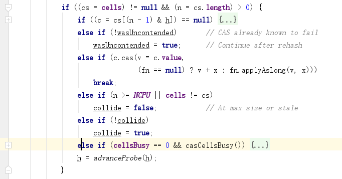
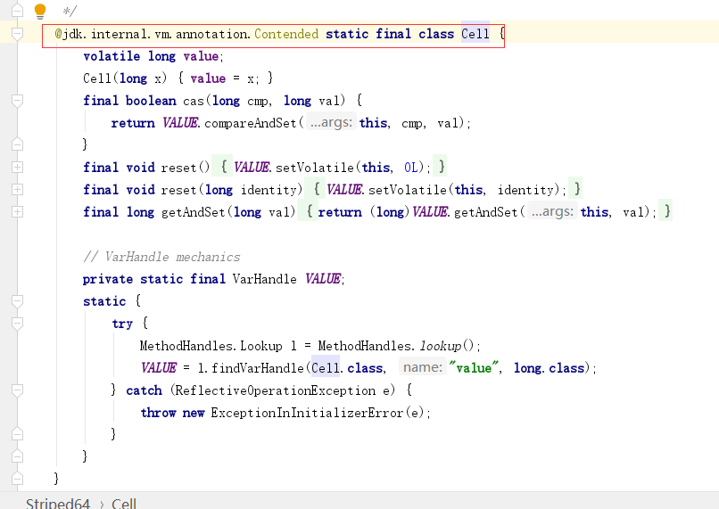

[TOC]


# CAS、原子操作类的应用与浅析及Java8对其的优化

前几天刷朋友圈的时候，看到一段话：**如果现在我是傻逼，那么我现在不管怎么努力，也还是傻逼，因为我现在的傻逼是由以前决定的，现在努力，是为了让以后的自己不再傻逼**。话糙理不糙，如果妄想现在努力一下，马上就不再傻逼，那是不可能的，需要积累，需要沉淀，才能慢慢的不再傻逼。

好了，鸡汤喝完。

今天我们的内容是CAS以及原子操作类应用与源码浅析，还会利用CAS来完成一个单例模式，还涉及到伪共享等。因为CAS是并发框架的基石，所以相当重要，这篇博客是一个长文，请做好准备。

说到CAS，不得不提到两个专业词语：悲观锁，乐观锁。我们先来看看什么是悲观锁，什么是乐观锁。

### 悲观锁，乐观锁

第一次看到悲观锁，乐观锁的时候，应该是在应付面试，看面试题的时候。有这么一个例子：如何避免多线程对数据库中的同一条记录进行修改。

#### 悲观锁

如果是mysql数据库，利用for update关键字+事务。这样的效果就是当A线程走到for update的时候，会把指定的记录上锁，然后B线程过来，就只能等待，A线程修改完数据之后，提交事务，锁就被释放了，这个时候B线程终于可以继续做他的事情了。悲观锁往往是互斥的：只有我一个人可以进来，其他人都给我等着。这么做是相当影响性能的。

#### 乐观锁

在数据表中加一个版本号的字段：version，这个字段不需要程序员手动维护，是数据库主动维护的，每次修改数据，version都会发生更改。

当version现在是1：

1. A线程进来，读到version是1。
2. B线程进来，读到version是1。
3. A线程执行了更新的操作：update stu set name='codebear' where id=1 and version=1。成功。数据库主动把version改成了2。
4. B线程执行了更新的操作：update stu set name='hello' where id=1 and version=1。失败。因为这个时候version字段已经不是1了。

乐观锁其实不能叫锁，它没有锁的概念。

在Java中，也有悲观锁，乐观锁的概念，悲观锁的典型代表就是Synchronized，而乐观锁的典型代表就是今天要说的CAS。而说CAS之前，先要说下原子操作类，因为CAS是原子操作类的基石，我们先要看看原子操作类的强大之处，从而产生探究CAS的兴趣。

### 原子操作类的应用

我们先来看看原子操作类的应用。在Java中提供了很多原子操作类，比如AtomicInteger，其中有一个自增方法。

```java
public class Main {
    public static void main(String[] args) {
        Thread[] threads = new Thread[20];
        AtomicInteger atomicInteger = new AtomicInteger();
        for (int i = 0; i < 20; i++) {
            threads[i] = new Thread(() -> {
                for (int j = 0; j < 1000; j++) {
                    atomicInteger.incrementAndGet();
                }
            });
            threads[i].start();
        }
        join(threads);
        System.out.println("x=" + atomicInteger.get());
    }

    private static void join(Thread[] threads) {
        for (int i = 0; i < 20; i++) {
            try {
                threads[i].join();
            } catch (InterruptedException e) {
                e.printStackTrace();
            }
        }
    }
} 
```

运行结果：

```
x=20000
```

这就是原子操作类的神奇之处了，在高并发的情况下，这种方法会比Synchronized更有优势，毕竟Synchronized关键字会让代码串行化，失去了多线程优势。

我们再来看个案例：

如果有一个需求，一个字段的初始值为0，开三个线程：

1. 一个线程执行：当x=0，x修改为100
2. 一个线程执行：当x=100，x修改为50
3. 一个线程执行：当x=50，x修改为60

```java
    public static void main(String[] args) {
        AtomicInteger atomicInteger=new AtomicInteger();
        new Thread(() -> {
            if(!atomicInteger.compareAndSet(0,100)){
                System.out.println("0-100:失败");
            }
        }).start();

        new Thread(() -> {
            try {
                Thread.sleep(500);////注意这里睡了一会儿，目的是让第三个线程先执行判断的操作，从而让第三个线程修改失败
            } catch (InterruptedException e) {
                e.printStackTrace();
            }
            if(!atomicInteger.compareAndSet(100,50)){
                System.out.println("100-50:失败");
            }
        }).start();

        new Thread(() -> {
            if(!atomicInteger.compareAndSet(50,60)){
                System.out.println("50-60:失败");
            }
        }).start();

        try {
            Thread.sleep(1000);
        } catch (InterruptedException e) {
            e.printStackTrace();
        }
    } 
```

运行结果也是一样的：

```
50-60:失败
```

这个例子好像没有什么意思啊，甚至有点无聊，为什么要举这个例子呢，因为在这里，我所调用的方法compareAndSet，首字母就是CAS，而且传递了两个参数，这两个参数是在原生CAS操作中必须要传递的，离原生的CAS操作更近一些。

既然原子操作类那么牛逼，我们很有必要探究下原子操作类的基石：CAS。

### CAS

CAS的全称是Compare And Swap，即比较交换，当然还有一种说法：Compare And Set，调用原生CAS操作需要确定三个值：

- 要更新的字段
- 预期值
- 新值

其中，要更新的字段（变量）有时候会被拆分成两个参数：1.实例 2.偏移地址。

也许你看到这里，会觉得云里雾里，不知道我在说什么，没关系，继续硬着头皮看下去。

我们先来看看compareAndSet的源码。

#### compareAndSet源码浅析

首先，调用这个方法需要传递两个参数，一个是预期值，一个是新值，这个预期值就相当于数据库乐观锁版本号的概念，新值就是我们希望修改的值（是值，不是字段）。我们来看看这个方法的内部实现：

```
 public final boolean compareAndSet(int expect, int update) {
        return unsafe.compareAndSwapInt(this, valueOffset, expect, update);
    } 
```

调用了unsafe下的compareAndSwapInt方法，除了传递了我们传到此方法的两个参数之外，又传递了两个参数，这两个参数就是我上面说的实例和偏移地址，this代表是当前类的实例，即AtomicInteger类的实例，这个偏移地址又是什么鬼呢，说的简单点，就是确定我们需要修改的字段在实例的哪个位置。知道了实例，知道了我们的需要修改的字段是在实例的哪个位置，就可以确定这个字段了。不过，这个确定的过程不是在Java中做的，而是在更底层做的。

偏移地址是在本类的静态代码块中获得的：

```
    private static final long valueOffset;

    static {
        try {
            valueOffset = unsafe.objectFieldOffset
                (AtomicInteger.class.getDeclaredField("value"));
        } catch (Exception ex) { throw new Error(ex); }
    } 
```

unsafe.objectFieldOffset接收的是Field类型的参数，得到的就是对应字段的偏移地址了，这里就是获得value字段在本类，即AtomicInteger中的偏移地址。

我们在来看看value字段的定义：

```
 private volatile int value; 
```

volatile是为了保证内存的可见性。

大家肯定想一探究竟compareAndSwapInt和objectFieldOffset这两个方法中做了什么事情，很遗憾，个人水平有限，目前还没有能力去探究，只知道这种写法是JNI，会调用到C或者C++，最终会把对应的指令发送给CPU，这是可以保证**原子性**的。

我们可以看下这两个方法的定义：

```
public final native boolean compareAndSwapInt(Object var1, long var2, int var4, int var5);
public native long objectFieldOffset(Field var1); 
```

这两个方法被native标记了。

我们来为compareAndSwapInt方法做一个比较形象的解释：

当我们执行compareAndSwapInt方法，传入10和100，Java会和更底层进行通信：老铁，我给你了字段的所属实例和偏移地址，你帮我看下这个字段的值是不是10，如果是10的话，你就改成100，并且返回true，如果不是的话，不用修改，返回false把。

其中比较的过程就是compare，修改的值的过程就是swap，因为是把旧值替换成新值，所以我们把这样的操作称为CAS。

我们再来看看incrementAndGet的源码。

#### incrementAndGet源码浅析

```
    public final int incrementAndGet() {
        return unsafe.getAndAddInt(this, valueOffset, 1) + 1;
    } 
    public final int getAndAddInt(Object var1, long var2, int var4) {
        int var5;
        do {
            var5 = this.getIntVolatile(var1, var2);
        } while(!this.compareAndSwapInt(var1, var2, var5, var5 + var4));

        return var5;
    } 
```

incrementAndGet方法会调到用getAndAddInt方法，这里有三个参数：

- var1：实例。
- var2：偏移地址。
- var4：需要自增的值，这里是1。

getAndAddInt方法内部有一个while循环，循环体内部根据实例和偏移地址获得对应的值，这里先称为A，再来看看while里面的判断内容，JDK和更底层进行通讯：嘿，我把实例和偏移地址给你，你帮我看下这个值是不是A，如果是的话，帮我修改成A+1，返回true，如果不是的话，返回false吧。

这里要思考一个问题：为什么需要while循环？

比如同时有两个线程执行到了getIntVolatile方法，拿到的值都是10，其中线程A执行native方法，修改成功，但是线程B就修改失败了啊，因为CAS操作是可以保证原子性的，所以线程B只能苦逼的再一次循环，这一次拿到的值是11，又去执行native方法，修改成功。

像这样的while循环，有一个高大上的称呼：**CAS自旋**。

让我们试想一下，如果现在并发真的很高很高，会出现什么事情？大量的线程在进行CAS自旋，这太浪费CPU了吧。所以在Java8之后，对原子操作类进行了一定的优化，这个我们后面再说。

可能大家对于原子操作类的底层实现，还是比较迷茫，还是不知道unsafe下面的方法到底是什么意思，毕竟刚才只是简单的读了下代码，俗话说“**纸上得来终觉浅，绝知此事要躬行**”，所以我们需要自己调用下unsafe下面的方法，来加深理解。

### Unsafe

Unsafe：不安全的，既然有这样的命名，说明这个类是比较危险的，Java官方也不推荐我们直接操作Unsafe类，但是毕竟现在是学习阶段，写写demo而已，只要不是发布到生产环境，又有什么关系呢？

Unsafe下面的方法还是比较多的，我们选择几个方法来看下，最终我们会利用这几个方法来完成一个demo。

objectFieldOffset：接收一个Field类型的数据，返回偏移地址。 compareAndSwapInt：比较交换，接收四个参数：实例，偏移地址，预期值，新值。 getIntVolatile：获得值，支持Volatile，接收两个参数：实例，偏移地址。

这三个方法在上面的源码浅析中，已经出现过了，也进行了一定的解释，这里再解释一下，就是为了加深印象，我在学习CAS的时候，也是反复的看博客，看源码，突然恍然大悟。我们需要用这三个方法来完成一个demo：写一个原子操作自增的方法，自增的值可以自定义，没错，这个方法上面我已经分析过了。下面直接放出代码：

```java
public class MyAtomicInteger {

    private volatile int value;

    private static long offset;//偏移地址

    private static Unsafe unsafe;

    static {
        try {
            Field theUnsafeField = Unsafe.class.getDeclaredField("theUnsafe");
            theUnsafeField.setAccessible(true);
            unsafe = (Unsafe) theUnsafeField.get(null);
            Field field = MyAtomicInteger.class.getDeclaredField("value");
            offset = unsafe.objectFieldOffset(field);//获得偏移地址
        } catch (Exception e) {
            e.printStackTrace();
        }
    }

    public void increment(int num) {
        int tempValue;
        do {
            tempValue = unsafe.getIntVolatile(this, offset);//拿到值
        } while (!unsafe.compareAndSwapInt(this, offset, tempValue, value + num));//CAS自旋
    }

    public int get() {
        return value;
    }
}
 
public class Main {
    public static void main(String[] args) {
        Thread[] threads = new Thread[20];
        MyAtomicInteger atomicInteger = new MyAtomicInteger();
        for (int i = 0; i < 20; i++) {
            threads[i] = new Thread(() -> {
                for (int j = 0; j < 1000; j++) {
                    atomicInteger.increment(1);
                }
            });
            threads[i].start();
        }
        for (int i = 0; i < threads.length; i++) {
            try {
                threads[i].join();
            } catch (InterruptedException e) {
                e.printStackTrace();
            }
        }
        System.out.println("x=" + atomicInteger.get());
    }
} 
```

运行结果：

```
x=20000
```

你可能会有疑问，为什么需要用反射来获取theUnsafe，其实这是JDK为了保护我们，让我们无法方便的获得unsafe，如果我们和JDK一样来获得unsafe会报错：

```
    @CallerSensitive
    public static Unsafe getUnsafe() {
        Class var0 = Reflection.getCallerClass();
        if (!VM.isSystemDomainLoader(var0.getClassLoader())) {
            throw new SecurityException("Unsafe");//如果我们也以getUnsafe来获得theUnsafe，会抛出异常
        } else {
            return theUnsafe;
        }
    } 
```

### CAS与单例模式

对的，你没看错，我也没写错，用CAS也可以完成单例模式，虽然在正常开发中，不会有人用CAS来完成单例模式，但是是检验是否学会CAS的一个很好的题目。

```java
public class Singleton {
    private Singleton() {
    }

    private static AtomicReference<Singleton> singletonAtomicReference = new AtomicReference<>();

    public static Singleton getInstance() {
        while (true) {
            Singleton singleton = singletonAtomicReference.get();// 获得singleton
            if (singleton != null) {// 如果singleton不为空，就返回singleton
                return singleton;
            }
            // 如果singleton为空，创建一个singleton
            singleton = new Singleton();
            // CAS操作，预期值是NULL，新值是singleton
            // 如果成功，返回singleton
            // 如果失败，进入第二次循环，singletonAtomicReference.get()就不会为空了
            if (singletonAtomicReference.compareAndSet(null, singleton)) {
                return singleton;
            }
        }
    }
} 
```

注释写的已经比较清楚了，可以对着注释，再好好理解一下。

### ABA

compareAndSet方法，上面已经写过一个demo，大家可以也试着分析下源码，我就不再分析了，我之所以要再次提到compareAndSet方法，是为了引出一个问题。

假设有三个步骤：

1. 修改150为50
2. 修改50为150
3. 修改150为90

请仔细看，这三个步骤做的事情，一个变量刚开始是150，修改成了50，后来又被修改成了150！（又改回去了），最后如果这个变量是150，再改成90。这就是CAS中ABA的问题。

第三步，判断这个值是否是150，有两种不同的需求：

- 没错啊，虽然这个值被修改了，但是现在被改回去了啊，所以第三步的判断是成立的。
- 不对，这个值虽然是150，但是这个值曾经被修改过，所以第三步的判断是不成立的。

针对于第二个需求，我们可以用AtomicStampedReference来解决这个问题，AtomicStampedReference支持泛型，其中有一个stamp的概念。下面直接贴出代码：

```java
    public static void main(String[] args) {
        try {
            AtomicStampedReference<Integer> atomicStampedReference = new AtomicStampedReference<Integer>(150, 0);
            Thread thread1 = new Thread(() -> {
                Integer oldValue = atomicStampedReference.getReference();
                int stamp = atomicStampedReference.getStamp();
                if (atomicStampedReference.compareAndSet(oldValue, 50, 0, stamp + 1)) {
                    System.out.println("150->50 成功:" + (stamp + 1));
                }
            });
            thread1.start();

            Thread thread2 = new Thread(() -> {
                try {
                    Thread.sleep(1000);//睡一会儿，是为了保证线程1 执行完毕
                } catch (InterruptedException e) {
                    e.printStackTrace();
                }
                Integer oldValue = atomicStampedReference.getReference();
                int stamp = atomicStampedReference.getStamp();
                if (atomicStampedReference.compareAndSet(oldValue, 150, stamp, stamp + 1)) {
                    System.out.println("50->150 成功:" + (stamp + 1));
                }
            });
            thread2.start();

            Thread thread3 = new Thread(() -> {
                try {
                    Thread.sleep(2000);//睡一会儿，是为了保证线程1，线程2 执行完毕
                } catch (InterruptedException e) {
                    e.printStackTrace();
                }
                Integer oldValue = atomicStampedReference.getReference();
                int stamp = atomicStampedReference.getStamp();
                if (atomicStampedReference.compareAndSet(oldValue, 90, 0, stamp + 1)) {
                    System.out.println("150->90 成功:" + (stamp + 1));
                }
            });
            thread3.start();

            thread1.join();
            thread2.join();
            thread3.join();
            System.out.println("现在的值是" + atomicStampedReference.getReference() + ";stamp是" + atomicStampedReference.getStamp());
        } catch (Exception e) {
            e.printStackTrace();
        }
    } 
```

### Java8对于原子操作类的优化

在进行incrementAndGet源码解析的时候，说到一个问题：在高并发之下，N多线程进行自旋竞争同一个字段，这无疑会给CPU造成一定的压力，所以在Java8中，提供了更完善的原子操作类：LongAdder。

我们简单的说下它做了下什么优化，它内部维护了一个数组Cell[]和base，Cell里面维护了value，在出现竞争的时候，JDK会根据算法，选择一个Cell，对其中的value进行操作，如果还是出现竞争，会换一个Cell再次尝试，最终把Cell[]里面的value和base相加，得到最终的结果。

因为其中的代码比较复杂，我就选择几个比较重要的问题，带着问题去看源码：

1. Cell[]是何时被初始化的。
2. 如果没有竞争，只会对base进行操作，这是从哪里看出来的。
3. 初始化Cell[]的规则是什么。
4. Cell[]扩容的时机是什么。
5. 初始化Cell[]和扩容Cell[]是如何保证线程安全性的。

这是LongAdder类的UML图：




add方法：

```
 public void add(long x) {
        Cell[] cs; long b, v; int m; Cell c;
        if ((cs = cells) != null || !casBase(b = base, b + x)) {//第一行
            boolean uncontended = true;
            if (cs == null || (m = cs.length - 1) < 0 ||//第二行
                (c = cs[getProbe() & m]) == null ||//第三行
                !(uncontended = c.cas(v = c.value, v + x)))//第四行
                longAccumulate(x, null, uncontended);//第五行
        }
    } 
```

第一行： ||判断，前者是判断cs=cells是否【不为空】，后者是判断CAS是否【不成功】 。 casBase做什么了?

```
final boolean casBase(long cmp, long val) {
        return BASE.compareAndSet(this, cmp, val);
}
复制代码
```

这个比较简单，就是调用compareAndSet方法，判断是否成功：

- 如果当前没有竞争，返回true。
- 如果当前有竞争，有线程会返回false。

再回到第一行，整体解释下这个判断：如果cell[]已经被初始化了，或者有竞争，才会进入到第二行代码。如果没有竞争，也没有初始化，就不会进入到第二行代码。

这就回答了第二个问题：如果没有竞争，只会对base进行操作，是从这里看出来的。

第二行代码： ||判断，前者判断cs是否【为NULL】，后者判断（cs的长度-1）是否【大于0】。这两个判断，应该都是判断Cell[]是否初始化的。如果没有初始化，会进入第五行代码。

第三行代码： 如果cell进行了初始化，通过【getProbe() & m】算法得到一个数字，判断cs[数字]是否【为NULL】,并且把cs[数字]赋值给了c，如果【为NULL】，会进入第五行代码。 我们需要简单的看下getProbe() 中做了什么：

```
    static final int getProbe() {
        return (int) THREAD_PROBE.get(Thread.currentThread());
    }

    private static final VarHandle THREAD_PROBE;
复制代码
```

我们只要知道这个算法是根据THREAD_PROBE算出来的即可。

第四行代码： 对c进行了CAS操作，看是否成功，并且把返回值赋值给uncontended，如果当前没有竞争，就会成功，如果当前有竞争，就会失败，在外面有一个!()，所以CAS失败了，会进入第五行代码。需要注意的是，这里已经是对Cell元素进行操作了。

第五行代码： 这方法内部非常复杂，我们先看下方法的整体：




有三个if： 1.判断cells是否被初始化了，如果被初始化了，进入这个if。

这里面又包含了6个if，真可怕，但是在这里，我们不用全部关注，因为我们的目标是解决上面提出来的问题。

我们还是先整体看下：




第一个判断：根据算法，拿出cs[]中的一个元素，并且赋值给c，然后判断是否【为NULL】，如果【为NULL】，进入这个if。

```
                    if (cellsBusy == 0) {       // 如果cellsBusy==0，代表现在“不忙”，进入这个if
                        Cell r = new Cell(x);   //创建一个Cell
                        if (cellsBusy == 0 && casCellsBusy()) {//再次判断cellsBusy ==0，加锁，这样只有一个线程可以进入这个if
                            //把创建出来Cell元素加入到Cell[]
                            try {       
                                Cell[] rs; int m, j;
                                if ((rs = cells) != null &&
                                    (m = rs.length) > 0 &&
                                    rs[j = (m - 1) & h] == null) {
                                    rs[j] = r;
                                    break done;
                                }
                            } finally {
                                cellsBusy = 0;//代表现在“不忙”
                            }
                            continue;           // Slot is now non-empty
                        }
                    }
                    collide = false;
复制代码
```

这就对第一个问题进行了补充，初始化Cell[]的时候，其中一个元素是NULL，这里对这个为NULL的元素进行了初始化，也就是只有用到了这个元素，才去初始化。

第六个判断：判断cellsBusy是否为0，并且加锁，如果成功，进入这个if，对Cell[]进行扩容。

```
                    try {
                        if (cells == cs)        // Expand table unless stale
                            cells = Arrays.copyOf(cs, n << 1);
                    } finally {
                        cellsBusy = 0;
                    }
                    collide = false;
                    continue;  
复制代码
```

这就回答了第五个问题的一半：扩容Cell[]的时候，利用CAS加了锁，所以保证线程的安全性。

那么第四个问题呢？首先你要注意，最外面是一个for (;;)死循环，只有break了，才终止循环。

一开始collide为false，在第三个if中，对cell进行CAS操作，如果成功，就break了，所以我们需要假设它是失败的，进入第四个if，第四个if中会判断Cell[]的长度是否大于CPU核心数， 如果小于核心数，会进入第五个判断，这个时候collide为false，会进入这个if，把collide改为true，代表有冲突，然后跑到advanceProbe方法，生成一个新的THREAD_PROBE，再次循环。如果在第三个if中，CAS还是失败，再次判断Cell[]的长度是否大于核心数，如果小于核心数，会进入第五个判断，这个时候collide为true，所以不会进入第五个if中去了，这样就进入了第六个判断，进行扩容。是不是很复杂。

简单的来说，Cell[]扩容的时机是：当Cell[]的长度小于CPU核心数，并且已经两次Cell CAS失败了。

2.前面两个判断很好理解，主要看第三个判断：

```
    final boolean casCellsBusy() {
        return CELLSBUSY.compareAndSet(this, 0, 1);
    }
复制代码
```

cas设置CELLSBUSY为1，可以理解为加了个锁，因为马上就要进行初始化了。

```
                try {                           // Initialize table
                    if (cells == cs) {
                        Cell[] rs = new Cell[2];
                        rs[h & 1] = new Cell(x);
                        cells = rs;
                        break done;
                    }
                } finally {
                    cellsBusy = 0;
                }
复制代码
```

初始化Cell[]，可以看到长度为2，根据算法，对其中的一个元素进行初始化，也就是此时Cell[]的长度为2，但是里面有一个元素还是NULL，现在只是对其中一个元素进行了初始化，最终把cellsBusy修改成了0，代表现在“不忙了”。

这就回答了 第一个问题：当出现竞争，且Cell[]还没有被初始化的时候，会初始化Cell[]。 第四个问题：初始化的规则是创建长度为2的数组，但是只会初始化其中一个元素，另外一个元素为NULL。 第五个问题的一半：在对Cell[]进行初始化的时候，是利用CAS加了锁，所以可以保证线程安全。

3.如果上面的都失败了，对base进行CAS操作。

如果大家跟着我一起在看源码，会发现一个可能以前从来也没有见过的注解：



这个注解是干什么的？**Contended是用来解决伪共享的**。

好了，又引出来一个知识盲区，伪共享为何物。

### 伪共享

我们知道CPU和内存之间的关系：当CPU需要一个数据，会先去缓存中找，如果缓存中没有，会去内存找，找到了，就把数据复制到缓存中，下次直接去缓存中取出即可。

但是这种说法，并不完善，在缓存中的数据，是以**缓存行**的形式存储的，什么意思呢？就是一个缓存行可能不止一个数据。假如一个缓存行的大小是64字节，CPU去内存中取数据，会把临近的64字节的数据都取出来，然后复制到缓存。

这对于单线程，是一种优化。试想一下，如果CPU需要A数据，把临近的BCDE数据都从内存中取出来，并且放入缓存了，CPU如果再需要BCDE数据，就可以直接去缓存中取了。

但在多线程下就有劣势了，因为同一缓存行的数据，同时只能被一个线程读取，这就叫**伪共享**了。

有没有办法可以解决这问题呢？聪明的开发者想到了一个办法：如果缓存行的大小是64字节，我可以加上一些冗余字段来填充到64字节。

比如我只需要一个long类型的字段，现在我再加上6个long类型的字段作为填充，一个long占8字节，现在是7个long类型的字段，也就是56字节，另外对象头也占8个字节，正好64字节，正好够一个缓存行。

但是这种办法不够优雅，所以在Java8中推出了@jdk.internal.vm.annotation.Contended注解，来解决伪共享的问题。但是如果开发者想用这个注解， 需要添加 JVM 参数，具体参数我在这里就不说了，因为我没有亲测过。

这一章的篇幅相当长，几乎涵盖了CAS中大部分常见的问题。

并发框架，是非常难学的，因为在开发中，很少会真正用到并发方面的知识，但是并发对于提高程序的性能，吞吐量是非常有效的手段，所以并发是值得花时间去学习，去研究的。


<https://juejin.im/post/5c7a86d2f265da2d8e7101a1#heading-0>