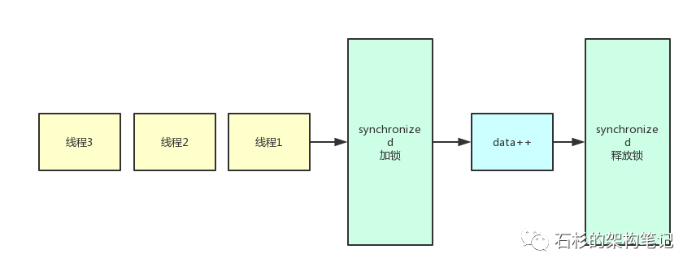
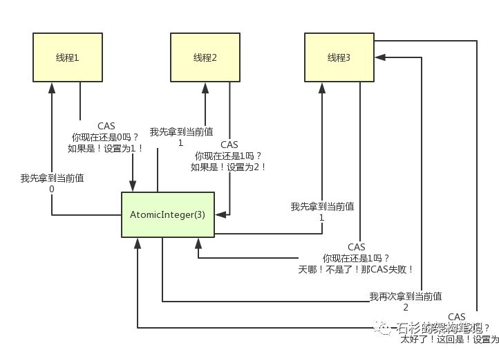
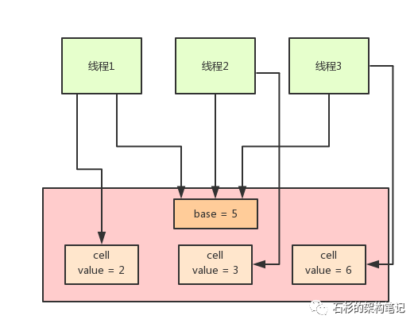

[TOC]


# java8如何优化CAS性能

BY [LEELIGHT](http://www.mobabel.net/author/leelight/) · PUBLISHED DECEMBER 17, 2018 · UPDATED DECEMBER 17, 2018


# 一、前情回顾

上篇文章给大家聊了一下volatile的原理，具体参见：[《Java内存模型原理》](http://www.mobabel.net/%E8%BD%ACjava%E5%86%85%E5%AD%98%E6%A8%A1%E5%9E%8B%E5%8E%9F%E7%90%86/)。

这篇文章给大家聊一下java并发包下的CAS相关的原子操作，以及Java 8如何改进和优化CAS操作的性能。

因为Atomic系列的原子类，无论在并发编程、JDK源码、还是各种开源项目中，都经常用到。而且在Java并发面试中，这一块也属于比较高频的考点，所以还是值得给大家聊一聊。

# 二、场景引入，问题凸现

好，我们正式开始！假设多个线程需要对一个变量不停的累加1，比如说下面这段代码：

```
public class HelloWorld {
    private int data = 0;
    // 多个线程同时对data变量执行操作： data++
}
```

实际上，上面那段代码是不ok的，因为多个线程直接这样并发的对一个data变量进行修改，是线程不安全性的行为，会导致data值的变化不遵照预期的值来改变。

举个例子，比如说20个线程分别对data执行一次data++操作，我们以为最后data的值会变成20，其实不是。

最后可能data的值是18，或者是19，都有可能，因为多线程并发操作下，就是会有这种安全问题，导致数据结果不准确。

至于为什么会不准确？那不在本文讨论的范围里，因为这个一般只要是学过java的同学，肯定都了解过多线程并发问题。

# 三、初步的解决方案：synchronized

所以，对于上面的代码，一般我们会改造一下，让他通过加锁的方式变成线程安全的：

```
public class HelloWorld {

    private int data = 0;

    public synchromized void increment(){
       data++;
   }

    // 多个线程同时调用 increment()
}
```

 

这个时候，代码就是线程安全的了，因为我们加了**synchronized**，也就是让每个线程要进入increment()方法之前先得尝试加锁，同一时间只有一个线程能加锁，其他线程需要等待锁。

通过这样处理，就可以保证换个data每次都会累加1，不会出现数据错乱的问题。

老规矩！我们来看看下面的图，感受一下synchronized加锁下的效果和氛围，相当于N个线程一个一个的排队在更新那个数值。



但是，如此简单的data++操作，都要加一个重磅的synchronized锁来解决多线程并发问题，就有点杀鸡用牛刀，大材小用了。

虽然随着Java版本更新，也对synchronized做了很多优化，但是处理这种简单的累加操作，仍然显得“太重了”。人家synchronized是可以解决更加复杂的并发编程场景和问题的。

而且，在这个场景下，你要是用synchronized，不就相当于让各个线程串行化了么？一个接一个的排队，加锁，处理数据，释放锁，下一个再进来。

# 四、更高效的方案：Atomic原子类及其底层原理

对于这种简单的data++类的操作，其实我们完全可以换一种做法，java并发包下面提供了一系列的Atomic原子类，比如说AtomicInteger。

他可以保证多线程并发安全的情况下，高性能的并发更新一个数值。我们来看下面的代码：

```
public class HelloWorld {

    private AtomicInteger data = new AtomicInteger(0);


    // 多个线程同时执行 data.incrementAndGet()
}
```

大家看上面的代码，是不是很简单！多个线程可以并发的执行AtomicInteger的incrementAndGet()方法，意思就是给我把data的值累加1，接着返回累加后最新的值。

这个代码里，就没有看到加锁和释放锁这一说了吧！

**实际上，****Atomic原子类底层用的不是传统意义的锁机制，而是无锁化的CAS机制，通过CAS机制保证多线程修改一个数值的安全性**

那什么是CAS呢？他的全称是：**Compare and Swap**，也就是先比较再设置的意思。

话不多说，先上图！



我们来看上面的图，假如说有3个线程并发的要修改一个AtomicInteger的值，他们底层的机制如下：

首先，每个线程都会先获取当前的值，接着走一个原子的CAS操作，原子的意思就是这个CAS操作一定是自己完整执行完的，不会被别人打断。

然后CAS操作里，会比较一下说，唉！大兄弟！现在你的值是不是刚才我获取到的那个值啊？

如果是的话，bingo！说明没人改过这个值，那你给我设置成累加1之后的一个值好了！

同理，如果有人在执行CAS的时候，发现自己之前获取的值跟当前的值不一样，会导致CAS失败，失败之后，进入一个无限循环，再次获取值，接着执行CAS操作！

**好！现在我们对照着上面的图，来看一下这整个过程：**

- 首先第一步，我们假设线程一咔嚓一下过来了，然后对AtomicInteger执行incrementAndGet()操作，他底层就会先获取AtomicInteger当前的值，这个值就是0。
- 此时没有别的线程跟他抢！他也不管那么多，直接执行原子的CAS操作，问问人家说：兄弟，你现在值还是0吗？
- 如果是，说明没人修改过啊！太好了，给我累加1，设置为1。于是AtomicInteger的值变为1！
- 接着线程2和线程3同时跑了过来，因为底层不是基于锁机制，都是无锁化的CAS机制，所以他们俩可能会并发的同时执行incrementAndGet()操作。
- 然后俩人都获取到了当前AtomicInteger的值，就是1
- 接着线程2抢先一步发起了原子的CAS操作！**注意，CAS是原子的，此时就他一个线程在执行！**
- 然后线程2问：兄弟，你现在值还是1吗？如果是，太好了，说明没人改过，我来改成2
- 好了，此时AtomicInteger的值变为了2。**关键点来了：**现在线程3接着发起了CAS操作，但是他手上还是拿着之前获取到的那个1啊！
- 线程3此时会问问说：兄弟，你现在值还是1吗？
- **噩耗传来！！！**这个时候的值是2啊！线程3哭泣了，他说，居然有人在这个期间改过值。算了，那我还是重新再获取一次值吧，于是获取到了最新的值，值为2。
- 然后再次发起CAS操作，问问，现在值是2吗？是的！太好了，没人改，我抓紧改，此时AtomicInteger值变为3！


上述整个过程，就是所谓Atomic原子类的原理，没有基于加锁机制串行化，而是基于CAS机制：先获取一个值，然后发起CAS，比较这个值被人改过没？如果没有，就更改值！这个CAS是原子的，别人不会打断你！

通过这个机制，不需要加锁这么重量级的机制，也可以用轻量级的方式实现多个线程安全的并发的修改某个数值。

# 五、Java 8对CAS机制的优化

但是这个CAS有没有问题呢？肯定是有的。比如说大量的线程同时并发修改一个AtomicInteger，可能有**很多线程会不停的自旋**，进入一个无限重复的循环中。

这些线程不停地获取值，然后发起CAS操作，但是发现这个值被别人改过了，于是再次进入下一个循环，获取值，发起CAS操作又失败了，再次进入下一个循环。

在大量线程高并发更新AtomicInteger的时候，这种问题可能会比较明显，导致大量线程空循环，自旋转，性能和效率都不是特别好。

于是，当当当当，Java 8推出了一个新的类，**LongAdder**，他就是尝试使用分段CAS以及自动分段迁移的方式来大幅度提升多线程高并发执行CAS操作的性能！



在LongAdder的底层实现中，首先有一个base值，刚开始多线程来不停的累加数值，都是对base进行累加的，比如刚开始累加成了base = 5。

接着如果发现并发更新的线程数量过多，就会开始施行**分段CAS的机制**，也就是内部会搞一个Cell数组，每个数组是一个数值分段。

这时，让大量的线程分别去对不同Cell内部的value值进行CAS累加操作，这样就把CAS计算压力分散到了不同的Cell分段数值中了！

这样就可以大幅度的降低多线程并发更新同一个数值时出现的无限循环的问题，大幅度提升了多线程并发更新数值的性能和效率！

而且他内部实现了**自动分段迁移的机制**，也就是如果某个Cell的value执行CAS失败了，那么就会自动去找另外一个Cell分段内的value值进行CAS操作。

这样也解决了线程空旋转、自旋不停等待执行CAS操作的问题，让一个线程过来执行CAS时可以尽快的完成这个操作。

最后，如果你要从LongAdder中获取当前累加的总值，就会把base值和所有Cell分段数值加起来返回给你。

 

### 基本分析

LongAdder中会维护一个或多个变量，这些变量共同组成一个long型的“和”。当多个线程同时更新（特指“add”）值时，为了减少竞争，可能会动态地增加这组变量的数量。“sum”方法（等效于longValue方法）返回这组变量的“和”值。
当我们的场景是为了统计技术，而不是为了更细粒度的同步控制时，并且是在多线程更新的场景时，LongAdder类比AtomicLong更好用。 在小并发的环境下，论更新的效率，两者都差不多。但是高并发的场景下，LongAdder有着明显更高的吞吐量，但是有着更高的空间复杂度。
从上面的java doc来看，LongAdder有两大方法，add和sum。其更适合使用在多线程统计计数的场景下，在这个限定的场景下比AtomicLong要高效一些。

### AtomicLong可否可以被LongAdder替代

有了传说中更高效的LongAdder，那AtomicLong可否不使用了呢？当然不是！

答案就在LongAdder的java doc中，LongAdder适合的场景是统计求和计数的场景，而且LongAdder基本只提供了add方法，而AtomicLong还具有cas方法(要使用cas，在不直接使用unsafe之外只能借助AtomicXXX了)

### LongAdder有啥用

从java doc中可以看出，其适用于统计计数的场景，例如计算qps这种场景。在高并发场景下，qps这个值会被多个线程频繁更新的，所以LongAdder很适合。HystrixRollingNumber就是用了它，下篇文章介绍它

[浅析LongAdder](https://www.jianshu.com/p/22d38d5c8c2a)

# 六、总结 & 思考

不知道大家有没有发现这种高并发访问下的分段处理机制，在很多地方都有类似的思想体现！因为高并发中的分段处理机制实际上是一个很常见和常用的并发优化手段。

在我们之前的一篇讲分布式锁的文章：（[《每秒上千订单场景下的分布式锁高并发优化实践》](http://www.mobabel.net/%e8%bd%ac%e6%af%8f%e7%a7%92%e4%b8%8a%e5%8d%83%e8%ae%a2%e5%8d%95%e7%9a%84%e9%ab%98%e5%b9%b6%e5%8f%91%e5%9c%ba%e6%99%af%e4%b8%8b%e5%a6%82%e4%bd%95%e5%ae%8c%e6%88%90%e5%88%86%e5%b8%83%e5%bc%8f%e9%94%81/)），也是用到了分段加锁以及自动分段迁移/合并加锁的一套机制，来大幅度几十倍的提升分布式锁的并发性能。

所以其实很多技术，思想都是有异曲同工之妙的

 

 

 

<https://mp.weixin.qq.com/s?__biz=MzU0OTk3ODQ3Ng==&mid=2247484070&idx=1&sn=c1d49bce3c9da7fcc7e057d858e21d69&chksm=fba6eaa5ccd163b3a935303f10a54a38f15f3c8364c7c1d489f0b1aa1b2ef293a35c565d2fda&mpshare=1&scene=24&srcid=#rd>

<http://www.mobabel.net/%E8%BD%ACjava-8%E5%A6%82%E4%BD%95%E4%BC%98%E5%8C%96cas%E6%80%A7%E8%83%BD/>