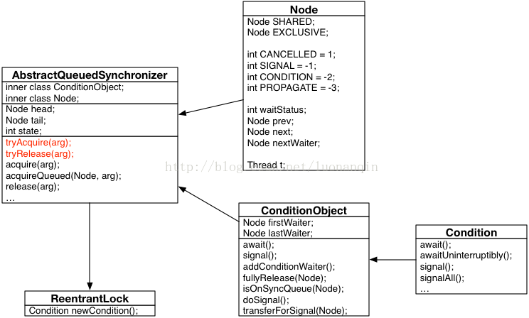

[TOC]

# java多线程之Condition的使用

原创心猿意碼 最后发布于2019-04-17 16:49:23 阅读数 14890  收藏
展开
目录

## 一、Condition的概念

回忆 synchronized 关键字，它配合 Object 的 wait()、notify() 系列方法可以实现等待/通知模式。对于 Lock，通过 Condition 也可以实现等待/通知模式。Condition是在java 1.5中才出现的，它用来替代传统的Object的wait()、notify()实现线程间的协作，相比使用Object的wait()、notify()，使用Condition的await()、signal()这种方式实现线程间协作更加安全和高效。因此通常来说比较推荐使用Condition，阻塞队列实际上是使用了Condition来模拟线程间协作。

Lock和Condition的关系：Lock只能实现互斥（一个线程持有锁，另外的线程不能访问该锁），但是不能实现通信（即使获取了CPU的执行权，但是也可以让出执行权通知另外的线程执行），一个是哥们你不能干，一个是哥们你可以干。

Condition是个接口，基本的方法就是await()和signal()方法；

Condition依赖于Lock接口，生成一个Condition的基本代码是lock.newCondition() 

调用Condition的await()和signal()方法，都必须在lock保护之内，就是说必须在lock.lock()和lock.unlock之间才可以使用Conditon中的await()对应Object的wait()；Condition中的signal()对应Object的notify()；Condition中的signalAll()对应Object的notifyAll()。

## 二、Condition的实现分析

ConditionObject 类是 AQS 的内部类，实现了 Condition 接口。



可以看到，等待队列和同步队列一样，使用的都是同步器 AQS 中的节点类 Node。同样拥有首节点和尾节点，
每个 Condition 对象都包含着一个 FIFO 队列。

### （1）等待

调用 Condition 的 await() 方法会使线程进入等待队列，并释放锁，线程状态变为等待状态，

```java
public final void await() throws InterruptedException {
    if (Thread.interrupted())
        throw new InterruptedException();
    Node node = addConditionWaiter();
    //释放同步状态（锁）
    int savedState = fullyRelease(node);
    int interruptMode = 0;
    //判断节点是否放入同步对列
    while (!isOnSyncQueue(node)) {
        //阻塞
        LockSupport.park(this);
        //如果已经中断了，则退出
        if ((interruptMode = checkInterruptWhileWaiting(node)) != 0)
            break;
    }
    if (acquireQueued(node, savedState) && interruptMode != THROW_IE)
        interruptMode = REINTERRUPT;
            if (node.nextWaiter != null) // clean up if cancelled
            unlinkCancelledWaiters();
            if (interruptMode != 0)
                reportInterruptAfterWait(interruptMode);
}
```

分析上述方法的大概过程：

将当前线程创建为节点，加入等待队列；
释放锁，唤醒同步队列中的后继节点；
while循环判断节点是否放入同步队列：
没有放入，则阻塞，继续 while 循环（如果已经中断了，则退出）
放入，则退出 while 循环，执行后面的判断
退出 while 说明节点已经在同步队列中，调用 acquireQueued() 方法加入同步状态竞争。
竞争到锁后从 await() 方法返回，即退出该方法。


addConditionWaiter() 方法：

```java
private Node addConditionWaiter() {
    Node t = lastWaiter;
    if (t != null && t.waitStatus != Node.CONDITION) {
        //清除条件队列中所有状态不为Condition的节点
        unlinkCancelledWaiters();
        t = lastWaiter;
    }
    //将该线程创建节点，放入等待队列
    Node node = new Node(Thread.currentThread(), Node.CONDITION);
    if (t == null)
        firstWaiter = node;
    else
        t.nextWaiter = node;
    lastWaiter = node;
    return node;
}
```

过程分析：同步队列的首节点移动到等待队列。加入尾节点之前会清除所有状态不为 Condition 的节点。

### （2）通知

调用 Condition 的 signal() 方法，可以唤醒等待队列的首节点（等待时间最长），唤醒之前会将该节点移动到同步队列中。

```java
public final void signal() {
    //判断是否获取了锁 
    if (!isHeldExclusively())
        throw new IllegalMonitorStateException();
    Node first = firstWaiter;
    if (first != null)
        doSignal(first);
}
```

过程：

先判断当前线程是否获取了锁；
然后对首节点调用 doSignal() 方法。

```java
private void doSignal(Node first) {
    do {
        if ( (firstWaiter = first.nextWaiter) == null)
            lastWaiter = null;
        first.nextWaiter = null;
    } while (!transferForSignal(first) &&
       (first = firstWaiter) != null);
}

```

过程：

修改首节点；
调用 transferForSignal() 方法将节点移动到同步队列。

```java
final boolean transferForSignal(Node node) {
    //将节点状态变为0  
    if (!compareAndSetWaitStatus(node, Node.CONDITION, 0))
        return false;
    //将该节点加入同步队列
    Node p = enq(node);
    int ws = p.waitStatus;
    //如果结点p的状态为cancel 或者修改waitStatus失败，则直接唤醒
    if (ws > 0 || !compareAndSetWaitStatus(p, ws, Node.SIGNAL))
        LockSupport.unpark(node.thread);
    return true;
}
```

调用同步器的 enq 方法，将节点移动到同步队列，
满足条件后使用 LockSupport 唤醒该线程。

当 Condition 调用 signalAll() 方法：

```java
    public final void signalAll() {
        if (!isHeldExclusively())
            throw new IllegalMonitorStateException();
        Node first = firstWaiter;
        if (first != null)
            doSignalAll(first);
    }

    private void doSignalAll(Node first) {
        lastWaiter = firstWaiter = null;
        do {
            Node next = first.nextWaiter;
            first.nextWaiter = null;
            transferForSignal(first);
            first = next;
        } while (first != null);
    }
```

可以看到 doSignalAll() 方法使用了 do-while 循环来唤醒每一个等待队列中的节点，直到 first 为 null 时，停止循环。

一句话总结 signalAll() 的作用：将等待队列中的全部节点移动到同步队列中，并唤醒每个节点的线程。

## 三、Condition应用

### （1）简单demo

package thread;

```java

import java.util.concurrent.locks.Condition;
import java.util.concurrent.locks.Lock;
import java.util.concurrent.locks.ReentrantLock;

/**
 * @author zhangliang
 * <p>
 * 2016年4月8日 下午5:48:54
 */
public class ConTest {
    final Lock lock = new ReentrantLock();
    final Condition condition = lock.newCondition();

    public static void main(String[] args) {
        // TODO Auto-generated method stub
        ConTest test = new ConTest();
        Producer producer = test.new Producer();
        Consumer consumer = test.new Consumer();

        consumer.start();
        producer.start();
    }

    class Consumer extends Thread {

        @Override
        public void run() {
            consume();
        }

        private void consume() {

            try {
                lock.lock();
                System.out.println("我在等一个新信号" + this.currentThread().getName());
                condition.await();

            } catch (InterruptedException e) {
                // TODO Auto-generated catch block
                e.printStackTrace();
            } finally {
                System.out.println("拿到一个信号" + this.currentThread().getName());
                lock.unlock();
            }

        }
    }

    class Producer extends Thread {

        @Override
        public void run() {
            produce();
        }

        private void produce() {
            try {
                lock.lock();
                System.out.println("我拿到锁" + this.currentThread().getName());
                condition.signalAll();
                System.out.println("我发出了一个信号：" + this.currentThread().getName());
            } finally {
                lock.unlock();
            }
        }
    }

}
```

运行结果：

```
我在等一个新信号Thread-1
我拿到锁Thread-0
我发出了一个信号：Thread-0
拿到一个信号Thread-1
```

一个锁内部可以有多个Condition，即有多路等待和通知，可以参看jdk1.5提供的Lock与Condition实现的可阻塞队列的应用案例（见下面代码），从中除了要体味算法，还要体味面向对象的封装。在传统的线程机制中一个监视器对象上只能有一路等待和通知，要想实现多路等待和通知，必须嵌套使用多个同步监视器对象。（如果只用一个Condition，两个存放的线程都在等，一旦一个放的线程进去了，那么它通知可能会导致另一个放的线程接着往下走。）
可阻塞队列起到缓冲的效果，应用：使用该队列实现寻呼信息的存放和取出，当队列满时，存放线程等待，当队列空时，取出线程等待。

### （2）可阻塞队列的应用案例

```java
class BoundedBuffer {
	final Lock lock = new ReentrantLock();
	final Condition notFull  = lock.newCondition(); 
	final Condition notEmpty = lock.newCondition(); 

	final Object[] items = new Object[100];
	int putptr, takeptr, count;
	 
	public void put(Object x) throws InterruptedException {
		lock.lock();
		try {
			while (count == items.length) //如果缓冲区中存入数据的数量等于缓冲区的长度，即缓冲区满了，那么存入线程就进入等待
				notFull.await();
			items[putptr] = x; 
			if (++putptr == items.length) putptr = 0;//将存的指针指向缓冲区第一个坐标
			++count;
			notEmpty.signal();//只换醒取出线程
		} finally {
			lock.unlock();
		}
	}
	 
	public Object take() throws InterruptedException {
		lock.lock();
		try {
			while (count == 0) //缓冲区中没有数据可取了，取出线程就进入等待
				notEmpty.await();
			Object x = items[takeptr]; 
			if (++takeptr == items.length) takeptr = 0;//将取的指针指向第一个坐标
			--count;
			notFull.signal();//只换醒存入线程
			return x;
		} finally {
			lock.unlock();
		}
	} 

}
```

### （3）多线程轮流执行

下面代码实现三个线程：主线程，子线程1，子线程2轮流交替运行：

```java

import java.util.concurrent.locks.Condition;
import java.util.concurrent.locks.Lock;
import java.util.concurrent.locks.ReentrantLock;

public class ThreeConditionCommunication {
	public static void main(String[] args) {
		final Business business = new Business();
		new Thread(
				new Runnable() {
					public void run() {	
						for(int i=1;i<=50;i++){
							business.sub2(i);
						}					
					}
				}
				).start();

		new Thread(
				new Runnable() {
					public void run() {				
						for(int i=1;i<=50;i++){
							business.sub3(i);
						}					
					}
				}
				).start();		
	 
		for(int i=1;i<=50;i++){
			business.main(i);
		}	
	}
	 
	static class Business {
		Lock lock = new ReentrantLock();
		//几个线程轮流执行就定义几个condition
		Condition condition1 = lock.newCondition();
		Condition condition2 = lock.newCondition();
		Condition condition3 = lock.newCondition();
		private int shouldSub = 1;//条件，该第几个线程运行
		public  void sub2(int i){
			lock.lock();
			try{
				while(shouldSub != 2){
					try {
						condition2.await();
					} catch (Exception e) {
						e.printStackTrace();
					}
				}
				for(int j=1;j<=10;j++){
					System.out.println("sub2 thread sequence of " + j + ",loop of " + i);
				}
				shouldSub = 3;//该第三个线程运行了
				condition3.signal();
			}finally{
				lock.unlock();
			}
		}
	 
		public  void sub3(int i){
			lock.lock();
			try{
				while(shouldSub != 3){
					try {
						condition3.await();
					} catch (Exception e) {
						e.printStackTrace();
					}
				}
				for(int j=1;j<=20;j++){
					System.out.println("sub3 thread sequence of " + j + ",loop of " + i);
				}
				shouldSub = 1;
				condition1.signal();
			}finally{
				lock.unlock();
			}
		}		  
	 
		public  void main(int i){
			lock.lock();
			try{
				while(shouldSub != 1){
					try {
						condition1.await();
					} catch (Exception e) {
						e.printStackTrace();
					}
				}
				for(int j=1;j<=100;j++){
					System.out.println("main thread sequence of " + j + ",loop of " + i);
				}
				shouldSub = 2;
				condition2.signal();
			}finally{
				lock.unlock();
			}
		}
	}

}
```


https://blog.csdn.net/yucaixiang/article/details/89357690