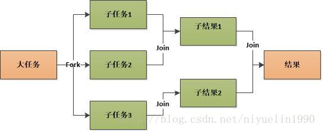

# java多线程 ForkJoinPool详解

## 1. 什么是ForkJoinPool

　　ForkJoinPool是JDK7引入的线程池，核心思想是将大的任务拆分成多个小任务（即fork），然后在将多个小任务处理汇总到一个结果上（即join），非常像MapReduce处理原理。同时，它提供基本的线程池功能，支持设置最大并发线程数，支持任务排队，支持线程池停止，支持线程池使用情况监控，也是AbstractExecutorService的子类，主要引入了“工作窃取”机制，在多CPU计算机上处理性能更佳。 


### 1.1 work-stealing（工作窃取算法）

　　work-stealing（工作窃取），ForkJoinPool提供了一个更有效的利用线程的机制，当ThreadPoolExecutor还在用单个队列存放任务时，ForkJoinPool已经分配了与线程数相等的队列，当有任务加入线程池时，会被平均分配到对应的队列上，各线程进行正常工作，当有线程提前完成时，会从队列的末端“窃取”其他线程未执行完的任务，当任务量特别大时，CPU多的计算机会表现出更好的性能。

## 2. 常用方法

　　ForkJoinTask：我们要使用ForkJoin框架，必须首先创建一个ForkJoin任务。它提供在任务中执行fork()和join()操作的机制，通常情况下我们不需要直接继承ForkJoinTask类，而只需要继承它的子类，Fork/Join框架提供了以下两个子类：

```
RecursiveAction：用于没有返回结果的任务。
RecursiveTask ：用于有返回结果的任务。 
```

　　ForkJoinPool ：ForkJoinTask需要通过ForkJoinPool来执行，任务分割出的子任务会添加到当前工作线程所维护的双端队列中，进入队列的头部。当一个工作线程的队列里暂时没有任务时，它会随机从其他工作线程的队列的尾部获取一个任务。 
　　**线程池监控** 
　　在线程池使用监控方面，主要通过如下方法： 
　　isTerminated—判断线程池对应的workQueue中是否有待执行任务未执行完； 
　　awaitTermination—判断线程池是否在约定时间内完成，并返回完成状态； 
　　getQueuedSubmissionCount—获取所有待执行的任务数； 
　　getRunningThreadCount—获取正在运行的任务数。

## 3. 例子

```java
import java.util.concurrent.ForkJoinPool;
import java.util.concurrent.RecursiveTask;

/**
 * Created by TF016591 on 2017/11/8.
 */
public class CountTaskTmp extends RecursiveTask<Integer> {
    private static final int THRESHOLD = 2;
    private int start;
    private int end;

    public CountTaskTmp(int start, int end) {
        this.start = start;
        this.end = end;
    }

    //实现compute 方法来实现任务切分和计算
    protected Integer compute() {
        int sum = 0;
        boolean canCompute = (end - start) <= THRESHOLD;
        if (canCompute) {
            for (int i = start; i <= end; i++)
                sum += i;
        } else {
            //如果任务大于阀值，就分裂成两个子任务计算
            int mid = (start + end) / 2;
            CountTaskTmp leftTask = new CountTaskTmp(start, mid);
            CountTaskTmp rightTask = new CountTaskTmp(mid + 1, end);

            //执行子任务
            leftTask.fork();
            rightTask.fork();

            //等待子任务执行完，并得到结果
            int leftResult = (int) leftTask.join();
            int rightResult = (int) rightTask.join();

            sum = leftResult + rightResult;
        }

        return sum;
    }

    public static void main(String[] args) {
        //使用ForkJoinPool来执行任务
        ForkJoinPool forkJoinPool = new ForkJoinPool();

        //生成一个计算资格，负责计算1+2+3+4
        CountTaskTmp task = new CountTaskTmp(1, 4);

        Integer r = forkJoinPool.invoke(task);
        System.out.println(r);
        //  或者可以这样写
        //        Future<Integer> result = forkJoinPool.submit(task);
        //        try {
        //            System.out.println(result.get());
        //        } catch (Exception e) {
        //        }
    }
}
 
```

输出结果：

```
10
```

## 4. java8 ParallelStreams

　　Java 8为ForkJoinPool添加了一个通用线程池，这个线程池用来处理那些没有被显式提交到任何线程池的任务。它是ForkJoinPool类型上的一个静态元素，它拥有的默认线程数量等于运行计算机上的处理器数量。当调用Arrays类上添加的新方法时，自动并行化就会发生。比如用来排序一个数组的并行快速排序，用来对一个数组中的元素进行并行遍历。自动并行化也被运用在Java 8新添加的Stream API中。

```
List<Integer> numbers = Arrays.asList(1, 2, 3, 4, 5, 6, 7, 8, 9);
numbers.parallelStream().forEach(out::println);  　　
```


https://blog.csdn.net/niyuelin1990/article/details/78658251