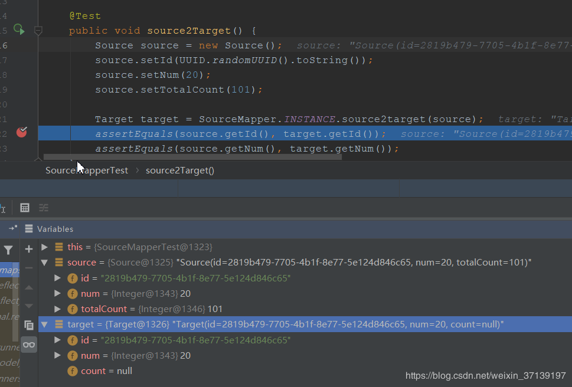
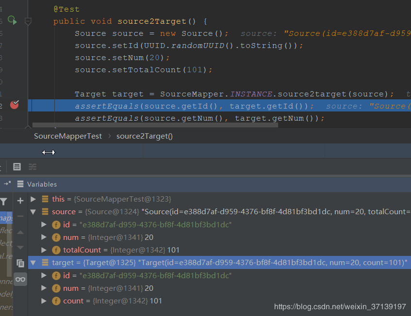
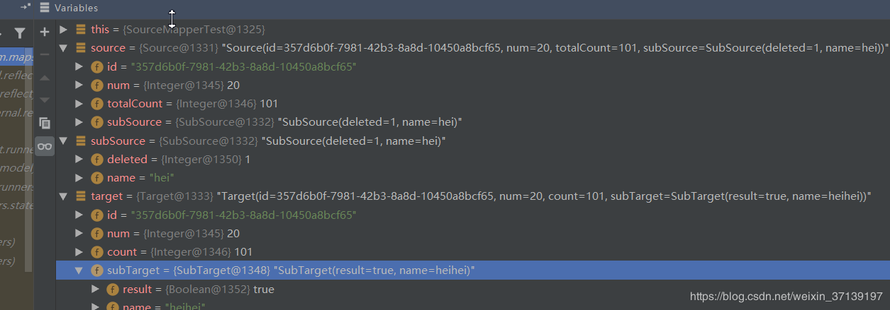
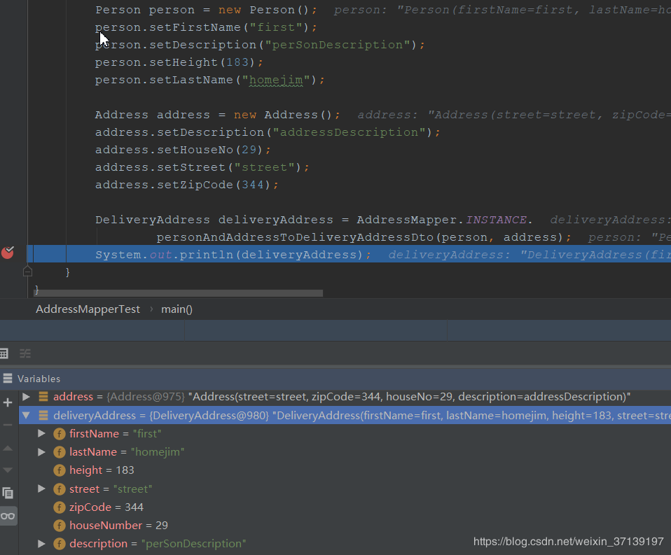

[TOC]


# 优雅的对象转换解决方案-MapStruct使用进阶(二)

在前面， 介绍了 `MapStruct` 及其入门。 本文则是进一步的进阶。

在 `MapStruct` 生成对应的实现类的时候， 有如下的几个情景。

## 1 属性名称相同，则进行转化

在实现类的时候， 如果属性名称相同， 则会进行对应的转化。这个在之前的文章代码中已经有所体现。 通过此种方式， 我们可以快速的编写出转换的方法。

源对象类

```
import lombok.Data;

@Data
public class Source {

    private String id;

    private Integer num;
}
```

目标对象类

```
import lombok.Data;

@Data
public class Target {

    private String id;

    private Integer num;
}
```

转化类

```
@Mapper
public interface SourceMapper {

    SourceMapper INSTANCE = Mappers.getMapper(SourceMapper.class);

    Target source2target(Source source);

}
```

由于 `Source` 和 `Target` 需要转化的属性是完全相同的。因此， 在 `Mapper` 中， `source2target` 方法很快就可以编写出来了。 只需要确定入参和返回值即可。

## 2 属性名不相同， 可通过 `@Mapping` 注解进行指定转化。

属性名不相同， 在需要进行互相转化的时候， 则我们可以通过 `@Mapping` 注解来进行转化。

在上面的 `Source` 类中， 增加一个属性 `totalCount`

```
@Data
public class Source {

    private String id;

    private Integer num;

    private Integer totalCount;
}
```

而对应的 `Target` 中， 定义的属性是 `count`。

```
@Data
public class Target {

    private String id;

    private Integer num;

    private Integer count;
}
```

如果方法没做任何的改变， 那么，在转化的时候， 由于属性名称不相同， 会导致 count 属性没有值。



这时候， 可以通过 `@Mappimg` 的方式进行映射。

```
@Mapper
public interface SourceMapper {

    SourceMapper INSTANCE = Mappers.getMapper(SourceMapper.class);

    @Mapping(source = "totalCount", target = "count")
    Target source2target(Source source);
}
```

仅仅是在方法上面加了一行。再次允许测试程序。



## 3 Mapper 中使用自定义的转换

有时候， 对于某些类型， 无法通过代码生成器的形式来进行处理。 那么， 就需要自定义的方法来进行转换。 这时候， 我们可以在接口（同一个接口， 后续还有调用别的 `Mapper` 的方法）中定义默认方法（Java8及之后）。

在 `Source` 类中增加

```
private SubSource subSource;
```

对应的类

```
import lombok.Data;

@Data
public class SubSource {

    private Integer deleted;

    private String name;
}
```

相应的， 在 `Target` 中

```
private SubTarget subTarget;
```

对应的类

```
import lombok.Data;

@Data
public class SubTarget {
    private Boolean result;

    private String name;
}
```

然后在 `SourceMapper` 中添加方法及映射， 对应的方法更改后

```
@Mapper
public interface SourceMapper {

    SourceMapper INSTANCE = Mappers.getMapper(SourceMapper.class);

    @Mapping(source = "totalCount", target = "count")
    @Mapping(source = "subSource", target = "subTarget")
    Target source2target(Source source);

    default SubTarget subSource2subTarget(SubSource subSource) {
        if (subSource == null) {
            return null;
        }
        SubTarget subTarget = new SubTarget();
        subTarget.setResult(!subSource.getDeleted().equals(0));
        subTarget.setName(subSource.getName()==null?"":subSource.getName()+subSource.getName());
        return subTarget;
    }
}
```

进行测试



## 4 多转一

我们在实际的业务中少不了将多个对象转换成一个的场景。 MapStruct 当然也支持多转一的操作。

有 `Address` 和 `Person` 两个对象。

```
import lombok.Data;

@Data
public class Address {

    private String street;
    private int zipCode;
    private int houseNo;
    private String description;

}

@Data
public class Person {

    private String firstName;
    private String lastName;
    private int height;
    private String description;

}
```

而在实际的使用时， 我们需要的是 `DeliveryAddress` 类

```
import lombok.Data;

@Data
public class DeliveryAddress {

    private String firstName;
    private String lastName;
    private int height;
    private String street;
    private int zipCode;
    private int houseNumber;
    private String description;
}
```

其对应的信息不仅仅来自一个类， 那么， 我们也可以通过配置来实现多到一的转换。

```
@Mapper
public interface AddressMapper {

    AddressMapper INSTANCE = Mappers.getMapper(AddressMapper.class);

    @Mapping(source = "person.description", target = "description")
    @Mapping(source = "address.houseNo", target = "houseNumber")
    DeliveryAddress personAndAddressToDeliveryAddressDto(Person person, Address address);
}
```

测试


在多对一转换时， **遵循以下几个原则**

1. 当多个对象中， 有其中一个为 null， 则会直接返回 null
2. 如一对一转换一样， 属性通过名字来自动匹配。 因此， 名称和类型相同的不需要进行特殊处理
3. 当多个原对象中，有相同名字的属性时，需要通过 `@Mapping` 注解来具体的指定， 以免出现歧义（不指定会报错）。 如上面的 `description`

属性也可以直接从传入的参数来赋值。

```
@Mapping(source = "person.description", target = "description")
@Mapping(source = "hn", target = "houseNumber")
DeliveryAddress personAndAddressToDeliveryAddressDto(Person person, Integer hn);
```

在上面的例子中， `hn` 直接赋值给 `houseNumber`。

## 5 更新 Bean 对象

有时候， 我们不是想返回一个新的 Bean 对象， 而是希望更新传入对象的一些属性。这个在实际的时候也会经常使用到。

在 `AddressMapper` 类中， 新增如下方法

```
    /**
     * Person->DeliveryAddress, 缺失地址信息
     * @param person
     * @return
     */
    DeliveryAddress person2deliveryAddress(Person person);

    /**
     * 更新， 使用 Address 来补全 DeliveryAddress 信息。 注意注解 @MappingTarget
     * @param address
     * @param deliveryAddress
     */
    void updateDeliveryAddressFromAddress(Address address,
                                          @MappingTarget DeliveryAddress deliveryAddress);
```

注解 `@MappingTarget`后面跟的对象会被更新。 以上的代码可以通过以下的测试。

```
@Test
public void updateDeliveryAddressFromAddress() {
    Person person = new Person();
    person.setFirstName("first");
    person.setDescription("perSonDescription");
    person.setHeight(183);
    person.setLastName("homejim");

    DeliveryAddress deliveryAddress = AddressMapper.INSTANCE.person2deliveryAddress(person);
    assertEquals(deliveryAddress.getFirstName(), person.getFirstName());
    assertNull(deliveryAddress.getStreet());

    Address address = new Address();
    address.setDescription("addressDescription");
    address.setHouseNo(29);
    address.setStreet("street");
    address.setZipCode(344);

    AddressMapper.INSTANCE.updateDeliveryAddressFromAddress(address, deliveryAddress);
    assertNotNull(deliveryAddress.getStreet());
}
```

## 6 获取 mapper

### 6.1 通过 Mapper 工厂获取

在上面的例子中， 我们都是通过 `Mappers.getMapper(xxx.class)` 的方式来进行对应 `Mapper` 的获取。 此种方法为通过 Mapper 工厂获取。

如果是此种方法， 约定俗成的是在接口内定义一个接口本身的实例 `INSTANCE`， 以方便获取对应的实例。

```
@Mapper
public interface SourceMapper {

    SourceMapper INSTANCE = Mappers.getMapper(SourceMapper.class);

    // ......
}
```

这样在调用的时候， 我们就不需要在重复的去实例化对象了。类似下面

```
Target target = SourceMapper.INSTANCE.source2target(source);
```

### 6.2 使用依赖注入

对于 Web 开发， 依赖注入应该很熟悉。 `MapSturct` 也支持使用依赖注入， 同时也推荐使用依赖注入。

| 值      | 注入方式                                                     |
| ------- | ------------------------------------------------------------ |
| default | 默认的方式， 使用 `Mappers.getMapper(Class)` 来进行获取 `Mapper` |
| cdi     | Contexts and Dependency Injection. 使用此种方式， 需要使用 `@Inject` 来进行注入 |
| spring  | Spring 的方式， 可以通过 `@Autowired` 来进行注入             |
| jsr330  | 生成的 Mapper 中， 使用 `@javax.inject.Named` 和 `@Singleton` 注解, 通过 `@Inject` 来注入 |

### 6.3 依赖注入策略

可以选择是通过构造方法或者属性注入， 默认是属性注入。

```
public enum InjectionStrategy {

    /** Annotations are written on the field **/
    FIELD,

    /** Annotations are written on the constructor **/
    CONSTRUCTOR
}
```

类似如此使用

```
@Mapper(componentModel = "cdi", uses = EngineMapper.class, injectionStrategy = InjectionStrategy.CONSTRUCTOR)
```

作者：[阿进的写字台](https://www.cnblogs.com/homejim/)

出处：<https://www.cnblogs.com/homejim/>

本文版权归作者和博客园共有，欢迎转载，但未经作者同意必须保留此段声明，且在文章页面明显位置给出原文连接，否则保留追究法律责任的权利。


分类: [Java](https://www.cnblogs.com/homejim/category/1071370.html)


<https://www.cnblogs.com/homejim/p/11313128.html>