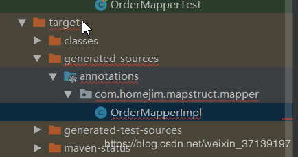
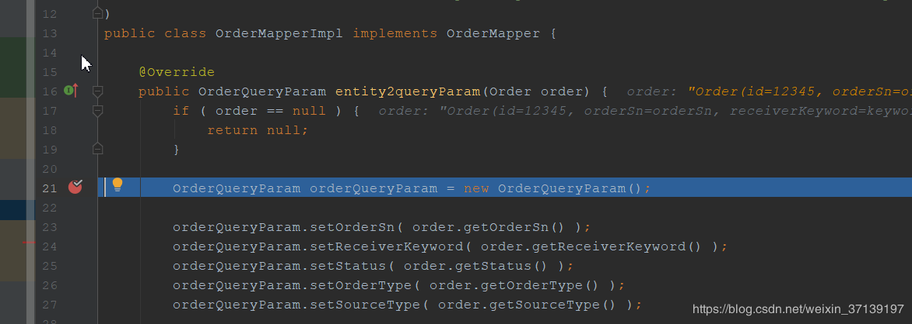

[TOC]


# 优雅的对象转换解决方案-MapStruct及其入门（一）

第一次看到 `MapStruct` 的时候， 我个人非常的开心。 因为其跟我内心里面的想法不谋而合。

## 1 MapStruct 是什么？

### 1.1 JavaBean 的困扰

对于代码中 `JavaBean`之间的转换， 一直是困扰我很久的事情。 在开发的时候我看到业务代码之间有很多的 `JavaBean` 之间的相互转化， 非常的影响观感， 却又不得不存在。 我后来想的一个办法就是通过反射， 或者自己写很多的转换器。

第一种通过反射的方法确实比较方便， 但是现在无论是 `BeanUtils`, `BeanCopier` 等在使用反射的时候都会影响到性能。 虽然我们可以进行反射信息的缓存来提高性能。 但是像这种的话， 需要类型和名称都一样才会进行映射， 有很多时候， 由于不同的团队之间使用的名词不一样， 还是需要很多的手动 set/get 等功能。

第二种的话就是会很浪费时间， 而且在添加新的字段的时候也要进行方法的修改。 不过， 由于不需要进行反射， 其性能是很高的。

### 1.2 `MapStruct` 带来的改变

`MapSturct` 是一个生成类型安全， 高性能且无依赖的 JavaBean 映射代码的注解处理器（annotation processor）。

抓一下重点：

1. 注解处理器
2. 可以生成 `JavaBean` 之间那的映射代码
3. 类型安全， 高性能， 无依赖性

从字面的理解， 我们可以知道， 该工具可以帮我们实现 `JavaBean` 之间的转换， 通过注解的方式。

同时， 作为一个工具类，相比于手写， 其应该具有便捷， 不容易出错的特点。

## 2 `MapStruct` 入门

入门很简单。 我是基于 `Maven` 来进行项目 jar 包管理的。

### 2.1 引入依赖

```xml
<dependency>
    <groupId>org.mapstruct</groupId>
    <artifactId>mapstruct</artifactId>
    <version>1.3.1.Final</version>
</dependency>
<dependency>
    <groupId>org.mapstruct</groupId>
    <artifactId>mapstruct-processor</artifactId>
    <version>1.3.1.Final</version>
    <scope>provided</scope>
</dependency>
```

### 2.2 创建entity和dto对象

该类是从 github 某个订单系统里面拿下来的部分。

```
@Data
public class Order {

    /**
     *订单id
     */
    private Long id;

    /**
     * 订单编号
     */
    private String orderSn;

    /**
     * 收货人姓名/号码
     */
    private String receiverKeyword;

    /**
     * 订单状态：0->待付款；1->待发货；2->已发货；3->已完成；4->已关闭；5->无效订单
     */
    private Integer status;

    /**
     * 订单类型：0->正常订单；1->秒杀订单
     */
    private Integer orderType;

    /**
     * 订单来源：0->PC订单；1->app订单
     */
    private Integer sourceType;
}
```

对应的查询参数

```
@Data
public class OrderQueryParam {
    /**
     * 订单编号
     */
    private String orderSn;

    /**
     * 收货人姓名/号码
     */
    private String receiverKeyword;

    /**
     * 订单状态：0->待付款；1->待发货；2->已发货；3->已完成；4->已关闭；5->无效订单
     */
    private Integer status;

    /**
     * 订单类型：0->正常订单；1->秒杀订单
     */
    private Integer orderType;

    /**
     * 订单来源：0->PC订单；1->app订单
     */
    private Integer sourceType;


}
```

### 2.3 写 Mapper

`Mapper` 即映射器， 一般来说就是写 `xxxMapper` 接口。 当然， 不一定是以 `Mapper` 结尾的。 只是官方是这么写的。 在本入门例子中，对应的接口如下

```
import com.homejim.mapstruct.dto.OrderQueryParam;
import com.homejim.mapstruct.entity.Order;
import org.mapstruct.Mapper;
import org.mapstruct.Mapping;

@Mapper
public interface OrderMapper {

    OrderQueryParam entity2queryParam(Order order);

}
```

简单的映射（字段和类型都匹配）， 只有一个要求， 在接口上写 `@Mapper` 注解即可。 然后方法上， 入参对应要被转化的对象， 返回值对应转化后的对象， 方法名称可任意。

### 2.4 测试

写一个测试类测试一下。

```
    @Test
    public void entity2queryParam() {
        Order order = new Order();
        order.setId(12345L);
        order.setOrderSn("orderSn");
        order.setOrderType(0);
        order.setReceiverKeyword("keyword");
        order.setSourceType(1);
        order.setStatus(2);

        OrderMapper mapper = Mappers.getMapper(OrderMapper.class);
        OrderQueryParam orderQueryParam = mapper.entity2queryParam(order);
        assertEquals(orderQueryParam.getOrderSn(), order.getOrderSn());
        assertEquals(orderQueryParam.getOrderType(), order.getOrderType());
        assertEquals(orderQueryParam.getReceiverKeyword(), order.getReceiverKeyword());
        assertEquals(orderQueryParam.getSourceType(), order.getSourceType());
        assertEquals(orderQueryParam.getStatus(), order.getStatus());

    }
```

测试通过， 没有任何的问题。

## 3 MapStruct 分析

上面中， 我写了3个步骤来实现了从 `Order` 到 `OrderQueryParam` 的转换。

那么， 作为一个注解处理器， 通过`MapStruct` 生成的代码具有怎么样的优势呢？

### 3.1 高性能

这是相对反射来说的， 反射需要去读取字节码的内容， 花销会比较大。 而通过 `MapStruct` 来生成的代码， 其类似于人手写。 速度上可以得到保证。

前面例子中生成的代码可以在编译后看到。 在 target/generated-sources/annotations 里可以看到。



对应的代码

```
@Generated(
    value = "org.mapstruct.ap.MappingProcessor",
    date = "2019-08-02T00:29:49+0800",
    comments = "version: 1.3.0.Final, compiler: javac, environment: Java 11.0.2 (Oracle Corporation)"
)
public class OrderMapperImpl implements OrderMapper {

    @Override
    public OrderQueryParam entity2queryParam(Order order) {
        if ( order == null ) {
            return null;
        }

        OrderQueryParam orderQueryParam = new OrderQueryParam();

        orderQueryParam.setOrderSn( order.getOrderSn() );
        orderQueryParam.setReceiverKeyword( order.getReceiverKeyword() );
        orderQueryParam.setStatus( order.getStatus() );
        orderQueryParam.setOrderType( order.getOrderType() );
        orderQueryParam.setSourceType( order.getSourceType() );

        return orderQueryParam;
    }
}
```

可以看到其生成了一个实现类， 而代码也类似于我们手写， 通俗易懂。

### 3.2 易于 debug

在我们生成的代码中， 我们可以轻易的进行 debug。



在使用反射的时候， 如果出现了问题， 很多时候是很难找到是什么原因的。

### 3.3 使用相对简单

如果是完全映射的， 使用起来肯定没有反射简单。 用类似 `BeanUtils` 这些工具一条语句就搞定了。 但是，如果需要进行特殊的匹配（特殊类型转换， 多对一转换等）， 其相对来说也是比较简单的。

基本上， 使用的时候， 我们只需要声明一个接口， 接口下写对应的方法， 就可以使用了。 当然， 如果有特殊情况， 是需要额外处理的。

### 3.4 代码独立

生成的代码是对立的， 没有运行时的依赖。

------

入门就先到这里， 后续会讲一些高级一点的用法。

作者：[阿进的写字台](https://www.cnblogs.com/homejim/)

出处：<https://www.cnblogs.com/homejim/>

本文版权归作者和博客园共有，欢迎转载，但未经作者同意必须保留此段声明，且在文章页面明显位置给出原文连接，否则保留追究法律责任的权利。

 


<https://www.cnblogs.com/homejim/p/11306313.html>