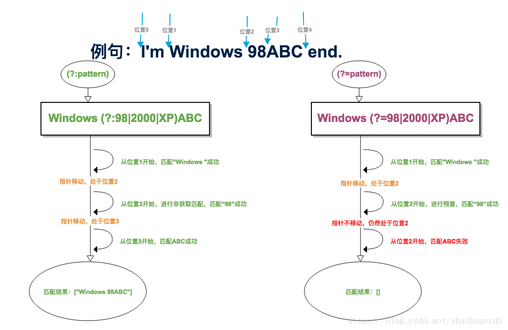

[TOC]


# 正则表达式语法手册，以及一些实例

以为自己 的正则很牛了，其实还是很菜，今天遇到一个问题，用\b来操作很简单，如果不用的话完成起来挺麻烦的，不过还好有经高人指点了一下，还是很轻松的搞定了。还要多看看教程，手册之类的。所以我把javascript手册里面的正则教程拿出来了，如果在要找东西的时候，可以方便一点

## **一 ，特殊字符**

| 特殊字符 | 行为                                                         | 示例                                                         |
| -------- | ------------------------------------------------------------ | ------------------------------------------------------------ |
| *        | 零次或多次匹配前面的字符或子表达式。等效于 {0,}。            | zo* 与“z”和“zoo”匹配。                                       |
| +        | 一次或多次匹配前面的字符或子表达式。等效于 {1,}。            | zo+ 与“zo”和“zoo”匹配，但与“z”不匹配。                       |
| ?        | 零次或一次匹配前面的字符或子表达式。等效于 {0,1}。当 ?紧随任何其他限定符（*、+、?、{n}、{n,} 或 {n,m}）之后时，匹配模式是**非贪婪的**。非贪婪模式匹配搜索到的、尽可能少的字符串，而默认的贪婪模式匹配搜索到的、尽可能多的字符串。 | zo? 与“z”和“zo”匹配，但与“zoo”不匹配。<br />o+? 只与“oooo”中的单个“o”匹配，而 o+ 与所有“o”匹配。<br />do(es)? 与“do”或“does”中的“do”匹配。 |
| ^        | 匹配搜索字符串开始的位置。如果标志中包括 m（多行搜索）字符，^ 还将匹配 \n 或 \r 后面的位置。如果将 ^ 用作括号表达式中的第一个字符，则会对字符集求反。 | ^\d{3} 与搜索字符串开始处的 3 个数字匹配。[^abc] 与除 a、b 和 c 以外的任何字符匹配。 |
| $        | 匹配搜索字符串结尾的位置。如果标志中包括 m（多行搜索）字符，^ 还将匹配 \n 或 \r 前面的位置。 | \d{3}$ 与搜索字符串结尾处的 3 个数字匹配。                   |
| .        | 匹配除换行符 \n 之外的任何单个字符。若要匹配包括 \n 在内的任意字符，请使用诸如 [\s\S] 之类的模式。 | a.c 与“abc”、“a1c”和“a-c”匹配。                              |
| []       | 标记括号表达式的开始和结尾。                                 | [1-4] 与“1”、“2”、“3”或“4”匹配。[^aAeEiIoOuU] 与任何非元音字符匹配。 |
| {}       | 标记限定符表达式的开始和结尾。                               | a{2,3} 与“aa”和“aaa”匹配。                                   |
| ()       | 标记子表达式的开始和结尾。可以保存子表达式以备将来之用。     | A(\d) 与“A0”至“A9”匹配。保存该数字以备将来之用。<br />do(es){2,2} 与“doeses”匹配, do后面跟着两个es的意思 |
| \|       | 指示在两个或多个项之间进行选择。                             | z\|food 与“z”或“food”匹配。(z\|f)ood 与“zood”或“food”匹配。  |
| /        | 表示 JScript 中的文本正则表达式模式的开始或结尾。在第二个“/”后添加单字符标志可以指定搜索行为。 | /abc/gi 是与“abc”匹配的 JScript 文本正则表达式。g（全局）标志指定查找模式的所有匹配项，i（忽略大小写）标志使搜索不区分大小写。 |
| \        | 将下一字符标记为特殊字符、文本、反向引用或八进制转义符。     | \n 与换行符匹配。\( 与“(”匹配。\\ 与“\”匹配。                |

### 正则表达式中[]和()的区别

**圆括号()是组**，主要应用在限制多选结构的范围/分组/捕获文本/环视/特殊模式处理
示例：
1、(abc|bcd|cde)，表示这一段是abc、bcd、cde三者之一均可，顺序也必须一致
2、(abc)?，表示这一组要么一起出现，要么不出现，出现则按此组内的顺序出现
3、(?:abc)表示找到这样abc这样一组，但不记录，不保存到$变量中，否则可以通过$x取第几个括号所匹配到的项，比如：(aaa)(bbb)(ccc)(?:ddd)(eee)，可以用$1获取(aaa)匹配到的内容，而$3则获取到了(ccc)匹配到的内容，而$4则获取的是由(eee)匹配到的内容，因为前一对括号没有保存变量
4、a(?=bbb) 顺序环视 表示a后面必须紧跟3个连续的b
5、(?i:xxxx) 不区分大小写 (?s:.*) 跨行匹配.可以匹配回车符

**方括号是单个匹配**，字符集/排除字符集/命名字符集
示例：
1、[0-3]，表示找到这一个位置上的字符只能是0到3这四个数字，与(abc|bcd|cde)的作用比较类似，但圆括号可以匹配多个连续的字符，而一对方括号只能匹配单个字符
2、[^0-3]，表示找到这一个位置上的字符只能是除了0到3之外的所有字符

**()和[]有本质的区别**
()内的内容表示的是一个子表达式，()本身不匹配任何东西，也不限制匹配任何东西，只是把括号内的内容作为同一个表达式来处理，例如(ab){1,3}，就表示ab一起连续出现最少1次，最多3次。如果没有括号的话，ab{1,3},就表示a，后面紧跟的b出现最少1次，最多3次。另外，括号在匹配模式中也很重要。这个就不延伸了，LZ有兴趣可以自己查查
[]表示匹配的字符在[]中，并且只能出现一次，并且特殊字符写在[]会被当成普通字符来匹配。例如[(a)]，会匹配(、a、)、这三个字符。
所以() [] 无论是作用还是表示的含义，都有天壤之别，没什么联系

http://blog.51cto.com/kusorz/1748472

## 二，字符

| 字符        | 行为                                                         | 示例                                                         |
| ----------- | ------------------------------------------------------------ | ------------------------------------------------------------ |
| \b          | 与一个字边界匹配；即字与空格间的位置。                       | er结尾的英文:er\b 与“never”中的“er”匹配，但与“verb”中的“er”不匹配。<br />er开头的英文:\ber 与“ernev”中的“er”匹配，但与“verb”中的“er”不匹配。 |
| \B          | 非边界字匹配。                                               | er\B 与“verb”中的“er”匹配，但与“never”中的“er”不匹配。       |
| \d          | 数字字符匹配。等效于 [0-9]。                                 | 在搜索字符串“12 345”中，\d{2} 与“12”和“34”匹配。\d 与“1”、“2”、“3”、“4”和“5”匹配。 |
| \D          | 非数字字符匹配。等效于 \[^0-9]。                             | \D+ 与“abc123 def”中的“abc”和“def”匹配。                     |
| \w          | 与以下任意字符匹配：A-Z、a-z、0-9 和下划线。等效于 [A-Za-z0-9_]。 | 在搜索字符串“The quick brown fox…”中，\w+ 与“The”、“quick”、“brown”和“fox”匹配。 |
| \W          | 与除 A-Z、a-z、0-9 和下划线以外的任意字符匹配。等效于 \[^A-Za-z0-9_]。 | 在搜索字符串“The quick brown fox…”中，\W+ 与“…”和所有空格匹配。 |
| [xyz]       | 字符集。与任何一个指定字符匹配。                             | [abc] 与“plain”中的“a”匹配。                                 |
| [^xyz]      | 反向字符集。与未指定的任何字符匹配。                         | [^abc] 与“plain”中的“p”、“l”、“i”和“n”匹配。                 |
| [a-z]       | 字符范围。匹配指定范围内的任何字符。                         | [a-z] 与“a”到“z”范围内的任何小写字母字符匹配。               |
| [^a-z]      | 反向字符范围。与不在指定范围内的任何字符匹配。               | [^a-z] 与不在范围“a”到“z”内的任何字符匹配。                  |
| {n}         | 正好匹配 n 次。n 是非负整数。                                | o{2} 与“Bob”中的“o”不匹配，但与“food”中的两个“o”匹配。       |
| {n,}        | 至少匹配 n 次。n 是非负整数。* 与 {0,} 相等。+ 与 {1,} 相等。 | o{2,} 与“Bob”中的“o”不匹配，但与“foooood”中的所有“o”匹配。   |
| {n,m}       | 匹配至少 n 次，至多 m 次。n 和 m 是非负整数，其中 n <= m。逗号和数字之间不能有空格。? 与 {0,1} 相等。 | 在搜索字符串“1234567”中，\d{1,3} 与“123”、“456”和“7”匹配。   |
| (pattern)   | 与模式 匹配并保存匹配项。您可以从由 JScript 中的 exec Method返回的数组元素中检索保存的匹配项。若要匹配括号字符 ( )，请使用“\(”或者“\)”。 | (Chapter\|Section) [1-9] 与“Chapter 5”匹配，保存“Chapter”以备将来之用。 |
| (?:pattern) | 与模式 匹配，但不保存匹配项；即不会存储匹配项以备将来之用。这对于用“or”字符 (\|) 组合模式部件的情况很有用。 | industr(?:y\|ies) 与 industry\|industries 相等。             |
| (?=pattern) | 积极的预测先行。找到一个匹配项后，将在匹配文本之前开始搜索下一个匹配项。不会保存匹配项以备将来之用。 | `^(?=.*\d).{4,8}$` 对密码应用以下限制：其长度必须介于 4 到 8 个字符之间，并且必须至少包含一个数字。在该模式中，.*\d 查找后跟有数字的任意多个字符。<br />对于搜索字符串“abc3qr”，这与“abc3”匹配。从该匹配项之前（而不是之后）开始，.{4,8} 与包含 4-8 个字符的字符串匹配。这与“abc3qr”匹配。^ 和 $ 指定搜索字符串的开始和结束位置。这将在搜索字符串包含匹配字符之外的任何字符时阻止匹配。 |
| (?!patten)  | 消极的预测先行。匹配与模式 不匹配的搜索字符串。找到一个匹配项后，将在匹配文本之前开始搜索下一个匹配项。不会保存匹配项以备将来之用。 | \b(?!th)\w+\b 与不以“th”开头的单词匹配。在该模式中，\b 与一个字边界匹配。对于搜索字符串“ quick ”，这与第一个空格匹配。(?!th) 与非“th”字符串匹配。这与“qu”匹配。从该匹配项开始，\w+ 与一个字匹配。这与“quick”匹配。 |
| \cx         | 匹配 x 指示的控制字符。x 的值必须在 A-Z 或 a-z 范围内。如果不是这样，则假定 c 就是文本“c”字符本身。 | \cM 与 Ctrl+M 或一个回车符匹配。                             |
| \xn         | 匹配 n，此处的 n 是一个十六进制转义码。十六进制转义码必须正好是两位数长。允许在正则表达式中使用 ASCII 代码。 | \x41 与“A”匹配。\x041 等效于后跟有“1”的“\x04”（因为 n 必须正好是两位数）。 |
| \num        | 匹配 num，此处的 num 是一个正整数。这是对已保存的匹配项的引用。 | (.)\1 与两个连续的相同字符匹配。                             |
| \n          | 标识一个八进制转义码或反向引用。如果 \n 前面至少有 n 个捕获子表达式，那么 n 是反向引用。否则，如果 n 是八进制数 (0-7)，那么 n 是八进制转义码。 | (\d)\1 与两个连续的相同数字匹配。                            |
| \nm         | 标识一个八进制转义码或反向引用。如果 \nm 前面至少有 nm 个捕获子表达式，那么 nm 是反向引用。如果 \nm 前面至少有 n 个捕获子表达式，则 n 是反向引用，后面跟有文本 m。如果上述情况都不存在，当 n 和 m 是八进制数字 (0-7) 时，\nm 匹配八进制转义码 nm。 | \11 与制表符匹配。                                           |
| \nml        | 当 n 是八进制数字 (0-3)，m 和 l 是八进制数字 (0-7) 时，匹配八进制转义码 nml。 | \011 与制表符匹配。                                          |
| \un         | 匹配 n，其中 n 是以四位十六进制数表示的 Unicode 字符。       | \u00A9 与版权符号 (©) 匹配。                                 |

### 正则表达式－－ (?:pattern)与(?=pattern)的区别

学习正则表达式时，对(?:pattern)与(?=pattern)的区别做个记录。

#### [官方定义](https://www.w3cschool.cn/regexp/2yjd1pq6.html)

> (pattern) ： 匹配 pattern 并获取这一匹配，所获取的匹配可以从产生的 Matches 集合得到。 
> (?:pattern) ：匹配 pattern 但不获取匹配结果，也就是说这是一个非获取匹配，不进行存储供以后使用。 
> (?=pattern) ：正向预查，在任何匹配 pattern 的字符串开始处匹配查找字符串。这是一个非获取匹配，也就是说，该匹配不需要获取供以后使用。预查不消耗字符，也就是说，在一个匹配发生后，在最后一次匹配之后立即开始下一次匹配的搜索，而不是从包含预查的字符之后开始。

#### 共同点

`(?:pattern)` 与 `(?=pattern)`都匹配pattern，但不会把pattern结果放到Matches的集合中。

#### 区别

- `(?:pattern)` 匹配得到的结果包含pattern，`(?=pattern)` 则不包含。如：

```
对字符串："industry abc"的匹配结果：
industr(?:y|ies) ---> "industry"
industr(?=y|ies) ---> "industr"123
```

- 是否消耗字符 
  `(?:pattern)` 消耗字符，下一字符匹配会从已匹配后的位置开始。 
  `(?=pattern)` 不消耗字符，下一字符匹配会从预查之前的位置开始。 
  即后者只预查，不移动匹配指针。如： 
  

注：示例中的位置为易于理解的视图位置，具体传动原理可以参照这篇文章 [正则基础之——NFA引擎匹配原理](https://blog.csdn.net/lxcnn/article/details/4304651) （感谢这个作者的分析）。

https://blog.csdn.net/shashagcsdn/article/details/80017678

## 三，非打印字符

| 字符 | 匹配                                         | 等效于        |
| ---- | -------------------------------------------- | ------------- |
| \f   | 换页符。                                     | \x0c 和 \cL   |
| \n   | 换行符。                                     | \x0a 和 \cJ   |
| \r   | 回车符。                                     | \x0d 和 \cM   |
| \s   | 任何空白字符。其中包括空格、制表符和换页符。 | [\f\n\r\t\v]  |
| \S   | 任何非空白字符。                             | [^\f\n\r\t\v] |
| \t   | Tab 字符。                                   | \x09 和 \cI   |
| \v   | 垂直制表符。                                 | \x0b 和 \cK   |

## **四，优先级**

| 运算符                    | 说明         |
| ------------------------- | ------------ |
| \                         | 转义符       |
| (), (?:), (?=), []        | 括号和中括号 |
| *、+、?、{n}、{n,}、{n,m} | 限定符       |
| ^、$、\任何元字符         | 定位点和序列 |
| \|                        | 替换         |

## 五，实例

### 使用

复制下面demo到vscode搜索测试

### 查找以.getTransaction开头以.commit结尾的

正则:

```
\.getTransaction.*\n(.*\n)+?.*\.commit或者
\.getTransaction.*\n(.*\n){1,}?.*\.commit
```

匹配字符串demo

```

	/**
	 * 订单状态回传
	 *
	 * @param request
	 * @return
	 * @author wzh
	 */
	@ResponseBody
	@RequestMapping(value = "/execOrderStatusBack", method = RequestMethod.POST,  produces = "application/json;charset=UTF-8")
	public String execOrderStatusBack(HttpServletRequest request) {

		// 开启事务
		DataSourceTransactionManager springTransactionManager =
				(DataSourceTransactionManager) ServiceLocator.getService("transactionManagerWms");
		DefaultTransactionDefinition def = new DefaultTransactionDefinition();
		TransactionStatus transaction  = springTransactionManager.getTransaction(def);

		try
		{
			//post数据
			String orginParam = CommonUtil.getInput(request);
			//数据有限期限
			Long checkInterval = new Long(PropertyUtility.getProperty("sysconfig.properties", "checkInterval"));
			//数据检查
			JSONObject jsonParam = AsynchronousUtils.checkToken(orginParam, checkInterval);

			AypOrderStatusBackParam aypOrderStatusBackParam = (AypOrderStatusBackParam) JSONObject.toBean(jsonParam.getJSONObject("param"), AypOrderStatusBackParam.class);

			// 写入数据库
			obdShippingOrderService.orderStatusBack(aypOrderStatusBackParam);

			// 事务commit
			springTransactionManager.commit(transaction);
			// 返回成功信息
			return successMessage("COMI00004", request);
		}
		catch(Exception ex)
		{
			// 异常，事务回滚
			springTransactionManager.rollback(transaction);
			return handlerException(ex, request);
		}
	}


	/**
	 * 订单状态回传
	 *
	 * @param request
	 * @return
	 * @author wzh
	 */
	@ResponseBody
	@RequestMapping(value = "/execOrderStatusBack", method = RequestMethod.POST,  produces = "application/json;charset=UTF-8")
	public String execOrderStatusBack(HttpServletRequest request) {

		// 开启事务
		DataSourceTransactionManager springTransactionManager =
				(DataSourceTransactionManager) ServiceLocator.getService("transactionManagerWms");
		DefaultTransactionDefinition def = new DefaultTransactionDefinition();
		TransactionStatus transaction  = springTransactionManager.getTransaction(def);

		try
		{
			//post数据
			String orginParam = CommonUtil.getInput(request);
			//数据有限期限
			Long checkInterval = new Long(PropertyUtility.getProperty("sysconfig.properties", "checkInterval"));
			//数据检查
			JSONObject jsonParam = AsynchronousUtils.checkToken(orginParam, checkInterval);

			AypOrderStatusBackParam aypOrderStatusBackParam = (AypOrderStatusBackParam) JSONObject.toBean(jsonParam.getJSONObject("param"), AypOrderStatusBackParam.class);

			// 写入数据库
			obdShippingOrderService.orderStatusBack(aypOrderStatusBackParam);

			// 事务commit
			springTransactionManager.commit(transaction);
			// 返回成功信息
			return successMessage("COMI00004", request);
		}
		catch(Exception ex)
		{
			// 异常，事务回滚
			springTransactionManager.rollback(transaction);
			return handlerException(ex, request);
		}
	}


```

转载请注明
作者:海底苍鹰
地址:<http://blog.51yip.com/php/957.html>