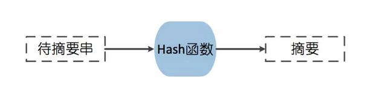
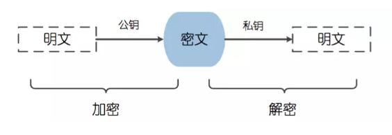

[TOC]

# java 加密方式 简介

程序员一代码搬运工 2018-04-03 12:12:30

## **第一种类型加密方式：数字摘要（不可逆）**

**数字摘要**也称为消息摘要,它是一个唯一对应一个消息或文本的固定长度的值,它**由一个单向Hash函数对消息进行计算而产生。**

**注：这个串有固定的长度,且不同的明文摘要成密文,其结果总是不同的(相对的),而同样的明文其摘要必定一致**

常见的数字摘要加密方式有 

### 1.MD5(Message Digest Algorithm 5(信息摘要算法5))

MD5**,**是数字摘要算法一种实现,用于确保信息传输完整性和一致性,摘要长度为128位

### 2.SHA(Secure Hash Algorithm,即安全散列算法)

SHA-1是基于MD4算法的,现在已成为公认的最安全的散列算法之一,并被广泛使用。

## **第二种加密方式：对称加密（可逆）**

在对称加密算法中,数据发送方将明文(原始数据)和加密密钥一起经过特殊加密算法处理后,生成复杂的加密密文进行发送,数据接收方收到密文后,若想读取原文,则需要使用加密使用的密钥及相同算法的逆算法对加密的密文进行解密,才能使其恢复成可读明文。

**常见的对称加密方式有**

### 1.DES

DES算法属于对称加密算法,明文按64位进行分组,密钥长64位,但事实上只有56位参与DES运算(第8、16、24、32、40、48、56、64位是校验位,使得每个密钥都有奇数个1),分组后的明文和56位的密钥按位替代或交换的方法形成密文。

### 2.AES(Advanced Encryption Standard,即高级加密标准)

AES算法作为新一代的数据加密标准汇聚了强安全性、高性能、高效率、易用和灵活等优点,设计有三个密钥长度:128,192,256位,比DES算法的加密强度更高,更为安全。

## **第三种加密方式：非对称加密（可逆）**

非对称加密算法又称为公开密钥加密算法,它需要两个密钥,一个称为公开密钥(public key), 即公钥,另一个称为私有密钥(private key),即私钥。公钥与私钥需要配对使用,如果用公钥对数据进行加密,只有用对应的私钥才能进行解密,而如果使用私钥对数据进行加密,那么只有用对应的公钥才能进行解密。

**常见的非对称加密方式有**

### RSA

RSA算法基于一个十分简单的数论事实:将两个大素数相乘十分容易,但反过来想要对其乘积进行因式分解却极其困难, 因此可以将乘积公开作为加密密钥。

## **第四种加密方式：数字签名**

签名认证是对非对称加密技术与数字摘要技术的综合运用,指的是将通信内容的摘要信息使用发送者的私钥进行加密,然后将密文与原文一起传输给信息的接收者,接收者通过发送者的公钥解密被加密的摘要信息,然后使用与发送者相同的摘要算法,对接收到的内容采用相同的方式产生摘要串,与解密的摘要串进行对比,如果相同,则说明接收到的内容是完整的,在传输过程中没有受到第三方篡改,否则则说明通信内容已被第三方修改。

## **第五种加密方式：数字证书**

数字证书(Digital Certificate),也称为电子证书,类似于日常生活中的身份证,也是一种形式的身份认证,用于标识网络中的用户身份。

一般一个数字证书包含如下内容

> 对象的名称(人,服务器,组织)
>
> 证书的过期时间
>
> 证书的颁发机构(谁为证书担保)
>
> 证书颁发机构对证书信息的数字签名
>
> 签名算法
>
> 对象的公钥

https://www.toutiao.com/a6540070183208223239/?tt_from=android_share&utm_campaign=client_share&timestamp=1522906577&app=news_article&iid=28537493856&utm_medium=toutiao_android