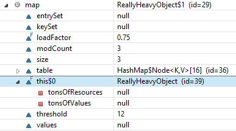

[TOC]


# java-双大括号实例初始化的反模式

今天在看springboot的batch时, 看到这样一段代码, 直接把我看懵了, 于是找了一下, 发现这 两个大括号 {{  叫实例初始化器


```java
 FlatFileItemReader<Person> reader = new FlatFileItemReader<>();
        // 设置 csv文件的路径
        reader.setResource(new ClassPathResource("people.csv"));
        // 对cvs文件的数据和领域模型做对应映射
        reader.setLineMapper(new DefaultLineMapper<Person>() {{
            setLineTokenizer(new DelimitedLineTokenizer() {{
                setNames(new String[] {"name", "age", "nation", "address"});
                }});
            setFieldSetMapper(new BeanWrapperFieldSetMapper<Person>() {{
                setTargetType(Person.class);
            }});
        }});
```


## 1, 什么是java的实例初始化器

1, 平时创建map并put值的时候, 是这样操作的

```
Set<Integer> set = new HashSet<>();
set.add(1);
set.add(2);
set.add(3);
```

或者, 在静态代码块中进行初始化

```java
private static final Set<Integer> set = new HashSet<>();
static {
    set.add(1);
    set.add(2);
    set.add(3);
}
```

或者, 简写成这种形式的

```java
Set<Integer> set = new HashSet<Integer>() {{
    add(1);
    add(2);
    add(3);
}}；
```

于是, 可以作为函数参数传入: 

```java
someFunction(new HashSet<Integer>() {{
    add(1);
    add(2);
    add(3); 
}}
);
```

这儿的大括号, 其实就是一段 { } 局部代码的写法: 

```java
Set<Integer> set = new HashSet<Integer>() {
    {
        add(1);
        add(2);
        add(3);
    }
};
```

这样, 不管使用哪一个构造器, 都会执行我们的这段代码

## 2, 反模式的内存泄漏

原博客地址: http://deepinmind.iteye.com/blog/2165827

说它是一个反模式主要出于三方面的原因： 

### 1. 可读性 

可读性是最次要的一个原因。尽管它使得程序编写变得更简单，并且看起来跟JSON中数据结构的初始化差不多： 

```json
{
    "firstName": "John",
    "lastName": "Smith",
    "organizations": {
        "0": {
            "id": "1234"
        },
        "abc": {
            "id": "5678"
        }
    }
}
```


### 2. 一个实例，一种类型 

通过一次双括号的初始化我们其实就已经创建了一个新类型了！通过这种方式所生成的每一个新map，都会隐式地创建了一个无法重复使用的新类型。如果仅用一次的话也无可厚非。但如果在一个大型的应用中到处都充斥着这种代码的话，无形中会给你的类加载器增加了许多负担，你的堆会持有着这些类的引用。不信么？编译下上述代码并查看下编译器的输出。大概会是这样的： 

```java
Test$1$1$1.class  
Test$1$1$2.class  
Test$1$1.class  
Test$1.class  
Test.class  
```

这里只有最外围的Test.class是有意义的。 

不过这还不是最重要的问题。 

### 3. 内存泄露！ 

最重要的问题就是匿名类所造成的。它们持有着外围实例的引用，这简直就是个定时ZHADAN。想像一下，你把这个看似NB的HashMap初始化放到一个EJB或者是一个很重的包含着这样的生命周期的对象里： 

```java
public class ReallyHeavyObject {  
   
    // Just to illustrate...  
    private int[] tonsOfValues;  
    private Resource[] tonsOfResources;  
   
    // This method almost does nothing  
    public void quickHarmlessMethod() {  
        Map source = new HashMap(){{  
            put("firstName", "John");  
            put("lastName", "Smith");  
            put("organizations", new HashMap(){{  
                put("0", new HashMap(){{  
                    put("id", "1234");  
                }});  
                put("abc", new HashMap(){{  
                    put("id", "5678");  
                }});  
            }});  
        }};  
           
        // Some more code here  
    }  
}  
```

这个ReallyHeavyObject类中有许多资源，当ReallyHeavyObject对象被垃圾回收掉时这些资源是需要尽快被释放掉的。不过调用quickHarmlessMethod()方法并不会造成什么影响，因为这个map很快就会被回收掉了。 

好的。 

我们假设另外一个开发人员，他重构了一下这个方法，返回了这个map，或者是map中的某一部分： 

```java
public Map quickHarmlessMethod() {  
    Map source = new HashMap(){{  
        put("firstName", "John");  
        put("lastName", "Smith");  
        put("organizations", new HashMap(){{  
            put("0", new HashMap(){{  
                put("id", "1234");  
            }});  
            put("abc", new HashMap(){{  
                put("id", "5678");  
            }});  
        }});  
    }};  
       
    return source;  
}  
```

这下问题就严重了！现在你把ReallyHeavyObject中的所有状态都暴露给外部了，因为每个内部类都会持有一个外围实例的引用，也就是ReallyHeavyObject实例。不信么？运行下这段程序看看： 

```java
public static void main(String[] args) throws Exception {  
    Map map = new ReallyHeavyObject().quickHarmlessMethod();  
    Field field = map.getClass().getDeclaredField("this$0");  
    field.setAccessible(true);  
    System.out.println(field.get(map).getClass());  
}  
```

确实是这样！。如果你仍不相信的话，还可以使用调试器来查看下这个返回的map的内部状态。  



 

 你会发现外围实例的引用就在这个匿名的HashMap子类中安静地躺着。所有的这些匿名子类型都会持有一个这样的引用。 

**因此，不要使用这个反模式** 

你可能会说，如果将quickHarmlessMethod()声明成static的不就好了，这不会出现3中的泄露问题了，你说的没错。 

不过上述代码中最糟糕的问题就是即便你知道这个静态上下文中的map该如何使用，但下一个开发人员可能会注意不到，他还可能会把这个static重构或者删除掉。他们还可能会把这个map存储在一个单例中，这样你就很难再从代码中看出哪里会有一个无用的ReallyHeavyObject的引用。 

内部类是一头野兽。它已经造成过许多的问题以及认知失衡。匿名内部类则更为严重，因为读到这段代码的人可能完全没有意识到自己已经包装了一个外围实例，并且把这个实例传递到了别处。 

## 结论便是： 

不要自作聪明了，别使用双括号来进行初始化。 


https://www.cnblogs.com/wenbronk/p/7000643.html