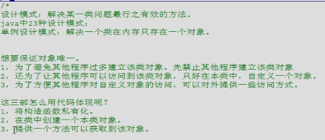
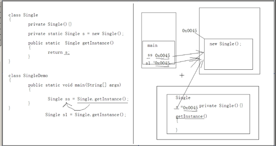
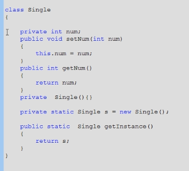
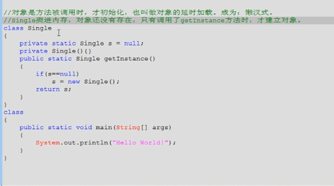
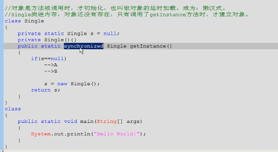

[TOC]


# 设计模式之单例设计模式

## 前言

记录原则:定义单例,建议使用饿汉式

面试经常考到懒汉式  复合型高

单例设计模式：解决一个类在内存只存在一个对象




## 第一种:饿汉式（一般用饿汉式 安全简单）

### 说明



 




  

### 具体代码

```java
/**
 * <B>Description:</B> 第一种:饿汉式（一般用饿汉式 安全简单） <br>
 * <B>Create on:</B> 2018/2/27 下午10:42 <br>
 *
 * @author xiangyu.ye
 * @version 1.0
 */
public class Single {

    private static Single single = new Single();
    private Single() {}
    public static Single getInstance() {
        return single;
    }

}
```


## 第二种:懒汉式

### 说明



解决安全问题  加锁

但是低效



### 具体代码

最终解决方案

```java
/**
 * <B>Description:</B> 第二种:懒汉式 <br>
 * 双重判断
 * <br>对象是方法被调用时才初始化,也叫做对象的延时加载.称 懒汉式.
 * <br>Single类进内存,对象还没有存在,只有调用了getInstance方法时,才建立对象.<br>
 * <B>Create on:</B> 2018/2/27 下午10:42 <br>
 *
 * @author xiangyu.ye
 * @version 1.0
 */
public class Single {

    private static volatile Single single = null;
    private Single() {}
    public static Single getInstance() {
        if (single==null){
            synchronized (Single.class){
                if (single==null){
                    single = new Single();
                }
            }
        }
        return single;
    }

}
```


 

 

 

 