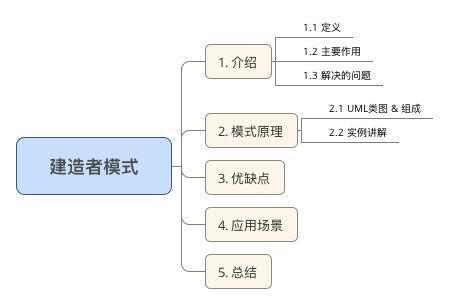
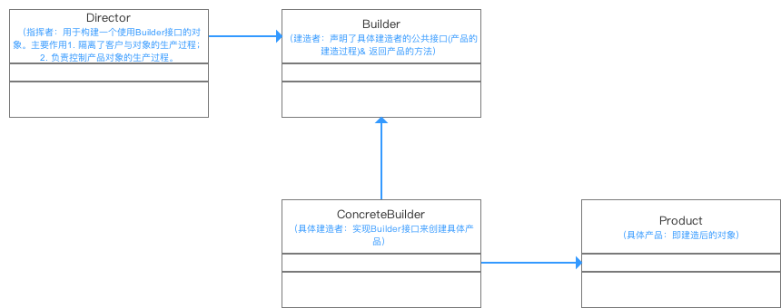

[TOC]


# 建造者模式（Builder Pattern）- 最易懂的设计模式解析

# 前言

今天我来全面总结一下Android开发中最常用的设计模式 -建造者模式。

> **其他设计模式介绍** 
> [1分钟全面了解“设计模式”](http://www.jianshu.com/p/6e5eda3a51af) 
> [单例模式（Singleton） - 最易懂的设计模式解析](http://www.jianshu.com/p/b8c578b07fbc) 
> [简单工厂模式（SimpleFactoryPattern）- 最易懂的设计模式解析](http://www.jianshu.com/p/e55fbddc071c) 
> [工厂方法模式（Factory Method）- 最易懂的设计模式解析](http://www.jianshu.com/p/d0c444275827) 
> [抽象工厂模式（Abstract Factory）- 最易懂的设计模式解析](http://www.jianshu.com/p/7deb64f902db) 
> [策略模式（Strategy Pattern）- 最易懂的设计模式解析](http://www.jianshu.com/p/0c62bf587b9c) 
> [适配器模式（Adapter Pattern）- 最易懂的设计模式解析](http://www.jianshu.com/p/9d0575311214) 
> [代理模式（Proxy Pattern）- 最易懂的设计模式解析](http://www.jianshu.com/p/a8aa6851e09e) 
> [模板方法模式（Template Method） - 最易懂的设计模式解析](http://www.jianshu.com/p/a3474f4fee57) 
> [建造者模式（Builder Pattern）- 最易懂的设计模式解析](http://www.jianshu.com/p/be290ccea05a) 
> [外观模式（Facade Pattern） - 最易懂的设计模式解析](http://www.jianshu.com/p/1b027d9fc005)

------

# 目录



------

# 1. 介绍

#### 1.1 定义

将一个复杂对象的构建与它的表示分离，使得同样的构建过程可以创建不同的表示

#### 1.2 主要作用

在用户不知道对象的建造过程和细节的情况下就可以直接创建复杂的对象。

> 1. 用户只需要给出指定复杂对象的类型和内容；
> 2. 建造者模式负责按顺序创建复杂对象（把内部的建造过程和细节隐藏起来)

#### 1.3 解决的问题

- 方便用户创建复杂的对象（不需要知道实现过程）
- 代码复用性 & 封装性（将对象构建过程和细节进行封装 & 复用）

> 例子：造汽车 & 买汽车。 
> \1. 工厂（建造者模式）：负责制造汽车（组装过程和细节在工厂内） 
> \2. 汽车购买者（用户）：你只需要说出你需要的型号（对象的类型和内容），然后直接购买就可以使用了 
> （不需要知道汽车是怎么组装的（车轮、车门、发动机、方向盘等等））

------

# 2. 模式原理

#### 2.1 UML类图 & 组成



模式讲解： 
\1. 指挥者（Director）直接和客户（Client）进行需求沟通； 
\2. 沟通后指挥者将客户创建产品的需求划分为各个部件的建造请求（Builder）； 
\3. 将各个部件的建造请求委派到具体的建造者（ConcreteBuilder）； 
\4. 各个具体建造者负责进行产品部件的构建； 
\5. 最终构建成具体产品（Product）。

#### 2.2 实例讲解

接下来我用一个实例来对建造者模式进行更深一步的介绍。

**a. 实例概况**

- 背景：小成希望去电脑城买一台组装的台式主机

- 过程：


  ​

  1. 电脑城老板（Diretor）和小成（Client）进行需求沟通（买来打游戏？学习？看片？）
  2. 了解需求后，电脑城老板将小成需要的主机划分为各个部件（Builder）的建造请求（CPU、主板blabla）
  3. 指挥装机人员（ConcreteBuilder）去构建组件；
  4. 将组件组装起来成小成需要的电脑（Product）

**b. 使用步骤** 
**步骤1：** 定义组装的过程（Builder）：组装电脑的过程

```java
public abstract class Builder {

    //第一步：装CPU
    //声明为抽象方法，具体由子类实现 
    public abstract void BuildCPU();

    //第二步：装主板
    //声明为抽象方法，具体由子类实现 
    public abstract void BuildMainboard();

    //第三步：装硬盘
    //声明为抽象方法，具体由子类实现 
    public abstract void BuildHD();

    //返回产品的方法：获得组装好的电脑
    public abstract Computer GetComputer();
} 
```

**步骤2：** 电脑城老板委派任务给装机人员（Director）

```
public class Director {
    //指挥装机人员组装电脑
    public void Construct(Builder builder) {
        builder.BuildCPU();
        builder.BuildMainboard();
        builder.BuildHD();
    }
}
```

**步骤3：** 创建具体的建造者（ConcreteBuilder）:装机人员

```
//装机人员1
public class ConcreteBuilder extends Builder {
    //创建产品实例
    Computer computer = new Computer();

    //组装产品
    @Override
    public void BuildCPU() {
        computer.Add("组装CPU");
    }

    @Override
    public void BuildMainboard() {
        computer.Add("组装主板");
    }

    @Override
    public void BuildHD() {
        computer.Add("组装主板");
    }

    //返回组装成功的电脑
    @Override
    public Computer GetComputer() {
        return computer;
    }
}

```

**步骤4：** 定义具体产品类（Product）：电脑

```
public class Computer {
 
    //电脑组件的集合
    private List<String> parts = new ArrayList<String>();

    //用于将组件组装到电脑里
    public void Add(String part) {
        parts.add(part);
    }

    public void Show() {
        for (int i = 0; i < parts.size(); i++) {
            System.out.println("组件" + parts.get(i) + "装好了");
        }
        System.out.println("电脑组装完成，请验收");
    }
}
```

**步骤5：** 客户端调用-小成到电脑城找老板买电脑

```
public class Test {
    public static void main(String[] args) {
        //逛了很久终于发现一家合适的电脑店
        //找到该店的老板和装机人员
        Director director = new Director();
        Builder builder = new ConcreteBuilder();

        //沟通需求后，老板叫装机人员去装电脑
        director.Construct(builder);

        //装完后，组装人员搬来组装好的电脑
        Computer computer = builder.GetComputer();
        //组装人员展示电脑给小成看
        computer.Show();
    }
}
```

结果输出

```
组件CUP装好了
组件主板装好了
组件硬盘装好了
电脑组装完成，请验收 
```

### 通过上述这个常见的生活例子，我相信你已经完全明白了建造者模式的原理了！！

------

# 3. 优缺点

在全面解析完后，我来分析下其优缺点：

#### 3.1 优点

- 易于解耦 
  将产品本身与产品创建过程进行解耦，可以使用相同的创建过程来得到不同的产品。也就说细节依赖抽象。

- 易于精确控制对象的创建 
  将复杂产品的创建步骤分解在不同的方法中，使得创建过程更加清晰

- 易于拓展


  ​

  增加新的具体建造者无需修改原有类库的代码，易于拓展，符合“开闭原则“。

   

  ​

  > 每一个具体建造者都相对独立，而与其他的具体建造者无关，因此可以很方便地替换具体建造者或增加新的具体建造者，用户使用不同的具体建造者即可得到不同的产品对象。

#### 3.2 缺点

- 建造者模式所创建的产品一般具有较多的共同点，其组成部分相似；如果产品之间的差异性很大，则不适合使用建造者模式，因此其使用范围受到一定的限制。

- 如果产品的内部变化复杂，可能会导致需要定义很多具体建造者类来实现这种变化，导致系统变得很庞大。


  ​

------

# 4. 应用场景

- 需要生成的产品对象有复杂的内部结构，这些产品对象具备共性；

- 隔离复杂对象的创建和使用，并使得相同的创建过程可以创建不同的产品。


# 5. 总结

本文主要对**建造者模式**进行了全面介绍，接下来将介绍其他设计模式，有兴趣可以继续关注[Carson_Ho的安卓开发笔记](http://www.jianshu.com/users/383970bef0a0/latest_articles)！！！！

https://blog.csdn.net/carson_ho/article/details/54910597