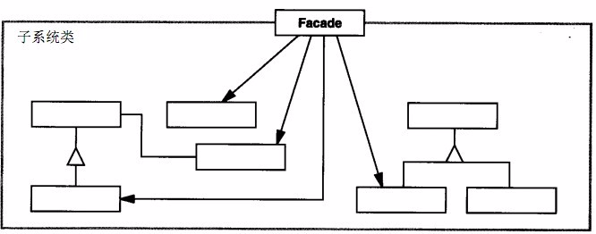
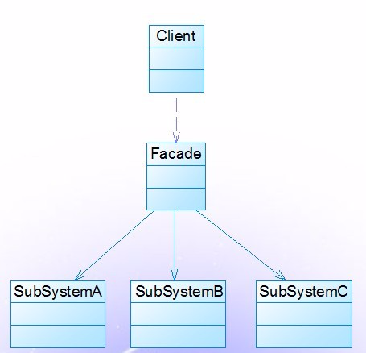
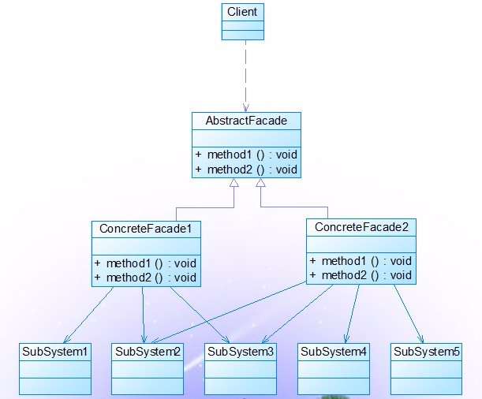

# **设计模式--外观模式Facade（结构型）:**

## **1. 概述**

 ​     [外观模式](http://blog.csdn.net/hguisu/article/details/7533759)，我们通过外观的包装，使应用程序只能看到外观对象，而不会看到具体的细节对象，这样无疑会降低应用程序的复杂度，并且提高了程序的可维护性。
 例子1：一个电源总开关可以控制四盏灯、一个风扇、一台空调和一台电视机的启动和关闭。该电源总开关可以同时控制上述所有电器设备，电源总开关即为该系统的外观模式设计。

## **2. 问题**

 为了降低复杂性，常常将系统划分为若干个子系统。但是如何做到各个系统之间的通信和相互依赖关系达到最小呢？

## **3. 解决方案**

 **外观模式**：为子系统中的一组接口提供一个一致的界面， Facade模式定义了一个高层接口，这个接口使得这一子系统更加容易使用。引入外观角色之后，用户只需要直接与外观角色交互，用户与子系统之间的复杂关系由外观角色来实现，从而降低了系统的耦合度。

 

## **4.适用性**

在遇到以下情况使用[facade模式](http://blog.csdn.net/hguisu/article/details/7533759)：
​    1) 当你要为一个复杂子系统提供一个简单接口时。子系统往往因为不断演化而变得越来越复杂。大多数模式使用时都会产生更多更小的类。
​    这使得子系统更具可重用性，也更容易对子系统进行定制，但这也给那些不需要定制子系统的用户带来一些使用上的困难。facade可以提供一个简单的缺省视图，
​    这一视图对大多数用户来说已经足够，而那些需要更多的可定制性的用户可以越过facade层。
​    2) 客户程序与抽象类的实现部分之间存在着很大的依赖性。引入 facade将这个子系统与客户以及其他的子系统分离，可以提高子系统的独立性 和可移植性。
​    3) 当你需要构建一个层次结构的子系统时，使用 facade模式定义子系统中每层的入口点。如果子系统之间是相互依赖的，你可以让它们仅通过facade进行通讯，从而简化了它们之间的依赖关系。

## **5.结构**





## **6.构建模式的组成**

 

 外观角色（Facade）

 ：是模式的核心，他被客户client角色调用，知道各个子系统的功能。同时根据客户角色已有的需求预订了几种功能组合\

 

 子系统角色（Subsystem classes）

 ：实现子系统的功能，并处理由Facade对象指派的任务。对子系统而言，facade和client角色是未知的，没有Facade的任何相关信息；即没有指向Facade的实例。

 

 客户角色（client）

 ：调用facade角色获得完成相应的功能。

 

## **7. 优点和缺点**

 ### Facade模式有下面一些优点：

 1）对客户屏蔽子系统组件，减少了客户处理的对象数目并使得子系统使用起来更加容易。通过引入外观模式，客户代码将变得很简单，与之关联的对象也很少。

 2）实现了子系统与客户之间的松耦合关系，这使得子系统的组件变化不会影响到调用它的客户类，只需要调整外观类即可。

 3）降低了大型软件系统中的编译依赖性，并简化了系统在不同平台之间的移植过程，因为编译一个子系统一般不需要编译所有其他的子系统。一个子系统的修改对其他子系统没有任何影响，而且子系统内部变化也不会影响到外观对象。

 4）只是提供了一个访问子系统的统一入口，并不影响用户直接使用子系统类。

 ### Facade模式的缺点

 1） 不能很好地限制客户使用子系统类，如果对客户访问子系统类做太多的限制则减少了可变性和灵活性。

 2） 在不引入抽象外观类的情况下，增加新的子系统可能需要修改外观类或客户端的源代码，违背了“开闭原则”。

 

## **8. 实现**

 我们使用开关的例子;

 ```
 <?php   
 /** 
  * 外观模式 
  * 
  */  
  class SwitchFacade  
 {  
     private $_light     = null;     //电灯  
     private $_ac        = null;     //空调  
     private $_fan       = null;     //电扇  
     private $_tv        = null;     //电视  
       
     public function __construct()  
     {  
         $this-_light = new Light();  
         $this-_fan = new Fan();  
         $this-_ac = new AirConditioner();  
         $this-_tv = new Television();  
     }  
     /** 
      * 晚上开电灯 
      * 
      */  
     public function method1($isOpen =1) {  
         if ($isOpen == 1) {  
             $this-_light-on();  
             $this-_fan-on();  
             $this-_ac-on();  
             $this-_tv-on();  
         }else{  
             $this-_light-off();  
             $this-_fan-off();  
             $this-_ac-off();  
             $this-_tv-off();  
         }  
   
     }  
     /** 
      * 白天不需要电灯 
      * 
      */  
     public function method2() {  
         if ($isOpen == 1) {  
             $this-_fan-on();  
             $this-_ac-on();  
             $this-_tv-on();  
         }else{  
             $this-_fan-off();  
             $this-_ac-off();  
             $this-_tv-off();  
         }  
     }  
 }  
   
 /******************************************子系统类 ************/  
 /** 
  *  
 */   
 class Light  
 {     
     private $_isOpen = 0;  
     public function on() {  
         echo 'Light is open', '<br/';  
         $this-_isOpen = 1;   
     }  
     public function off() {  
         echo 'Light is off', '<br/';  
         $this-_isOpen = 0;  
     }  
 }  
   
 class Fan  
 {  
     private $_isOpen = 0;  
     public function on() {  
         echo 'Fan is open', '<br/';  
         $this-_isOpen = 1;   
     }  
     public function off() {  
         echo 'Fan is off', '<br/';  
         $this-_isOpen = 0;  
     }  
 }  
   
 class AirConditioner  
 {  
     private $_isOpen = 0;  
     public function on() {  
         echo 'AirConditioner is open', '<br/';  
         $this-_isOpen = 1;   
     }  
     public function off() {  
         echo 'AirConditioner is off', '<br/';  
         $this-_isOpen = 0;  
     }  
 }  
 class Television  
 {  
     private $_isOpen = 0;  
     public function on() {  
         echo 'Television is open', '<br/';  
         $this-_isOpen = 1;   
     }  
     public function off() {  
         echo 'Television is off', '<br/';  
         $this-_isOpen = 0;  
     }  
 }  
 /** 
  * 客户类 
  * 
  */  
 class client {  
     static function open() {  
         $f = new  SwitchFacade();  
         $f-method1(1);  
     }  
   
     static function close() {  
         $f = new  SwitchFacade();  
         $f-method1(0);  
     }  
 }  
 client::open();  
 ```

 


## **9.与其他相关模式**

    [ 1）抽象工厂模式](http://blog.csdn.net/hguisu/article/details/7505909)：Abstract Factory式可以与Facade模式一起使用以提供一个接口，这一接口可用来以一种子系统独立的方式创建子系统对象。 Abstract Factory也可以代替Facade模式隐藏那些与平台相关的类。
    ​    [2）中介模式](http://blog.csdn.net/hguisu/article/details/7554612)：Mediator模式与Facade模式的相似之处是，它抽象了一些已有的类的功能。然而，Mediator的目的是对同事之间的任意通讯进行抽象，通常集中不属于任何单个对象的功能。
    ​    Mediator的同事对象知道中介者并与它通信，而不是直接与其他同类对象通信。相对而言，Facade模式仅对子系统对象的接口进行抽象，从而使它们更容易使用；它并不定义新功能，子系统也不知道Facade的存在。 
    ​    通常来讲，仅需要一个Facade对象，因此Facade对象通常属于Singleton模式。
    [ 3）Adapter模式](http://blog.csdn.net/hguisu/article/details/blog.csdn.net/hguisu/article/details/7527842)：
    ​    适配器模式是将一个接口通过适配来间接转换为另一个接口。
    ​    外观模式的话，其主要是提供一个整洁的一致的接口给客户端。

## **10. 总结**

 

 1）根据[“单一职责原则”](http://blog.csdn.net/hguisu/article/details/7571617)，在软件中将一个系统划分为若干个子系统有利于降低整个系统的复杂性，一个常见的设计目标是使子系统间的通信和相互依赖关系达到最小，而达到该目标的途径之一就是引入一个外观对象，它为子系统的访问提供了一个简单而单一的入口。

 

 2）[外观模式](http://blog.csdn.net/hguisu/article/details/7533759)也是“迪米特法则”的体现，通过引入一个新的外观类可以降低原有系统的复杂度，外观类充当了客户类与子系统类之间的“第三者”，同时降低客户类与子系统类的耦合度。外观模式就是实现代码重构以便达到“迪米特法则”要求的一个强有力的武器。

 

 3）[外观模式](http://blog.csdn.net/hguisu/article/details/7533759)要求一个子系统的外部与其内部的通信通过一个统一的外观对象进行，外观类将客户端与子系统的内部复杂性分隔开，使得客户端只需要与外观对象打交道，而不需要与子系统内部的很多对象打交道。

 

 

 4）[外观模式](http://blog.csdn.net/hguisu/article/details/7533759)从很大程度上提高了客户端使用的便捷性，使得客户端无须关心子系统的工作细节，通过外观角色即可调用相关功能。

 5）不要试图通过外观类为子系统增加新行为 ，不要通过继承一个外观类在子系统中加入新的行为，这种做法是错误的。外观模式的用意是为子系统提供一个集中化和简化的沟通渠道，而不是向子系统加入新的行为，新的行为的增加应该通过修改原有子系统类或增加新的子系统类来实现，不能通过外观类来实现。

 

## **11.模式扩展**

 **一个系统有多个外观类：**

 ​        在外观模式中，通常只需要一个外观类，并且此外观类只有一个实例，换言之它是一个

 单例类

 。

 在很多情况下为了节约系统资源，一般将外观类设计为单例类。

 当然这并不意味着在整个系统里只能有一个外观类，

 在一个系统中可以设计多个外观类，每个外观类都负责和一些特定的子系统交互

 ，向用户提供相应的业务功能。

 **不要试图通过外观类为子系统增加新行为：**

 ​       不要通过继承一个外观类在子系统中加入新的行为，这种做法是错误的。外观模式的用意是为子系统提供一个集中化和简化的沟通渠道，而不是向子系统加入新的行为，新的行为的增加应该通过修改原有子系统类或增加新的子系统类来实现，不能通过外观类来实现。

 **外观模式与迪米特法则：**

 ​       外观模式创造出一个外观对象，将客户端所涉及的属于一个子系统的协作伙伴的数量减到最少，使得客户端与子系统内部的对象的相互作用被外观对象所取代。外观类充当了客户类与子系统类之间的“第三者”，降低了客户类与子系统类之间的耦合度，外观模式就是实现代码重构以便达到“迪米特法则”要求的一个强有力的武器。

 

 **抽象外观类的引入：**

 

 

 外观模式最大的缺点在于违背了[“开闭原则”](http://blog.csdn.net/hguisu/article/details/7571617)，

 当增加新的子系统或者移除子系统时需要修改外观类，可以通过引入抽象外观类在一定程度上解决该问题，客户端针对抽象外观类进行编程。

 对于新的业务需求，不修改原有外观类，而对应增加一个新的具体外观类，由新的具体外观类来关联新的子系统对象，同时通过修改配置文件来达到不修改源代码并更换外观类的目的。 

 

 UML:

 

来源： <http://blog.csdn.net/hguisu/article/details/7533759