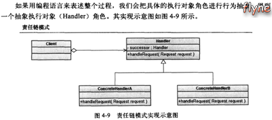
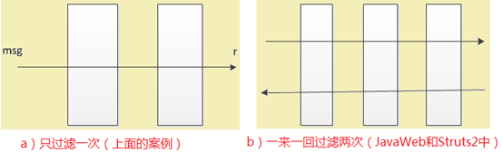
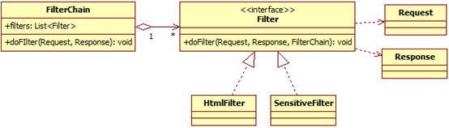

[TOC]


# 设计模式之责任链设计模式(过滤器/拦截器)

​       责任链设计模式（Chain of Responsibility）的应用有：Java Web中的过滤器链、springmvc中的拦截器链，Struts2中的拦截器栈等等。

​       先看如下一个问题：

​       给定一个字符串“被就业了：)，敏感信息，\<script>”，对其中的HTML标记和敏感词进行过滤或替换。本文主要以该问题设计方法的演变来讲解责任链设计模式。

## 第一种设计：没有任何设计模式

​       设计了一个MsgProcessor类，完成字符串处理的主要工作。MainTest类是本设计中的测试类。

```java
package zmx.designmode.test.responsibilitychain;
 
public class MainTest {
	
	public static void main(String[] args) {
	        //需要被过滤的语句  
	        String msg = "被就业了：)，敏感信息，<script>";  
	        //实例化处理类  
	        MsgProcessor mp = new MsgProcessor(msg);  
	        String r = mp.process();  
	        System.out.println(r);	
	}
 
}

```

```java
package zmx.designmode.test.responsibilitychain;
 
public class MsgProcessor {
 
	private String msg;
 
	public MsgProcessor(String msg) {
		this.msg = msg;
	}
 
	public String process() {
		String r = msg;
		// 过滤msg中的HTML标记
		r = r.replaceAll("<.*>", "");
		
		// 过滤敏感词
		r = r.replace("敏感信息", "").replace("被就业", "就业");
		return r;
	}
 
}

```

测试结果：

​        就业了：)

​       在第一种设计中，对字符串的所有处理都放在MsgProcessor类中，扩展性极差。如果要过滤字符串中的笑脸（将”：)”替换成”^_^”），则需要改动MSgProcessor中的process方法。我们看第二种设计。

## 第二种设计：增加一个Filter接口

### 1、filter接口：

```
package zmx.designmode.test.responsibilitychain;
 
public interface Filter {
	public String doFilter(String str);
}

```

### 2、定义实现几种实现：

```
package zmx.designmode.test.responsibilitychain;
 
public class HtmlFilter implements Filter {
 
	@Override
	public String doFilter(String str) {
		
        String r = str;  
        //过滤msg中的HTML标记  
        r = r.replaceAll("<.*>", "");  
        return r;  
 
	}
 
}

```

```
package zmx.designmode.test.responsibilitychain;
 
public class SensitiveFilter implements Filter {
 
	@Override
	public String doFilter(String str) {
		
        String r = str;  
        //过滤str中的敏感信息 
        r = r.replace("敏感信息", "").replace("被就业", "就业");
		return r;  
 
	}
 
}

```

### 3、处理类

```
package zmx.designmode.test.responsibilitychain;
 
public class MsgFilterProcessor {
	
	private String msg;
	private Filter[] filters= new Filter[]{new HtmlFilter(),new SensitiveFilter()};
	
	public MsgFilterProcessor(String msg) {
		this.msg = msg;
	}
	
	public String process(){
		
        String r = msg;  
        for(Filter f : filters){  
	        r = f.doFilter(r);  
        }  
        return r;  
 
	}
 
}

```

### 4、测试类

```
package zmx.designmode.test.responsibilitychain;
 
public class MainTest {
	
	public static void main(String[] args) {
		
	        //需要被过滤的语句  
	        String msg = "被就业了：)，敏感信息，<script>";  
	        //实例化处理类  
	        //MsgProcessor mp = new MsgProcessor(msg);  	        
	        MsgFilterProcessor mp = new MsgFilterProcessor(msg);
	        String r = mp.process();  
	        System.out.println(r);	
	}
 
}

```

测试结果：

​        就业了：)

​        此时，如果需要过滤字符串中的笑脸，只需要创建一个类FaceFilter实现Filter接口，并在MsgProcessor类中的filters字段中登记即可。

## 第三种设计：责任链模式（FilterChain）

​       定义：将一个事件处理流程分派到一组执行对象上去，这一组执行对象形成一个链式结构，事件处理请求在这一组执行对象上进行传递。责任链模式的主要参与角色：

​       ① 事件处理请求对象（Request）

​       ② 执行对象（Handler）



### 1、FilterChain

```
package zmx.designmode.test.responsibilitychain;
 
import java.util.ArrayList;
import java.util.List;
 
public class FilterChain implements Filter {
	
	public List<Filter> filters = new ArrayList<Filter>();
	
	public FilterChain addFilter(Filter f){
		filters.add(f);  
	    return this;
	}
 
	@Override
	public String doFilter(String str) {
		
        String r = str;  
        for(Filter f : filters){  
	        r = f.doFilter(r);  
        }  
        return r; 
 
	}
 
}

```

### 2、SimleFilter

```
package zmx.designmode.test.responsibilitychain;
 
public class SmileFilter implements Filter {
 
	@Override
	public String doFilter(String str) {
		
        String r = str;  
        //过滤msg中的笑脸标记  
        r = r.replace(":)", "^_^");  
        return r;  
 
	}
 
}

```

### 3、MsgFilterChainProcessor

```
package zmx.designmode.test.responsibilitychain;
 
public class MsgFilterChainProcessor {
	
    private String msg;  
    private FilterChain chain = new FilterChain();  
    public MsgFilterChainProcessor(String msg, FilterChain filterChain){  
        this.msg = msg;  
        this.chain = filterChain;  
    }  
    public String process(){  
        return chain.doFilter(msg);  
    } 
 
 
}

```

### 4、MainTest

```
package zmx.designmode.test.responsibilitychain;
 
public class MainTest {
	
	public static void main(String[] args) {
		
	        //需要被过滤的语句  
	        String msg = "被就业了:),敏感信息,<script>";  
	        //实例化处理类  
	        //MsgProcessor mp = new MsgProcessor(msg);  	        
	        //MsgFilterProcessor mp = new MsgFilterProcessor(msg);
	        
	        //搞一个过过滤链  
	        FilterChain chain = new FilterChain();  
	        chain.addFilter(new HtmlFilter())
	             .addFilter(new SensitiveFilter())
	             .addFilter(new SmileFilter());  
	        //实例化处理类  
	        MsgFilterChainProcessor mp = new MsgFilterChainProcessor(msg,chain);
 
	        String r = mp.process();  
	        System.out.println(r);	
	}
 
}

```

测试结果：

​     就业了^_^

## 责任链模式加强版

​      上面的实现的过滤链可以用下图a）表示出来，整个过程只对msg过滤了一次。而JavaWeb中的过滤器链和Struts2中的拦截器栈执行的过程可以形象的表示为图b，很重要）。

[](http://www.flyne.org/wp-content/uploads/2014/09/%E8%B4%A3%E4%BB%BB%E9%93%BE%E8%AE%BE%E8%AE%A1%E6%A8%A1%E5%BC%8F%EF%BC%88%E8%BF%87%E6%BB%A4%E5%99%A8%E3%80%81%E6%8B%A6%E6%88%AA%E5%99%A8%EF%BC%892890.png)

​       下面用程序模拟JavaWeb中的过滤器，实现类似于对Request和Response的过滤。主要涉及的类如下所示：

[](http://www.flyne.org/wp-content/uploads/2014/09/%E8%B4%A3%E4%BB%BB%E9%93%BE%E8%AE%BE%E8%AE%A1%E6%A8%A1%E5%BC%8F%EF%BC%88%E8%BF%87%E6%BB%A4%E5%99%A8%E3%80%81%E6%8B%A6%E6%88%AA%E5%99%A8%EF%BC%892950.png)

```java
public interface Filter {
    void doFilter(Request req,Response resp,FilterChain chain);
}

```

```java
public class HtmlFilter implements Filter {
    public void doFilter(Request req, Response resp, FilterChain chain) {
        //过滤req.reqStr中的HTML标记
        req.reqStr = req.reqStr.replace("<", "<").replace(">", ">");
        req.reqStr += "---HtmlFilter()---";
        chain.doFilter(req, resp);
        resp.respStr += "---HtmlFilter()---";
    }
}

```

```java
public class SensitiveFilter implements Filter {
    public void doFilter(Request req, Response resp, FilterChain chain) {
        // 过滤req.reqStr中的敏感词
        req.reqStr = req.reqStr.replace("敏感", "").replace("被就业", "就业");
        req.reqStr += "===SensitiveFilter";
        chain.doFilter(req, resp);
        resp.respStr += "===SensitiveFilter";
    }
}

```

```java
public class FilterChain{
    private List<Filter> filters = new ArrayList<Filter>();
    //调用链上的过滤器时，记录过滤器的位置用
    private int index = 0;
    public FilterChain addFilter(Filter f){
        filters.add(f);
        return this;
    }
    public void doFilter(Request req, Response resp) {
        if(index == filters.size()) return;
        //得到当前过滤器
        Filter f = filters.get(index);
        index++;
        f.doFilter(req, resp, this);
    }
}

```

```java
public class Request {
    //在Request中只保持了一个reqStr字段记录对Request的操作
    //为了方便模拟，没有将reqStr设置为private
    String reqStr;
}

```

```java
 
public class Response {
    //在Response中只保持了一个respStr字段记录对Response的操作
    //为了方便模拟，没有将respStr设置为private
    String respStr;
}

```

```java
package org.flyne.fiter;
public class MainClass {
    public static void main(String[] args) {
        // 需要被过滤的语句
        String msg = "被就业了：），敏感信息，<script>";
        //创建Request、Response对象
        Request req = new Request();
        Response resp = new Response();
        req.reqStr = msg;
        resp.respStr = "response";
        //搞一个过滤链，链上有两个过滤器
        FilterChain chain = new FilterChain();
        chain.addFilter(new HtmlFilter())
             .addFilter(new SensitiveFilter());
        //开始过滤
        chain.doFilter(req, resp);
        System.out.println(req.reqStr);
        System.out.println(resp.respStr);
    }
}

```


https://blog.csdn.net/zmx729618/article/details/51512919