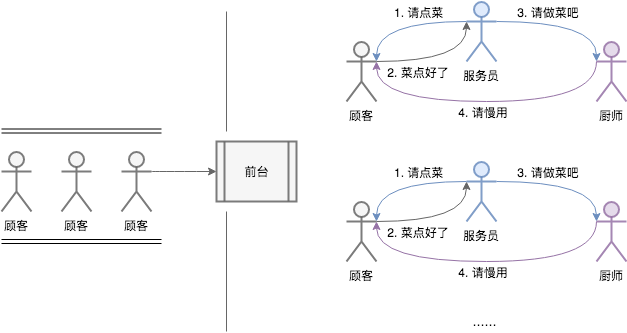
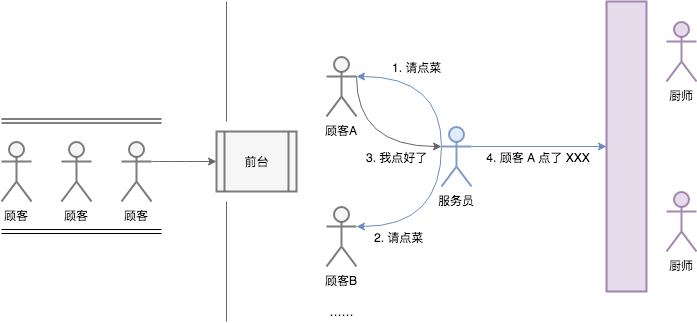

[TOC]

# 设计模式之Reactor 模式简介

如果你熟悉 Java 的 23 种设计模式，看到“Reactor 模式”可能就会一脸懵逼，这是什么鬼。Reactor 是一种应用在服务器端的开发模式（也有说法称 Reactor 是一种 IO 模式），目的是提高服务端程序的并发能力。

## Reactor 模式

它要解决什么问题呢？传统的 thread per connection 用法中，线程在真正处理请求之前首先需要从 socket 中读取网络请求，而在读取完成之前，线程本身被阻塞，不能做任何事，这就导致线程资源被占用，而线程资源本身是很珍贵的，尤其是在处理高并发请求时。

而 Reactor 模式指出，在等待 IO 时，线程可以先退出，这样就不会因为有线程在等待 IO 而占用资源。但是这样原先的执行流程就没法还原了，因此，我们可以利用事件驱动的方式，要求线程在退出之前向 event loop 注册回调函数，这样 IO 完成时 event loop 就可以调用回调函数完成剩余的操作。

所以说，Reactor 模式通过减少服务器的资源消耗，提高了并发的能力。当然，从实现角度上，事件驱动编程会更难写，难 debug 一些。

## 餐厅里的 Reactor 模式

我们用“餐厅”类比的话，就像下图：

对于每个新来的顾客，前台都需要找到一个服务员和厨师来服务这个顾客。

1. 服务员给出菜单，并等待点菜
2. 顾客查看菜单，并点菜
3. 服务员把菜单交给厨师，厨师照着做菜
4. 厨师做好菜后端到餐桌上

这就是传统的多线程服务器。每个顾客都有自己的服务团队（线程），在人少的情况下是可以良好的运作的。现在餐厅的口碑好，顾客人数不断增加，这时服务员就有点处理不过来了。

这时老板发现，每个服务员在服务完客人后，都要去休息一下，因此老板就说，“你们都别休息了，在旁边待命”。这样可能 10 个服务员也来得及服务 20 个顾客了。这也是“线程池”的方式，通过重用线程来减少线程的创建和销毁时间，从而提高性能。

但是客人又进一步增加了，仅仅靠剥削服务员的休息时间也没有办法服务这么多客人。老板仔细观察，发现其实服务员并不是一直在干活的，大部分时间他们只是站在餐桌旁边等客人点菜。

于是老板就对服务员说，客人点菜的时候你们就别傻站着了，先去服务其它客人，有客人点好的时候喊你们再过去。对应于下图：

最后，老板发现根本不需要那么多的服务员，于是裁了一波员，最终甚至可以只有一个服务员。

这就是 Reactor 模式的核心思想：减少等待。当遇到需要等待 IO 时，先释放资源，而在 IO 完成时，再通过事件驱动 (event driven) 的方式，继续接下来的处理。从整体上减少了资源的消耗。

## 参考

- <https://www.cse.wustl.edu/~schmidt/PDF/reactor-siemens.pdf> 原版论文，图文并茂
- <https://blog.csdn.net/xxqi1229/article/details/39292661> Reactor 模式的类比
- [Scalable IO in Java](http://www.cnblogs.com/luxiaoxun/p/4331110.html) 几种 Reactor 模式的扩展

https://lotabout.me/2018/reactor-pattern/