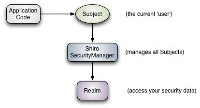
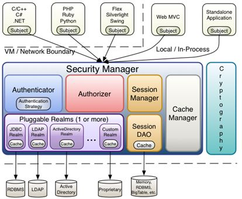
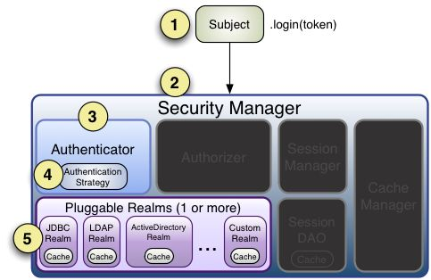
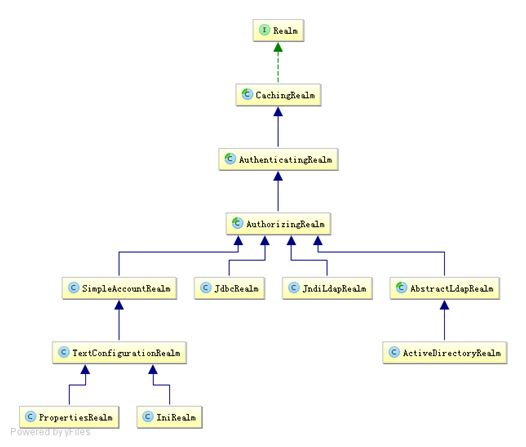
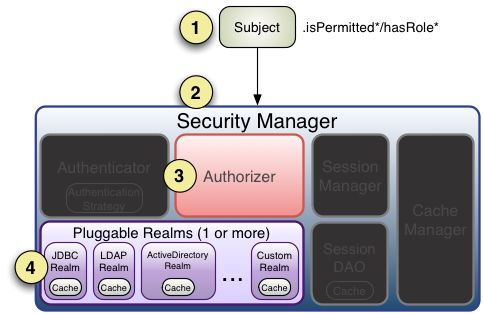

[TOC]


# shiro详解-shiro学习笔记

  

## **1.shiro简介**

## **1.1.基本功能点**

Shiro 可以非常容易的开发出足够好的应用，其不仅可以用在 JavaSE 环境，也可以用在 JavaEE 环境。Shiro 可以帮助我们完成：认证、授权、加密、会话管理、与 Web 集成、缓存等。其基本功能点如下图所示：


- Authentication：身份认证 / 登录，验证用户是不是拥有相应的身份；
- Authorization：授权，即权限验证，验证某个已认证的用户是否拥有某个权限；即判断用户是否能做事情，常见的如：验证某个用户是否拥有某个角色。或者细粒度的验证某个用户对某个资源是否具有某个权限；
- Session Manager：会话管理，即用户登录后就是一次会话，在没有退出之前，它的所有信息都在会话中；会话可以是普通 JavaSE 环境的，也可以是如 Web 环境的；
- Cryptography：加密，保护数据的安全性，如密码加密存储到数据库，而不是明文存储；
- Web Support：Web 支持，可以非常容易的集成到 Web 环境；
- Caching：缓存，比如用户登录后，其用户信息、拥有的角色 / 权限不必每次去查，这样可以提高效率；
- Concurrency：shiro 支持多线程应用的并发验证，即如在一个线程中开启另一个线程，能把权限自动传播过去；
- Testing：提供测试支持；
- Run As：允许一个用户假装为另一个用户（如果他们允许）的身份进行访问；
- Remember Me：记住我，这个是非常常见的功能，即一次登录后，下次再来的话不用登录了。

记住一点，Shiro 不会去维护用户、维护权限；这些需要我们自己去设计 / 提供；然后通过相应的接口注入给 Shiro 即可。

## **1.2.Shiro的架构**

## **1.2.1.外部**

我们从外部来看 Shiro ，即从应用程序角度的来观察如何使用 Shiro 完成工作。如下图：



可以看到：应用代码直接交互的对象是 Subject，也就是说 Shiro 的对外 API 核心就是 Subject；其每个 API 的含义：

**Subject**：主体，代表了当前 “用户”，这个用户不一定是一个具体的人，与当前应用交互的任何东西都Subject，如网络爬虫，机器人等；即一个抽象概念；所有 Subject 都绑定到 SecurityManager，与 Subject 的所有交互都会委托给 SecurityManager；可以把 Subject 认为是一个门面；SecurityManager 才是实际的执行者；

**SecurityManager**：安全管理器；即所有与安全有关的操作都会与 SecurityManager 交互；且它管理着所有 Subject；可以看出它是 Shiro 的核心，它负责与后边介绍的其他组件进行交互，如果学习过 SpringMVC，你可以把它看成 DispatcherServlet 前端控制器；

**Realm**：域，Shiro 从 Realm 获取安全数据（如用户、角色、权限），就是说 SecurityManager 要验证用户身份，那么它需要从 Realm 获取相应的用户进行比较以确定用户身份是否合法；也需要从 Realm 得到用户相应的角色 / 权限进行验证用户是否能进行操作；可以把 Realm 看成 DataSource，即安全数据源。

也就是说对于我们而言，最简单的一个 Shiro 应用：

1. 应用代码通过 Subject 来进行认证和授权，而 Subject 又委托给 SecurityManager；
2. 我们需要给 Shiro 的 SecurityManager 注入 Realm，从而让 SecurityManager 能得到合法的用户及其权限进行判断。

**从以上也可以看出，Shiro 不提供维护用户 / 权限，而是通过 Realm 让开发人员自己注入。**

## **1.2.2.内部**

接下来我们来从 Shiro 内部来看下 Shiro 的架构，如下图所示：



**Subject**：主体，可以看到主体可以是任何可以与应用交互的 “用户”；

**SecurityManager**：相当于 SpringMVC 中的 DispatcherServlet 或者 Struts2 中的 FilterDispatcher；是 Shiro 的心脏；所有具体的交互都通过 SecurityManager 进行控制；它管理着所有 Subject、且负责进行认证和授权、及会话、缓存的管理。

**Authenticator**：认证器，负责主体认证的，这是一个扩展点，如果用户觉得 Shiro 默认的不好，可以自定义实现；其需要认证策略（Authentication Strategy），即什么情况下算用户认证通过了；

**Authrizer**：授权器，或者访问控制器，用来决定主体是否有权限进行相应的操作；即控制着用户能访问应用中的哪些功能；

**Realm**：可以有 1 个或多个 Realm，可以认为是安全实体数据源，即用于获取安全实体的；可以是 JDBC 实现，也可以是 LDAP 实现，或者内存实现等等；由用户提供；注意：Shiro 不知道你的用户 / 权限存储在哪及以何种格式存储；所以我们一般在应用中都需要实现自己的 Realm；

**SessionManager**：如果写过 Servlet 就应该知道 Session 的概念，Session 呢需要有人去管理它的生命周期，这个组件就是 SessionManager；而 Shiro 并不仅仅可以用在 Web 环境，也可以用在如普通的 JavaSE 环境、EJB 等环境；所有呢，Shiro 就抽象了一个自己的 Session 来管理主体与应用之间交互的数据；这样的话，比如我们在 Web 环境用，刚开始是一台 Web 服务器；接着又上了台 EJB 服务器；这时想把两台服务器的会话数据放到一个地方，这个时候就可以实现自己的分布式会话（如把数据放到 Memcached 服务器）；

**SessionDAO**：DAO 大家都用过，数据访问对象，用于会话的 CRUD，比如我们想把 Session 保存到数据库，那么可以实现自己的 SessionDAO，通过如 JDBC 写到数据库；比如想把 Session 放到 Memcached 中，可以实现自己的 Memcached SessionDAO；另外 SessionDAO 中可以使用 Cache 进行缓存，以提高性能；

**CacheManager**：缓存控制器，来管理如用户、角色、权限等的缓存的；因为这些数据基本上很少去改变，放到缓存中后可以提高访问的性能

**Cryptography**：密码模块，Shiro 提高了一些常见的加密组件用于如密码加密 / 解密的。

## **2.shiro组件**

## **2.1.身份验证**

**身份验证**，即在应用中谁能证明他就是他本人。一般提供如他们的身份 ID 一些标识信息来表明他就是他本人，如提供身份证，用户名 / 密码来证明。

在 shiro 中，用户需要提供 principals （身份）和 credentials（证明）给 shiro，从而应用能验证用户身份：

**principals**：身份，即主体的标识属性，可以是任何东西，如用户名、邮箱等，唯一即可。一个主体可以有多个 principals，但只有一个 Primary principals，一般是用户名 / 密码 / 手机号。

**credentials**：证明 / 凭证，即只有主体知道的安全值，如密码 / 数字证书等。

最常见的 principals 和 credentials 组合就是用户名 / 密码了。接下来先进行一个基本的身份认证。

另外两个相关的概念是之前提到的 **Subject** 及 **Realm**，分别是主体及验证主体的数据源。

## **2.1.1.maven依赖配置**

```xml
<properties>
  <project.build.sourceEncoding>UTF-8</project.build.sourceEncoding>
  <shiro.version>1.2.2</shiro.version>
</properties>

<dependencies>
  <dependency>
    <groupId>junit</groupId>
    <artifactId>junit</artifactId>
    <version>4.12</version>
    <scope>test</scope>
  </dependency>
  <!-- log4j -->
  <dependency>
    <groupId>org.slf4j</groupId>
    <artifactId>slf4j-log4j12</artifactId>
    <version>1.7.2</version>
  </dependency>
  <!-- shiro相关依赖 -->
  <dependency>
    <groupId>org.apache.shiro</groupId>
    <artifactId>shiro-web</artifactId>
    <version>${shiro.version}</version>
  </dependency>
  <dependency>
    <groupId>org.apache.shiro</groupId>
    <artifactId>shiro-ehcache</artifactId>
    <version>${shiro.version}</version>
  </dependency>
  <dependency>
    <groupId>org.apache.shiro</groupId>
    <artifactId>shiro-spring</artifactId>
    <version>${shiro.version}</version>
  </dependency>
  <dependency>
    <groupId>org.apache.shiro</groupId>
    <artifactId>shiro-quartz</artifactId>
    <version>${shiro.version}</version>
  </dependency>
  <dependency>
      <groupId>commons-logging</groupId>
      <artifactId>commons-logging</artifactId>
      <version>1.1.3</version>
    </dependency>
</dependencies>
```

## **2.1.2.登录/退出**

1、准备一些用户身份

```ini
[users]
zhang=123
wang=123
```

此处使用 ini 配置文件，通过 [users] 指定了两个主体：zhang/123、wang/123。

```java
 @Test
    public void  testLoginLoginout(){
        //1、获取SecurityManager工厂，此处使用Ini配置文件初始化SecurityManager
        Factory<org.apache.shiro.mgt.SecurityManager> factory = new IniSecurityManagerFactory("classpath:shiro.ini");
        //2、得到SecurityManager实例 并绑定给SecurityUtils
        org.apache.shiro.mgt.SecurityManager securityManager = factory.getInstance();
        SecurityUtils.setSecurityManager(securityManager);
        //3、得到Subject及创建用户名/密码身份验证Token（即用户身份/凭证）
        Subject subject = SecurityUtils.getSubject();
        UsernamePasswordToken token = new UsernamePasswordToken("zhang", "123");
        try {
            //4、登录，即身份验证
            subject.login(token);
        } catch (AuthenticationException e) {
            //5、身份验证失败
        }
        System.out.println(subject.isAuthenticated());
        //6、退出
        subject.logout();

    }
```

- 首先通过 new IniSecurityManagerFactory 并指定一个 ini 配置文件来创建一个 SecurityManager 工厂；
- 接着获取 SecurityManager 并绑定到 SecurityUtils，这是一个全局设置，设置一次即可；
- 通过 SecurityUtils 得到 Subject，其会自动绑定到当前线程；如果在 web 环境在请求结束时需要解除绑定；然后获取身份验证的 Token，如用户名 / 密码；
- 调用 subject.login 方法进行登录，其会自动委托给 SecurityManager.login 方法进行登录；
- 如果身份验证失败请捕获 AuthenticationException 或其子类，常见的如： DisabledAccountException（禁用的帐号）、LockedAccountException（锁定的帐号）、UnknownAccountException（错误的帐号）、ExcessiveAttemptsException（登录失败次数过多）、IncorrectCredentialsException （错误的凭证）、ExpiredCredentialsException（过期的凭证）等，具体请查看其继承关系；对于页面的错误消息展示，最好使用如 “用户名 / 密码错误” 而不是 “用户名错误”/“密码错误”，防止一些恶意用户非法扫描帐号库；
- 最后可以调用 subject.logout 退出，其会自动委托给 SecurityManager.logout 方法退出。

从如上代码可总结出身份验证的步骤：

1. 收集用户身份 / 凭证，即如用户名 / 密码；
2. 调用 Subject.login 进行登录，如果失败将得到相应的 AuthenticationException 异常，根据异常提示用户错误信息；否则登录成功；
3. 最后调用 Subject.logout 进行退出操作。

## **2.1.3.身份认证流程**



流程如下：

1. 首先调用 Subject.login(token) 进行登录，其会自动委托给 Security Manager，调用之前必须通过 SecurityUtils.setSecurityManager() 设置；
2. SecurityManager 负责真正的身份验证逻辑；它会委托给 Authenticator 进行身份验证；
3. Authenticator 才是真正的身份验证者，Shiro API 中核心的身份认证入口点，此处可以自定义插入自己的实现；
4. Authenticator 可能会委托给相应的 AuthenticationStrategy 进行多 Realm 身份验证，默认 ModularRealmAuthenticator 会调用 AuthenticationStrategy 进行多 Realm 身份验证；
5. Authenticator 会把相应的 token 传入 Realm，从 Realm 获取身份验证信息，如果没有返回 / 抛出异常表示身份验证失败了。此处可以配置多个 Realm，将按照相应的顺序及策略进行访问。

## **2.1.4.Realm**

Realm：域，Shiro 从从 Realm 获取安全数据（如用户、角色、权限），就是说 SecurityManager 要验证用户身份，那么它需要从 Realm 获取相应的用户进行比较以确定用户身份是否合法；也需要从 Realm 得到用户相应的角色 / 权限进行验证用户是否能进行操作；可以把 Realm 看成 DataSource，即安全数据源。如我们之前的 ini 配置方式将使用 org.apache.shiro.realm.text.IniRealm。

## **2.1.4.1.单 Realm 配置**

1、自定义 Realm 实现（需要实现四个方法）

```java
public class MyRealm extends AuthorizingRealm {
    /**
     * 获取角色与权限
     *doGetAuthorizationInfo执行时机有三个，如下：
     *  1、subject.hasRole(“admin”) 或 subject.isPermitted(“admin”)：自己去调用这个是否有什么角色或者是否有什么权限的时候；
     *  2、@RequiresRoles("admin") ：在方法上加注解的时候；
     *  3、@shiro.hasPermission name = "admin"/@shiro.hasPermission："dustin:test"在页面上加shiro标签的时候，即进这个页面的时候扫描到有这个标签的时候。
     * @param principals
     * @return
     */
    @Override
    protected AuthorizationInfo doGetAuthorizationInfo(PrincipalCollection principals) {
        return null;
    }

    /**
     * 登录信息验证
     
     * 1.doGetAuthenticationInfo执行时机如下
     * 当调用Subject currentUser = SecurityUtils.getSubject();
     * currentUser.login(token);
     * @param token
     * @return
     * @throws AuthenticationException
     */
    @Override
    protected AuthenticationInfo doGetAuthenticationInfo(AuthenticationToken token) throws AuthenticationException {

        String username = (String)token.getPrincipal();
       String password = new String((char[])token.getCredentials());

        if(!"zhang".equals(username)) {
            throw new UnknownAccountException(); //如果用户名错误
        }
        if(!"123".equals(password)) {
            throw new IncorrectCredentialsException(); //如果密码错误
        }


       return new SimpleAuthenticationInfo(username, password, getName());
    }


    @Override
    public void clearCachedAuthorizationInfo(PrincipalCollection principals) {
        super.clearCachedAuthorizationInfo(principals);
    }

    @Override
    public void clearCachedAuthenticationInfo(PrincipalCollection principals) {
        super.clearCachedAuthenticationInfo(principals);
    }

    @Override
    public void clearCache(PrincipalCollection principals) {
        super.clearCache(principals);
    }

    public void clearAllCachedAuthorizationInfo() {
        getAuthorizationCache().clear();
    }

    public void clearAllCachedAuthenticationInfo() {
        getAuthenticationCache().clear();
    }

    public void clearAllCache() {
        clearAllCachedAuthenticationInfo();
        clearAllCachedAuthorizationInfo();

    }
}


```

2、ini 配置文件指定自定义 Realm 实现 (shiro-realm.ini)

```ini
#声明一个realm
myRealm=net.wanho.realm.MyRealm
#指定securityManager的realms实现
securityManager.realms=$myRealm
```

3、测试

只需要把之前的 shiro.ini 配置文件改成 shiro-realm.ini 即可。

```java
 @Test
    public void  testLoginLoginout(){
        //1、获取SecurityManager工厂，此处使用Ini配置文件初始化SecurityManager
        Factory<org.apache.shiro.mgt.SecurityManager> factory = new IniSecurityManagerFactory("classpath:shiro-realm.ini");
        //2、得到SecurityManager实例 并绑定给SecurityUtils
        org.apache.shiro.mgt.SecurityManager securityManager = factory.getInstance();
        SecurityUtils.setSecurityManager(securityManager);
        //3、得到Subject及创建用户名/密码身份验证Token（即用户身份/凭证）
        Subject subject = SecurityUtils.getSubject();
        UsernamePasswordToken token = new UsernamePasswordToken("zhang", "123");
        try {
            //4、登录，即身份验证
            subject.login(token);
        } catch (AuthenticationException e) {
            //5、身份验证失败
        }
        System.out.println(subject.isAuthenticated());
        //6、退出
        subject.logout();

    }
```

## **2.1.4.2.多Realm 配置**

1、ini 配置文件（shiro-multi-realm.ini）

```ini
#声明一个realm
myRealm1=net.wanho.realm.MyRealm1
myRealm2=net.wanho.realm.MyRealm2
#指定securityManager的realms实现
securityManager.realms=$myRealm1,$myRealm2
```

注：securityManager 会按照 realms 指定的顺序进行身份认证。此处我们使用显示指定顺序的方式指定了 Realm 的顺序，如果删除 “securityManager.realms=myRealm1,myRealm2”，那么securityManager 会按照 realm 声明的顺序进行使用（即无需设置 realms 属性，其会自动发现），当我们显示指定 realm 后，其他没有指定 realm 将被忽略，如 “securityManager.realms=$myRealm1”，那么 myRealm2 不会被自动设置进去。

2、测试

测试方法同单 Realm 配置方法一致

## **2.1.4.3.Shiro 默认提供的 Realm**



其中主要默认实现如下：

**org.apache.shiro.realm.text.IniRealm**：[users] 部分指定用户名 / 密码及其角色；[roles] 部分指定角色即权限信息；

**org.apache.shiro.realm.text.PropertiesRealm**： user.username=password,role1,role2 指定用户名 / 密码及其角色；role.role1=permission1,permission2 指定角色及权限信息；

**org.apache.shiro.realm.jdbc.JdbcRealm**：通过 sql 查询相应的信息，如 “select password from users where username = ?” 获取用户密码，“select password, password_salt from users where username = ?” 获取用户密码及盐；“select role_name from user_roles where username = ?” 获取用户角色；“select permission from roles_permissions where role_name = ?” 获取角色对应的权限信息；也可以调用相应的 api 进行自定义 sql；

## **2.1.4.4.JDBC Realm 使用**

1、数据库及依赖

使用 mysql 数据库及 druid 连接池

```xml
<dependency>
  <groupId>mysql</groupId>
  <artifactId>mysql-connector-java</artifactId>
  <version>5.1.18</version>
</dependency>
<dependency>
      <groupId>com.alibaba</groupId>
      <artifactId>druid</artifactId>
      <version>1.0.11</version>
 </dependency>
```

2、到数据库 shiro 下建三张表：users（用户名 / 密码）、user_roles（用户 / 角色）、roles_permissions（角色 / 权限），并添加一个用户记录，用户名 / 密码为 zhang/123；

3、ini 配置（shiro-jdbc-realm.ini）

```ini
jdbcRealm=org.apache.shiro.realm.jdbc.JdbcRealm
dataSource=com.alibaba.druid.pool.DruidDataSource
dataSource.driverClassName=com.mysql.jdbc.Driver
dataSource.url=jdbc:mysql://localhost:3306/shiro
dataSource.username=root
dataSource.password=11111
jdbcRealm.dataSource=$dataSource
securityManager.realms=$jdbcRealm
```

注：

- 变量名 = 全限定类名会自动创建一个类实例 全限定类名会自动创建一个类实例
- 变量名. 属性 = 值 自动调用相应的 setter 方法进行赋值
- $ 变量名 引用之前的一个对象实例

4、测试

```java
 @Test
    public void  testLoginLoginout(){
        //1、获取SecurityManager工厂，此处使用Ini配置文件初始化SecurityManager
        Factory<org.apache.shiro.mgt.SecurityManager> factory = new IniSecurityManagerFactory("classpath:shiro-jdbc-realm.ini");
        //2、得到SecurityManager实例 并绑定给SecurityUtils
        org.apache.shiro.mgt.SecurityManager securityManager = factory.getInstance();
        SecurityUtils.setSecurityManager(securityManager);
        //3、得到Subject及创建用户名/密码身份验证Token（即用户身份/凭证）
        Subject subject = SecurityUtils.getSubject();
        UsernamePasswordToken token = new UsernamePasswordToken("zhang", "123");
        try {
            //4、登录，即身份验证
            subject.login(token);
        } catch (AuthenticationException e) {
            //5、身份验证失败
        }
        System.out.println(subject.isAuthenticated());
        //6、退出
        subject.logout();

    }
```

## **2.1.5.Authenticator 及 AuthenticationStrategy**

Authenticator 的职责是验证用户帐号，是 Shiro API 中身份验证核心的入口点,

如果验证成功，将返回 AuthenticationInfo 验证信息；此信息中包含了身份及凭证；如果验证失败将抛出相应的AuthenticationException 实现。

SecurityManager 接口继承了 Authenticator，另外还有一个 ModularRealmAuthenticator 实现，其委托给多个 Realm 进行验证，验证规则通过 AuthenticationStrategy 接口指定，默认提供的实现：

**FirstSuccessfulStrategy**：只要有一个 Realm 验证成功即可，只返回第一个 Realm 身份验证成功的认证信息，其他的忽略；

**AtLeastOneSuccessfulStrategy**：只要有一个 Realm 验证成功即可，和 FirstSuccessfulStrategy 不同，返回所有 Realm 身份验证成功的认证信息；

**AllSuccessfulStrategy**：所有 Realm 验证成功才算成功，且返回所有 Realm 身份验证成功的认证信息，如果有一个失败就失败了。

**注：**ModularRealmAuthenticator 默认使用 AtLeastOneSuccessfulStrategy 策略。

假设我们有三个 realm：myRealm1： 用户名 / 密码为 zhang/123 时成功，且返回身份 / 凭据为 zhang/123；myRealm2： 用户名 / 密码为 wang/123 时成功，且返回身份 / 凭据为 wang/123；myRealm3： 用户名 / 密码为 zhang/123 时成功，且返回身份 / 凭据为 [zhang@163.com](mailto:zhang@163.com)/123，和 myRealm1 不同的是返回时的身份变了；

1、ini 配置文件 (shiro-authenticator-all-success.ini)

```ini
#指定securityManager的authenticator实现
authenticator=org.apache.shiro.authc.pam.ModularRealmAuthenticator
securityManager.authenticator=$authenticator
#指定securityManager.authenticator的authenticationStrategy
allSuccessfulStrategy=org.apache.shiro.authc.pam.AllSuccessfulStrategy
securityManager.authenticator.authenticationStrategy=$allSuccessfulStrategy

myRealm=net.wanho.realm.MyRealm
myRealm2=net.wanho.realm.MyRealm2
myRealm3=net.wanho.realm.MyRealm3
securityManager.realms=$myRealm,$myRealm3
```

2、新建realm

MyRealm2

```java
public class MyRealm2 extends AuthorizingRealm {
    /**
     * 获取角色与权限
     *doGetAuthorizationInfo执行时机有三个，如下：
     *  1、subject.hasRole(“admin”) 或 subject.isPermitted(“admin”)：自己去调用这个是否有什么角色或者是否有什么权限的时候；
     *  2、@RequiresRoles("admin") ：在方法上加注解的时候；
     *  3、@shiro.hasPermission name = "admin"/@shiro.hasPermission："dustin:test"在页面上加shiro标签的时候，即进这个页面的时候扫描到有这个标签的时候。
     * @param principals
     * @return
     */
    @Override
    protected AuthorizationInfo doGetAuthorizationInfo(PrincipalCollection principals) {
        return null;
    }

    /**
     * 登录信息验证
     *
     * 1.doGetAuthenticationInfo执行时机如下
     * 当调用Subject currentUser = SecurityUtils.getSubject();
     * currentUser.login(token);
     * @param token
     * @return
     * @throws AuthenticationException
     */
    @Override
    protected AuthenticationInfo doGetAuthenticationInfo(AuthenticationToken token) throws AuthenticationException {

        String username = (String)token.getPrincipal();
       String password = new String((char[])token.getCredentials());

        if(!"wang".equals(username)) {
            throw new UnknownAccountException(); //如果用户名错误
        }
        if(!"123".equals(password)) {
            throw new IncorrectCredentialsException(); //如果密码错误
        }


       return new SimpleAuthenticationInfo(username, password, getName());
    }


    @Override
    public void clearCachedAuthorizationInfo(PrincipalCollection principals) {
        super.clearCachedAuthorizationInfo(principals);
    }

    @Override
    public void clearCachedAuthenticationInfo(PrincipalCollection principals) {
        super.clearCachedAuthenticationInfo(principals);
    }

    @Override
    public void clearCache(PrincipalCollection principals) {
        super.clearCache(principals);
    }

    public void clearAllCachedAuthorizationInfo() {
        getAuthorizationCache().clear();
    }

    public void clearAllCachedAuthenticationInfo() {
        getAuthenticationCache().clear();
    }

    public void clearAllCache() {
        clearAllCachedAuthenticationInfo();
        clearAllCachedAuthorizationInfo();

    }
}


```

MyRealm3

```java

public class MyRealm extends AuthorizingRealm {
    /**
     * 获取角色与权限
     *doGetAuthorizationInfo执行时机有三个，如下：
     *  1、subject.hasRole(“admin”) 或 subject.isPermitted(“admin”)：自己去调用这个是否有什么角色或者是否有什么权限的时候；
     *  2、@RequiresRoles("admin") ：在方法上加注解的时候；
     *  3、@shiro.hasPermission name = "admin"/@shiro.hasPermission："dustin:test"在页面上加shiro标签的时候，即进这个页面的时候扫描到有这个标签的时候。
     * @param principals
     * @return
     */
    @Override
    protected AuthorizationInfo doGetAuthorizationInfo(PrincipalCollection principals) {
        return null;
    }

    /**
     * 登录信息验证
     *
     * 1.doGetAuthenticationInfo执行时机如下
     * 当调用Subject currentUser = SecurityUtils.getSubject();
     * currentUser.login(token);
     * @param token
     * @return
     * @throws AuthenticationException
     */
    @Override
    protected AuthenticationInfo doGetAuthenticationInfo(AuthenticationToken token) throws AuthenticationException {

        String username = (String)token.getPrincipal();
       String password = new String((char[])token.getCredentials());

        if(!"zhang".equals(username)) {
            throw new UnknownAccountException(); //如果用户名错误
        }
        if(!"123".equals(password)) {
            throw new IncorrectCredentialsException(); //如果密码错误
        }


       return new SimpleAuthenticationInfo("zhang@163.com", password, getName());
    }


    @Override
    public void clearCachedAuthorizationInfo(PrincipalCollection principals) {
        super.clearCachedAuthorizationInfo(principals);
    }

    @Override
    public void clearCachedAuthenticationInfo(PrincipalCollection principals) {
        super.clearCachedAuthenticationInfo(principals);
    }

    @Override
    public void clearCache(PrincipalCollection principals) {
        super.clearCache(principals);
    }

    public void clearAllCachedAuthorizationInfo() {
        getAuthorizationCache().clear();
    }

    public void clearAllCachedAuthenticationInfo() {
        getAuthenticationCache().clear();
    }

    public void clearAllCache() {
        clearAllCachedAuthenticationInfo();
        clearAllCachedAuthorizationInfo();

    }
}


```

3、测试

- 首先通用化登录逻辑

```java
private void login(String configFile) {
    //1、获取SecurityManager工厂，此处使用Ini配置文件初始化SecurityManager
    Factory<org.apache.shiro.mgt.SecurityManager> factory =
            new IniSecurityManagerFactory(configFile);
    //2、得到SecurityManager实例 并绑定给SecurityUtils
    org.apache.shiro.mgt.SecurityManager securityManager = factory.getInstance();
    SecurityUtils.setSecurityManager(securityManager);
    //3、得到Subject及创建用户名/密码身份验证Token（即用户身份/凭证）
    Subject subject = SecurityUtils.getSubject();
    UsernamePasswordToken token = new UsernamePasswordToken("zhang", "123");
    subject.login(token);
}

  /**
     * 测试验证规则（可在配置文件中修改）
     *
     * FirstSuccessfulStrategy：只要有一个 Realm 验证成功即可，只返回第一个 Realm 身份验证成功的认证信息，其他的忽略；
        AtLeastOneSuccessfulStrategy：只要有一个 Realm 验证成功即可，和 FirstSuccessfulStrategy 不同，返回所有 Realm 身份验证成功的认证信息；
        AllSuccessfulStrategy：所有 Realm 验证成功才算成功，且返回所有 Realm 身份验证成功的认证信息，如果有一个失败就失败了。

     */
    @Test
    public void testAllSuccessfulStrategyWithSuccess() {
        login("classpath:shiro-authenticator-all-success.ini");
        Subject subject = SecurityUtils.getSubject();
        //得到一个身份集合，其包含了Realm验证成功的身份信息
        PrincipalCollection principalCollection = subject.getPrincipals();
        for (Object principal : principalCollection) {
            System.out.println(principal.toString());
        }
    }

```

4、自定义AuthenticationStrategy实现，首先看其API：

```java
//在所有Realm验证之前调用  
AuthenticationInfo beforeAllAttempts(  
Collection<? extends Realm> realms, AuthenticationToken token)   
throws AuthenticationException;  
//在每个Realm之前调用  
AuthenticationInfo beforeAttempt(  
Realm realm, AuthenticationToken token, AuthenticationInfo aggregate)   
throws AuthenticationException;  
//在每个Realm之后调用  
AuthenticationInfo afterAttempt(  
Realm realm, AuthenticationToken token,   
AuthenticationInfo singleRealmInfo, AuthenticationInfo aggregateInfo, Throwable t)  
throws AuthenticationException;  
//在所有Realm之后调用  
AuthenticationInfo afterAllAttempts(  
AuthenticationToken token, AuthenticationInfo aggregate)   
throws AuthenticationException;   
```

自定义实现时一般继承org.apache.shiro.authc.pam.AbstractAuthenticationStrategy即可

## **2.2.授权**

授权，也叫访问控制，即在应用中控制谁能访问哪些资源（如访问页面/编辑数据/页面操作等）。在授权中需了解的几个关键对象：主体（Subject）、资源（Resource）、权限（Permission）、角色（Role）。

**主体**主体，即访问应用的用户，在 Shiro 中使用 Subject 代表该用户。用户只有授权后才允许访问相应的资源。

**资源**在应用中用户可以访问的任何东西，比如访问 JSP 页面、查看/编辑某些数据、访问某个业务方法、打印文本等等都是资源。用户只要授权后才能访问。

**权限**安全策略中的原子授权单位，通过权限我们可以表示在应用中用户有没有操作某个资源的权力。即权限表示在应用中用户能不能访问某个资源，如： 访问用户列表页面查看/新增/修改/删除用户数据（即很多时候都是 CRUD（增查改删）式权限控制）打印文档等等。。。

如上可以看出，权限代表了用户有没有操作某个资源的权利，即反映在某个资源上的操作允不允许，不反映谁去执行这个操作。所以后续还需要把权限赋予给用户，即定义哪个用户允许在某个资源上做什么操作（权限），Shiro 不会去做这件事情，而是由实现人员提供。

Shiro 支持粗粒度权限（如用户模块的所有权限）和细粒度权限（操作某个用户的权限，即实例级别的），后续部分介绍。

**角色**角色代表了操作集合，可以理解为权限的集合，一般情况下我们会赋予用户角色而不是权限，即这样用户可以拥有一组权限，赋予权限时比较方便。典型的如：项目经理、技术总监、CTO、开发工程师等都是角色，不同的角色拥有一组不同的权限。

**隐式角色**：即直接通过角色来验证用户有没有操作权限，如在应用中 CTO、技术总监、开发工程师可以使用打印机，假设某天不允许开发工程师使用打印机，此时需要从应用中删除相应代码；再如在应用中 CTO、技术总监可以查看用户、查看权限；突然有一天不允许技术总监查看用户、查看权限了，需要在相关代码中把技术总监角色从判断逻辑中删除掉；即粒度是以角色为单位进行访问控制的，粒度较粗；如果进行修改可能造成多处代码修改。

**显示角色**：在程序中通过权限控制谁能访问某个资源，角色聚合一组权限集合；这样假设哪个角色不能访问某个资源，只需要从角色代表的权限集合中移除即可；无须修改多处代码；即粒度是以资源/实例为单位的；粒度较细。

## **2.2.1.授权方式**

Shiro 支持三种方式的授权：

1.编程式：通过写 if/else 授权代码块完成：

```java
Subject subject = SecurityUtils.getSubject();
if(subject.hasRole(“admin”)) {
    //有权限
} else {
    //无权限
};
```

2.注解式：通过在执行的 Java 方法上放置相应的注解完成：

```java
@RequiresRoles("admin")
public void hello() {
    //有权限
};
```

3.SP/GSP 标签：在 JSP/GSP 页面通过相应的标签完成：

```java
<shiro:hasRole name="admin">
<!— 有权限 —>
</shiro:hasRole>;
```

## **2.2.1.1.基于角色的访问控制（隐式角色）**

1、在 ini 配置文件配置用户拥有的角色（shiro-role.ini）

```ini
[users]
zhang=123,role1,role2
wang=123,role1
```

规则即：“用户名=密码,角色1，角色2”，如果需要在应用中判断用户是否有相应角色，就需要在相应的 Realm 中返回角色信息，也就是说 Shiro 不负责维护用户-角色信息，需要应用提供，Shiro 只是提供相应的接口方便验证。

2、测试

登录方法

```java
private Subject login(String configFile,String userName,String password) {
    //1、获取SecurityManager工厂，此处使用Ini配置文件初始化SecurityManager
    Factory<org.apache.shiro.mgt.SecurityManager> factory =
            new IniSecurityManagerFactory(configFile);
    //2、得到SecurityManager实例 并绑定给SecurityUtils
    org.apache.shiro.mgt.SecurityManager securityManager = factory.getInstance();
    SecurityUtils.setSecurityManager(securityManager);
    //3、得到Subject及创建用户名/密码身份验证Token（即用户身份/凭证）
    Subject subject = SecurityUtils.getSubject();
    UsernamePasswordToken token = new UsernamePasswordToken(userName, password);
    subject.login(token);
    return subject;

}
```

Shiro提供了hasRole/hasRole用于判断用户是否拥有某个角色/某些权限；

```java
 @Test
    public void testHasRole() {
        Subject subject = login("classpath:shiro-role.ini", "zhang", "123");
        //判断拥有角色：role1
        System.out.println(subject.hasRole("role1"));
        //判断拥有角色：role1 and role2
        System.out.println(subject.hasAllRoles(Arrays.asList("role1", "role2")));
        //判断拥有角色：role1 and role2 and !role3
        boolean[] result = subject.hasRoles(Arrays.asList("role1", "role2", "role3"));
        System.out.println(result[0]);
        System.out.println(result[1]);
        System.out.println(result[2]);

    }
```

Shiro提供的checkRole/checkRoles和hasRole/hasAllRoles不同的地方是它在判断为假的情况下会抛出UnauthorizedException异常。

```java
@Test(expected = UnauthorizedException.class)
    public void testCheckRole() {
        Subject subject = login("classpath:shiro-role.ini", "zhang", "123");
        //判断是否拥有角色：role1
        subject.checkRole("role1");
        //判断是否拥有角色：role1 and role3 失败抛出异常
        subject.checkRoles("role1", "role3");
    }
```

**注：**到此基于角色的访问控制（即隐式角色）就完成了，这种方式的缺点就是如果很多地方进行了角色判断，但是有一天不需要了那么就需要修改相应代码把所有相关的地方进行删除；这就是粗粒度造成的问题。

## **2.2.1.2.基于角色的访问控制（显式角色）**

1、在ini配置文件配置用户拥有的角色及角色-权限关系（shiro-permission.ini）

```ini
[users]  
zhang=123,role1,role2  
wang=123,role1  
[roles]  
role1=user:create,user:update  
role2=user:create,user:delete  
```

规则：“用户名=密码，角色1，角色2”“角色=权限1，权限2”，即首先根据用户名找到角色，然后根据角色再找到权限；即角色是权限集合；Shiro同样不进行权限的维护，需要我们通过Realm返回相应的权限信息。只需要维护“用户——角色”之间的关系即可。

2、测试

Shiro提供了isPermitted和isPermittedAll用于判断用户是否拥有某个权限或所有权限

```java
@Test
    public void testIsPermitted() {
        Subject subject = login("classpath:shiro-permission.ini", "zhang", "123");
        //判断拥有权限：user:create
        System.out.println(subject.isPermitted("user:create"));
        //判断拥有权限：user:update and user:delete
        System.out.println(subject.isPermittedAll("user:update", "user:delete"));
        //判断没有权限：user:view
        System.out.println(subject.isPermitted("user:view"));
    }
```


```java
@Test(expected = UnauthorizedException.class)  
public void testCheckPermission () {  
    Subject subject = login("classpath:shiro-permission.ini", "zhang", "123");
    //断言拥有权限：user:create  
    subject.checkPermission("user:create");  
    //断言拥有权限：user:delete and user:update  
    subject.checkPermissions("user:delete", "user:update");  
    //断言拥有权限：user:view 失败抛出异常  
    subject.checkPermissions("user:view");  
}   
```

失败的情况下会抛出UnauthorizedException异常

到此基于资源的访问控制（显示角色）就完成了，也可以叫基于权限的访问控制，这种方式的一般规则是“资源标识符：操作”，即是资源级别的粒度；这种方式的好处就是如果要修改基本都是一个资源级别的修改，不会对其他模块代码产生影响，粒度小。但是实现起来可能稍微复杂点，需要维护“用户——角色，角色——权限（资源：操作）”之间的关系。

## **2.2.2.Permission权限**

字符串通配符权限

规则：“资源标识符：操作：对象实例ID” 即对哪个资源的哪个实例可以进行什么操作。其默认支持通配符权限字符串，“:”表示资源/操作/实例的分割；“,”表示操作的分割；“*”表示任意资源/操作/实例。

## **2.2.2.1.单个资源单个权限**

```java
subject.checkPermissions("system:user:update");  
```

用户拥有资源“system:user”的“update”权限。

## **2.2.2.2.单个资源多个权限**

1.ini配置文件 (两种写法)

```ini
role41=system:user:update,system:user:delete 
#或者
role41="system:user:update,delete"
```

2.然后通过如下代码判断

```java
subject.checkPermissions("system:user:update", "system:user:delete");
//或者
subject.checkPermissions("system:user:update,delete");
```

通过“system:user:update,delete”验证"system:user:update, system:user:delete"是没问题的，但是反过来是规则不成立。

## **2.2.2.3.单个资源全部权限**

1.ini配置文件 (两种写法)

```ini
role51="system:user:create,update,delete,view"
#或者
role51=system:user:*  
```

2.然后通过如下代码判断

```java
subject.checkPermissions("system:user:create,delete,update:view");
//或者
subject.checkPermissions("system:user:*");  
subject.checkPermissions("system:user");  
```

通过“system:user:*”验证“system:user:create,delete,update:view”可以，但是反过来是不成立的。

## **2.2.2.4.所有资源全部权限**

1.ini配置文件

```ini
role61=*:view   
```

2.然后通过如下代码判断

```java
subject.checkPermissions("user:view");  
```

用户拥有所有资源的“view”所有权限。假设判断的权限是“"system:user:view”，那么需要“role5=* :*:view”这样写才行。

## **2.2.2.5.单个实例单个权限**

1.ini配置文件

```ini
role71=user:view:1  
```

对资源user的1实例拥有view权限。

2.然后通过如下代码判断

```java
subject.checkPermissions("user:view:1");  
```

## **2.2.2.6.单个实例多个权限**

1.ini配置文件

```ini
role72="user:update,delete:1" 
```

2.然后通过如下代码判断

```java
subject.checkPermissions("user:delete,update:1");  
subject.checkPermissions("user:update:1", "user:delete:1"); 
```

## **2.2.2.7.单个实例所有权限**

1.ini配置文件

```ini
role73=user:*:1 
```

2.然后通过如下代码判断

```java
subject.checkPermissions("user:update:1", "user:delete:1", "user:view:1");  
```

## **2.2.2.8.所有实例单个权限**

1.ini配置文件

```ini
role74=user:auth:*
```

2.然后通过如下代码判断

```java
subject.checkPermissions("user:auth:1", "user:auth:2");   
```

## **2.2.2.9.所有实例所有权限**

1.ini配置文件

```ini
role75=user:*:*  
```

2.然后通过如下代码判断

```java
subject.checkPermissions("user:view:1", "user:auth:2");   
```

## **2.2.2.10.Shiro对权限字符串缺失部分的处理**

如“user:view”等价于“user:view:*”；而“organization”等价于“organization:*”或者“organization:*:*”。可以这么理解，这种方式实现了前缀匹配。另外如“user:*”可以匹配如“user:delete”、“user:delete”可以匹配如“user:delete:1”、“user:*:1”可以匹配如“user:view:1”、“user”可以匹配“user:view”或“user:view:1”等。即*可以匹配所有，不加*可以进行前缀匹配；但是如“*:view”不能匹配“system:user:view”，需要使用“*:*:view”，即后缀匹配必须指定前缀（多个冒号就需要多个*来匹配）。

## **2.2.2.11.性能问题**

通配符匹配方式比字符串相等匹配来说是更复杂的，因此需要花费更长时间，但是一般系统的权限不会太多，且可以配合缓存来提供其性能，如果这样性能还达不到要求我们可以实现位操作算法实现性能更好的权限匹配。另外实例级别的权限验证如果数据量太大也不建议使用，可能造成查询权限及匹配变慢。可以考虑比如在sql查询时加上权限字符串之类的方式在查询时就完成了权限匹配。

## **2.2.3.授权流程**



流程如下：1、首先调用Subject.isPermitted*/hasRole*接口，其会委托给SecurityManager，而SecurityManager接着会委托给Authorizer；2、Authorizer是真正的授权者，如果我们调用如isPermitted(“user:view”)，其首先会通过PermissionResolver把字符串转换成相应的Permission实例；3、在进行授权之前，其会调用相应的Realm获取Subject相应的角色/权限用于匹配传入的角色/权限；4、Authorizer会判断Realm的角色/权限是否和传入的匹配，如果有多个Realm，会委托给ModularRealmAuthorizer进行循环判断，如果匹配如isPermitted*/hasRole*会返回true，否则返回false表示授权失败。

ModularRealmAuthorizer进行多Realm匹配流程：1、首先检查相应的Realm是否实现了实现了Authorizer；2、如果实现了Authorizer，那么接着调用其相应的isPermitted*/hasRole*接口进行匹配；3、如果有一个Realm匹配那么将返回true，否则返回false。

如果Realm进行授权的话，应该继承AuthorizingRealm，其流程是：1.1、如果调用hasRole*，则直接获取AuthorizationInfo.getRoles()与传入的角色比较即可；1.2、首先如果调用如isPermitted(“user:view”)，首先通过PermissionResolver将权限字符串转换成相应的Permission实例，默认使用WildcardPermissionResolver，即转换为通配符的WildcardPermission；2、通过AuthorizationInfo.getObjectPermissions()得到Permission实例集合；通过AuthorizationInfo. getStringPermissions()得到字符串集合并通过PermissionResolver解析为Permission实例；然后获取用户的角色，并通过RolePermissionResolver解析角色对应的权限集合（默认没有实现，可以自己提供）；3、接着调用Permission. implies(Permission p)逐个与传入的权限比较，如果有匹配的则返回true，否则false。

 

<https://zhuanlan.zhihu.com/p/52584039>