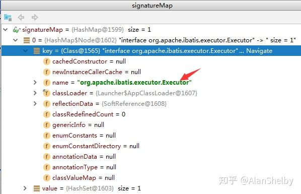

[TOC]


# Mybatis自定义Plugins拦截器

/Users/jerryye/backup/studio/AvailableCode/framework/mybatis/interceptor_拦截器/spring-boot-mybatis-interceptor-demo

## **一、前言**

拦截器的一个作用就是我们可以拦截某些方法的调用，**我们可以选择在这些被拦截的方法执行前后加上某些逻辑，也可以在执行这些被拦截的方法时执行自己的逻辑而不再执行被拦截的方法**。Mybatis 拦截器设计的一个初衷就是为了供用户在某些时候可以实现自己的逻辑而不必去动 Mybatis 固有的逻辑。打个比方，对于 Executor，Mybatis 中有几种实现：BatchExecutor、ReuseExecutor、SimpleExecutor 和 CachingExecutor。这个时候如果你觉得这几种实现对于 Executor 接口的 query 方法都不能满足你的要求，那怎么办呢？是要去改源码吗？当然不。我们可以建立一个Mybatis 拦截器用于拦截 Executor 接口的 query 方法，在拦截之后实现自己的 query 方法逻辑，之后可以选择是否继续执行原来的 query 方法。下面我们一起来看一下如何自定义一个 Plugins 拦截器。

------

## **二、自定义 Plugins 拦截器**

### 1、编写自定义拦截器

对于拦截器 Mybatis 为我们提供了一个 Interceptor 接口，通过实现该接口就可以定义我们自己的拦截器。我们先来看一下这个接口的定义：

```java
package org.apache.ibatis.plugin;

import java.util.Properties;

/**
 * @author Clinton Begin
 */
public interface Interceptor {

  Object intercept(Invocation invocation) throws Throwable;

  Object plugin(Object target);

  void setProperties(Properties properties);

}
```

我们可以看到在该接口中一共定义有三个方法，intercept、plugin 和 setProperties。plugin 方法是拦截器用于封装目标对象的，通过该方法我们可以返回目标对象本身，也可以返回一个它的代理。当返回的是代理的时候我们可以对其中的方法进行拦截来调用 intercept 方法，当然也可以调用其他方法，这点将在后文讲解。setProperties 方法是用于在 Mybatis 配置文件中指定一些属性的。

定义自己的Interceptor最重要的是要实现 plugin 方法和 intercept 方法，在 plugin 方法中我们可以决定是否要进行拦截进而决定要返回一个什么样的目标对象。而 intercept 方法就是要进行拦截的时候要执行的方法。

对于 plugin 方法而言，其实 Mybatis 已经为我们提供了一个实现。Mybatis 中有一个叫做Plugin 的类，里面有一个静态方法 wrap(Object target,Interceptor interceptor)，通过该方法可以决定要返回的对象是目标对象还是对应的代理。

对于实现自己的 Interceptor 而言有两个很重要的注解，一个是 @Intercepts，其值是一个@Signature 数组。@Intercepts 用于表明当前的对象是一个 Interceptor，而 @Signature则表明要拦截的接口、方法以及对应的参数类型。来看一个自定义的简单 Interceptor：

```java
package top.alanshelby.mybatis.util;

import org.apache.ibatis.executor.Executor;
import org.apache.ibatis.mapping.MappedStatement;
import org.apache.ibatis.plugin.*;
import org.apache.ibatis.session.ResultHandler;
import org.apache.ibatis.session.RowBounds;

import java.util.Properties;

@Intercepts(
        @Signature(method = "query",
                type = Executor.class,
                args = {MappedStatement.class, Object.class, RowBounds.class, ResultHandler.class}
        )
)
public class MyInterceptor implements Interceptor {

    /**
     * @param invocation { 代理对象，被监控方法对象，当前被监控方法运行时需要的实参 }
     * @return
     * @throws Throwable
     */
    @Override
    public Object intercept(Invocation invocation) throws Throwable {
        System.out.println("被拦截方法执行之前，做的辅助服务······");
        Object proceed = invocation.proceed();
        System.out.println("被拦截方法执行之后，做的辅助服务······");
        return proceed;
    }

    /**
     * @param target 表示被拦截的对象，此处为 Executor 的实例对象
     *               作用：如果被拦截对象所在的类有实现接口，就为当前拦截对象生成一个代理对象
     *               如果被拦截对象所在的类没有指定接口，这个对象之后的行为就不会被代理操作
     * @return
     */
    @Override
    public Object plugin(Object target) {
        return Plugin.wrap(target, this);
    }

    @Override
    public void setProperties(Properties properties) {

    }
}
```

这里我们来对几个点做一下讲解：

（1）@Signature 的参数：

----1》type：要拦截的接口

----2》method：需要拦截的方法，存在于要拦截的接口之中

----3》args：被拦截的方法所需要的参数

这里我们打开例子中被拦截的接口 org.apache.ibatis.executor.Executor 的源码，找到需要拦截的方法 query()，这样对应起来就十分清晰了。

```java
<E> List<E> query(MappedStatement ms, Object parameter, RowBounds rowBounds, ResultHandler resultHandler) throws SQLException;
```

*需要注意的是：MyBatis 自定义拦截器，可以拦截的接口只有四种 Executor.class，StatementHandler.class，ParameterHandler.class 和 ResultSetHandler.class。*

（2）intercept 方法的参数 invocation 中的属性：

打开 org.apache.ibatis.plugin.Invocation 类，可以看到有如下三个属性：

```java
 private final Object target;
 private final Method method;
 private final Object[] args;
```

----1》target：*代理对象*

----2》method：*被监控方法对象*

----3》args：*当前被监控方法运行时需要的实参*


（3）Plugin.wrap() *方法*

这里我们直接看一下 wrap() 方法的源码：

```java
public static Object wrap(Object target, Interceptor interceptor) {
	Map<Class<?>, Set<Method>> signatureMap = getSignatureMap(interceptor);
	Class<?> type = target.getClass();
	Class<?>[] interfaces = getAllInterfaces(type, signatureMap);
	if (interfaces.length > 0) {
		return Proxy.newProxyInstance(
				type.getClassLoader(),
				interfaces,
				new Plugin(target, interceptor, signatureMap));
	}
	return target;
}
```



我们可以看出，在 signatureMap 拿到了需要拦截的接口，根据 target 的类型和 signatureMap 得到所有的接口，如果接口的数量大于0，就返回一个代理对象，否则直接返回原对象 target。

### 2、在 MyBatis 核心配置文件注册自定义拦截器

```xml
<plugins>
	<plugin interceptor="top.alanshelby.mybatis.util.MyInterceptor"></plugin>
</plugins>
```

这样一个自定义的 plugin 就完成了。

### 3、单元测试

由于自定义 plugin 中拦截的是 Executor 中的 query() 方法，这里我们使用一个查询方法进行测试：

```java
@Test
public void test01() throws IOException {
	DeptMapper deptMapper = session.getMapper(DeptMapper.class);
	List<Dept> list = deptMapper.deptFind();
	list.forEach(item -> {
		System.out.println(item);
	});
}
```


可以看到，我们打印的提示语句都已经打印到了控制台。这里只介绍了自定义 plugin 的简单使用，小伙伴们可以根据业务需求，来创建自己的 plugin。


本章代码已经上传到码云：

JavaEE企业级分布式架构核心技术配套源码地址：[AlanShelby/Course-Chapter](https://link.zhihu.com/?target=https%3A//gitee.com/AlanShelby/Course-Chapter)


<https://zhuanlan.zhihu.com/p/40414491>