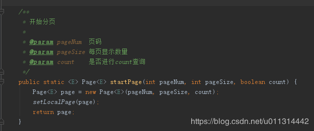
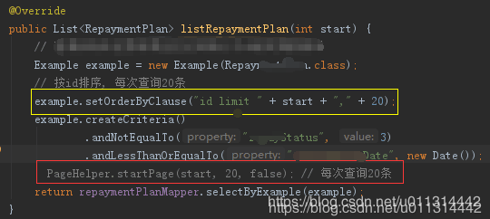

[TOC]


# mybatis mapper 中 Example 的使用 条件查询,排序,分页(三种分页方式RowBounds、PageHelpler 、limit )

 

```java
   import tk.mybatis.mapper.entity.Example;
   import com.github.pagehelper.PageHelper;
 
...
 
    @Override
    public List<Repayxxx> listRepaymentPlan(Integer start) {
 
    
        Example example = new Example(Repayxxx.class);
        // 排序
        example.orderBy("id");
        // 条件查询
        example.createCriteria()
                .andNotEqualTo("repayxxx", 3)
                .andLessThanOrEqualTo("xxxRepayDate", new Date());
        // 分页
        PageHelper.startPage(start, 20); // 每次查询20条
 
        return repaymentPlanMapper.selectByExample(example);
    }    
```

关于排序还有这些写法：

```java
// 注意：排序使用的是表中的列名，不是对象属性名。
example.setOrderByClause("time DESC");

example.setOrderByClause ("product_code desc , product_name desc");

// 注意：排序使用的是对象属性。
example.orderBy('id').asc().orderBy('name').desc();
```

\2. PageHelper 使用详解见文章：[分页插件pageHelpler的使用（ssm框架中）服务器端分页](https://blog.csdn.net/jiangyu1013/article/details/56287388)

\3. 更多关于 Example 的使用说明见文章：

[java 查询功能实现的八种方式](https://blog.csdn.net/jiangyu1013/article/details/90032529)

[MyBatis : Mapper 接口以及 Example 使用实例、详解](https://blog.csdn.net/jiangyu1013/article/details/88689767) 


\4. 当只是查询数据，不需要返回总条数时可选择此方法：

```
PageHelper.startPage(第几页, 20,false); // 每次查询20条
```

当数据量极大时，可以快速查询，忽略总条数的查询，减少查询时间。

以下是该方法原码实现：



 

-------------------------------------------------

2019.5.13 后记 ： 

1）分页的写法 下图中黄框中的写法运行 比红框中 快，不知道是不是插件本身也会有费时：



2）再补充一种分页方式，mybatis 自带的 RowBounds：

```java
 public List<RepayPlan> listRepayPlan(int start) {
        
        Example example = new Example(RepayPlan.class);
        example.orderBy("id "); // 按id排序
        example.createCriteria()
                .andNotEqualTo("repayxxx", 3)
                .andLessThanOrEqualTo("xxxRepayDate", new Date());
        RowBounds rowBounds = new RowBounds(start, 20); //　每次查询20条
        return epaymentPlanMapper.selectByExampleAndRowBounds(example,rowBounds);
    }

 
```


https://blog.csdn.net/jiangyu1013/article/details/90140532