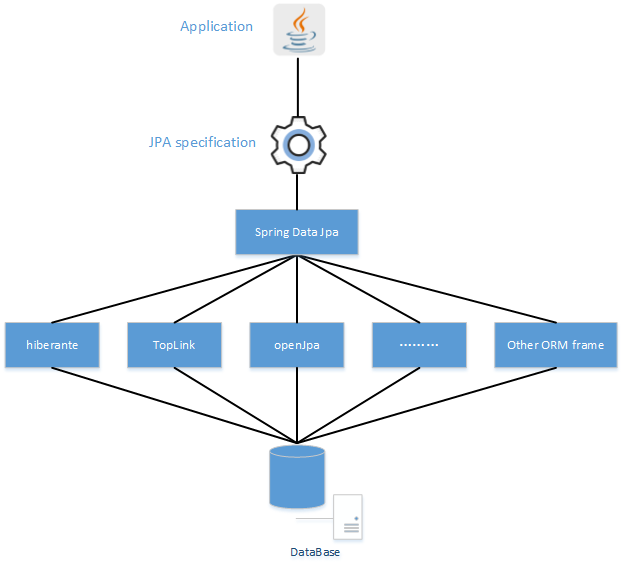

## [spring data jpa hibernate jpa 三者之间的关系](http://www.cnblogs.com/xiaoheike/p/5150553.html)

### JPA规范与ORM框架之间的关系是怎样的呢？

JPA规范本质上就是一种ORM规范，注意不是ORM框架——因为JPA并未提供ORM实现，它只是制订了一些规范，提供了一些编程的API接口，但具体实现则由服务厂商来提供实现，JBoss应用服务器底层就以Hibernate作为JPA的实现。

既然JPA作为一种规范——也就说JPA规范中提供的只是一些接口，显然接口不能直接拿来使用。虽然应用程序可以面向接口编程，但JPA底层一定需要某种JPA实现，否则JPA依然无法使用。
从笔者的视角来看，Sun之所以提出JPA规范，其目的是以官方的身份来统一各种ORM框架的规范，包括著名的Hibernate、TopLink等。不过JPA规范给开发者带来了福音：开发者面向JPA规范的接口，但底层的JPA实现可以任意切换：觉得Hibernate好的，可以选择Hibernate JPA实现；觉得TopLink好的，可以选择TopLink JPA实现……这样开发者可以避免为使用Hibernate学习一套ORM框架，为使用TopLink又要再学习一套ORM框架。
下图是JPA和Hibernate、TopLink等ORM框架之间的关系：

 

 JPA规范与ORM框架之间的关系

上面部分内容引用自：[http://www.lxway.com/528201191.htm](http://www.lxway.com/528201191.htm)

 

### 那么Spring Data JPA与JPA规范的关系是怎样的呢？

StackOverFlow这个问答回答了这个问题，[http://stackoverflow.com/questions/16148188/spring-data-jpa-versus-jpa-whats-the-difference](http://stackoverflow.com/questions/16148188/spring-data-jpa-versus-jpa-whats-the-difference)

一下回复的原话的重要部分：

Implementing a data access layer of an application has been cumbersome for quite a while. Too much boilerplate code had to be written. Domain classes were anemic and haven't been designed in a real object oriented or domain driven manner.

Using both of these technologies makes developers life a lot easier regarding rich domain model's persistence. Nevertheless the amount of boilerplate code to implement repositories especially is still quite high. So the goal of the repository abstraction of Spring Data is to reduce the effort to implement data access layers for various persistence stores significantly.

实现应用程序的数据访问层已经很麻烦了好一阵子。太多的样板代码必须被写入。Domain classes，并没有被设计成面向一个真正的对象或领域驱动的方式。

使用spring data jpa能够使丰富的Domain classes的持久性开发变得轻松很多，即使样板代码来实现存储库量特别还是相当高的。所以Spring data jpa的目标是简化关于各种持久存储数据访问层而努力。

备注：Domain classes 指的是POJO类，例如数据库中有一张表：Student，那么我们会在程序中定义与之对应的Student.java，而这个Student.java就是属于Domain classes。

Long story short, then, Spring Data JPA provides a definition to implement repositories that is supported under the hood by referencing the JPA specification, using the provider you define.

长话短说，Spring Data JPA 是在JPA规范的基础下提供了Repository层的实现，但是使用那一款ORM需要你自己去决定。

我的理解是：虽然ORM框架都实现了JPA规范，但是在不同ORM框架之间切换是需要编写的代码有一些差异，而通过使用Spring Data Jpa能够方便大家在不同的ORM框架中间进行切换而不要更改代码。并且Spring Data Jpa对Repository层封装的很好，可以省去不少的麻烦。

spring data jpa、jpa以及ORM框架之间的关系

 

2016-01-22  11:00:09

http://www.cnblogs.com/xiaoheike/p/5150553.html