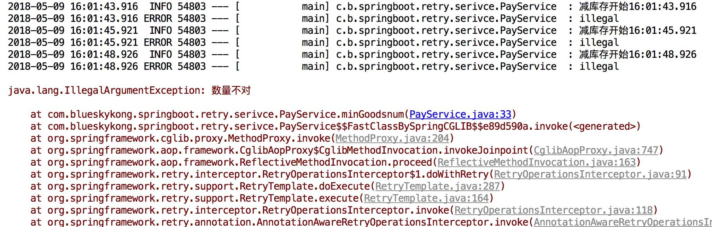
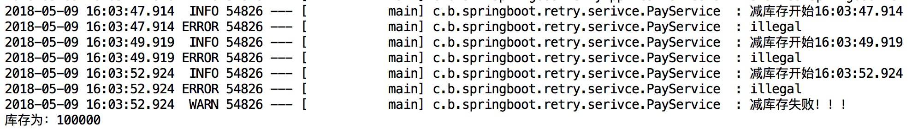

[TOC]


# spring Retry重试机制

在调用第三方接口或者使用mq时，会出现网络抖动，连接超时等网络异常，所以需要重试。为了使处理更加健壮并且不太容易出现故障，后续的尝试操作，有时候会帮助失败的操作最后执行成功。例如，由于网络故障或数据库更新中的DeadLockLoserException导致Web服务或RMI服务的远程调用可能会在短暂等待后自行解决。 为了自动执行这些操作的重试，Spring Batch具有RetryOperations策略。不过该重试功能从Spring Batch 2.2.0版本中独立出来，变成了Spring Retry模块。

## 引入依赖

```xml
    <dependency>
        <groupId>org.springframework.retry</groupId>
        <artifactId>spring-retry</artifactId>
    </dependency>

    <dependency>
        <groupId>org.springframework.boot</groupId>
        <artifactId>spring-boot-starter-web</artifactId>
    </dependency>
    <dependency>
        <groupId>org.aspectj</groupId>
        <artifactId>aspectjweaver</artifactId>
    </dependency> 
```

需要引入Spring-retry和aspectjweaver的依赖。

## 入口类

```java
@SpringBootApplication
@EnableRetry
public class SpringbootRetryApplication {

    public static void main(String[] args) {
        SpringApplication.run(SpringbootRetryApplication.class, args);
    }
} 
```

入口类上开启retry的拦截，使用`@EnableRetry`注解。

## Service

```java
@Service
public class PayService {

    private Logger logger = LoggerFactory.getLogger(getClass());

    private final int totalNum = 100000;

    @Retryable(value = Exception.class, maxAttempts = 3, backoff = @Backoff(delay = 2000L, multiplier = 1.5))
    public int minGoodsnum(int num) throws Exception {
        logger.info("减库存开始" + LocalTime.now());
        try {
            int i = 1 / 0;
        } catch (Exception e) {
            logger.error("illegal");
        }
        if (num <= 0) {
            throw new IllegalArgumentException("数量不对");
        }
        logger.info("减库存执行结束" + LocalTime.now());
        return totalNum - num;
    }
} 
```

`@Retryable`的参数说明：

- value：抛出指定异常才会重试
- include：和value一样，默认为空，当exclude也为空时，默认所以异常
- exclude：指定不处理的异常
- maxAttempts：最大重试次数，默认3次
- backoff：重试等待策略，默认使用`@Backoff`，`@Backoff`的value默认为1000L，我们设置为2000L；multiplier（指定延迟倍数）默认为0，表示固定暂停1秒后进行重试，如果把multiplier设置为1.5，则第一次重试为2秒，第二次为3秒，第三次为4.5秒。

## 测试类

```java
@RunWith(SpringRunner.class)
@SpringBootTest
public class SpringbootRetryApplicationTests {
    @Autowired
    private PayService payService;

    @Test
    public void payTest() throws Exception {
        int store = payService.minGoodsnum(-1);
        System.out.println("库存为：" + store);
    }

} 
```

运行的控制台结果如下：




可以看到，三次之后抛出了`IllegalArgumentException`异常。

当重试耗尽时，RetryOperations可以将控制传递给另一个回调，即RecoveryCallback。Spring-Retry还提供了@Recover注解，用于@Retryable重试失败后处理方法，此方法里的异常一定要是@Retryable方法里抛出的异常，否则不会调用这个方法。

```java
@Recover
public int recover(Exception e) {
    logger.warn("减库存失败！！！" + LocalTime.now());
    return totalNum;
} 
```

在Service中，加上如上的方法之后，进行测试。



可以看到当三次重试执行完之后，会调用Recovery方法，也不会再次抛出异常。

## 总结

本文主要讲了在Spring Boot项目中的Spring-Retry简单应用，主要是基于注解配置一些重试的策略，使用比较简单。主要的适用场景为在调用第三方接口或者使用mq时。由于会出现网络抖动，连接超时等网络异常，这时就需要重试。

**本文的代码：** https://github.com/keets2012/Spring-Cloud_Samples/tree/master/springboot-retry


<https://juejin.im/post/5af2b2075188256720340d31>