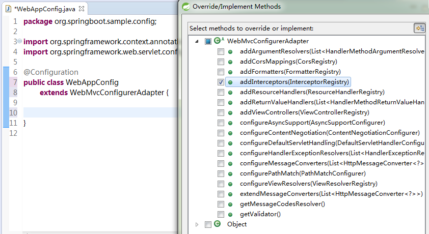

[TOC]


# springboot 拦截器 Interceptor

## 说明

上一篇对过滤器的定义做了说明，也比较简单。过滤器属于Servlet范畴的API，与Spring 没什么关系。 
Web开发中，我们除了使用 Filter 来过滤请web求外，还可以使用Spring提供的HandlerInterceptor（拦截器）。

HandlerInterceptor 的功能跟过滤器类似，但是提供更精细的的控制能力：在request被响应之前、request被响应之后、视图渲染之前以及request全部结束之后。我们不能通过拦截器修改request内容，但是可以通过抛出异常（或者返回false）来暂停request的执行。

实现 UserRoleAuthorizationInterceptor 的拦截器有： 
ConversionServiceExposingInterceptor 
CorsInterceptor 
LocaleChangeInterceptor 
PathExposingHandlerInterceptor 
ResourceUrlProviderExposingInterceptor 
ThemeChangeInterceptor 
UriTemplateVariablesHandlerInterceptor 
UserRoleAuthorizationInterceptor

其中 LocaleChangeInterceptor 和 ThemeChangeInterceptor 比较常用。

配置拦截器也很简单，Spring 为我们提供了基础类WebMvcConfigurerAdapter ，我们只需要重写 addInterceptors 方法添加注册拦截器。

### 实现自定义拦截器只需要3步： 

1、创建我们自己的拦截器类并实现 HandlerInterceptor 接口。 
2、创建一个Java类继承WebMvcConfigurerAdapter，并重写 addInterceptors 方法。 
2、实例化我们自定义的拦截器，然后将对像手动添加到拦截器链中（在addInterceptors方法中添加）。 
PS：本文重点在如何在Spring-Boot中使用拦截器，关于拦截器的原理请大家查阅资料了解。

## 代码示例：

### MyInterceptor1.java

```
package org.springboot.sample.interceptor;

import javax.servlet.http.HttpServletRequest;
import javax.servlet.http.HttpServletResponse;

import org.springframework.web.servlet.HandlerInterceptor;
import org.springframework.web.servlet.ModelAndView;

/**
 * 自定义拦截器1
 *
 * @author   单红宇(365384722)
 * @myblog  http://blog.csdn.net/catoop/
 * @create    2016年1月7日
 */
public class MyInterceptor1 implements HandlerInterceptor {

    @Override
    public boolean preHandle(HttpServletRequest request, HttpServletResponse response, Object handler)
            throws Exception {
        System.out.println(">>>MyInterceptor1>>>>>>>在请求处理之前进行调用（Controller方法调用之前）");

        return true;// 只有返回true才会继续向下执行，返回false取消当前请求
    }

    @Override
    public void postHandle(HttpServletRequest request, HttpServletResponse response, Object handler,
            ModelAndView modelAndView) throws Exception {
        System.out.println(">>>MyInterceptor1>>>>>>>请求处理之后进行调用，但是在视图被渲染之前（Controller方法调用之后）");
    }

    @Override
    public void afterCompletion(HttpServletRequest request, HttpServletResponse response, Object handler, Exception ex)
            throws Exception {
        System.out.println(">>>MyInterceptor1>>>>>>>在整个请求结束之后被调用，也就是在DispatcherServlet 渲染了对应的视图之后执行（主要是用于进行资源清理工作）");
    }

}

```

### MyInterceptor2.java

```java
package org.springboot.sample.interceptor;

import javax.servlet.http.HttpServletRequest;
import javax.servlet.http.HttpServletResponse;

import org.springframework.web.servlet.HandlerInterceptor;
import org.springframework.web.servlet.ModelAndView;

/**
 * 自定义拦截器2
 *
 * @author   单红宇(365384722)
 * @myblog  http://blog.csdn.net/catoop/
 * @create    2016年1月7日
 */
public class MyInterceptor2 implements HandlerInterceptor {

    @Override
    public boolean preHandle(HttpServletRequest request, HttpServletResponse response, Object handler)
            throws Exception {
        System.out.println(">>>MyInterceptor2>>>>>>>在请求处理之前进行调用（Controller方法调用之前）");

        return true;// 只有返回true才会继续向下执行，返回false取消当前请求
    }

    @Override
    public void postHandle(HttpServletRequest request, HttpServletResponse response, Object handler,
            ModelAndView modelAndView) throws Exception {
        System.out.println(">>>MyInterceptor2>>>>>>>请求处理之后进行调用，但是在视图被渲染之前（Controller方法调用之后）");
    }

    @Override
    public void afterCompletion(HttpServletRequest request, HttpServletResponse response, Object handler, Exception ex)
            throws Exception {
        System.out.println(">>>MyInterceptor2>>>>>>>在整个请求结束之后被调用，也就是在DispatcherServlet 渲染了对应的视图之后执行（主要是用于进行资源清理工作）");
    }

}

```

### MyWebAppConfigurer.java

```java
package org.springboot.sample.config;

import org.springboot.sample.interceptor.MyInterceptor1;
import org.springboot.sample.interceptor.MyInterceptor2;
import org.springframework.context.annotation.Configuration;
import org.springframework.web.servlet.config.annotation.InterceptorRegistry;
import org.springframework.web.servlet.config.annotation.WebMvcConfigurerAdapter;

@Configuration
public class MyWebAppConfigurer 
        extends WebMvcConfigurerAdapter {

    @Override
    public void addInterceptors(InterceptorRegistry registry) {
        // 多个拦截器组成一个拦截器链
        // addPathPatterns 用于添加拦截规则
        // excludePathPatterns 用户排除拦截
        registry.addInterceptor(new MyInterceptor1()).addPathPatterns("/**");
        registry.addInterceptor(new MyInterceptor2()).addPathPatterns("/**");
        super.addInterceptors(registry);
    }

}

```

然后在浏览器输入地址： <http://localhost:8080/index> 后，控制台的输出为：

```
>>>MyInterceptor1>>>>>>>在请求处理之前进行调用（Controller方法调用之前）
>>>MyInterceptor2>>>>>>>在请求处理之前进行调用（Controller方法调用之前）
>>>MyInterceptor2>>>>>>>请求处理之后进行调用，但是在视图被渲染之前（Controller方法调用之后）
>>>MyInterceptor1>>>>>>>请求处理之后进行调用，但是在视图被渲染之前（Controller方法调用之后）
>>>MyInterceptor2>>>>>>>在整个请求结束之后被调用，也就是在DispatcherServlet 渲染了对应的视图之后执行（主要是用于进行资源清理工作）
>>>MyInterceptor1>>>>>>>在整个请求结束之后被调用，也就是在DispatcherServlet 渲染了对应的视图之后执行（主要是用于进行资源清理工作）123456
```

根据输出可以了解拦截器链的执行顺序（具体原理介绍，大家找度娘一问便知）

最后强调一点：只有经过DispatcherServlet 的请求，才会走拦截器链，我们自定义的Servlet 请求是不会被拦截的，比如我们自定义的Servlet地址 <http://localhost:8080/xs/myservlet> 是不会被拦截器拦截的。并且不管是属于哪个Servlet 只要复合过滤器的过滤规则，过滤器都会拦截。

最后说明下，我们上面用到的 WebMvcConfigurerAdapter 并非只是注册添加拦截器使用，其顾名思义是做Web配置用的，它还可以有很多其他作用，通过下面截图便可以大概了解，具体每个方法都是干什么用的，留给大家自己研究（其实都大同小异也很简单）。 




https://blog.csdn.net/catoop/article/details/50501696