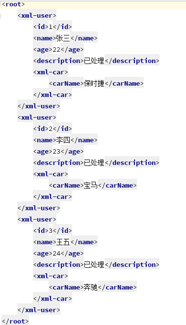
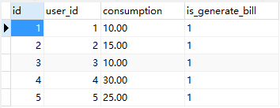

[TOC]


# spring-boot-batch 集成介绍

MarvelCode发布于 2018/04/01 15:33

 

## **前言：**

  日常开发中，业务系统会有定期扫描大量数据，并对数据进行处理后入库、或着短信通知用户。比如用户在云平台上购买了服务，在服务到期前、到期后短信通知用户，并在用户无续费操作将服务销毁等。

  这些业务逻辑用通常的代码配合定时任务也能够实现。但批处理框架能够解耦并简化其中的业务逻辑，让流程变得清晰。

## **介绍：**

  本篇采用了**Spring Batch**这个批处理框架，配合**Spring Boot**搭建的工程。

  Spring Batch，通过将公共逻辑抽象为 读-处理-写，其中读和写支持文件、数据库、消息队列（框架已实现），用户仅需关注业务逻辑的实现。并提供事务支持，监听器等。

- 预备知识：简单使用Spring Boot，并了解Spring Batch各个接口基本功能；
- 工程Git地址：https://gitee.com/marvelcode/marvelcode-batch.git
- 本篇主要介绍Spring Batch框架的使用，会略去一些实体类、工具类等代码。

## **代码：**

```
# Batch配置
# 是否生成执行状态记录的表结构
spring.batch.initialize-schema = always
# 是否自动执行Job，默认true，需要定时任务或手动触发请置为false
spring.batch.job.enabled = true
```


### **CVS文件批处理：**  

​    首先，以读文件-处理-写文件作为简单的Demo。

```java
package com.menghao.batch.config;

import com.menghao.batch.entity.file.CsvUser;
import org.springframework.batch.core.Job;
import org.springframework.batch.core.Step;
import org.springframework.batch.core.configuration.annotation.JobBuilderFactory;
import org.springframework.batch.core.configuration.annotation.StepBuilderFactory;
import org.springframework.batch.core.launch.JobLauncher;
import org.springframework.batch.core.launch.support.RunIdIncrementer;
import org.springframework.batch.core.launch.support.SimpleJobLauncher;
import org.springframework.batch.core.repository.JobRepository;
import org.springframework.batch.core.repository.support.JobRepositoryFactoryBean;
import org.springframework.batch.item.ItemProcessor;
import org.springframework.batch.item.ItemReader;
import org.springframework.batch.item.ItemWriter;
import org.springframework.batch.item.file.FlatFileItemReader;
import org.springframework.batch.item.file.builder.FlatFileItemWriterBuilder;
import org.springframework.batch.item.file.mapping.BeanWrapperFieldSetMapper;
import org.springframework.batch.item.file.mapping.DefaultLineMapper;
import org.springframework.batch.item.file.transform.BeanWrapperFieldExtractor;
import org.springframework.batch.item.file.transform.DelimitedLineAggregator;
import org.springframework.batch.item.file.transform.DelimitedLineTokenizer;
import org.springframework.batch.support.DatabaseType;
import org.springframework.beans.factory.annotation.Autowired;
import org.springframework.beans.factory.annotation.Qualifier;
import org.springframework.context.annotation.Bean;
import org.springframework.context.annotation.Configuration;
import org.springframework.core.io.ClassPathResource;
import org.springframework.transaction.PlatformTransactionManager;

import javax.sql.DataSource;

/**
 * <p>CSV文件批处理配置.<br>
 *
 * @author menghao.
 * @version 2018/3/28.
 */
@Configuration
public class CsvBatchConfig {

    private final DataSource dataSource;
    private final PlatformTransactionManager transactionManager;

    @Autowired
    public CsvBatchConfig(@Qualifier("dataSource") DataSource dataSource, PlatformTransactionManager transactionManager) {
        this.dataSource = dataSource;
        this.transactionManager = transactionManager;
    }

    @Bean
    public JobRepository jobRepository() throws Exception {
        JobRepositoryFactoryBean jobRepositoryFactoryBean = new JobRepositoryFactoryBean();
        jobRepositoryFactoryBean.setDataSource(dataSource);
        jobRepositoryFactoryBean.setTransactionManager(transactionManager);
        jobRepositoryFactoryBean.setDatabaseType(DatabaseType.MYSQL.getProductName());
        return jobRepositoryFactoryBean.getObject();
    }

    @Bean
    public JobLauncher jobLauncher(JobRepository jobRepository) {
        SimpleJobLauncher jobLauncher = new SimpleJobLauncher();
        jobLauncher.setJobRepository(jobRepository);
        return jobLauncher;
    }

    @Bean
    public ItemReader<CsvUser> csvItemReader() {
        return new FlatFileItemReader<CsvUser>() {{
            setResource(new ClassPathResource("before.csv"));
            // 用于设置文件与对象的映射关系
            setLineMapper(new DefaultLineMapper<CsvUser>() {{
                setLineTokenizer(new DelimitedLineTokenizer() {{
                    setNames("name", "age");
                }});
                setFieldSetMapper(new BeanWrapperFieldSetMapper<CsvUser>() {{
                    setTargetType(CsvUser.class);
                }});
            }});
        }};
    }

    @Bean
    public ItemWriter<CsvUser> csvItemWriter() {
        // 默认会清空文件重新编写，如需追加请指定append为true
        return new FlatFileItemWriterBuilder<CsvUser>()
                .name("writer")
                .resource(new ClassPathResource("after.csv"))
                .lineAggregator(new DelimitedLineAggregator<CsvUser>() {{
                    setFieldExtractor(new BeanWrapperFieldExtractor<CsvUser>() {{
                        setNames(new String[]{"name", "age"});
                    }});
                }}).build();
    }

    @Bean
    public Step csvStep(JobRepository jobRepository,
                        ItemReader<CsvUser> csvItemReader, ItemWriter<CsvUser> csvItemWriter) {
        return new StepBuilderFactory(jobRepository, transactionManager).get("csvStep")
                .<CsvUser, CsvUser>chunk(5)
                .reader(csvItemReader)
                .processor((ItemProcessor<CsvUser, CsvUser>) batchUser -> {
                    batchUser.setAge(batchUser.getAge() + 1);
                    return batchUser;
                })
                .writer(csvItemWriter)
                .build();
    }

    @Bean
    public Job csvJob(JobRepository jobRepository, Step csvStep) {
        return new JobBuilderFactory(jobRepository).get("csvJob")
                .incrementer(new RunIdIncrementer())
                .start(csvStep)
                .build();
    }
}
```

  其中涉及到了Spring Batch的几个主要组成部分，JobRepository、JobLauncher、ItemReader、ItemProcessor、ItemWriter、Step、Job等。

- **JobRepository**：存储任务执行的状态信息，有内存模式和数据库模式；
- **JobLauncher**：用于执行Job，并返回JobInstance；
- **ItemReader**：读操作抽象接口；
- **ItemProcessor**：处理逻辑抽象接口；
- **ItemWriter**：写操作抽象接口；
- **Step**：组成一个Job的各个步骤；
- **Job**：可被多次执行的任务，每次执行返回一个JobInstance。

  其中 JobRepository、JobLauncher无需配置（第二个例子会简化该配置），Spring Boot 的自配置已经实现，当然也可以自定义。

  FlatFileItemReader 和 FlatFileItemWriter 就是框架实现好的文件读和写操作，分别采用了两种创建方式：构造器和建造器，Spring官方推荐使用后者。文件与对象的映射则是通过LineMapper，实现与 Spring JDBC 的 RowMapper 极其相似，完成配置关系后，ItemReader会读取（文件/数据库/消息队列）并填充对象给ItemProcessor使用，ItemProcessor通过处理返回的对象则会丢给ItemWriter写入（文件/数据库/消息队列）。

  **注意**：对于 Spring Batch 来说，JobParameters 相同的任务只能成功运行一次。如果希望该任务是周期执行的（如每月执行一次），那么必须保证周期内参数是唯一。因此配置Job时需要使用 incrementer方法为每次执行创建一个递增的ID保证唯一性，否则任务仅会执行一次。如下：

```
Step already complete or not restartable, so no action to execute：.....
```

**初始数据：**


**结果数据：**


 


### **XML文件批处理：**

  跟cvs配置基本相同，不同在于使用了另外一组读/写操作。

  根据反馈，加入了复杂数据结构（嵌入对象）的配置，其实最终都是给这些字段起别名，有两种实现方式。最简单的方式只需要在内嵌成员上加入@XStreamAlias，并指定别名即可（5.11新增）

```
package com.menghao.batch.entity.file;

import com.thoughtworks.xstream.annotations.XStreamAlias;
import lombok.Data;

/**
 * <p>XML文件使用.<br>
 *
 * @author menghao.
 * @version 2018/5/11.
 */
@Data
@XStreamAlias("xml-user")
public class XmlUser {

    private Integer id;

    private String name;

    private Integer age;

    private String description;
    @XStreamAlias("xml-car")
    private XmlCar xmlCar;
}
@Data
public class XmlCar {
    
    private String carName;
}
package com.menghao.batch.config;

import com.menghao.batch.entity.file.XmlUser;
import org.springframework.batch.core.Job;
import org.springframework.batch.core.Step;
import org.springframework.batch.core.configuration.annotation.JobBuilderFactory;
import org.springframework.batch.core.configuration.annotation.StepBuilderFactory;
import org.springframework.batch.core.launch.support.RunIdIncrementer;
import org.springframework.batch.item.ItemProcessor;
import org.springframework.batch.item.ItemReader;
import org.springframework.batch.item.ItemWriter;
import org.springframework.batch.item.xml.builder.StaxEventItemReaderBuilder;
import org.springframework.batch.item.xml.builder.StaxEventItemWriterBuilder;
import org.springframework.beans.factory.annotation.Autowired;
import org.springframework.context.annotation.Bean;
import org.springframework.context.annotation.Configuration;
import org.springframework.core.io.ClassPathResource;
import org.springframework.oxm.xstream.XStreamMarshaller;

import java.util.HashMap;
import java.util.Map;

/**
 * <p>XML批处理配置.<br>
 *
 * @author menghao.
 * @version 2018/4/2.
 */
@Configuration
public class XmlBatchConfig {

    private final StepBuilderFactory stepBuilderFactory;

    private final JobBuilderFactory jobBuilderFactory;

    @Autowired
    public XmlBatchConfig(StepBuilderFactory stepBuilderFactory, JobBuilderFactory jobBuilderFactory) {
        this.stepBuilderFactory = stepBuilderFactory;
        this.jobBuilderFactory = jobBuilderFactory;
    }

    @Bean
    public XStreamMarshaller xStreamMarshaller() {
        XStreamMarshaller xStreamMarshaller = new XStreamMarshaller();
        // 指定使用@XStreamAlias注解标识的类，本例别名为“xml-user”
        xStreamMarshaller.setAnnotatedClasses(XmlUser.class);
        return xStreamMarshaller;
    }

    @Bean
    public ItemReader<XmlUser> xmlItemReader(XStreamMarshaller xStreamMarshaller) {
        return new StaxEventItemReaderBuilder<XmlUser>()
                .name("xmlItemReader")
                .resource(new ClassPathResource("before.xml"))
                // 这里指定的是bean对应的标签，而不是最外层的根标签
                .addFragmentRootElements("xml-user")
                .unmarshaller(xStreamMarshaller)
                .build();
    }

    @Bean
    public ItemWriter<XmlUser> xmlItemWriter(XStreamMarshaller xStreamMarshaller) {
        return new StaxEventItemWriterBuilder<XmlUser>()
                .name("xmlItemWriter")
                .resource(new ClassPathResource("after.xml"))
                .marshaller(xStreamMarshaller)
                .build();
    }

    @Bean
    public Step xmlStep(ItemReader<XmlUser> xmlItemReader,
                        ItemWriter<XmlUser> xmlItemWriter) {
        return stepBuilderFactory.get("xmlStep")
                .<XmlUser, XmlUser>chunk(5)
                .reader(xmlItemReader)
                .processor((ItemProcessor<XmlUser, XmlUser>) batchUser -> {
                    batchUser.setAge(batchUser.getAge() + 1);
                    batchUser.setDescription("已处理");
                    return batchUser;
                })
                .writer(xmlItemWriter)
                .build();
    }

    @Bean
    public Job xmlJob(Step xmlStep) {
        return jobBuilderFactory.get("xmlJob")
                .incrementer(new RunIdIncrementer())
                .start(xmlStep)
                .build();
    }
}
```

  XML 的读写使用到了 StaxEventItemReaderBuilder、StaxEventItemWriterBuilder，需要两者分别需要指定 Unmarshaller、Marshaller 实现，而 spring-xom 的 XStreamMarshaller 就是对两者的组合实现。

  别名操作的话，有两种，一种是最外层的包装类，一种是包装类中的嵌入类。

  **外层类：**

- 注解方式：外围类使用@XStreamAlias，结合setAnnotatedClasses方法指定；
- 代码方式：通过 XStreamMarshaller 的 setAliases 方法，key为 “别名”，value为 “类的全限定名”

```
public void setAliases(Map<String, ?> aliases)
```

  本例为：

```
xStreamMarshaller.setAliases(new HashMap<String,String>(1){{
    put("xml-user",XmlUser.class.getName());
}});
```

  **嵌入类：**

- 注解方式：直接在成员变量上使用@XStreamAlias；
- 代码方式：通过 XStreamMarshaller 的 setFieldAliases 方法，key为 “类全限定名.成员变量名”，value为 “别名”。

```
public void setFieldAliases(Map<String, String> fieldAliases)
```

  本例为：

```
xStreamMarshaller.setFieldAliases(new HashMap<String, String>(1) {{
    put(XmlUser.class.getName() + ".xmlCar", "xml-car");
}});
```

**初始数据：**


**结果数据：**



 

**提示：**文件的结果数据，不会呈现在工程resource下，而是在编译后的target/classes目录下。

 

### **数据库数据批处理：**

  大多数的批处理针对的则是数据库中的数据，因此 Spring Batch 为我们实现好了许多读写操作：JDBC、Hibernate、Spring Data JPA等，下面Demo采用 JPA 方式。

  例子：模拟一个收水费的场景，抄表员根据各户抄表记录录入数据，然后批处理程序定时检测这些记录并生成月账单，根据用户是否设置自动缴费：扣费或通知用户缴费，在用户余额不足的情况下通知用户充值。

```java
package com.menghao.batch.config;

import com.menghao.batch.entity.db.MonthBill;
import com.menghao.batch.entity.db.UserAccount;
import com.menghao.batch.entity.db.WaterRecord;
import com.menghao.batch.exception.MoneyNotEnoughException;
import com.menghao.batch.repository.MonthBillRepository;
import com.menghao.batch.repository.UserAccountRepository;
import com.menghao.batch.repository.WaterRecordRepository;
import com.menghao.batch.utils.DateUtils;
import org.slf4j.Logger;
import org.slf4j.LoggerFactory;
import org.springframework.batch.core.*;
import org.springframework.batch.core.configuration.annotation.JobBuilderFactory;
import org.springframework.batch.core.configuration.annotation.StepBuilderFactory;
import org.springframework.batch.core.job.flow.FlowExecutionStatus;
import org.springframework.batch.item.ItemProcessor;
import org.springframework.batch.item.database.JpaItemWriter;
import org.springframework.batch.item.database.JpaPagingItemReader;
import org.springframework.batch.repeat.RepeatStatus;
import org.springframework.beans.factory.annotation.Autowired;
import org.springframework.context.annotation.Bean;
import org.springframework.context.annotation.Configuration;

import javax.persistence.EntityManagerFactory;
import java.math.BigDecimal;
import java.util.Date;
import java.util.List;
import java.util.Optional;

/**
 * <p>Step Flow批处理配置.<br>
 *
 * @author menghao.
 * @version 2018/3/30.
 */
@Configuration
public class FlowBatchConfig {

    private static final Logger LOGGER = LoggerFactory.getLogger(FlowBatchConfig.class);

    private EntityManagerFactory entityManagerFactory;

    private StepBuilderFactory stepBuilderFactory;

    private JobBuilderFactory jobBuilderFactory;

    @Autowired
    public FlowBatchConfig(EntityManagerFactory entityManagerFactory, StepBuilderFactory stepBuilderFactory, JobBuilderFactory jobBuilderFactory) {
        this.entityManagerFactory = entityManagerFactory;
        this.stepBuilderFactory = stepBuilderFactory;
        this.jobBuilderFactory = jobBuilderFactory;
    }

    /*
     * 生成月账单
     */
    @Bean
    public Step generateBillStep(WaterRecordRepository waterRecordRepository) {
        return stepBuilderFactory.get("generateBillStep")
                .<WaterRecord, MonthBill>chunk(10)
                .reader(new JpaPagingItemReader<WaterRecord>() {{
                    setQueryString("select w from WaterRecord w");
                    setEntityManagerFactory(entityManagerFactory);
                }})
                .processor((ItemProcessor<WaterRecord, MonthBill>) item ->
                {
                    if (item.getIsGenerateBill()) {
                        // 已生成的不会生成月账单
                        return null;
                    } else {
                        MonthBill monthBill = new MonthBill();
                        // 计费策略
                        monthBill.setTotalFee(item.getConsumption().multiply(BigDecimal.valueOf(1.5d)));
                        monthBill.setIsPaid(false);
                        monthBill.setIsNotice(false);
                        monthBill.setCreateTime(new Date());
                        monthBill.setUserId(item.getUserId());
                        item.setIsGenerateBill(true);
                        waterRecordRepository.save(item);
                        return monthBill;
                    }
                })
                .writer(new JpaItemWriter<MonthBill>() {{
                    setEntityManagerFactory(entityManagerFactory);
                }})
                .build();
    }

    /*
     * 自动缴费
     */
    @Bean
    public Step deductStep(MonthBillRepository monthBillRepository, UserAccountRepository userAccountRepository) {
        return stepBuilderFactory.get("deductStep")
                .<MonthBill, UserAccount>chunk(10)
                .faultTolerant()
                // 允许忽略的异常，否则会以Job Failed结束
                .skip(MoneyNotEnoughException.class)
                // 允许最大跳过100个余额不足数据
                .skipLimit(100)
                .reader(new JpaPagingItemReader<MonthBill>() {{
                    setQueryString("select m from MonthBill m");
                    setEntityManagerFactory(entityManagerFactory);
                }})
                .processor((ItemProcessor<MonthBill, UserAccount>) item -> {
                    if (item.getIsPaid() || item.getIsNotice()) {
                        // 过滤已缴费
                        return null;
                    }
                    // 根据账单信息查找账户信息
                    Optional<UserAccount> accountOptional = userAccountRepository.findById(item.getUserId());
                    if (accountOptional.isPresent()) {
                        UserAccount userAccount = accountOptional.get();
                        // 自动缴费
                        if (userAccount.getAutoDeduct()) {
                            // 余额充足
                            if (userAccount.getAccountBalance().compareTo(item.getTotalFee()) > -1) {
                                userAccount.setAccountBalance(userAccount.getAccountBalance().subtract(item.getTotalFee()));
                                item.setIsPaid(true);
                                item.setIsNotice(true);
                            } else {
                                // 余额不足
                                throw new MoneyNotEnoughException();
                            }
                        } else {
                            item.setIsNotice(true);
                            // 手动缴费——短信通知
                            System.out.println(String.format("Message sent to UserID %s ——> your water bill this month is %s￥",
                                    item.getUserId(), item.getTotalFee()));
                        }
                        monthBillRepository.save(item);
                        return userAccount;
                    } else {
                        // 账户不存在
                        LOGGER.error(String.format("账单号 %s,用户ID %s,的用户不存在", item.getId(), item.getUserId()));
                        return null;
                    }
                })
                .writer(new JpaItemWriter<UserAccount>() {{
                    setEntityManagerFactory(entityManagerFactory);
                }})
                .build();
    }

    /*
     * 余额不足通知
     */
    @Bean
    public Step noticeStep(MonthBillRepository monthBillRepository) {
        return stepBuilderFactory.get("noticeStep")
                .tasklet((contribution, chunkContext) -> {
                    List<MonthBill> monthBills = monthBillRepository.findUnpaidMonthBill(
                            DateUtils.getBeginDayOfMonth(), DateUtils.getEndDayOfMonth());
                    for (MonthBill monthBill : monthBills) {
                        System.out.println(
                                String.format("Message sent to UserID %s ——> your water bill this month is ￥%s，please pay for it",
                                        monthBill.getUserId(), monthBill.getTotalFee()));
                    }
                    return RepeatStatus.FINISHED;
                }).build();
    }

    @Bean
    public Job flowJob(Step generateBillStep, Step deductStep, Step noticeStep) {
        return jobBuilderFactory.get("flowJob")
                .listener(new JobExecutionListener() {
                    private Long time;
                    @Override
                    public void beforeJob(JobExecution jobExecution) {
                        time = System.currentTimeMillis();
                    }

                    @Override
                    public void afterJob(JobExecution jobExecution) {
                        System.out.println(String.format("任务耗时：%sms", System.currentTimeMillis() - time));
                    }
                })
                .flow(generateBillStep)
                .next(deductStep)
                .next((jobExecution, stepExecution) -> {
                    if (stepExecution.getExitStatus().equals(ExitStatus.COMPLETED) &&
                            stepExecution.getSkipCount() > 0) {
                        return new FlowExecutionStatus("NOTICE USER");
                    } else {
                        return new FlowExecutionStatus(stepExecution.getExitStatus().toString());
                    }
                })
                .on("COMPLETED").end()
                .on("NOTICE USER").to(noticeStep)
                .end()
                .build();
    }
}
```

  通过 Spring Boot 自配置的 Spring Batch简化了我们第一个例子的配置代码，我们可以直接注入 StepBuilderFactory、JobBuilderFactory 来创建 Step 和 Job。

  读写实现分别使用了JpaPagingItemReader（自带分页功能）、JpaItemWriter。

  **跳过异常**：在自动缴费Step中，我们使用了条件流程，也就是在满足条件时才继续执行下面的Step，否则则认为Job已结束。通过调用FaultTolerantStepBuilder的skip来指定跳过的异常，因为在ItemProcessor中抛出任意异常都会将Job状态变为Failed，例如我们代码中指定了MoneyNotEnoughException，那么如果抛出该异常，任务会跳过该数据继续执行。

  **条件决策：**我们可以实现自己的决策逻辑——实现JobExecutionDecider接口，通过判断程序是正常结束的且跳过了非零条数据（说明有余额不足），返回自定义的FlowExecutionStatus，在配置任务是通过on(String)来进行条件决策是执行下一个Step还是终结Job。

  **监听器**：我们可以给Job、Step指定相应的监听器，来记录日志信息或其他用途，本例通过给Job添加JobExecutionListener，来记录整个任务的执行时间。

```
package com.menghao.batch.service;

import org.springframework.batch.core.Job;
import org.springframework.batch.core.JobParameters;
import org.springframework.batch.core.JobParametersBuilder;
import org.springframework.batch.core.JobParametersInvalidException;
import org.springframework.batch.core.launch.JobLauncher;
import org.springframework.batch.core.repository.JobExecutionAlreadyRunningException;
import org.springframework.batch.core.repository.JobInstanceAlreadyCompleteException;
import org.springframework.batch.core.repository.JobRestartException;
import org.springframework.beans.factory.annotation.Autowired;
import org.springframework.scheduling.annotation.Scheduled;
import org.springframework.stereotype.Service;

import java.util.Date;

/**
 * <p>水费收取服务类.<br>
 * 需要使用 @EnableScheduling 开启定时任务支持
 *
 * @author menghao.
 * @version 2018/3/31.
 */
@Service
public class WaterService {

    private JobLauncher jobLauncher;

    private Job flowJob;

    @Autowired
    public WaterService(JobLauncher jobLauncher, Job flowJob) {
        this.jobLauncher = jobLauncher;
        this.flowJob = flowJob;
    }


    @Scheduled(fixedRate = 24 * 60 * 60 * 1000)
    public void run() throws JobParametersInvalidException, JobExecutionAlreadyRunningException, JobRestartException, JobInstanceAlreadyCompleteException {
        JobParameters jobParameters = new JobParametersBuilder().addDate("time", new Date()).toJobParameters();
        jobLauncher.run(flowJob, jobParameters);
    }
}
```

  之上的代码是利用Spring提供的定时任务，来每月执行一次该任务。

**初始数据：**

  以下分别是用户账户表、水表记录、月账单表：


**结果数据：**

  以下分别是用户账户表、水表记录、月账单表数据，以及控制台日志：





```
2018-04-01 15:05:30.011  INFO 3868 --- [           main] o.s.b.c.l.support.SimpleJobLauncher      : Job: [FlowJob: [name=flowJob]] launched with the following parameters: [{run.id=1}]
2018-04-01 15:05:30.072  INFO 3868 --- [           main] o.s.batch.core.job.SimpleStepHandler     : Executing step: [generateBillStep]
2018-04-01 15:05:30.385  INFO 3868 --- [           main] o.s.batch.core.job.SimpleStepHandler     : Executing step: [deductStep]
Message sent to UserID 2 ——> your water bill this month is 22.50￥
Message sent to UserID 4 ——> your water bill this month is 45.00￥
2018-04-01 15:05:30.538  INFO 3868 --- [           main] o.s.batch.core.job.SimpleStepHandler     : Executing step: [noticeStep]
Message sent to UserID 1 ——> your water bill this month is ￥15.00，please pay for it
任务耗时：595ms
2018-04-01 15:05:30.627  INFO 3868 --- [           main] o.s.b.c.l.support.SimpleJobLauncher      : Job: [FlowJob: [name=flowJob]] completed with the following parameters: [{run.id=1}] and the following status: [COMPLETED]
```

 


## **总结：**

  第一个Demo和第二个Demo用简单的配置完成了CVS文件和XML文件数据的批处理。

  第三个Demo则尽可能地将 Spring Batch 常用的配置点揉合，并且使用了Java8 的lambda表达式。为了让流程更加清晰，将所有的处理逻辑都以匿名内部类形式实现。  

  可以看出，批处理框架让批量数据按照我们的逻辑一步一步的处理，本篇未使用到的技术包括参数的后绑定（运行时指定，借助@StepScope），以及并发处理（包括同个Step被多个线程执行，不同Step被多个线程执行），后期有时间补充。


https://my.oschina.net/marvelcode/blog/1788165#comments