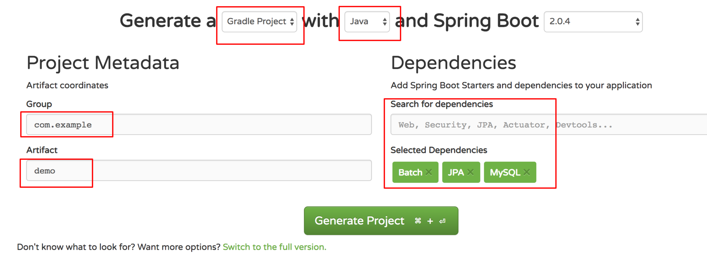
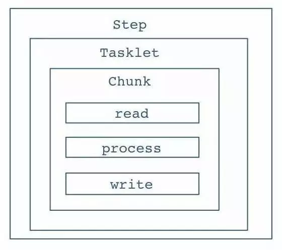
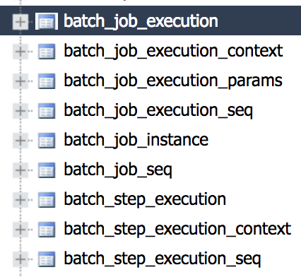
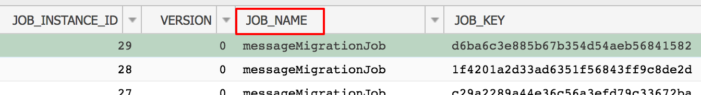
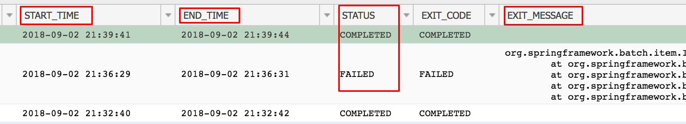
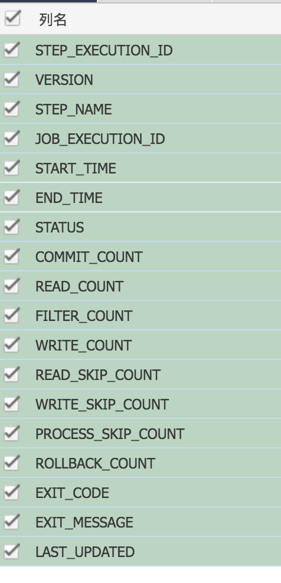

[TOC]


# 记一次Spring Batch完整入门实践

## 前言

本文将从0到1讲解一个Spring Batch是如何搭建并运行起来的。

本教程将讲解从一个文本文件读取数据，然后写入MySQL。

## 什么是 Spring Batch

Spring Batch 作为 Spring 的子项目，是一款基于 Spring 的企业批处理框架。通过它可以构建出健壮的企业批处理应用。Spring Batch 不仅提供了统一的读写接口、丰富的任务处理方式、灵活的事务管理及并发处理，同时还支持日志、监控、任务重启与跳过等特性，大大简化了批处理应用开发，将开发人员从复杂的任务配置管理过程中解放出来，使他们可以更多地去关注核心的业务处理过程。

更多的介绍可以参考官网：[spring.io/projects/sp…](https://spring.io/projects/spring-batch)

## 环境搭建

我是用的Intellij Idea，用gradle构建。

可以使用Spring Initializr 来创建Spring boot应用。地址：[start.spring.io/](https://start.spring.io/)



首先选择Gradle Project，然后选择Java。填上你的Group和Artifact名字。 最后再搜索你需要用的包，比如Batch是一定要的。另外，由于我写的Batch项目是使用JPA向MySQL插入数据，所以也添加了JPA和MySQL。其他可以根据自己需要添加。

点击Generate Project，一个项目就创建好了。

Build.gralde文件大概就长这个样子：

```
buildscript {
   ext {
      springBootVersion = '2.0.4.RELEASE'
   }
   repositories {
      mavenCentral()
   }
   dependencies {
      classpath("org.springframework.boot:spring-boot-gradle-plugin:${springBootVersion}")
   }
}

apply plugin: 'java'
apply plugin: 'idea'
apply plugin: 'org.springframework.boot'
apply plugin: 'io.spring.dependency-management'

group = 'com.demo'
version = '0.0.1-SNAPSHOT'
sourceCompatibility = 1.8

repositories {
   mavenCentral()
}

dependencies {
   compile('org.springframework.boot:spring-boot-starter-batch')
   compile('org.springframework.boot:spring-boot-starter-jdbc')
   compile("org.springframework.boot:spring-boot-starter-data-jpa")
   compile group: 'com.fasterxml.jackson.datatype', name: 'jackson-datatype-joda', version: '2.9.4'
   compile group: 'org.jadira.usertype', name: 'usertype.core', version: '6.0.1.GA'
   compile group: 'mysql', name: 'mysql-connector-java', version: '6.0.6',
   testCompile('org.springframework.boot:spring-boot-starter-test')
   testCompile('org.springframework.batch:spring-batch-test')
}
复制代码
```

## Spring Batch 结构

网上有很多Spring Batch结构和原理的讲解，我就不详细阐述了，我这里只讲一下Spring Batch的一个基本层级结构。

首先，Spring Batch运行的基本单位是一个Job，一个Job就做一件批处理的事情。 一个Job包含很多Step，step就是每个job要执行的单个步骤。 如下图所示，Step里面，会有Tasklet，Tasklet是一个任务单元，它是属于可以重复利用的东西。

然后是Chunk，chunk就是数据块，你需要定义多大的数据量是一个chunk。 Chunk里面就是不断循环的一个流程，读数据，处理数据，然后写数据。Spring Batch会不断的循环这个流程，直到批处理数据完成。




## 构建Spring Batch

首先，我们需要一个全局的Configuration来配置所有的Job和一些全局配置。

代码如下：

```
@Configuration
@EnableAutoConfiguration
@EnableBatchProcessing(modular = true)
public class SpringBatchConfiguration {
    @Bean
    public ApplicationContextFactory firstJobContext() {
        return new GenericApplicationContextFactory(FirstJobConfiguration.class);
    }
    
    @Bean
    public ApplicationContextFactory secondJobContext() {
        return new GenericApplicationContextFactory(SecondJobConfiguration.class);
    }

}
复制代码
```

@EnableBatchProcessing是打开Batch。如果要实现多Job的情况，需要把EnableBatchProcessing注解的modular设置为true，让每个Job使用自己的ApplicationConext。

比如上面代码的就创建了两个Job。

## 例子背景

本博客的例子是迁移数据，数据源是一个文本文件，数据量是上百万条，一行就是一条数据。然后我们通过Spring Batch帮我们把文本文件的数据全部迁移到MySQL数据库对应的表里面。

假设我们迁移的数据是Message，那么我们就需要提前创建一个叫Message的和数据库映射的数据类。

```
@Entity
@Table(name = "message")
public class Message {
    @Id
    @Column(name = "object_id", nullable = false)
    private String objectId;

    @Column(name = "content")
    private String content;

    @Column(name = "last_modified_time")
    private LocalDateTime lastModifiedTime;

    @Column(name = "created_time")
    private LocalDateTime createdTime;
}
复制代码
```

## 构建Job

首先我们需要一个关于这个Job的Configuration，它将在SpringBatchConfigration里面被加载。

```
@Configuration
@EnableAutoConfiguration
@EnableBatchProcessing(modular = true)
public class SpringBatchConfiguration {
    @Bean
    public ApplicationContextFactory messageMigrationJobContext() {
        return new GenericApplicationContextFactory(MessageMigrationJobConfiguration.class);
    }
}
复制代码
```

下面的关于构建Job的代码都将写在这个MessageMigrationJobConfiguration里面。

```
public class MessageMigrationJobConfiguration {
}
复制代码
```

我们先定义一个Job的Bean。

```
@Autowired
private JobBuilderFactory jobBuilderFactory;

@Bean
public Job messageMigrationJob(@Qualifier("messageMigrationStep") Step messageMigrationStep) {
    return jobBuilderFactory.get("messageMigrationJob")
            .start(messageMigrationStep)
            .build();
}
复制代码
```

jobBuilderFactory是注入进来的，get里面的就是job的名字。

这个job只有一个step。

### Step

接下来就是创建Step。

```
@Autowired
private StepBuilderFactory stepBuilderFactory;

@Bean
public Step messageMigrationStep(@Qualifier("jsonMessageReader") FlatFileItemReader<Message> jsonMessageReader,
                                 @Qualifier("messageItemWriter") JpaItemWriter<Message> messageItemWriter,
                                 @Qualifier("errorWriter") Writer errorWriter) {
    return stepBuilderFactory.get("messageMigrationStep")
            .<Message, Message>chunk(CHUNK_SIZE)
            .reader(jsonMessageReader).faultTolerant().skip(JsonParseException.class).skipLimit(SKIP_LIMIT)
            .listener(new MessageItemReadListener(errorWriter))
            .writer(messageItemWriter).faultTolerant().skip(Exception.class).skipLimit(SKIP_LIMIT)
            .listener(new MessageWriteListener())
            .build();
}
复制代码
```

stepBuilderFactory是注入进来的，然后get里面是Step的名字。

我们的Step中可以构建很多东西，比如reader，processer，writer，listener等等。

下面我们就逐个来看看step里面的这些东西是如何使用的。

### Chunk

Spring batch在配置Step时采用的是基于Chunk的机制，即每次读取一条数据，再处理一条数据，累积到一定数量后再一次性交给writer进行写入操作。这样可以最大化的优化写入效率，整个事务也是基于Chunk来进行。

比如我们定义chunk size是50，那就意味着，spring batch处理了50条数据后，再统一向数据库写入。

这里有个很重要的点，chunk前面需要定义数据输入类型和输出类型，由于我们输入是Message，输出也是Message，所以两个都直接写Message了。

如果不定义这个类型，会报错。

```
.<Message, Message>chunk(CHUNK_SIZE)
复制代码
```

### Reader

Reader顾名思义就是从数据源读取数据。

Spring Batch给我们提供了很多好用实用的reader，基本能满足我们所有需求。比如FlatFileItemReader，JdbcCursorItemReader，JpaPagingItemReader等。也可以自己实现Reader。

本例子里面，数据源是文本文件，所以我们就使用FlatFileItemReader。FlatFileItemReader是从文件里面一行一行的读取数据。

首先需要设置文件路径，也就是设置resource。

因为我们需要把一行文本映射为Message类，所以我们需要自己设置并实现LineMapper。

```
@Bean
public FlatFileItemReader<Message> jsonMessageReader() {
    FlatFileItemReader<Message> reader = new FlatFileItemReader<>();
    reader.setResource(new FileSystemResource(new File(MESSAGE_FILE)));
    reader.setLineMapper(new MessageLineMapper());
    return reader;
}
复制代码
```

### Line Mapper

LineMapper的输入就是获取一行文本，和行号，然后转换成Message。

在本例子里面，一行文本就是一个json对象，所以我们使用JsonParser来转换成Message。

```
public class MessageLineMapper implements LineMapper<Message> {
    private MappingJsonFactory factory = new MappingJsonFactory();

    @Override
    public Message mapLine(String line, int lineNumber) throws Exception {   
        JsonParser parser = factory.createParser(line);
        Map<String, Object> map = (Map) parser.readValueAs(Map.class);
        Message message = new Message();
        ... // 转换逻辑
        return message;
    }
}
复制代码
```

### Processor

由于本例子里面，数据是一行文本，通过reader变成Message的类，然后writer直接把Message写入MySQL。所以我们的例子里面就不需要Processor，关于如何写Processor其实和reader/writer是一样的道理。

从它的接口可以看出，需要定义输入和输出的类型，把输入I通过某些逻辑处理之后，返回输出O。

```
public interface ItemProcessor<I, O> {
    O process(I item) throws Exception;
}
复制代码
```

### Writer

Writer顾名思义就是把数据写入到目标数据源里面。

Spring Batch同样给我们提供很多好用实用的writer。比如JpaItemWriter，FlatFileItemWriter，HibernateItemWriter，JdbcBatchItemWriter等。同样也可以自定义。

本例子里面，使用的是JpaItemWriter，可以直接把Message对象写到数据库里面。但是需要设置一个EntityManagerFactory，可以注入进来。

```
@Autowired
private EntityManagerFactory entityManager;

@Bean
public JpaItemWriter<Message> messageItemWriter() {
    JpaItemWriter<Message> writer = new JpaItemWriter<>();
    writer.setEntityManagerFactory(entityManager);
    return writer;
}
复制代码
```

另外，你需要配置数据库的连接等东西。由于我使用的spring，所以直接在Application.properties里面配置如下：

```
spring.datasource.url=jdbc:mysql://database
spring.datasource.username=username
spring.datasource.password=password
spring.datasource.driverClassName=com.mysql.cj.jdbc.Driver
spring.jpa.database-platform=org.hibernate.dialect.MySQLDialect
spring.jpa.show-sql=true
spring.jpa.properties.jadira.usertype.autoRegisterUserTypes=true
spring.jackson.serialization.write-dates-as-timestamps=false
spring.batch.initialize-schema=ALWAYS
spring.jpa.hibernate.ddl-auto=update
复制代码
```

spring.datasource相关的设置都是在配置数据库的连接。

spring.batch.initialize-schema=always表示让spring batch在数据库里面创建默认的数据表。

spring.jpa.show-sql=true表示在控制台输出hibernate读写数据库时候的SQL。

spring.jpa.database-platform=org.hibernate.dialect.MySQLDialect是在指定MySQL的方言。

### Listener

Spring Batch同样实现了非常完善全面的listener，listener很好理解，就是用来监听每个步骤的结果。比如可以有监听step的，有监听job的，有监听reader的，有监听writer的。没有你找不到的listener，只有你想不到的listener。

在本例子里面，我只关心，read的时候有没有出错，和write的时候有没有出错，所以，我只实现了ReadListener和WriteListener。

在read出错的时候，把错误结果写入一个单独的error列表文件中。

```
public class MessageItemReadListener implements ItemReadListener<Message> {
    private Writer errorWriter;

    public MessageItemReadListener(Writer errorWriter) {
        this.errorWriter = errorWriter;
    }

    @Override
    public void beforeRead() {
    }

    @Override
    public void afterRead(Message item) {
    }

    @Override
    public void onReadError(Exception ex) {
         errorWriter.write(format("%s%n", ex.getMessage()));
    }
}
复制代码
```

在write出错的时候，也做同样的事情，把出错的原因写入单独的日志中。

```
public class MessageWriteListener implements ItemWriteListener<Message> {

    @Autowired
    private Writer errorWriter;

    @Override
    public void beforeWrite(List<? extends Message> items) {
    }

    @Override
    public void afterWrite(List<? extends Message> items) {
    }

    @Override
    public void onWriteError(Exception exception, List<? extends Message> items) {
        errorWriter.write(format("%s%n", exception.getMessage()));
        for (Message message : items) {
            errorWriter.write(format("Failed writing message id: %s", message.getObjectId()));
        }
    }
}
复制代码
```

前面有说chuck机制，所以write的listener传入参数是一个List，因为它是累积到一定的数量才一起写入。

### Skip

Spring Batch提供了skip的机制，也就是说，如果出错了，可以跳过。如果你不设置skip，那么一条数据出错了，整个job都会挂掉。

设置skip的时候一定要设置什么Exception才需要跳过，并且跳过多少条数据。如果失败的数据超过你设置的skip limit，那么job就会失败。

你可以分别给reader和writer等设置skip机制。

```
writer(messageItemWriter).faultTolerant().skip(Exception.class).skipLimit(SKIP_LIMIT) 
```

### Retry

这个和Skip是一样的原理，就是失败之后可以重试，你同样需要设置重试的次数。 同样可以分别给reader，writer等设置retry机制。

如果同时设置了retry和skip，会先重试所有次数，然后再开始skip。比如retry是10次，skip是20，会先重试10次之后，再开始算第一次skip。

## 运行Job

所有东西都准备好以后，就是如何运行了。

运行就是在main方法里面用JobLauncher去运行你制定的job。

下面是我写的main方法，main方法的第一个参数是job的名字，这样我们就可以通过不同的job名字跑不同的job了。

首先我们通过运行起来的Spring application得到jobRegistry，然后通过job的名字找到对应的job。

接着，我们就可以用jobLauncher去运行这个job了，运行的时候会传一些参数，比如你job里面需要的文件路径或者文件日期等，就可以通过这个jobParameters传进去。如果没有参数，可以默认传当前时间进去。

```java
public static void main(String[] args) {
    String jobName = args[0];

    try {
        ConfigurableApplicationContext context = SpringApplication.run(ZuociBatchApplication.class, args);
        JobRegistry jobRegistry = context.getBean(JobRegistry.class);
        Job job = jobRegistry.getJob(jobName);
        JobLauncher jobLauncher = context.getBean(JobLauncher.class);
        JobExecution jobExecution = jobLauncher.run(job, createJobParams());
        if (!jobExecution.getExitStatus().equals(ExitStatus.COMPLETED)) {
            throw new RuntimeException(format("%s Job execution failed.", jobName));
        }
    } catch (Exception e) {
        throw new RuntimeException(format("%s Job execution failed.", jobName));
    }
}

private static JobParameters createJobParams() {
    return new JobParametersBuilder().addDate("date", new Date()).toJobParameters();
} 
```

最后，把jar包编译出来，在命令行执行下面的命令，就可以运行你的Spring Batch了。

```
java -jar YOUR_BATCH_NAME.jar YOUR_JOB_NAME 
```

## 调试

调试主要依靠控制台输出的log，可以在application.properties里面设置log输出的级别，比如你希望输出INFO信息还是DEBUG信息。

基本上，通过查看log都能定位到问题。

```
logging.path=build/logs
logging.file=${logging.path}/batch.log
logging.level.com.easystudio=INFO
logging.level.root=INFO
log4j.logger.org.springframework.jdbc=INFO
log4j.logger.org.springframework.batch=INFO
logging.level.org.hibernate.SQL=INFO
复制代码
```

## Spring Batch数据表

如果你的batch最终会写入数据库，那么Spring Batch会默认在你的数据库里面创建一些batch相关的表，来记录所有job/step运行的状态和结果。

大部分表你都不需要关心，你只需要关心几张表。




batch_job_instance：这张表能看到每次运行的job名字。



batch_job_execution：这张表能看到每次运行job的开始时间，结束时间，状态，以及失败后的错误消息是什么。



batch_step_execution：这张表你能看到更多关于step的详细信息。比如step的开始时间，结束时间，提交次数，读写次数，状态，以及失败后的错误信息等。




## 总结

Spring Batch为我们提供了非常实用的功能，对批处理场景进行了完善的抽象，它不仅能实现小数据的迁移，也能应对大企业的大数据实践应用。它让我们开发批处理应用可以事半功倍。

最后一个tips，搭建Spring Batch的过程中，会遇到各种各样的问题。**只要善用Google，都能找到答案。**


https://juejin.im/post/5b8f4849e51d45389005d26f#heading-17