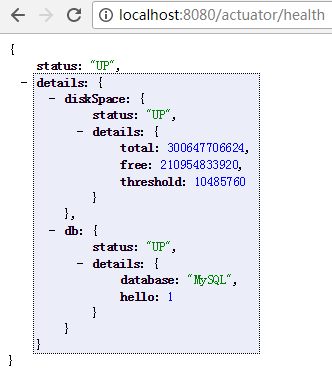
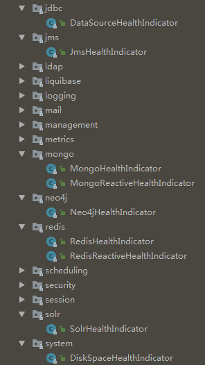

[TOC]


# spring boot 2.0.0下spring-boot-starter-actuator默认endpoints未打开

最近在spring boot 2.0.0下配置spring-boot-starter-actuator，加入依赖后启动，发现spring-boot-starter-actuator2.0.0 RELEASE进行了重构，与之前的spring-boot-actuator的使用大有区别

## 区别1：启动后访问http://localhost:8081/actuator只显示

/actuator

/actuator/info

/actuator/health

其他的endpoints都没有显示出来

查看文档 <https://docs.spring.io/spring-boot/docs/current/reference/html/production-ready-endpoints.html>

怀疑可能是未enable或未expose造成的

在application.properties中按照文档添加内容

```
management.endpoints.web.exposure.include=*
```

于是出现了久违的log


## 区别2：显示所有健康状态，需要加配置

```
management.endpoint.health.show-details=always
```

结果：



从源码可以看到其集成了多个HealthIndicator





https://blog.csdn.net/u013905744/article/details/79857063