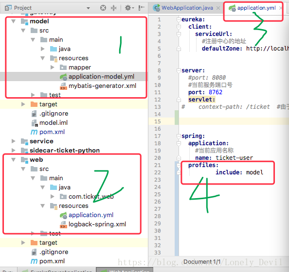
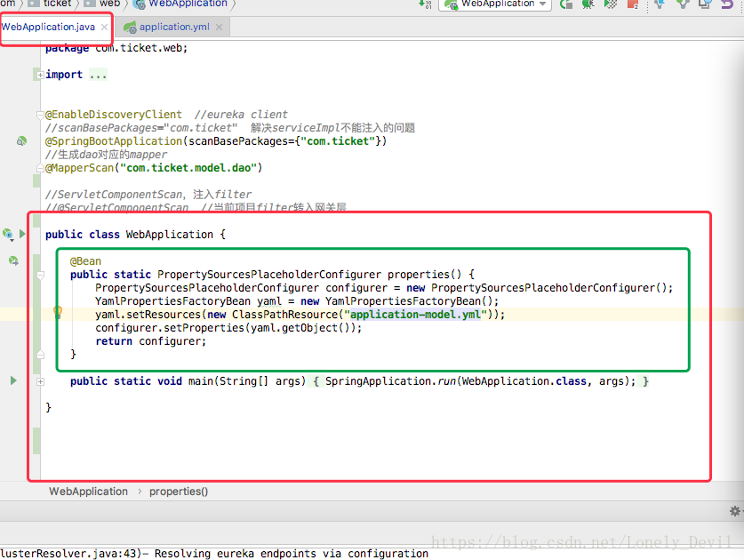

# springboot使用外部yml文件的两种方法

在上篇文章中介绍了classpath与classpath*的区别，这篇文章主要介绍在springboot中如何使用依赖jar包中的yml文件。

java web项目都是分模块的，比如这个项目web模块依赖 model模块

### 第一种方法：



在web模块中引用model中的yml文件

主要就是图4

```
 spring: 
    application: 
        profiles: 
           include: model
```

**这种方法中  application-model.yml的前缀一定要和主在配置文件application.yml的名字一致**

### 第二种方法：



   就是在WebApplication中添加绿色代码

```
@Bean
public static PropertySourcesPlaceholderConfigurer properties() {
	PropertySourcesPlaceholderConfigurer configurer = new PropertySourcesPlaceholderConfigurer();
	YamlPropertiesFactoryBean yaml = new YamlPropertiesFactoryBean();
	yaml.setResources(new ClassPathResource("application-model.yml"));
	configurer.setProperties(yaml.getObject());
	return configurer;
}
```

 


https://blog.csdn.net/Lonely_Devil/article/details/81875890