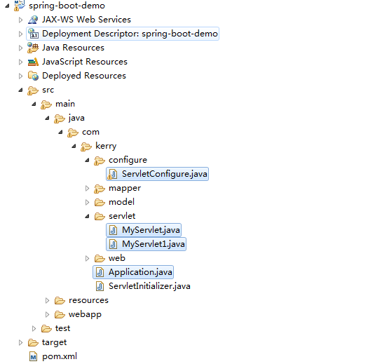

# springboot servlet使用配置

## 简介

在spring boot中添加自己的Servlet有两种方法，代码注册Servlet和注解自动注册（Filter和Listener也是如此）。 

## 一、代码注册通过ServletRegistrationBean 获得控制。 

也可以通过实现 ServletContextInitializer 接口直接注册。

```java
package com.kerry.servlet;
 
import java.io.IOException;
import java.io.PrintWriter;
 
import javax.servlet.ServletException;
import javax.servlet.http.HttpServlet;
import javax.servlet.http.HttpServletRequest;
import javax.servlet.http.HttpServletResponse;
 
public class MyServlet1 extends HttpServlet{
 
	private static final long serialVersionUID = 8031133938454140403L;
 
	@Override
	protected void service(HttpServletRequest req, HttpServletResponse resp)
			throws ServletException, IOException {
		resp.setContentType("text/html");  
        PrintWriter out = resp.getWriter();  
        out.println("<html>");  
        out.println("<head>");  
        out.println("<title>Hello World</title>");  
        out.println("</head>");  
        out.println("<body>");  
        out.println("<h1>welcome this is my servlet1!!!</h1>");  
        out.println("</body>");  
        out.println("</html>"); 
	}
}

```

```java
package com.kerry.configure;
 
import org.springframework.boot.web.servlet.ServletRegistrationBean;
import org.springframework.context.annotation.Bean;
import org.springframework.context.annotation.Configuration;
 
import com.kerry.servlet.MyServlet;
import com.kerry.servlet.MyServlet1;
 
@Configuration
public class ServletConfigure {
	
	/**
	 * 代码注册servlet(不需要@ServletComponentScan注解)
	 * @return
	 */
	   @Bean
	    public ServletRegistrationBean servletRegistrationBean() {
	        return new ServletRegistrationBean(new MyServlet1(), "/servlet/myServlet1");// ServletName默认值为首字母小写，即myServlet1
	    }
	   
	   /**
	    * 多个servlet就注册多个bean
	    * @return
	    */
	   @Bean
	    public ServletRegistrationBean servletRegistrationBean1() {
	        return new ServletRegistrationBean(new MyServlet(), "/servlet/myServlet");// ServletName默认值为首字母小写，即myServlet
	    }
}

```

## 二 注解注入使用

1 Application上加上@ServletComponentScan注解

```
package com.kerry;
 
import org.mybatis.spring.annotation.MapperScan;
import org.springframework.boot.SpringApplication;
import org.springframework.boot.autoconfigure.SpringBootApplication;
import org.springframework.boot.web.servlet.ServletComponentScan;
 
@SpringBootApplication
@MapperScan("com.kerry.mapper")
@ServletComponentScan
public class Application {
 
	public static void main(String[] args) {
		SpringApplication.run(Application.class, args);
	}
}

```

2 servlet上加上@WebServlet注解

```
package com.kerry.servlet;
 
import java.io.IOException;
import java.io.PrintWriter;
 
import javax.servlet.ServletException;
import javax.servlet.annotation.WebServlet;
import javax.servlet.http.HttpServlet;
import javax.servlet.http.HttpServletRequest;
import javax.servlet.http.HttpServletResponse;
 
/**
 * 注解使用servlet 需要在Application上加入 @ServletComponentScan
 * @author Administrator
 *
 */
@WebServlet(name="myServlet",urlPatterns="/servlet/myServlet")
public class MyServlet extends HttpServlet{
 
	private static final long serialVersionUID = 8031133938454140403L;
 
	@Override
	protected void service(HttpServletRequest req, HttpServletResponse resp)
			throws ServletException, IOException {
		resp.setContentType("text/html");  
        PrintWriter out = resp.getWriter();  
        out.println("<html>");  
        out.println("<head>");  
        out.println("<title>Hello World</title>");  
        out.println("</head>");  
        out.println("<body>");  
        out.println("<h1>welcome this is my servlet!!!</h1>");  
        out.println("</body>");  
        out.println("</html>"); 
	}
	
	
 
}

```

附上项目结构




https://blog.csdn.net/lr131425/article/details/76269788