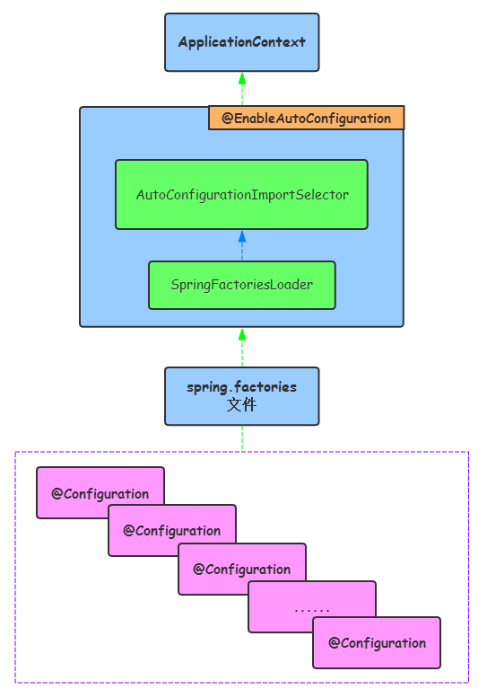
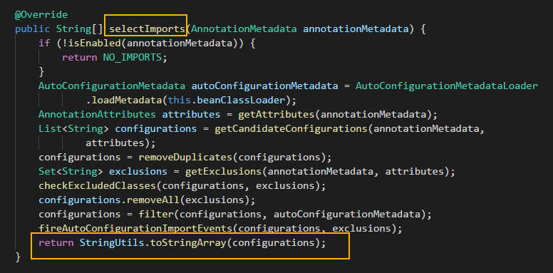
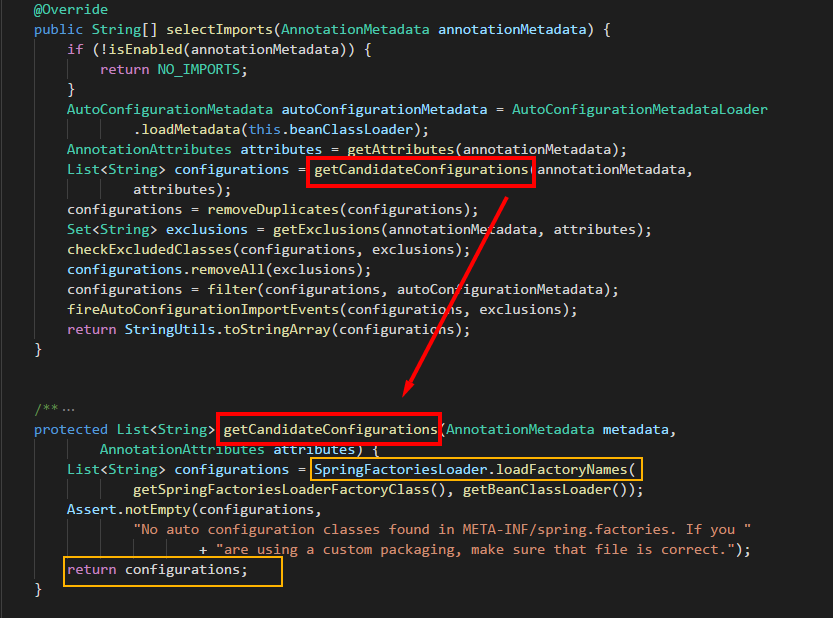
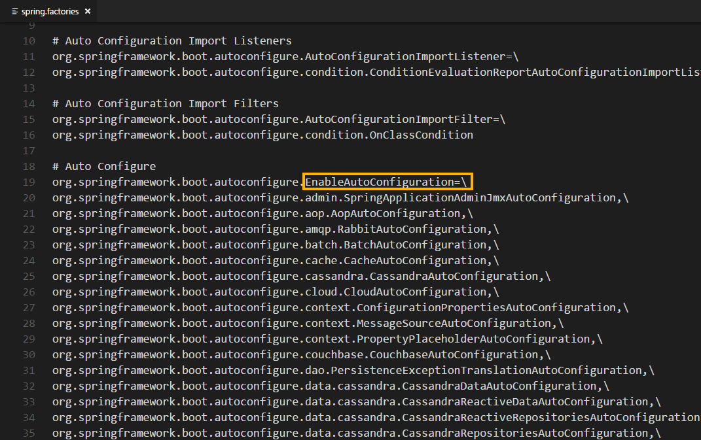

[TOC]


# SpringBoot 中 @SpringBootApplication注解背后的三体结构探秘

结合SpringBoot的源码，来看看SpringBoot中@SpringBootApplication注解背后三体结构的奥秘 

------

## 概 述

SpringBoot **约定大于配置** 的功力让我们如沐春风，在我之前写的文章[《从SpringBoot到SpringMVC》](https://www.jianshu.com/p/8483277e9011)
也对比过 SpringBoot 和 SpringMVC 这两个框架，不过最终 SpringBoot 以超高的代码信噪比 和 易上手性 让我们映像颇深。

但归根结底，不论 SpringBoot 或者 SpringMVC 应用本质上依然是一个基于 Spring的应用，只不过在后者脸庞上蒙上了一层神秘的面纱而已！

回到 SpringBoot 的话题，我们在开发基于 SpringBoot 的应用时，用到了一些新的注解和类，正式由于其存在，才让JavaEE的开发如鱼得水。这其中我们用的最多的注解之一，当属 SpringBoot 应用启动类上的 **@SpringBootApplication** 注解了

本文就来看看它到底是个啥！

> **注：** 本文首发于 My 公众号 **CodeSheep** ，可 **长按** 或 **扫描** 下面的 **小心心** 来订阅 ↓ ↓ ↓

## @SpringBootApplication 背后到底是什么？

@SpringBootApplication注解实际上是SpringBoot提供的一个复合注解，我们来看一看其源码：

```java
@Target(ElementType.TYPE)
@Retention(RetentionPolicy.RUNTIME)
@Documented
@Inherited
@SpringBootConfiguration
@EnableAutoConfiguration
@ComponentScan(excludeFilters = {
		@Filter(type = FilterType.CUSTOM, classes = TypeExcludeFilter.class),
		@Filter(type = FilterType.CUSTOM, classes = AutoConfigurationExcludeFilter.class) })
public @interface SpringBootApplication {
	...
}
```

看得很清楚，其是一个合成体，但其中最重要的三个注解分别是：

- **@SpringBootConfiguration**
- **@EnableAutoConfiguration**
- **@ComponentScan**

我们不妨称其为 **“ 三体结构 ”** 吧！

如果我们不怕麻烦，在 SpringBoot 应用的启动类上用这个三个注解代替@SpringBootApplication 注解发现也是没问题的：

```java
@SpringBootConfiguration
@EnableAutoConfiguration
@ComponentScan
public class TestSpringBootApplication {
	...
}
```

下面分别剖析一下这三个注解的功效！

------

------

## @SpringBootConfiguration

看代码吧，代码里是这样写的：

```java
@Target(ElementType.TYPE)
@Retention(RetentionPolicy.RUNTIME)
@Documented
@Configuration
public @interface SpringBootConfiguration {

}
```

这说明 @SpringBootConfiguration 也是来源于 @Configuration，二者功能都是将当前类标注为配置类，并将当前类里以 @Bean 注解标记的方法的实例注入到srping容器中，实例名即为方法名。

至于@Configuration，我想在非SpringBoot时代大家应该不陌生吧，作用是配置Spring容器，也即 JavaConfig 形式的 Spring IoC 容器的配置类所使用。

到目前来看，好像还没有什么新东西！！！

------

------

## @EnableAutoConfiguration

再继续看代码，代码是这样的：

```
@Target(ElementType.TYPE)
@Retention(RetentionPolicy.RUNTIME)
@Documented
@Inherited
@AutoConfigurationPackage
@Import(AutoConfigurationImportSelector.class)
public @interface EnableAutoConfiguration {
	...
}
```

@EnableAutoConfiguration 注解启用自动配置，其可以帮助 SpringBoot 应用将所有符合条件的 @Configuration 配置都加载到当前 IoC 容器之中，可以简要用图形示意如下：

[](https://upload-images.jianshu.io/upload_images/9824247-7b06c3e0982092b3.png?imageMogr2/auto-orient/strip%7CimageView2/2/w/1240)
@EnableAutoConfiguration 幕后的组件调用关系

接下来我们对照源码，来解释一下这个流程：

- @EnableAutoConfiguration 借助 **AutoConfigurationImportSelector** 的帮助，而后者通过实现 **selectImports()** 方法来导出 Configuration



- AutoConfigurationImportSelector 类的 selectImports() 方法里面通过调用Spring Core 包里 **SpringFactoriesLoader** 类的 **loadFactoryNames()**方法



- 最终通过 SpringFactoriesLoader.loadFactoryNames() 读取了 ClassPath 下面的 **META-INF/spring.factories** 文件来获取所有导出类。

而spring.factories 文件里关于 EnableAutoConfiguration 的配置其实就是一个键值对结构，样子大概长下面这样：



说了这么多，如果从稍微宏观一点的角度 **概括总结** 上述这一过程那就是：

从 ClassPath下扫描所有的 META-INF/spring.factories 配置文件，并将spring.factories 文件中的 EnableAutoConfiguration 对应的配置项通过反射机制实例化为对应标注了 @Configuration 的形式的IoC容器配置类，然后注入IoC容器。

------

------

## @ComponentScan

@ComponentScan 对应于XML配置形式中的 <context:component-scan>，用于将一些标注了特定注解的bean定义批量采集注册到Spring的IoC容器之中，这些特定的注解大致包括：

- @Controller
- @Entity
- @Component
- @Service
- @Repository

等等

对于该注解，还可以通过 basePackages 属性来更细粒度的控制该注解的自动扫描范围，比如：

```
@ComponentScan(basePackages = {"cn.codesheep.controller","cn.codesheep.entity"})
```

可见 这个注解也并不是什么新东西！

 


https://www.codesheep.cn/2018/07/30/at-SpringBootApplication-zhujie/