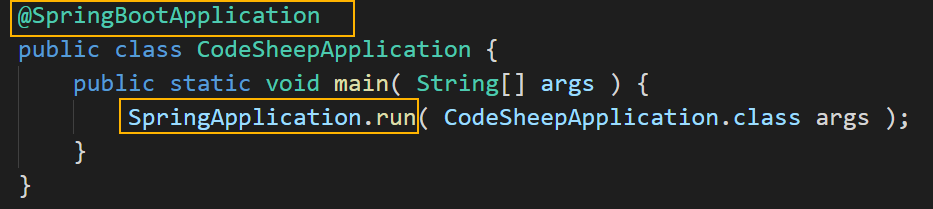
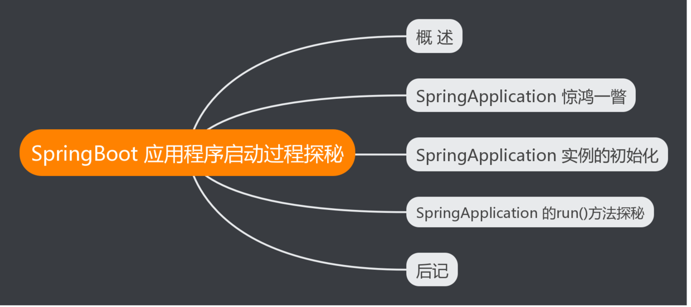
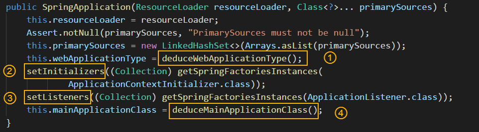
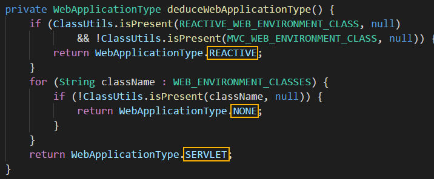
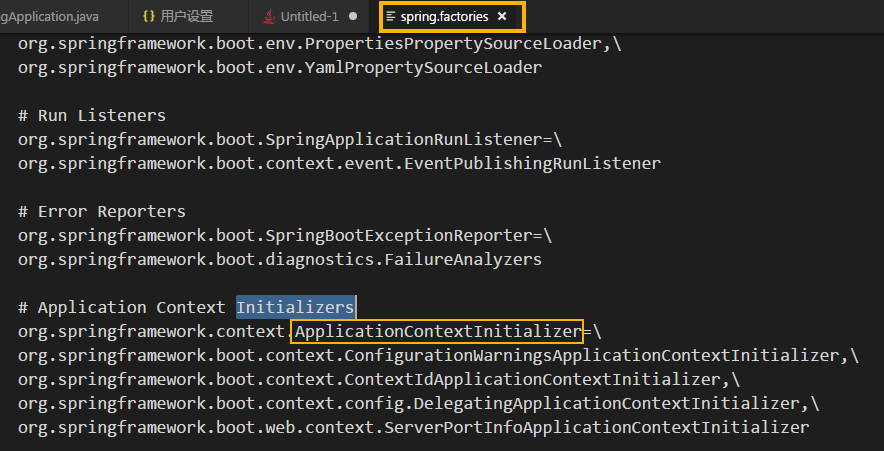
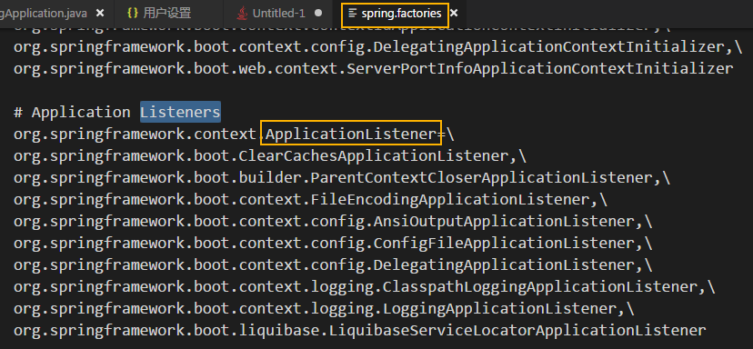
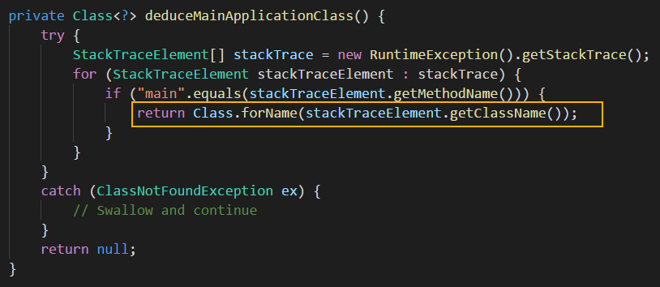
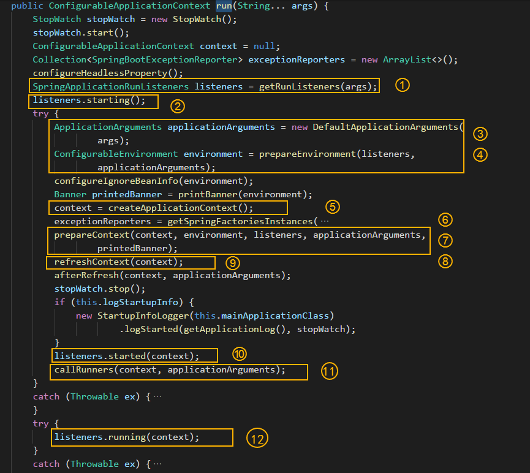
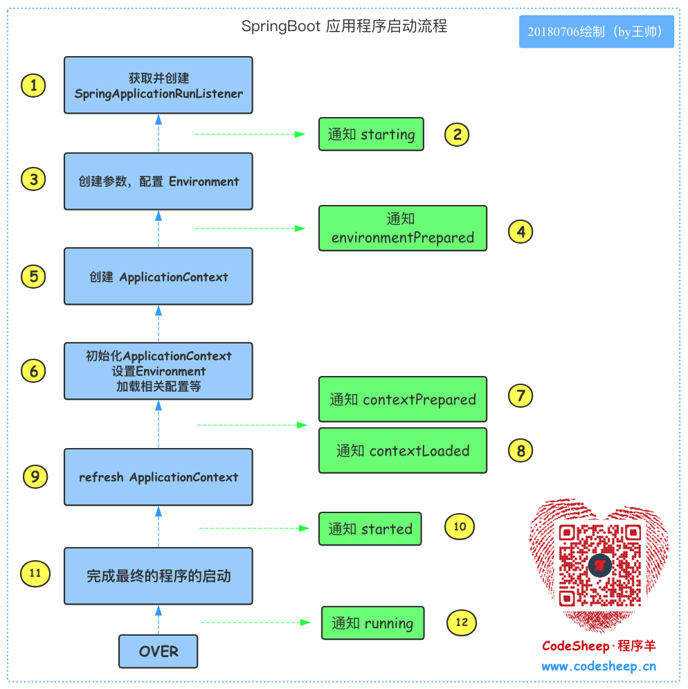

[TOC]


# SpringBoot 应用程序启动过程探秘 

> 本文共 946字，阅读大约需要 3分钟 ！

------

## 概述

说到接触 SpringBoot 开始，给我第一映像最深的是有两个关键元素：



对照上面的典型代码，这个两个元素分别是：

- **@SpringBootApplication**
- **SpringApplication** 以及 **run()** 方法

关于 **@SpringBootApplication** 注解的剖析已经在上文：[《SpringBoot 中 @SpringBootApplication注解背后的三体结构探秘》](http://www.codesheep.cn/2018/07/30/at-SpringBootApplication-zhujie/) 中完成了，其实它背后就是一个三体结构，只是 SpringBoot给了其一个包装而已。那么本文我们就来看看这个 **SpringApplication** 以及 **run()** 方法 到底是个什么鬼，它背后又隐藏了哪些奥秘呢？

> **注：** 本文首发于 [**My Personal Blog**](http://www.codesheep.cn/)，欢迎光临 [**小站**](http://www.codesheep.cn/)

本文内容脑图如下：



------

## SpringApplication 惊鸿一瞥

SpringApplication 这个类应该算是 SpringBoot 框架 的“创新”产物了，原始的 Spring中并没有这个类，SpringApplication 里面封装了一套 Spring 应用的启动流程，然而这对用户完全透明，因此我们上手 SpringBoot 时感觉简洁、轻量。

一般来说默认的 SpringApplication 执行流程已经可以满足大部分需求，但是 若用户想干预这个过程，则可以通过 SpringApplication 在流程某些地方开启的 **扩展点** 来完成对流程的扩展，典型的扩展方案那就是使用 set 方法。

我们来举一个栗子，把我们天天司空见惯的 SpringBoot 应用的启动类来拆解一下写出来：

```java
@SpringBootApplication
public class CodeSheepApplication {
	public static void main( String[] args ) {
		// SpringApplication.run( CodeSheepApplication.class args ); // 这是传统SpringBoot应用的启动，一行代码搞定，内部默认做了很多事
		SpringApplication app = new SpringApplication( CodeSheepApplication.class );
		app.setXXX( ... ); // 用户自定的扩展在此 ！！！
		app.run( args );
	}
}
```

这样一拆解后我们发现，我们也需要先构造 SpringApplication 类对象，然后调用该对象的 `run()` 方法。那么接下来就讲讲 SpringApplication 的构造过程 以及其 `run()` 方法的流程，搞清楚了这个，那么也就搞清楚了SpringBoot应用是如何运行起来的！

------

## SpringApplication 实例的初始化

我们对照代码来看：



四个关键的步骤已标注在图中，分别解释如下：

- **①** 推断应用的类型：创建的是 REACTIVE应用、SERVLET应用、NONE 三种中的某一种



- **②** 使用 `SpringFactoriesLoader`查找并加载 classpath下 `META-INF/spring.factories`文件中所有可用的 `ApplicationContextInitializer`



- **③** 使用 `SpringFactoriesLoader`查找并加载 classpath下 `META-INF/spring.factories`文件中的所有可用的 `ApplicationListener`



- **④** 推断并设置 main方法的定义类



------

------

## SpringApplication 的run()方法探秘

先看看代码长啥样子：

 

各个主要步骤我已经标注在上图之中了，除此之外，我也按照自己的理解画了一个流程图如下所示，可以对照数字标示看一下：



我们将各步骤总结精炼如下：

1. 通过 `SpringFactoriesLoader` 加载 `META-INF/spring.factories` 文件，获取并创建 `SpringApplicationRunListener` 对象
2. 然后由 `SpringApplicationRunListener` 来发出 starting 消息
3. 创建参数，并配置当前 SpringBoot 应用将要使用的 Environment
4. 完成之后，依然由 `SpringApplicationRunListener` 来发出 environmentPrepared 消息
5. 创建 `ApplicationContext`
6. 初始化 `ApplicationContext`，并设置 Environment，加载相关配置等
7. 由 `SpringApplicationRunListener` 来发出 `contextPrepared` 消息，告知SpringBoot 应用使用的 `ApplicationContext` 已准备OK
8. 将各种 beans 装载入 `ApplicationContext`，继续由 `SpringApplicationRunListener` 来发出 contextLoaded 消息，告知 SpringBoot 应用使用的 `ApplicationContext` 已装填OK
9. refresh ApplicationContext，完成IoC容器可用的最后一步
10. 由 `SpringApplicationRunListener` 来发出 started 消息
11. 完成最终的程序的启动
12. 由 `SpringApplicationRunListener` 来发出 running 消息，告知程序已运行起来了

至此，全流程结束！

------

------

## 后记

> 由于能力有限，若有错误或者不当之处，还请大家批评指正，一起学习交流！

- [My Personal Blog](http://www.codesheep.cn/)
- [我的半年技术博客之路](https://www.jianshu.com/p/28ba53821450)


https://my.oschina.net/hansonwang99/blog/1942642