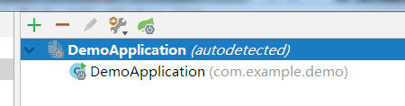

[TOC]

# springboot idea不识别yml配置文件，怎么办？

## 问题描述：

- 如下图，新建的springboot项目，添加了自定义的配置文件后，`2.yml`无法像上方文件的一样，被识别成配置文件！
  
- 虽然可能不会影响项目（不确定），但问题不解决，根本没有心情开始下一步！
- 百度了半天，只找到了相同的问题，没找到有参考价值的答案，也是写此文的目的。
- 附上没有答案的问题链接：<https://www.imooc.com/wenda/detail/347761>

## 解决思路：

- 首先应该明确，这种问题，属于_项目结构_问题！
- 通过如下方式，找到相关设置。
  1.ctrl + shift + alt + s ，打开设置
  2.找到下图设置
  
  3.可以明显的看到，右侧`Configuration Files`里面只有 `1.yml`，对于新添加的并不在其中
  4.有的人还想说，别说没有新加的文件，就连`Configuration Files`也没有啊！
  5,如下是解决办法！

## 详细操作：

- 为了更好的演示，直接来到原始的样子
  
- 按照如下步骤操作，框中输入配置文件名，即可显示，点击ok，即可成功添加！
  
- 当然了，有些情况是输入了配置文件名，并没有提示，就像下图！
  
- 不妨可以考虑检查下，是不是文件放错了位置！
- 一定保证，配置文件的所在文件夹类型为，下图绿色框类型的文件夹（而非红色框）！下图也是更改文件夹类型方式！
  

https://www.cnblogs.com/kangkaii/p/8442822.html