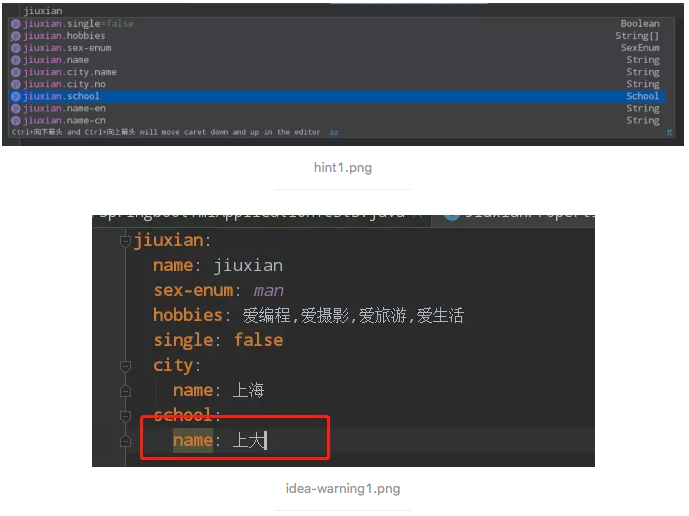
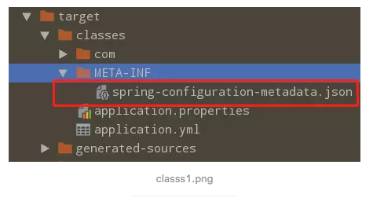
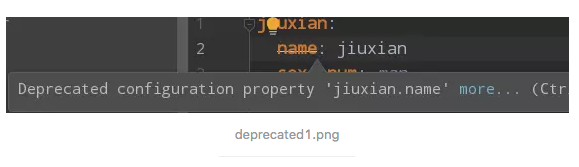

[TOC]


# spring-boot 如何让yml,properties配置文件有提示

82019.01.24 17:12:09字数 1,083阅读 7,416

我们在引用spring官方start库或者第三方start库时，在写配置文件时idea总是能精准的提示，并且鼠标可以点过去看具体属性或者类，而自己写的配置文件idea只会有“Cannot resolve configuration property ...”这样的提示。

我们现在也去配置我们自己的配置文件让idea知道这些配置文件是干什么的。

### 一、需要的注解

- @ConfigurationProperties 配置属性文件，需要指定前缀 prefix
- @EnableConfigurationProperties 启用配置，需要指定启用的配置类
- @NestedConfigurationProperty 当一个类中引用了外部类，需要在该属性上加该注解

### 二、POM依赖


```xml
<dependency>
    <groupId>org.springframework.boot</groupId>
    <artifactId>spring-boot-configuration-processor</artifactId>
    <optional>true</optional>
</dependency>
```

### 三、配置类


```java
@Data
public class School {
    private Integer no;
    private String name;
    private String address;
}
```


```java
@Data
@ConfigurationProperties(prefix = "jiuxian")
public class JiuxianProperties {
    private String name;
    private String nameCn;
    private String nameEn;
    private String[] hobbies;
    private SexEnum sexEnum;
    private boolean single;
    private School school;
    private City city;

    enum SexEnum {
        MAN, WOMAN
    }

    @Data
    static class City {
        private String no;
        private String name;
    }
}
```

这个时候@ConfigurationProperties(prefix = "jiuxian") 注解会报错not registered via @EnableConfigurationProperties or marked as Spring component。这需要加上@EnableConfigurationProperties就可以了

```java
@EnableConfigurationProperties({ JiuxianProperties.class })
@SpringBootApplication
public class SpringbootYmlApplication {

    public static void main(String[] args) {
        SpringApplication.run(SpringbootYmlApplication.class, args);
    }
}
```

### 四、看效果

然后输入 mvn clean package

这个时候properties和yml文件已经可以提示了，不过有一些会有问题，比如jiuxian.school，这是一个对象，idea并不能解析,而因为City对象是个内部类是可以解析的。

如图:



如何处理呢？
只需要加上 @NestedConfigurationProperty注解即可

```java
@NestedConfigurationProperty
private School school;
```

然后输入命令 mvn clean package

警告消失(会有一点延迟)

### 五、为什么

为什么一定要打包编译后才可以呢？

看一下打包过后的结构，如图：



idea之所以会代码提示就是因为这个spring-configuration-metadata.json json文件。这个文件的生成依据的就是我们上面的配置。

### 六、进阶配置

如果想在配置文件中能够提示该字段描述，以及该字段可选参数，是否弃用等信息时，需要加额外的配置

#### 1. 在resources目录下新建META-INF文件夹，加一个additional-spring-configuration-metadata.json 配置文件

（1）该配置文件的节点信息

- groups 有以下属性：
  - name group的全名，该属性必须
  - type group数据类型的类名。例如，如果group是基于一个被@ConfigurationProperties注解的类，该属性将包含该类的全限定名。如果基于一个@Bean方法，它将是该方法的返回类型。如果该类型未知，则该属性将被忽略
  - description 一个简短的group描述，用于展示给用户，要.点结尾。如果没有可用描述，该属性将被忽略
  - sourceType 来源类名。例如，如果组基于一个被@ConfigurationProperties注解的@Bean方法，该属性将包含@Configuration类的全限定名，该类包含此方法。如果来源类型未知，则该属性将被忽略
  - sourceMethod 该组的方法的全名（包含括号及参数类型）。例如，被@ConfigurationProperties注解的@Bean方法名。如果源方法未知，该属性将被忽略

"groups"是高级别的节点，它们本身不指定一个值，但为properties提供一个有上下文关联的分组。例如，server.port和server.servlet-path属性是server组的一部分。

> 注：不需要每个"property"都有一个"group"，一些属性可以以自己的形式存在。

- properties
  - name 属性全名,格式为小写虚线分割的形式（jiuxian.name-en).必须要有的
  - type 属性数据类型,java.lang.Boolean。类型未知可忽略
  - description 该属性的描述
  - sourceType 来源类型,例如，如果property来自一个被@ConfigurationProperties注解的类，该属性将包括该类的全限定名。如果来源类型未知则该属性会被忽略
  - defaultValue 定义输入时的默认值,只是提示，并不是真正的默认值，可忽略
  - deprecated 是否废弃 boolean 值
    - level 级别 error,warning
    - reason 废弃原因
    - replacement 替代属性，为properties 全名
- hints 可以给属性提供可选的值，以级描述
  - name 属性全名，不能为空
  - values 可选的值

详细看示例


```xml
{
  "groups": [
    {
      "name": "jiuxian",
      "sourceType": "com.jiuxian.config.JiuxianProperties",
      "type": "com.jiuxian.config.JiuxianProperties"
    },
    {
      "name": "jiuxian.school",
      "sourceType": "com.jiuxian.config.School",
      "type": "com.jiuxian.config.School",
      "sourceMethod": "getSchool()"
    }
  ],
  "properties": [
    {
      "name": "jiuxian.name",
      "sourceType": "com.jiuxian.config.JiuxianProperties",
      "type": "java.lang.String",
      "deprecation": {
        "level": "error",
        "reason": "replacement nameCn.",
        "replacement": "jiuxian.name-cn"
      }
    },
    {
      "name": "jiuxian.name-cn",
      "sourceType": "com.jiuxian.config.JiuxianProperties",
      "type": "java.lang.String",
      "defaultValue": "jiuxian"
    }
  ],
  "hints": [
    {
      "name": "jiuxian.sex-enum",
      "values": [
        {
          "value": "man",
          "description": "man."
        },
        {
          "value": "woman",
          "description": "woman."
        }
      ]
    },
    {
      "name": "jiuxian.single",
      "values": [
        {
          "value": true,
          "description": "yes."
        },
        {
          "value": false,
          "description": "no."
        }
      ]
    }
  ]
}
```

idea 提示：



#### 2. 也可以用注释来标识

如何废弃某个字段，可以用代码来注解

```java
@Deprecated
private String name;

@DeprecatedConfigurationProperty(replacement = "jiuxian.name-cn", reason = "replacement nameCn")
public String getName() {
    return getNameCn();
}

public void setName(String name) {
    setNameCn(name);
}
```

### 七、更多详细介绍请参阅官网

[Spring官网介绍](https://docs.spring.io/spring-boot/docs/2.1.2.RELEASE/reference/html/configuration-metadata.html)

### 八、本文示例代码

[GitHub 源码](https://github.com/Zejun-Liu/SpringBoot2.0/tree/master/springboot-yml)

> 【注】以上代码基于Springboot 2.0


https://www.jianshu.com/p/497d6a231b65