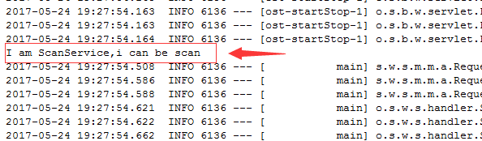
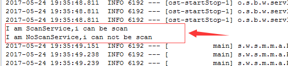

[TOC]


# spring-boot 的xml配置

2016-12-29 分类：[springBoot](http://blog.longjiazuo.com/archives/category/code_language/java/spring-ecology/springboot) 阅读(6413) 评论(0) 

## 一. 点睛

`Spring Boot`提倡零配置，即无`xml`配置，但是在实际项目中，可能有一些特殊要求你必须使用`xml`配置，这时候可以通过在配置类上面使用`Spring`提供的`@ImportResource`来在加载`xml`配置，例如：

```
@ImportResource(value = { "classpath:some-context.xml","classpath:another-context.xml" })
```

## 二. 示例

### 1. 新建包

新建两个包:`org.light4j.springboot.xml.scan`和`org.light4j.springboot.xml.noScan`

### 2. 新建启动类

新建`Application.java`启动类，放到包`org.light4j.springboot.xml.scan`下，根据`Spring` `Boot`的扫描原则（扫描从根包到子包的原则），能够扫描到`org.light4j.springboot.xml.scan`以及它的子包，`org.light4j.springboot.xml.noScan`包以及子包则不能被扫描到，代码如下：

```
package org.light4j.springboot.xml.scan;

import org.springframework.boot.SpringApplication;
import org.springframework.boot.autoconfigure.SpringBootApplication;
import org.springframework.context.annotation.ImportResource;

@SpringBootApplication
public class Application {
    public static void main(String[] args) {
        SpringApplication.run(Application.class, args);
    }
}
```

### 3. 新建Service类

新建`ScanService`和`NoScanService`两个`Service`类，根据`Spring ``Boot`的扫描原则，我们把`ScanService`写在`Spring ``Boot`可以扫描的位置,也即放到包`org.light4j.springboot.xml.scan`下，`NoScanService`写在`Spring``Boot`无法扫描到的位置,也即放到包`org.light4j.springboot.xml.noScan`下。
**ScanService.java代码如下所示：**

```
package org.light4j.springboot.xml.scan;

import org.springframework.stereotype.Service;

@Service
public class ScanService {
    public ScanService() {
        System.out.println("I am ScanService,i can be scan");
    }
}
```

**NoScanService.java代码如下所示：**

```
package org.light4j.springboot.xml.noScan;

import org.springframework.stereotype.Service;

@Service
public class NoScanService {
    public NoScanService() {
        System.out.println("I am NoScanService,i can not be scan");
    }
}
```

### 4. 运行程序

运行`Application.java`，看到控制台打印日志如下图所示：

从上面可以看到，在程序启动的时候，执行了`ScanService`类的构造函数，而`NoScanService`没有执行，这是因为`NoScanService`所在的包没有被扫描到，所以没有进行初始化。 那么下面我们使用`xml`配置文件的方式进行引入。

### 5. 编写application-bean.xml

在`src/main/resouces`目录下编写配置文件`application-bean.xml`文件，内容如下所示：

```
<?xml version="1.0" encoding="UTF-8"?>
<beans xmlns="http://www.springframework.org/schema/beans"
    xmlns:xsi="http://www.w3.org/2001/XMLSchema-instance"
    xsi:schemaLocation="http://www.springframework.org/schema/beans http://www.springframework.org/schema/beans/spring-beans.xsd">

    <!-- 注入spring boot无法扫描到的bean. -->
    <bean id="noScanService" class="org.light4j.springboot.xml.noScan.NoScanService"></bean>

</beans>
```

### 6. 导入配置文件

在启动类`Application`上使用注解`@ImportResource(value = { "classpath:application-bean.xml" })`导入`bean`的配置文件，修改后的`Application`启动类如下图所示：

```
package org.light4j.springboot.xml.scan;

import org.springframework.boot.SpringApplication;
import org.springframework.boot.autoconfigure.SpringBootApplication;
import org.springframework.context.annotation.ImportResource;

@SpringBootApplication
@ImportResource(value = { "classpath:application-bean.xml" })
public class Application {
    public static void main(String[] args) {
        SpringApplication.run(Application.class, args);
    }
}
```

### 7.运行程序测试

运行`Application.java`，现在看到控制台打印日志如下图所示：

从上面可以看到，在程序启动的时候，`ScanService`和`NoScanService`的构造函数都被执行了，二者构造函数里的代码都在控制台打印。

## 三. 源代码示例：

> `github`地址：[点击查看](https://github.com/longjiazuo/springBoot-project/tree/master/springBoot-xml)
> 码云地址：[点击查看](http://git.oschina.net/longshiy/springBoot-project/tree/master/springBoot-xml)


<http://blog.longjiazuo.com/archives/1565>