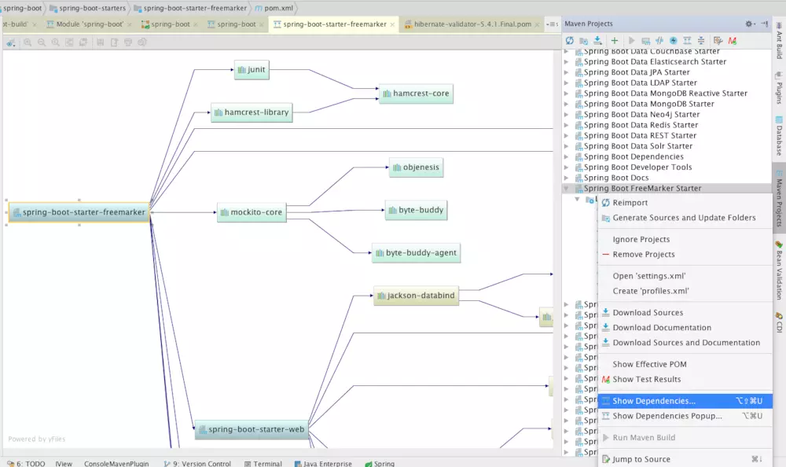
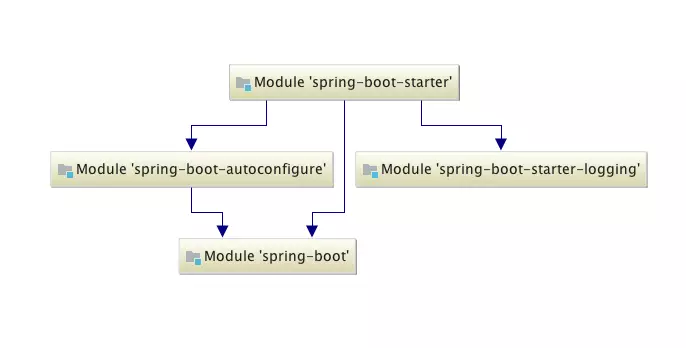
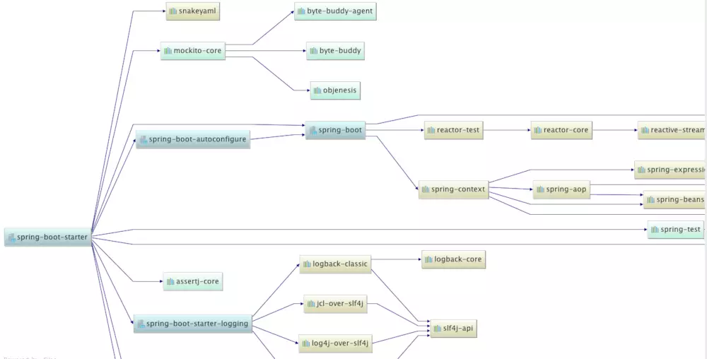
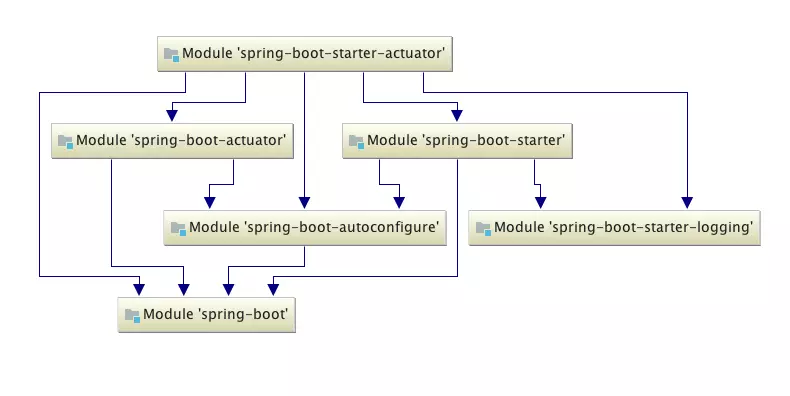
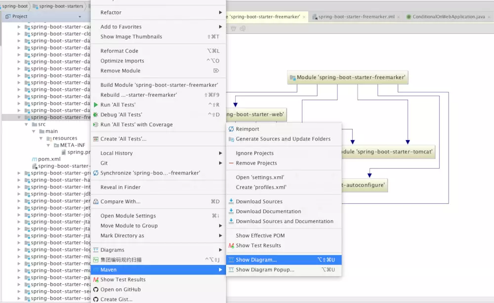
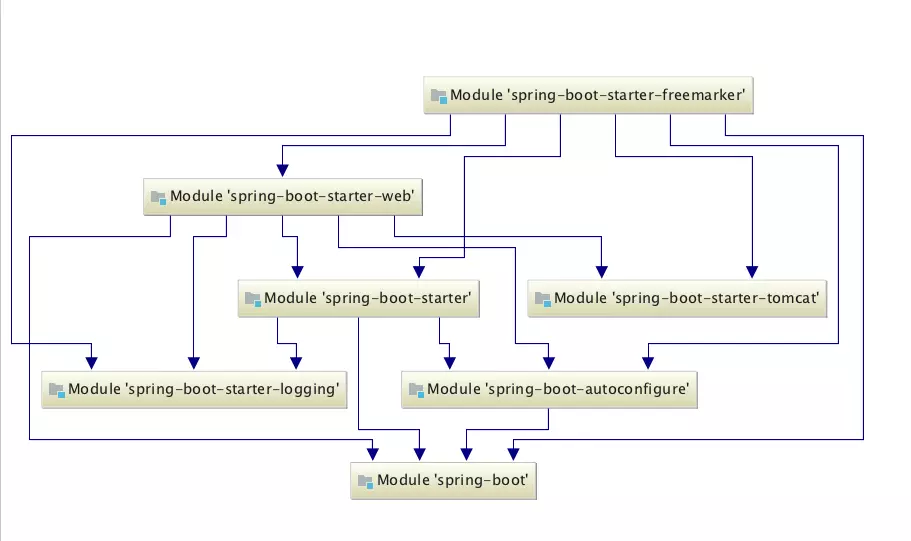
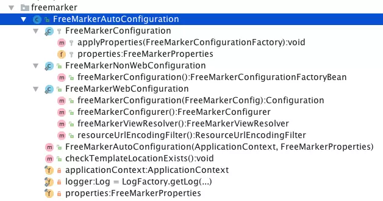
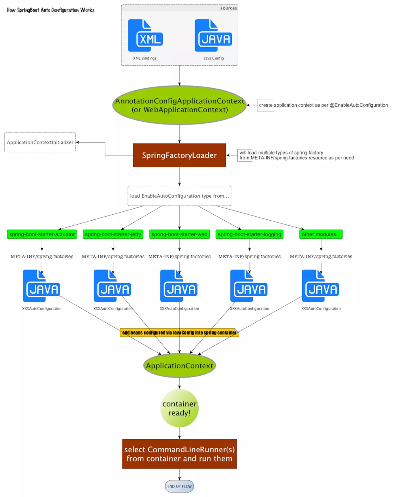

[TOC]


# springboot 自动配置原理 spring.factories和spring.provides

## 5.1 SpringBoot的核心组件模块

首先，我们来简单统计一下SpringBoot核心工程的源码java文件数量：

我们cd到spring-boot-autoconfigure工程根目录下。执行

```
$ tree | grep -c .java$
```

| 模块                      | java文件数 |
| ------------------------- | ---------- |
| spring-boot               | 551        |
| spring-boot-actuator      | 423        |
| spring-boot-autoconfigure | 783        |
| spring-boot-devtools      | 169        |
| spring-boot-cli           | 180        |
| spring-boot-tools         | 355        |

我们可以看到有783个java文件。spring-boot核心工程有551个java文件。从上面的java文件数量大致可以看出，SpringBoot技术框架的核心组成部分：

```
spring-boot-autoconfigure
spring-boot
spring-boot-tools
```

我们把SpringBoot源码导入IntelliJ IDEA，查看artifact的全部依赖关系。

IDEA有个Maven Projects窗口，一般在右侧能够找到，如果没有可以从菜单栏打开：View>Tool Windows>Maven Projects;

选择要分析的maven module(idea的module相当于eclipse的project),右击show dependencies,会出来该module的全部依赖关系图，非常清晰细致。

例如，spring-boot-starter-freemarker的依赖图分析如下：



在spring-boot-build 的pom中，我们可以看到：

```
           <modules>
                <module>spring-boot-dependencies</module>
                <module>spring-boot-parent</module>
                <module>spring-boot-tools</module>
                <module>spring-boot</module>
                <module>spring-boot-test</module>
                <module>spring-boot-autoconfigure</module>
                <module>spring-boot-test-autoconfigure</module>
                <module>spring-boot-actuator</module>
                <module>spring-boot-devtools</module>
                <module>spring-boot-docs</module>
                <module>spring-boot-starters</module>
                <module>spring-boot-actuator-docs</module>
                <module>spring-boot-cli</module>
            </modules>
```

其中，在spring-boot-dependencies中，SpringBoot项目维护了一份庞大依赖。这些依赖的版本都是经过实践，测试通过，不会发生依赖冲突的。就这样一个事情，就大大减少了Spring开发过程中，出现jar包冲突的概率。spring-boot-parent依赖spring-boot-dependencies。

下面我们简要介绍一下SpringBoot子modules。

#### spring-boot

SpringBoot核心工程。

#### spring-boot-starters

是SpringBoot的启动服务工程。

#### spring-boot-autoconfigure

是SpringBoot实现自动配置的核心工程。

#### spring-boot-actuator

提供SpringBoot应用的外围支撑性功能。 比如：

- Endpoints，SpringBoot应用状态监控管理
- HealthIndicator，SpringBoot应用健康指示表
- 提供metrics支持
- 提供远程shell支持

#### spring-boot-tools

提供了SpringBoot开发者的常用工具集。诸如，spring-boot-gradle-plugin，spring-boot-maven-plugin就是这个工程里面的。

#### spring-boot-cli

是Spring Boot命令行交互工具，可用于使用Spring进行快速原型搭建。你可以用它直接运行Groovy脚本。如果你不喜欢Maven或Gradle，Spring提供了CLI（Command Line Interface）来开发运行Spring应用程序。你可以使用它来运行Groovy脚本，甚至编写自定义命令。

## 5.2 SpringBoot Starters

Spring boot中的starter概念是非常重要的机制，能够抛弃以前繁杂的配置，统一集成进starter，应用者只需要引入starter jar包，spring boot就能自动扫描到要加载的信息。

starter让我们摆脱了各种依赖库的处理，需要配置各种信息的困扰。Spring Boot会自动通过classpath路径下的类发现需要的Bean，并织入bean。

例如，如果你想使用Spring和用JPA访问数据库，你只要依赖 spring-boot-starter-data-jpa 即可。

目前，github上spring-boot项目的最新的starter列表[spring-boot/spring-boot-starters](https://link.jianshu.com/?t=https://github.com/spring-projects/spring-boot/tree/master/spring-boot-starters)如下：

```
spring-boot-starter
spring-boot-starter-activemq
spring-boot-starter-actuator
spring-boot-starter-amqp
spring-boot-starter-aop
spring-boot-starter-artemis
spring-boot-starter-batch
spring-boot-starter-cache
spring-boot-starter-cloud-connectors
spring-boot-starter-data-cassandra
spring-boot-starter-data-couchbase
spring-boot-starter-data-elasticsearch
spring-boot-starter-data-jpa
spring-boot-starter-data-ldap
spring-boot-starter-data-mongodb
spring-boot-starter-data-mongodb-reactive
spring-boot-starter-data-neo4j
spring-boot-starter-data-redis
spring-boot-starter-data-rest
spring-boot-starter-data-solr
spring-boot-starter-freemarker
spring-boot-starter-groovy-templates
spring-boot-starter-hateoas
spring-boot-starter-integration
spring-boot-starter-jdbc
spring-boot-starter-jersey
spring-boot-starter-jetty
spring-boot-starter-jooq
spring-boot-starter-jta-atomikos
spring-boot-starter-jta-bitronix
spring-boot-starter-jta-narayana
spring-boot-starter-log4j2
spring-boot-starter-logging
spring-boot-starter-mail
spring-boot-starter-mobile
spring-boot-starter-mustache
spring-boot-starter-parent
spring-boot-starter-reactor-netty
spring-boot-starter-security
spring-boot-starter-social-facebook
spring-boot-starter-social-linkedin
spring-boot-starter-social-twitter
spring-boot-starter-test
spring-boot-starter-thymeleaf
spring-boot-starter-tomcat
spring-boot-starter-undertow
spring-boot-starter-validation
spring-boot-starter-web
spring-boot-starter-web-services
spring-boot-starter-webflux
spring-boot-starter-websocket
```

(源代码目录执行shell：l|awk '{print \$9}'， l|awk '{print $9}'|grep -c 'starter')

共52个。每个starter工程里面的pom描述有相应的介绍。具体的说明，参考官网文档[1]。关于这些starters的使用例子，可以参考[spring-boot/spring-boot-samples](https://link.jianshu.com/?t=https://github.com/spring-projects/spring-boot/tree/master/spring-boot-samples)

比如说，spring-boot-starter是：

> Core starter, including auto-configuration support, logging and YAML

这是Spring Boot的核心启动器，包含了自动配置、日志和YAML。它的项目依赖图如下：







可以看出，这些starter只是配置，真正做自动化配置的代码的是在spring-boot-autoconfigure里面。同时spring-boot-autoconfigure依赖spring-boot工程，这个spring-boot工程是SpringBoot的核心。

SpringBoot会基于你的classpath中的jar包，试图猜测和配置您可能需要的bean。

例如，如果你的classpath中有tomcat-embedded.jar，你可能会想要一个TomcatEmbeddedServletContainerFactory Bean (SpringBoot通过获取EmbeddedServletContainerFactory来启动对应的web服务器。常用的两个实现类是TomcatEmbeddedServletContainerFactory和JettyEmbeddedServletContainerFactory)。

其他的所有基于Spring Boot的starter都依赖这个spring-boot-starter。比如说spring-boot-starter-actuator的依赖树，如下图：



## 5.3 @EnableAutoConfiguration自动配置原理

通过@EnableAutoConfiguration启用Spring应用程序上下文的自动配置，这个注解会导入一个EnableAutoConfigurationImportSelector的类,而这个类会去读取一个spring.factories下key为EnableAutoConfiguration对应的全限定名的值。

这个spring.factories里面配置的那些类，主要作用是告诉Spring Boot这个stareter所需要加载的那些xxxAutoConfiguration类，也就是你真正的要自动注册的那些bean或功能。然后，我们实现一个spring.factories指定的类，标上@Configuration注解，一个starter就定义完了。

如果想从自己的starter中读取应用的starter工程的配置，只需要在入口类上加上如下注解即可：

```
@EnableConfigurationProperties(MyProperties.class)
```

### 读取spring.factories文件的实现

是通过org.springframework.core.io.support.SpringFactoriesLoader实现。

SpringFactoriesLoader的实现类似于SPI（Service Provider Interface，在java.util.ServiceLoader的文档里有比较详细的介绍。java SPI提供一种服务发现机制，为某个接口寻找服务实现的机制。有点类似IOC的思想，就是将装配的控制权移到程序之外，在模块化设计中这个机制尤其重要[3]）。

SpringFactoriesLoader会加载classpath下所有JAR文件里面的META-INF/spring.factories文件。

其中加载spring.factories文件的代码在loadFactoryNames方法里:

```java
public static final String FACTORIES_RESOURCE_LOCATION = "META-INF/spring.factories";

....

    public static List<String> loadFactoryNames(Class<?> factoryClass, ClassLoader classLoader) {
        String factoryClassName = factoryClass.getName();
        try {
            Enumeration<URL> urls = (classLoader != null ? classLoader.getResources(FACTORIES_RESOURCE_LOCATION) :
                    ClassLoader.getSystemResources(FACTORIES_RESOURCE_LOCATION));
            List<String> result = new ArrayList<>();
            while (urls.hasMoreElements()) {
                URL url = urls.nextElement();
                Properties properties = PropertiesLoaderUtils.loadProperties(new UrlResource(url));
                String factoryClassNames = properties.getProperty(factoryClassName);
                result.addAll(Arrays.asList(StringUtils.commaDelimitedListToStringArray(factoryClassNames)));
            }
            return result;
        }
        catch (IOException ex) {
            throw new IllegalArgumentException("Unable to load [" + factoryClass.getName() +
                    "] factories from location [" + FACTORIES_RESOURCE_LOCATION + "]", ex);
        }
    }
```

通过org.springframework.boot.autoconfigure.AutoConfigurationImportSelector里面的getCandidateConfigurations方法，获取到候选类的名字List<String>。该方法代码如下：

```
    protected List<String> getCandidateConfigurations(AnnotationMetadata metadata,
            AnnotationAttributes attributes) {
        List<String> configurations = SpringFactoriesLoader.loadFactoryNames(
                getSpringFactoriesLoaderFactoryClass(), getBeanClassLoader());
        Assert.notEmpty(configurations,
                "No auto configuration classes found in META-INF/spring.factories. If you "
                        + "are using a custom packaging, make sure that file is correct.");
        return configurations;
    }
```

其中，getSpringFactoriesLoaderFactoryClass()方法直接返回的是EnableAutoConfiguration.class, 代码如下：

```
    protected Class<?> getSpringFactoriesLoaderFactoryClass() {
        return EnableAutoConfiguration.class;
    }
```

所以，getCandidateConfigurations方法里面的这段代码：

```
List<String> configurations = SpringFactoriesLoader.loadFactoryNames(
                getSpringFactoriesLoaderFactoryClass(), getBeanClassLoader());
```

会过滤出key为org.springframework.boot.autoconfigure.EnableAutoConfiguration的全限定名对应的值。全限定名都使用如下命名方法：

```
包名.外部类名
包名.外部类名$内部类名

e.g:

org.springframework.boot.autoconfigure.context.PropertyPlaceholderAutoConfiguration
```

SpringBoot中的META-INF/spring.factories（完整路径：spring-boot/spring-boot-autoconfigure/src/main/resources/META-INF/spring.factories）中关于EnableAutoConfiguration的这段配置如下：

```
# Auto Configure
org.springframework.boot.autoconfigure.EnableAutoConfiguration=\
org.springframework.boot.autoconfigure.admin.SpringApplicationAdminJmxAutoConfiguration,\
org.springframework.boot.autoconfigure.aop.AopAutoConfiguration,\
org.springframework.boot.autoconfigure.amqp.RabbitAutoConfiguration,\
org.springframework.boot.autoconfigure.batch.BatchAutoConfiguration,\
org.springframework.boot.autoconfigure.cache.CacheAutoConfiguration,\
org.springframework.boot.autoconfigure.cassandra.CassandraAutoConfiguration,\
org.springframework.boot.autoconfigure.cloud.CloudAutoConfiguration,\
org.springframework.boot.autoconfigure.context.ConfigurationPropertiesAutoConfiguration,\
org.springframework.boot.autoconfigure.context.MessageSourceAutoConfiguration,\
org.springframework.boot.autoconfigure.context.PropertyPlaceholderAutoConfiguration,\
org.springframework.boot.autoconfigure.couchbase.CouchbaseAutoConfiguration,\
org.springframework.boot.autoconfigure.dao.PersistenceExceptionTranslationAutoConfiguration,\
org.springframework.boot.autoconfigure.data.cassandra.CassandraDataAutoConfiguration,\
org.springframework.boot.autoconfigure.data.cassandra.CassandraRepositoriesAutoConfiguration,\
org.springframework.boot.autoconfigure.data.couchbase.CouchbaseDataAutoConfiguration,\
org.springframework.boot.autoconfigure.data.couchbase.CouchbaseRepositoriesAutoConfiguration,\
org.springframework.boot.autoconfigure.data.elasticsearch.ElasticsearchAutoConfiguration,\
org.springframework.boot.autoconfigure.data.elasticsearch.ElasticsearchDataAutoConfiguration,\
org.springframework.boot.autoconfigure.data.elasticsearch.ElasticsearchRepositoriesAutoConfiguration,\
org.springframework.boot.autoconfigure.data.jpa.JpaRepositoriesAutoConfiguration,\
org.springframework.boot.autoconfigure.data.ldap.LdapDataAutoConfiguration,\
org.springframework.boot.autoconfigure.data.ldap.LdapRepositoriesAutoConfiguration,\
org.springframework.boot.autoconfigure.data.mongo.MongoDataAutoConfiguration,\
org.springframework.boot.autoconfigure.data.mongo.MongoRepositoriesAutoConfiguration,\
org.springframework.boot.autoconfigure.data.mongo.ReactiveMongoDataAutoConfiguration,\
org.springframework.boot.autoconfigure.data.mongo.ReactiveMongoRepositoriesAutoConfiguration,\
org.springframework.boot.autoconfigure.data.neo4j.Neo4jDataAutoConfiguration,\
org.springframework.boot.autoconfigure.data.neo4j.Neo4jRepositoriesAutoConfiguration,\
org.springframework.boot.autoconfigure.data.solr.SolrRepositoriesAutoConfiguration,\
org.springframework.boot.autoconfigure.data.redis.RedisAutoConfiguration,\
org.springframework.boot.autoconfigure.data.redis.RedisRepositoriesAutoConfiguration,\
org.springframework.boot.autoconfigure.data.rest.RepositoryRestMvcAutoConfiguration,\
org.springframework.boot.autoconfigure.data.web.SpringDataWebAutoConfiguration,\
org.springframework.boot.autoconfigure.elasticsearch.jest.JestAutoConfiguration,\
org.springframework.boot.autoconfigure.flyway.FlywayAutoConfiguration,\
org.springframework.boot.autoconfigure.freemarker.FreeMarkerAutoConfiguration,\
org.springframework.boot.autoconfigure.gson.GsonAutoConfiguration,\
org.springframework.boot.autoconfigure.h2.H2ConsoleAutoConfiguration,\
org.springframework.boot.autoconfigure.hateoas.HypermediaAutoConfiguration,\
org.springframework.boot.autoconfigure.hazelcast.HazelcastAutoConfiguration,\
org.springframework.boot.autoconfigure.hazelcast.HazelcastJpaDependencyAutoConfiguration,\
org.springframework.boot.autoconfigure.http.HttpMessageConvertersAutoConfiguration,\
org.springframework.boot.autoconfigure.info.ProjectInfoAutoConfiguration,\
org.springframework.boot.autoconfigure.integration.IntegrationAutoConfiguration,\
org.springframework.boot.autoconfigure.jackson.JacksonAutoConfiguration,\
org.springframework.boot.autoconfigure.jdbc.DataSourceAutoConfiguration,\
org.springframework.boot.autoconfigure.jdbc.JdbcTemplateAutoConfiguration,\
org.springframework.boot.autoconfigure.jdbc.JndiDataSourceAutoConfiguration,\
org.springframework.boot.autoconfigure.jdbc.XADataSourceAutoConfiguration,\
org.springframework.boot.autoconfigure.jdbc.DataSourceTransactionManagerAutoConfiguration,\
org.springframework.boot.autoconfigure.jms.JmsAutoConfiguration,\
org.springframework.boot.autoconfigure.jmx.JmxAutoConfiguration,\
org.springframework.boot.autoconfigure.jms.JndiConnectionFactoryAutoConfiguration,\
org.springframework.boot.autoconfigure.jms.activemq.ActiveMQAutoConfiguration,\
org.springframework.boot.autoconfigure.jms.artemis.ArtemisAutoConfiguration,\
org.springframework.boot.autoconfigure.groovy.template.GroovyTemplateAutoConfiguration,\
org.springframework.boot.autoconfigure.jersey.JerseyAutoConfiguration,\
org.springframework.boot.autoconfigure.jooq.JooqAutoConfiguration,\
org.springframework.boot.autoconfigure.kafka.KafkaAutoConfiguration,\
org.springframework.boot.autoconfigure.ldap.embedded.EmbeddedLdapAutoConfiguration,\
org.springframework.boot.autoconfigure.ldap.LdapAutoConfiguration,\
org.springframework.boot.autoconfigure.liquibase.LiquibaseAutoConfiguration,\
org.springframework.boot.autoconfigure.mail.MailSenderAutoConfiguration,\
org.springframework.boot.autoconfigure.mail.MailSenderValidatorAutoConfiguration,\
org.springframework.boot.autoconfigure.mobile.DeviceResolverAutoConfiguration,\
org.springframework.boot.autoconfigure.mobile.DeviceDelegatingViewResolverAutoConfiguration,\
org.springframework.boot.autoconfigure.mobile.SitePreferenceAutoConfiguration,\
org.springframework.boot.autoconfigure.mongo.embedded.EmbeddedMongoAutoConfiguration,\
org.springframework.boot.autoconfigure.mongo.MongoAutoConfiguration,\
org.springframework.boot.autoconfigure.mongo.ReactiveMongoAutoConfiguration,\
org.springframework.boot.autoconfigure.mustache.MustacheAutoConfiguration,\
org.springframework.boot.autoconfigure.orm.jpa.HibernateJpaAutoConfiguration,\
org.springframework.boot.autoconfigure.reactor.core.ReactorCoreAutoConfiguration,\
org.springframework.boot.autoconfigure.security.SecurityAutoConfiguration,\
org.springframework.boot.autoconfigure.security.SecurityFilterAutoConfiguration,\
org.springframework.boot.autoconfigure.security.FallbackWebSecurityAutoConfiguration,\
org.springframework.boot.autoconfigure.security.oauth2.OAuth2AutoConfiguration,\
org.springframework.boot.autoconfigure.sendgrid.SendGridAutoConfiguration,\
org.springframework.boot.autoconfigure.session.SessionAutoConfiguration,\
org.springframework.boot.autoconfigure.social.SocialWebAutoConfiguration,\
org.springframework.boot.autoconfigure.social.FacebookAutoConfiguration,\
org.springframework.boot.autoconfigure.social.LinkedInAutoConfiguration,\
org.springframework.boot.autoconfigure.social.TwitterAutoConfiguration,\
org.springframework.boot.autoconfigure.solr.SolrAutoConfiguration,\
org.springframework.boot.autoconfigure.thymeleaf.ThymeleafAutoConfiguration,\
org.springframework.boot.autoconfigure.transaction.TransactionAutoConfiguration,\
org.springframework.boot.autoconfigure.transaction.jta.JtaAutoConfiguration,\
org.springframework.boot.autoconfigure.validation.ValidationAutoConfiguration,\
org.springframework.boot.autoconfigure.web.client.RestTemplateAutoConfiguration,\
org.springframework.boot.autoconfigure.web.reactive.HttpHandlerAutoConfiguration,\
org.springframework.boot.autoconfigure.web.reactive.ReactiveWebServerAutoConfiguration,\
org.springframework.boot.autoconfigure.web.reactive.WebFluxAnnotationAutoConfiguration,\
org.springframework.boot.autoconfigure.web.servlet.DispatcherServletAutoConfiguration,\
org.springframework.boot.autoconfigure.web.servlet.ServletWebServerFactoryAutoConfiguration,\
org.springframework.boot.autoconfigure.web.servlet.error.ErrorMvcAutoConfiguration,\
org.springframework.boot.autoconfigure.web.servlet.HttpEncodingAutoConfiguration,\
org.springframework.boot.autoconfigure.web.servlet.MultipartAutoConfiguration,\
org.springframework.boot.autoconfigure.web.servlet.WebMvcAutoConfiguration,\
org.springframework.boot.autoconfigure.websocket.WebSocketAutoConfiguration,\
org.springframework.boot.autoconfigure.websocket.WebSocketMessagingAutoConfiguration,\
org.springframework.boot.autoconfigure.webservices.WebServicesAutoConfiguration
```

当然了，这些AutoConfiguration不是所有都会加载的，会根据AutoConfiguration上的@ConditionalOnClass等条件，再进一步判断是否加载。我们下文通过FreeMarkerAutoConfiguration实例来分析整个自动配置的过程。

## 5.4 FreeMarkerAutoConfiguration自动配置的实例分析

我们首先看spring-boot-starter-freemarker工程，目录结构如下：

```
.
├── pom.xml
├── spring-boot-starter-freemarker.iml
└── src
    └── main
        └── resources
            └── META-INF
                └── spring.provides

4 directories, 3 files
```

我们可以看出，这个工程没有任何Java代码，只有两个文件：pom.xml跟spring.provides。starter本身在你的应用程序中实际上是空的。

其中，
spring.provides文件

```
provides: freemarker,spring-context-support
```

主要是给这个starter起个好区分的名字。

Spring Boot 通过starter对项目的依赖进行统一管理. starter利用了maven的传递依赖解析机制,把常用库聚合在一起, 组成了针对特定功能而定制的依赖starter。

我们可以使用IDEA提供的maven依赖图分析的功能（如下图），得到spring-boot-starter-freemarker依赖的module。



IDEA提供的maven依赖图分析



spring-boot-starter-freemarker依赖的module

从上面的依赖图，我们可以清晰看出其间依赖关系。

当Spring Boot Application中自动配置EnableAutoConfiguration的相关类执行完毕之后，Spring Boot会进一步解析对应类的配置信息。如果我们配置了spring-boot-starter-freemarker ，maven就会通过这个starter所依赖的spring-boot-autoconfigure，自动传递到spring-boot-autoconfigure工程中。

我们来简单分析一下spring-boot-autoconfigure工程的架构。

其中，FreeMarker的自动配置类是org.springframework.boot.autoconfigure.freemarker.FreeMarkerAutoConfiguration。

下面我们来简要分析一下FreeMarkerAutoConfiguration这个类。

在FreeMarkerAutoConfiguration类上面有四行注解：

```java
@Configuration
@ConditionalOnClass({ freemarker.template.Configuration.class,
        FreeMarkerConfigurationFactory.class })
@AutoConfigureAfter(WebMvcAutoConfiguration.class)
@EnableConfigurationProperties(FreeMarkerProperties.class)
public class FreeMarkerAutoConfiguration {
    ...
}
```

其中，
（1）@Configuration，是org.springframework.context.annotation包里面的注解。这么说吧，用@Configuration注解该类，等价 与XML中配置beans；用@Bean标注方法等价于XML中配置bean。

（2）@ConditionalOnClass，org.springframework.boot.autoconfigure.condition包里面的注解。意思是当类路径下有指定的类的条件下，才会去注册被标注的类为一个bean。在上面的代码中的意思就是，当类路径中有freemarker.template.Configuration.class,FreeMarkerConfigurationFactory.class两个类的时候，才会实例化FreeMarkerAutoConfiguration这个Bean。

（3）@AutoConfigureAfter，org.springframework.boot.autoconfigure包里面的注解。这个通过注解的名字意思就可以知道，当WebMvcAutoConfiguration.class这个类实例化完毕，才能实例化FreeMarkerAutoConfiguration（有个先后顺序）。SpringBoot使用@ AutoConfigureBefore、@AutoConfigureAfter注解来定义这些配置类的载入顺序。

（4）@EnableConfigurationProperties，表示启动对FreeMarkerProperties.class的内嵌配置支持，自动将FreeMarkerProperties注册为一个bean。这个FreeMarkerProperties类里面就是关于FreeMarker属性的配置：

```java
@ConfigurationProperties(prefix = "spring.freemarker")
public class FreeMarkerProperties extends AbstractTemplateViewResolverProperties {

    public static final String DEFAULT_TEMPLATE_LOADER_PATH = "classpath:/templates/";

    public static final String DEFAULT_PREFIX = "";

    public static final String DEFAULT_SUFFIX = ".ftl";

    /**
     * Well-known FreeMarker keys which will be passed to FreeMarker's Configuration.
     */
    private Map<String, String> settings = new HashMap<>();

    /**
     * Comma-separated list of template paths.
     */
    private String[] templateLoaderPath = new String[] { DEFAULT_TEMPLATE_LOADER_PATH };

    /**
     * Prefer file system access for template loading. File system access enables hot
     * detection of template changes.
     */
    private boolean preferFileSystemAccess = true;

    public FreeMarkerProperties() {
        super(DEFAULT_PREFIX, DEFAULT_SUFFIX);
    }

    public Map<String, String> getSettings() {
        return this.settings;
    }

    public void setSettings(Map<String, String> settings) {
        this.settings = settings;
    }

    public String[] getTemplateLoaderPath() {
        return this.templateLoaderPath;
    }

    public boolean isPreferFileSystemAccess() {
        return this.preferFileSystemAccess;
    }

    public void setPreferFileSystemAccess(boolean preferFileSystemAccess) {
        this.preferFileSystemAccess = preferFileSystemAccess;
    }

    public void setTemplateLoaderPath(String... templateLoaderPaths) {
        this.templateLoaderPath = templateLoaderPaths;
    }

}
```

综上，当（1）（2）两个条件满足时，才会继续（3）（4）的动作，同时注册FreeMarkerAutoConfiguration这个Bean。该类的结构如下图：



我们来看其内部类FreeMarkerWebConfiguration的代码：

```java
    @Configuration
    @ConditionalOnClass(Servlet.class)
    @ConditionalOnWebApplication(type = Type.SERVLET)
    public static class FreeMarkerWebConfiguration extends FreeMarkerConfiguration {

        @Bean
        @ConditionalOnMissingBean(FreeMarkerConfig.class)
        public FreeMarkerConfigurer freeMarkerConfigurer() {
            FreeMarkerConfigurer configurer = new FreeMarkerConfigurer();
            applyProperties(configurer);
            return configurer;
        }

        @Bean
        public freemarker.template.Configuration freeMarkerConfiguration(
                FreeMarkerConfig configurer) {
            return configurer.getConfiguration();
        }

        @Bean
        @ConditionalOnMissingBean(name = "freeMarkerViewResolver")
        @ConditionalOnProperty(name = "spring.freemarker.enabled", matchIfMissing = true)
        public FreeMarkerViewResolver freeMarkerViewResolver() {
            FreeMarkerViewResolver resolver = new FreeMarkerViewResolver();
            this.properties.applyToViewResolver(resolver);
            return resolver;
        }

        @Bean
        @ConditionalOnMissingBean
        @ConditionalOnEnabledResourceChain
        public ResourceUrlEncodingFilter resourceUrlEncodingFilter() {
            return new ResourceUrlEncodingFilter();
        }

    }
```

其中，
（1）@ConditionalOnWebApplication(type = Type.SERVLET)， 是当该应用是基于Servlet的Web应用时。

（2）@ConditionalOnMissingBean(name = "freeMarkerViewResolver")，是当Spring容器中不存在freeMarkerViewResolver的Bean时。

（3）@ConditionalOnProperty(name = "spring.freemarker.enabled", matchIfMissing = true)，指定的spring.freemarker.enabled属性是否有。如果没有（IfMissing），设为true。

当（1）（2）（3）三个条件都满足，则注册freeMarkerViewResolver这个Bean。

我们也可以自定义我们自己的my-starter，以及实现对应的@MyEnableAutoConfiguration。SpringBoot有很多第三方starter，其自动配置的原理基本都是这样，比如mybatis-spring-boot-starter的MybatisAutoConfiguration，阅读源码[https://github.com/mybatis/spring-boot-starter[4\]](https://link.jianshu.com/?t=https://github.com/mybatis/spring-boot-starter)。

上面文字描述了这么多，再用一张形象生动的图来说明[5]：



SpringBoot Autoconfigure 工作原理图

## 5.5 spring.factories与定义应用程序的初始化行为

上面说了这么多，讲的都是读取properties文件中key为org.springframework.boot.autoconfigure.EnableAutoConfiguration的全限定名对应的值。SpringBoot内部还有许多其他的key用于过滤得到需要加载的类。

```properties
# Initializers
org.springframework.context.ApplicationContextInitializer=\
org.springframework.boot.autoconfigure.SharedMetadataReaderFactoryContextInitializer,\
org.springframework.boot.autoconfigure.logging.AutoConfigurationReportLoggingInitializer

# Application Listeners
org.springframework.context.ApplicationListener=\
org.springframework.boot.autoconfigure.BackgroundPreinitializer

# Auto Configuration Import Listeners
org.springframework.boot.autoconfigure.AutoConfigurationImportListener=\
org.springframework.boot.autoconfigure.condition.ConditionEvaluationReportAutoConfigurationImportListener

# Auto Configuration Import Filters
org.springframework.boot.autoconfigure.AutoConfigurationImportFilter=\
org.springframework.boot.autoconfigure.condition.OnClassCondition

# Failure analyzers
org.springframework.boot.diagnostics.FailureAnalyzer=\
org.springframework.boot.autoconfigure.diagnostics.analyzer.NoSuchBeanDefinitionFailureAnalyzer,\
org.springframework.boot.autoconfigure.jdbc.DataSourceBeanCreationFailureAnalyzer,\
org.springframework.boot.autoconfigure.jdbc.HikariDriverConfigurationFailureAnalyzer

# Template availability providers
org.springframework.boot.autoconfigure.template.TemplateAvailabilityProvider=\
org.springframework.boot.autoconfigure.freemarker.FreeMarkerTemplateAvailabilityProvider,\
org.springframework.boot.autoconfigure.mustache.MustacheTemplateAvailabilityProvider,\
org.springframework.boot.autoconfigure.groovy.template.GroovyTemplateAvailabilityProvider,\
org.springframework.boot.autoconfigure.thymeleaf.ThymeleafTemplateAvailabilityProvider,\
org.springframework.boot.autoconfigure.web.servlet.JspTemplateAvailabilityProvider
```

这些key仍然是定义在spring-boot/spring-boot-autoconfigure/src/main/resources/META-INF/spring.factories文件中。

还有对应的用于测试的自动配置，在
spring-boot/spring-boot-test-autoconfigure/src/main/resources/META-INF/spring.factories文件中定义。

另外，我们使用spring.factories里还可以定制应用程序的初始化行为。这样我们就可以在应用程序载入前操纵Spring的应用程序上下文ApplicationContext。

例如，可以使用ConfigurableApplicationContext类的addApplicationListener()方法，在应用上下文ApplicationContext中创建监听器。

自动配置运行日志报告功能就是这么实现的。我们来看在spring.factories中，Initializers一段的配置：

```properties
# Initializers
org.springframework.context.ApplicationContextInitializer=\
org.springframework.boot.autoconfigure.SharedMetadataReaderFactoryContextInitializer,\
org.springframework.boot.autoconfigure.logging.AutoConfigurationReportLoggingInitializer
```

其中，AutoConfigurationReportLoggingInitializer监听到系统事件时，比如上下文刷新ContextRefreshedEvent或应用程序启动故障ApplicationFailedEvent之类的事件，Spring Boot可以做一些事情。这里说的代码在AutoConfigurationReportLoggingInitializer.AutoConfigurationReportListener里面。关于支持的事件类型supportsEventType的如下：

```
    private class AutoConfigurationReportListener implements GenericApplicationListener {

...
        @Override
        public boolean supportsEventType(ResolvableType resolvableType) {
            Class<?> type = resolvableType.getRawClass();
            if (type == null) {
                return false;
            }
            return ContextRefreshedEvent.class.isAssignableFrom(type)
                    || ApplicationFailedEvent.class.isAssignableFrom(type);
        }

        @Override
        public boolean supportsSourceType(Class<?> sourceType) {
            return true;
        }

        @Override
        public void onApplicationEvent(ApplicationEvent event) {
    AutoConfigurationReportLoggingInitializer.this.onApplicationEvent(event);
        }

    }
```

要以调试模式启动应用程序，可以使用-Ddebug标识，或者在application.properties文件这添加属性debug= true。这样，当我们以调试模式启动应用程序时，SpringBoot就可以帮助我们创建自动配置的运行报告。对于每个自动配置，通过报告我们可以看到它启动或失败的原因。 这个报告内容格式大致如下：

```
=========================
AUTO-CONFIGURATION REPORT
=========================


Positive matches:
-----------------

   DataSourceAutoConfiguration matched:
      - @ConditionalOnClass found required classes 'javax.sql.DataSource', 'org.springframework.jdbc.datasource.embedded.EmbeddedDatabaseType'; @ConditionalOnMissingClass did not find unwanted class (OnClassCondition)

   DataSourceAutoConfiguration#dataSourceInitializer matched:
      - @ConditionalOnMissingBean (types: org.springframework.boot.autoconfigure.jdbc.DataSourceInitializer; SearchStrategy: all) did not find any beans (OnBeanCondition)

   DataSourceAutoConfiguration.PooledDataSourceConfiguration matched:
      - AnyNestedCondition 2 matched 0 did not; NestedCondition on DataSourceAutoConfiguration.PooledDataSourceCondition.PooledDataSourceAvailable PooledDataSource found supported DataSource; NestedCondition on DataSourceAutoConfiguration.PooledDataSourceCondition.ExplicitType @ConditionalOnProperty (spring.datasource.type) matched (DataSourceAutoConfiguration.PooledDataSourceCondition)
      - @ConditionalOnMissingBean (types: javax.sql.DataSource,javax.sql.XADataSource; SearchStrategy: all) did not find any beans (OnBeanCondition)

   ...

Exclusions:
-----------

    None


Unconditional classes:
----------------------

    org.springframework.boot.autoconfigure.web.WebClientAutoConfiguration

    org.springframework.boot.autoconfigure.context.PropertyPlaceholderAutoConfiguration

    org.springframework.boot.autoconfigure.context.ConfigurationPropertiesAutoConfiguration

    org.springframework.boot.autoconfigure.info.ProjectInfoAutoConfiguration
```

除了SpringBoot官方提供的starter外，还有社区贡献的很多常用的第三方starter，列表可参考[2]。

另外，国内很多公司使用RPC框架dubbo，关于SpringBoot集成dubbo，可参考：[https://github.com/linux-china/spring-boot-dubbo](https://link.jianshu.com/?t=https://github.com/linux-china/spring-boot-dubbo)。

参考资料：

1.[http://docs.spring.io/spring-boot/docs/current/reference/htmlsingle/#using-boot-starter](https://link.jianshu.com/?t=http://docs.spring.io/spring-boot/docs/current/reference/htmlsingle/#using-boot-starter)
2.[https://github.com/spring-projects/spring-boot/tree/master/spring-boot-starters](https://link.jianshu.com/?t=https://github.com/spring-projects/spring-boot/tree/master/spring-boot-starters)
3.[http://www.cnblogs.com/javaee6/p/3714719.html](https://link.jianshu.com/?t=http://www.cnblogs.com/javaee6/p/3714719.html)
4.[https://github.com/mybatis/spring-boot-starter](https://link.jianshu.com/?t=https://github.com/mybatis/spring-boot-starter)
5.[https://afoo.me/posts/2015-07-09-how-spring-boot-works.html](https://link.jianshu.com/?t=https://afoo.me/posts/2015-07-09-how-spring-boot-works.html)


https://www.jianshu.com/p/346cac67bfcc