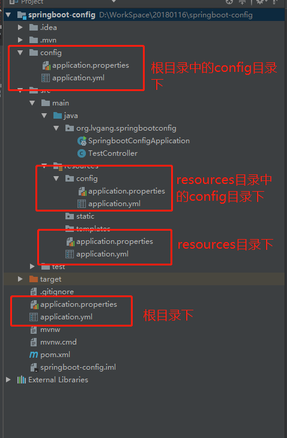

[TOC]

# springboot 配置文件存放位置及读取顺序

SpringBoot配置文件可以使用yml格式和properties格式

分别的默认命名为：application.yml、application.properties

## 存放目录

SpringBoot配置文件默认可以放到以下目录中，可以自动读取到：

- 项目根目录下
- 项目根目录中config目录下
- 项目的resources目录下
- 项目resources目录中config目录下

 

## 读取顺序

​     如果在不同的目录中存在多个配置文件，它的读取顺序是：

​        1、config/application.properties（项目根目录中config目录下）

​        2、config/application.yml

​        3、application.properties（项目根目录下）

​        4、application.yml

​        5、resources/config/application.properties（项目resources目录中config目录下）

​        6、resources/config/application.yml

​        7、resources/application.properties（项目的resources目录下）

​        8、resources/application.yml

​    注：

​        1、如果同一个目录下，有application.yml也有application.properties，默认先读取application.properties。

​        2、如果同一个配置属性，在多个配置文件都配置了，默认使用第1个读取到的，后面读取的不覆盖前面读取到的。

​        3、创建SpringBoot项目时，一般的配置文件放置在“项目的resources目录下”

 

https://my.oschina.net/sdlvzg/blog/1612703