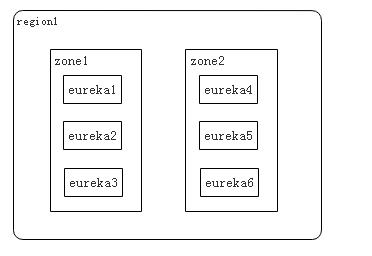

[TOC]

# Eureka简介及原理 服务发现框架

## 简介

Eureka是Netflix开发的服务发现框架，本身是一个基于REST的服务，主要用于定位运行在AWS域中的中间层服务，以达到负载均衡和中间层服务故障转移的目的。Spring Cloud将它集成在其子项目spring-cloud-netflix中，以实现Spring Cloud的服务发现功能。

Eureka 项目相当活跃，代码更新相当频繁，目前最新的版本是1.5.5。Eureka 2.0的版本也正在紧锣密鼓地开发中，2.0将会带来更好的扩展性，并且使用细粒度的订阅模型取代了基于拉取的模型，但是由于还没有Release，故而不作讲解。

## 原理

### Region、Zone解析

Eureka的官方文档对regin、zone几乎没有提及，由于概念抽象，新手很难理解。因此，在分析Eureka原理之前，我们先来了解一下region、zone、Eureka集群三者的关系，如图4-2。

图4-2 region、zone、Eureka集群之间的关系

region和zone（或者Availability Zone）均是AWS的概念。在非AWS环境下，我们可以简单地将region理解为Eureka集群，zone理解成机房。这样图4-2就很好理解了——一个Eureka集群被部署在了zone1机房和zone2机房中。

对region和zone感兴趣的读者可前往<http://blog.csdn.net/awschina/article/details/17639191> 扩展阅读。Spring Cloud中默认的region是`us-east-1` 。

### Eureka架构

图4-3 Eureka架构图

图4-3是来自Eureka官方的架构图，大致描述了Eureka集群的工作过程。图中包含的组件非常多，可能比较难以理解，我们用通俗易懂的语言解释一下：

- Application Service 相当于本书中的服务提供者，Application Client相当于本书中的服务消费者；
- Make Remote Call，可以简单理解为调用RESTful API；
- us-east-1c、us-east-1d等都是zone，它们都属于us-east-1这个region；

由图可知，Eureka包含两个组件：Eureka Server 和 Eureka Client，它们的作用如下：

- Eureka Client是一个Java客户端，用于简化与Eureka Server的交互；

- Eureka Server提供服务发现的能力，各个微服务启动时，会通过Eureka Client向Eureka Server进行注册自己的信息（例如网络信息），Eureka Server会存储该服务的信息；
- 微服务启动后，会周期性地向Eureka Server发送心跳（默认周期为30秒）以续约自己的信息。如果Eureka Server在一定时间内没有接收到某个微服务节点的心跳，Eureka Server将会注销该微服务节点（默认90秒）；
- 每个Eureka Server同时也是Eureka Client，多个Eureka Server之间通过复制的方式完成服务注册表的同步；
- Eureka Client会缓存Eureka Server中的信息。即使所有的Eureka Server节点都宕掉，服务消费者依然可以使用缓存中的信息找到服务提供者。

综上，Eureka通过心跳检测、健康检查和客户端缓存等机制，提高了系统的灵活性、可伸缩性和可用性。

http://www.itmuch.com/spring-cloud-1/