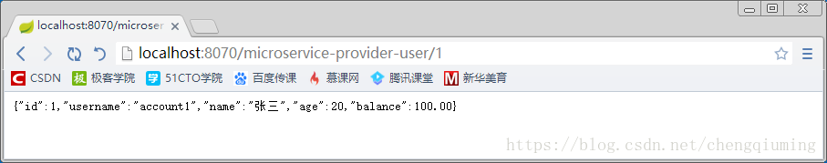

[TOC]


# 使用Sidecar整合非JVM微服务

## **一 介绍**

非JVM微服务可操作Eureka的REST端点，从而实现注册与发现。事实上，也可使用Sidecar更方便整合非JVM微服务。

Spring Cloud Netflix Sidecar的灵感来自Netflix Prana，它包括了一个简单的HTTP API来获取指定服务所有实例信息（例如主机和端口）。不仅如此，还可通过内嵌的Zuul来代理服务调用，该代理从Eureka Server中获取信息。非JVM微服务需要实现监控检查，以便Sidecar将它的状态上报该Eureka Server，健康检查的形式如下：

```
{
    "status":"UP"
}
```

其中，status用于描述微服务的状态，常见取值有：UP、DOWN、OUT_OF_SERVICE以及UNKNOWN等。

下面来使用Sidecar整合非JVM微服务。

## **二 实战**

1 新建项目microservice-sidecar，添加依赖

```
<dependencies>
    <dependency>
      <groupId>org.springframework.cloud</groupId>
      <artifactId>spring-cloud-starter-zuul</artifactId>
    </dependency>
    <dependency>
      <groupId>org.springframework.cloud</groupId>
      <artifactId>spring-cloud-starter-eureka</artifactId>
    </dependency>
    <dependency>
      <groupId>org.springframework.cloud</groupId>
      <artifactId>spring-cloud-netflix-sidecar</artifactId>
    </dependency>
  </dependencies>
```

2 在启动类上添加@EnableSidecar注解，声明这是一个Sidecar

```
package com.itmuch.cloud.study;
 
import org.springframework.boot.SpringApplication;
import org.springframework.boot.autoconfigure.SpringBootApplication;
import org.springframework.cloud.netflix.sidecar.EnableSidecar;
 
@SpringBootApplication
@EnableSidecar
public class SidecarApplication {
  public static void main(String[] args) {
    SpringApplication.run(SidecarApplication.class, args);
  }
}

```

@EnableSidecar是一个组合注解，它整合了三个注解，分别是：@EnableCircuitBreaker、@EnableDiscoveryClient、@EnableZuulProxy

3 修改配置文件

```
server:
  port: 8070
spring:
  application:
    name: microservice-sidecar-node-service
eureka:
  client:
    service-url:
      defaultZone:http://localhost:8761/eureka/
  instance:
    prefer-ip-address: true
sidecar:
  port: 8060                                      # Node.js微服务的端口
  health-uri:http://localhost:8060/health.json# Node.js微服务的健康检查URL

```

由配置可知，已经把Sidecar注册到Eureka Server上，并用sidecar.port属性指定了非JVM微服务所监听的端口，用sidecat.health-uri属性指定了非JVM微服务的健康检查URL。

## **三 测试**

1 启动eureka

2 启动用户微服务

3 启动node-service

4 启动sidecar微服务

5 访问<http://localhost:8070/microservice-provider-user/1>



因此，非JVM微服务可通过这种方式调用注册在Eureka Server上的JVM微服务。


https://blog.csdn.net/chengqiuming/article/details/80847556