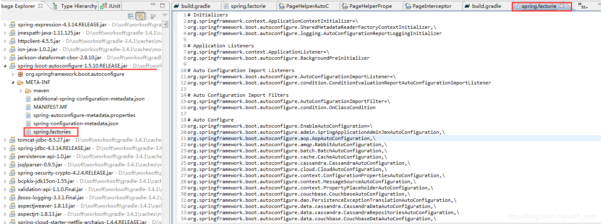

[TOC]


# spring @EnableXXX注解实现原理与实例

2019年01月24日 00:42:16 [博さん](https://me.csdn.net/w47_csdn) 阅读数 101

## 简介

Spring提供了一系列以Enable开头的注解，这些注解本质上是激活Spring的某些管理功能。例如@EnableWebMvc注解引入了MVC框架在Spring应用中需要用到的所有bean，@EnableAsync注解可以使Bean在spring应用中支持异步功能。

```java
@Target(ElementType.TYPE)
@Retention(RetentionPolicy.RUNTIME)
@Documented
@Import(AsyncConfigurationSelector.class)
public @interface EnableAsync { 
    ...
}
 
@Retention(RetentionPolicy.RUNTIME)
@Target(ElementType.TYPE)
@Documented
@Import(DelegatingWebMvcConfiguration.class)
public @interface EnableWebMvc {
}
```

不难发现，这些@Enable**注解的定义都包含一个@Import注解。@Import注解在4.2之前只支持导入配置类，在4.2以后@Import支持导入普通java类并将其声明成一个bean。这也说明@Enable**的实现，其实是导入了一些配置类。

> Ps：[@Import注解](https://my.oschina.net/u/1176977/blog/1982873)表示要导入的一个或多个配置类。提供与Spring XML中的<import />元素等效的功能。允许导入@Configuration类，ImportSelector和ImportBeanDefinitionRegistrar接口的实现，以及常规组件类。

## @Import注解导入配置方式的三种类型

### **第一类：直接导入配置类**

例如，@EnableScheduling中直接导入配置类SchedulingConfiguration，这个类注解了@Configuration，且注册了一个scheduledAnnotationProcessor的Bean，@EnableScheduling以及SchedulingConfiguration的源码如下：

```java
@Target({ElementType.TYPE})
@Retention(RetentionPolicy.RUNTIME)
@Import({SchedulingConfiguration.class})
@Documented
public @interface EnableScheduling {
 
}
 
@Configuration
@Role(BeanDefinition.ROLE_INFRASTRUCTURE)
public class SchedulingConfiguration {
 
	@Bean(name = TaskManagementConfigUtils.SCHEDULED_ANNOTATION_PROCESSOR_BEAN_NAME)
	@Role(BeanDefinition.ROLE_INFRASTRUCTURE)
	public ScheduledAnnotationBeanPostProcessor scheduledAnnotationProcessor() {
		return new ScheduledAnnotationBeanPostProcessor();
	}
 
}
```

 **举个栗子：**

定义一个简单的配置类SomeBeanConfiguration：

```java
@Configuration
public class SomeBeanConfiguration {
 
    @Bean
    public String Bean1() {
        return "Bean1";
    }
 
    @Bean
    public String Bean2() {
        return "Bean2";
    }
}
```

定义注解@EnableSomeBeans并导入上面的配置类：

```java
@Retention(RetentionPolicy.RUNTIME)
@Target(ElementType.TYPE)
@Import(SomeBeanConfiguration.class)
public @interface EnableSomeBeans {
    String value() default "";

}
```

把这个注解应用到Spring Bean，这时配置类SomeBeanConfiguration及其中定义的bean就会被引入到Spring容器：

```java
@Configuration
@EnableSomeBeans
public class SpringConfig {
    ...
}
```

### **第二类：根据条件选择配置类**

@Import导入ImportSelector的实现类时，Spring会把selectImport方法的返回值对应的Bean注入到Spring容器，这个方法的返回值必须是一个类的全限定类名的String数组。例如@EnableAsync注解的AsyncConfigurationSelector：

```java
@Target(ElementType.TYPE)
@Retention(RetentionPolicy.RUNTIME)
@Documented
@Import(AsyncConfigurationSelector.class)
public @interface EnableAsync {
 
    Class<? extends Annotation> annotation() default Annotation.class;
 
    boolean proxyTargetClass() default false;
 
    AdviceMode mode() default AdviceMode.PROXY;
 
    int order() default Ordered.LOWEST_PRECEDENCE;
}
```

AsyncConfigurationSelector的父类为AdviceModeImportSelector，父类实现了接口ImportSelector但是在重写的selectImports方法中并没有直接导入配置类而是交给子类重写的selectImports方法根据注解@EnableAsync的"mode"属性进行条件判断来选择需要导入的配置类。源码如下：

```java
public class AsyncConfigurationSelector extends AdviceModeImportSelector<EnableAsync> {
 
	private static final String ASYNC_EXECUTION_ASPECT_CONFIGURATION_CLASS_NAME =
			"org.springframework.scheduling.aspectj.AspectJAsyncConfiguration";
 
	/**
	 * Returns {@link ProxyAsyncConfiguration} or {@code AspectJAsyncConfiguration}
	 * for {@code PROXY} and {@code ASPECTJ} values of {@link EnableAsync#mode()},
	 * respectively.
	 */
	@Override
	@Nullable
	public String[] selectImports(AdviceMode adviceMode) {
		switch (adviceMode) {
			case PROXY:
				return new String[] {ProxyAsyncConfiguration.class.getName()};
			case ASPECTJ:
				return new String[] {ASYNC_EXECUTION_ASPECT_CONFIGURATION_CLASS_NAME};
			default:
				return null;
		}
	}
}
```

父类AdviceModeImportSelector实现了ImportSelector接口：

```java
public abstract class AdviceModeImportSelector<A extends Annotation> implements ImportSelector {
 
	public static final String DEFAULT_ADVICE_MODE_ATTRIBUTE_NAME = "mode";
 
	protected String getAdviceModeAttributeName() {
		return DEFAULT_ADVICE_MODE_ATTRIBUTE_NAME;
	}
 
	@Override
	public final String[] selectImports(AnnotationMetadata importingClassMetadata) {
		Class<?> annType = GenericTypeResolver.resolveTypeArgument(getClass(), AdviceModeImportSelector.class);
		Assert.state(annType != null, "Unresolvable type argument for AdviceModeImportSelector");
 
		AnnotationAttributes attributes = AnnotationConfigUtils.attributesFor(importingClassMetadata, annType);
		if (attributes == null) {
			throw new IllegalArgumentException(String.format(
					"@%s is not present on importing class '%s' as expected",
					annType.getSimpleName(), importingClassMetadata.getClassName()));
		}
 
		AdviceMode adviceMode = attributes.getEnum(getAdviceModeAttributeName());
		String[] imports = selectImports(adviceMode);
		if (imports == null) {
			throw new IllegalArgumentException("Unknown AdviceMode: " + adviceMode);
		}
		return imports;
	}
 
	@Nullable
	protected abstract String[] selectImports(AdviceMode adviceMode);
 
}
```

**举个栗子：**

定义注解@EnableSomeBeansSelector：

```java
@Retention(RetentionPolicy.RUNTIME)
@Target(ElementType.TYPE)
@Import(SomeBeanConfigurationSelector.class)
public @interface EnableSomeBeansSelector {
    String criteria() default "default";
}
```

上面的注解有一个叫criteria的属性，我想根据这个属性来激活不同的bean。这可以通过定义一个ImportSelector的实现类返回不同的配置来实现，样板代码如下：

```java
import org.springframework.context.annotation.ImportSelector;
import org.springframework.core.annotation.AnnotationAttributes;
import org.springframework.core.type.AnnotationMetadata;
 
public class SomeBeanConfigurationSelector implements ImportSelector {
    @Override
    public String[] selectImports(AnnotationMetadata importingClassMetadata) {
        AnnotationAttributes attributes =
                AnnotationAttributes.fromMap(
                        importingClassMetadata.getAnnotationAttributes(EnableSomeBeansSelector.class.getName(), false));
        String criteria = attributes.getString("criteria");
        if (criteria.equals("default")) {
            return new String[]{"enableannot.selector.SomeBeanConfigurationDefault"};
        }else {
            return new String[]{"enableannot.selector.SomeBeanConfigurationType1"};
        }
    }
}
 
@Configuration
class SomeBeanConfigurationType1 {
 
    @Bean
    public String Bean1() {
        return "Type1";
    }
}
 
@Configuration
class SomeBeanConfigurationDefault {
 
    @Bean
    public String Bean2() {
        return "Default";
    }
}
```

所以，如果criteria是default, SomeBeanConfigurationDefault被加入；反之，加入SomeBeanConfigurationType1。

```
@Configuration
@EnableSomeBeansSelector(criteria="other")
public class SpringConfig {
    ...
}
```

### **第三类：动态注册Bean**

@Import导入ImportBeanDefinitionRegistrar的实现类，通过重写方法registerBeanDefinitions()注入bean：

```java
public void registerBeanDefinitions(AnnotationMetadata importingClassMetadata,
        BeanDefinitionRegistry registry);
```

其中，AnnotationMetadata参数用来获得当前配置类上的注解，BeanDefinitionRegistry参数用来注册Bean。

以@EnableAspectJAutoProxy为例：

```
@Target(ElementType.TYPE)
@Retention(RetentionPolicy.RUNTIME)
@Documented
@Import(AspectJAutoProxyRegistrar.class)
public @interface EnableAspectJAutoProxy {
 
    boolean proxyTargetClass() default false;
 
    boolean exposeProxy() default false;
}
```

AspectJAutoProxyRegistrar实现了ImportBeanDefinitionRegistrar接口：

```java

class AspectJAutoProxyRegistrar implements ImportBeanDefinitionRegistrar {
 
    /**
     * Register, escalate, and configure the AspectJ auto proxy creator based on the value
     * of the @{@link EnableAspectJAutoProxy#proxyTargetClass()} attribute on the importing
     * {@code @Configuration} class.
     */
    @Override
    public void registerBeanDefinitions(
            AnnotationMetadata importingClassMetadata, BeanDefinitionRegistry registry) {
 
        AopConfigUtils.registerAspectJAnnotationAutoProxyCreatorIfNecessary(registry);
 
        AnnotationAttributes enableAspectJAutoProxy =
                AnnotationConfigUtils.attributesFor(importingClassMetadata, EnableAspectJAutoProxy.class);
        if (enableAspectJAutoProxy.getBoolean("proxyTargetClass")) {
            AopConfigUtils.forceAutoProxyCreatorToUseClassProxying(registry);
        }
        if (enableAspectJAutoProxy.getBoolean("exposeProxy")) {
            AopConfigUtils.forceAutoProxyCreatorToExposeProxy(registry);
        }
    }
 
}
```

**举个栗子：**

定义注解@EnableSomeBeansRegistrar：

```java
@Retention(RetentionPolicy.RUNTIME)
@Target(ElementType.TYPE)
@Import(SomeBeanConfigurationRegistrar.class)
public @interface EnableSomeBeansRegistrar {
    String value() default "";
}
```

 定义ImportBeanDefinitionRegistrar的实现类SomeBeanConfigurationRegistrar在重写方法中注入测试bean：

```java
public class SomeBeanConfigurationRegistrar implements ImportBeanDefinitionRegistrar {
    
    @Override
    public void registerBeanDefinitions(AnnotationMetadata importingClassMetadata, BeanDefinitionRegistry registry) {
        // 创建构建器对象
        BeanDefinitionBuilder bdb1 = BeanDefinitionBuilder.rootBeanDefinition(User.class);
        BeanDefinition beanDefinition1 = bdb1.getBeanDefinition();
        registry.registerBeanDefinition(User.class.getName(), beanDefinition1);
 
        BeanDefinitionBuilder bdb2 = BeanDefinitionBuilder.rootBeanDefinition(Book.class);
        BeanDefinition beanDefinition2 = bdb2.getBeanDefinition();
        registry.registerBeanDefinition(Book.class.getName(), beanDefinition2);
```

 执行测试：

```java
@EnableSomeBeansRegistrar
public class ImportRegistrarTest {
 
    @Test
    public void contextTest() {
        AnnotationConfigApplicationContext context = new AnnotationConfigApplicationContext(ImportRegistrarTest.class);
        User user = (CustomerBo) context.getBean(User.class);
        System.out.println("user: " + user);
 
        Book book = (SchedulerBo) context.getBean(Book.class);
        System.out.println("book: " + book);
    }
}
```

**栗子2：**

当注入dto和vo两个包下的bean时，输出一段话：echo bean ：+ bean的全类名，注入entity包下的bean时，不输出。

```
package com.bo.springboot.dto;
 
@Component
public class User {
 
}
 
package com.bo.springboot.entity;
 
@Component
public class Bird {
 
}
 
package com.bo.springboot.vo;
 
@Component
public class Car {
 
}
```

1.创建`EchoBeanPostProcessor.class`，实现`BeanPostProcessor`接口，作用是实现上文的业务逻辑。我们同样可以创建一个`@EchoBean`，然后通过AOP的方式实现。

```java
//实现BeanPostProcessor接口的类，放入spring容器中后，容器启动和关闭时会执行以下两个重写的方法
public class EchoBeanPostProcessor implements BeanPostProcessor {
 
    //getter、setter省略，读者在试验的时候要加上
    private List<String> packages;
 
    //该方法在spring容器初始化前执行
    @Override
    public Object postProcessBeforeInitialization(Object bean, String s) throws BeansException {
        for (String pack : packages) {
            if (bean.getClass().getName().startsWith(pack)) {
                System.out.println("echo bean: " + bean.getClass().getName());
            }
        }
        return bean;
    }
 
    @Override
    public Object postProcessAfterInitialization(Object bean, String s) throws BeansException {
        return bean;
    }
}
```

2.创建`BamuImportBeanDefinitionRegistrar.class`，实现`ImportBeanDefinitionRegistrar`

```java

public class BamuImportBeanDefinitionRegistrar implements ImportBeanDefinitionRegistrar {
 
    @Override
    public void registerBeanDefinitions(AnnotationMetadata annotationMetadata, BeanDefinitionRegistry beanDefinitionRegistry) {
        //获取EnableEcho注解的所有属性的value
        Map<String, Object> attributes = annotationMetadata.getAnnotationAttributes(EnableEcho.class.getName());
        //获取package属性的value
        List<String> packages = Arrays.asList((String[]) attributes.get("packages"));
 
        //使用beanDefinitionRegistry对象将EchoBeanPostProcessor注入至Spring容器中
        BeanDefinitionBuilder beanDefinitionBuilder = BeanDefinitionBuilder.rootBeanDefinition(EchoBeanPostProcessor.class);
        //给EchoBeanPostProcessor.class中注入packages
        beanDefinitionBuilder.addPropertyValue("packages", packages);
        beanDefinitionRegistry.registerBeanDefinition(EchoBeanPostProcessor.class.getName(), beanDefinitionBuilder.getBeanDefinition());
    }
}
```

3.创建注解`@EnableEcho`并导入`BamuImportBeanDefinitionRegistrar.class`

```java
@Target({ElementType.TYPE})
@Retention(RetentionPolicy.RUNTIME)
@Documented
@Import({BamuImportBeanDefinitionRegistrar.class})
public @interface EnableEcho {
    //传入包名
    String[] packages() default "";
}
```

4.在springboot启动类中加入我们创建的注解，并传入指定的包名，执行main方法

```java
@SpringBootApplication
@EnableEcho(packages = {"com.bo.springboot.vo", "com.bo.springboot.dto"})
public class BlogApplication {
 
    public static void main(String[] args) {
 
        ConfigurableApplicationContext context = SpringApplication.run(BlogApplication.class, args);
        context.close();
    }
}
```

控制台输出结果：只有dto和vo包下的bean初始化时输出，entity包下的bean初始化时没有输出，试验成功。

## ImportSelector在SpringBoot中的使用

SpringBoot的ImportSelector是通过SpringBoot提供的@EnableAutoConfiguration这个注解里完成的，这个@EnableAutoConfiguration注解可以显式地调用，否则它会在@SpringBootApplication注解中隐式地被调用，@EnableAutoConfiguration注解中使用了EnableAutoConfigurationImportSelector作为ImportSelector。

下面这段代码就是EnableAutoConfigurationImportSelector中进行选择的具体代码：

```java
@Override
public String[] selectImports(AnnotationMetadata metadata) {
    try {
        AnnotationAttributes attributes = getAttributes(metadata);
        List<String> configurations = getCandidateConfigurations(metadata,
                attributes);
        configurations = removeDuplicates(configurations); // 删除重复的配置
        Set<String> exclusions = getExclusions(metadata, attributes); // 去掉需要exclude的配置
        configurations.removeAll(exclusions);
        configurations = sort(configurations); // 排序
        recordWithConditionEvaluationReport(configurations, exclusions);
        return configurations.toArray(new String[configurations.size()]);
    }
    catch (IOException ex) {
        throw new IllegalStateException(ex);
    }
}
```

其中getCandidateConfigurations方法将获取配置类：

```java

protected List<String> getCandidateConfigurations(AnnotationMetadata metadata,
        AnnotationAttributes attributes) {
    return SpringFactoriesLoader.loadFactoryNames(
            getSpringFactoriesLoaderFactoryClass(), getBeanClassLoader());
}
```

SpringFactoriesLoader.loadFactoryNames方法会根据FACTORIES_RESOURCE_LOCATION这个静态变量从所有的jar包中读取META-INF/spring.factories文件信息：

```java
public static List<String> loadFactoryNames(Class<?> factoryClass, ClassLoader classLoader) {
    String factoryClassName = factoryClass.getName();
    try {
        Enumeration<URL> urls = (classLoader != null ? classLoader.getResources(FACTORIES_RESOURCE_LOCATION) :
                ClassLoader.getSystemResources(FACTORIES_RESOURCE_LOCATION));
        List<String> result = new ArrayList<String>();
        while (urls.hasMoreElements()) {
            URL url = urls.nextElement();
            Properties properties = PropertiesLoaderUtils.loadProperties(new UrlResource(url));
            String factoryClassNames = properties.getProperty(factoryClassName); // 只会过滤出key为factoryClassNames的值
            result.addAll(Arrays.asList(StringUtils.commaDelimitedListToStringArray(factoryClassNames)));
        }
        return result;
    }
    catch (IOException ex) {
        throw new IllegalArgumentException("Unable to load [" + factoryClass.getName() +
                "] factories from location [" + FACTORIES_RESOURCE_LOCATION + "]", ex);
    }
}
```

getCandidateConfigurations()方法中的getSpringFactoriesLoaderFactoryClass()方法返回的是EnableAutoConfiguration.class，所以会过滤出key为org.springframework.boot.autoconfigure.EnableAutoConfiguration的值。

下面这段配置代码就是autoconfigure这个jar包里的spring.factories文件的一部分内容(有个key为org.springframework.boot.autoconfigure.EnableAutoConfiguration，所以会得到这些AutoConfiguration，即等号以后的部分，",\"是各个配置类的分隔符)：

```bash
# Initializers
org.springframework.context.ApplicationContextInitializer=\
org.springframework.boot.autoconfigure.logging.AutoConfigurationReportLoggingInitializer
 
# Application Listeners
org.springframework.context.ApplicationListener=\
org.springframework.boot.autoconfigure.BackgroundPreinitializer
 
# Auto Configure
org.springframework.boot.autoconfigure.EnableAutoConfiguration=\
org.springframework.boot.autoconfigure.admin.SpringApplicationAdminJmxAutoConfiguration,\
org.springframework.boot.autoconfigure.aop.AopAutoConfiguration,\
org.springframework.boot.autoconfigure.amqp.RabbitAutoConfiguration,\
org.springframework.boot.autoconfigure.MessageSourceAutoConfiguration,\
...
...
```



当然了，这些AutoConfiguration不会全部加载，会根据AutoConfiguration上的@ConditionalOnClass等条件判断是否加载。上面的例子说的是key为org.springframework.boot.autoconfigure.EnableAutoConfiguration的情况。

SpringBoot内部还有一些其他的key用于过滤得到需要加载的类：

- org.springframework.test.context.TestExecutionListener
- org.springframework.beans.BeanInfoFactory
- org.springframework.context.ApplicationContextInitializer
- org.springframework.context.ApplicationListener
- org.springframework.boot.SpringApplicationRunListener
- org.springframework.boot.env.EnvironmentPostProcessor
- org.springframework.boot.env.PropertySourceLoader
- ...

### **应用栗子：**自动装配第3方jar包的Bean

新建maven工程
1、pom.xml

```java

<modelVersion>4.0.0</modelVersion>
 
 <groupId>com.bo.springboot</groupId>
 <artifactId>hello</artifactId>
 <version>1.0.0</version>
 
 <properties>
     <maven.compiler.source>1.8</maven.compiler.source>
     <maven.compiler.target>1.8</maven.compiler.target>
     <project.build.sourceEncoding>UTF-8</project.build.sourceEncoding>
 </properties>
 
 <dependencies>
     <dependency>
     <groupId>org.springframework</groupId>
     <artifactId>spring-context</artifactId>
     <version>4.3.17.RELEASE</version>
     </dependency>
 </dependencies>
```

2、编写Configuration

```java
@Configuration
public class MyTest {
    @Bean
    public Runnable runnable() {
        return ()->{};
    }
}
```

在resources下新建META-INF/spring.factories文件，加入以下配置：

```bash
org.springframework.boot.autoconfigure.EnableAutoConfiguration=com.bo.springboot.MyTest
```

3、将项目安装到本地maven仓库：mvn install

4、主工程引入刚才安装到本地的jar

```java
<dependency>
    <groupId>com.bo.springboot</groupId>
    <artifactId>hello</artifactId>
    <version>1.0.0</version>
</dependency>
```

 5、获取刚才配置的Runnable

```java
@SpringBootApplication
public class Main {
    public static void main(String[] args) {
        SpringApplication application = new SpringApplication(Main.class);
        ConfigurableApplicationContext context = application.run(args);
        System.out.println(context.getBean(Runnable.class));
    }
}
```

6、控制台打印

```bash
com.bo.springboot.MyTest$$Lambda$153/284686302@2c07545f
```

 

## 参考资料

> <http://www.java-allandsundry.com/2015/04/spring-enable-annotation-writing-custom.html> [[译文](https://www.cnblogs.com/lzmrex/p/9915877.html)]
>
> <http://blog.fawnanddoug.com/2012/08/how-those-spring-enable-annotations-work.html>
>
> [[惜暮\] Spring4-@Enable** 注解的实现原理](https://blog.csdn.net/u010853261/article/details/78138928)
>
> [[兴浩\] Spring笔记@Import实现Enable系列注解](https://www.jianshu.com/p/5f99d0809eaa)
>
> [[八目朱勇铭\] Springboot @Enable*注解的工作原理](https://www.jianshu.com/p/3da069bd865c)
>
> [[学无止境\] Spring源码分析之@Enable**注解,定时任务Scheduled注解](http://www.cnblogs.com/duanxz/p/4875156.html)


<https://blog.csdn.net/w47_csdn/article/details/86611237>