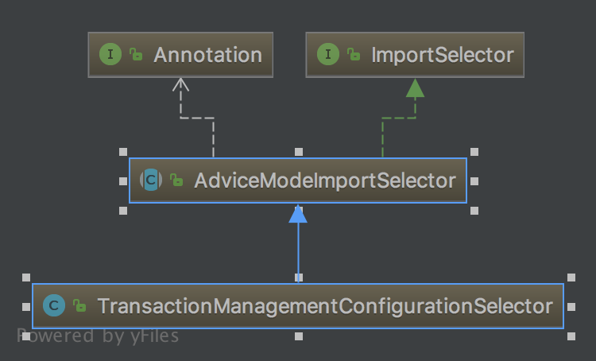
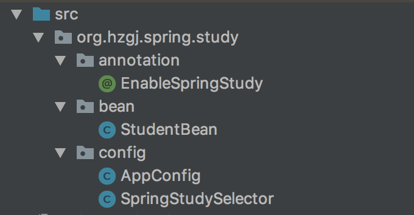
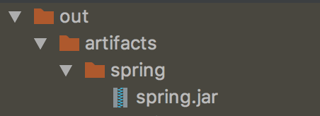

 

[TOC]


# 深入理解Spring的ImportSelector接口

　　ImportSelector接口是至spring中导入外部配置的核心接口，在SpringBoot的自动化配置和@EnableXXX(功能性注解)都有它的存在，关于SpringBoot的分析可以参考:[深入理解SpringBoot的自动装配](http://www.cnblogs.com/niechen/p/9027804.html)。

 

## 一、关于ImportSelector接口 

```java
package org.springframework.context.annotation;

import org.springframework.core.type.AnnotationMetadata;

/**
 * Interface to be implemented by types that determine which @{@link Configuration}
 * class(es) should be imported based on a given selection criteria, usually one or more
 * annotation attributes.
 *
 * <p>An {@link ImportSelector} may implement any of the following
 * {@link org.springframework.beans.factory.Aware Aware} interfaces, and their respective
 * methods will be called prior to {@link #selectImports}:
 * <ul>
 * <li>{@link org.springframework.context.EnvironmentAware EnvironmentAware}</li>
 * <li>{@link org.springframework.beans.factory.BeanFactoryAware BeanFactoryAware}</li>
 * <li>{@link org.springframework.beans.factory.BeanClassLoaderAware BeanClassLoaderAware}</li>
 * <li>{@link org.springframework.context.ResourceLoaderAware ResourceLoaderAware}</li>
 * </ul>
 *
 * <p>ImportSelectors are usually processed in the same way as regular {@code @Import}
 * annotations, however, it is also possible to defer selection of imports until all
 * {@code @Configuration} classes have been processed (see {@link DeferredImportSelector}
 * for details).
 *
 * @author Chris Beams
 * @since 3.1
 * @see DeferredImportSelector
 * @see Import
 * @see ImportBeanDefinitionRegistrar
 * @see Configuration
 */
public interface ImportSelector {

    /**
     * Select and return the names of which class(es) should be imported based on
     * the {@link AnnotationMetadata} of the importing @{@link Configuration} class.
     */
    String[] selectImports(AnnotationMetadata importingClassMetadata);

}
```

　　该接口文档上说的明明白白，其主要作用是收集需要导入的配置类，如果该接口的实现类同时实现EnvironmentAware， BeanFactoryAware ，BeanClassLoaderAware或者ResourceLoaderAware，那么在调用其selectImports方法之前先调用上述接口中对应的方法，如果需要在所有的@Configuration处理完在导入时可以实现DeferredImportSelector接口。

在这里我举个Spring中的实例来看一下：

```java
@Target(ElementType.TYPE)
@Retention(RetentionPolicy.RUNTIME)
@Documented
@Import(TransactionManagementConfigurationSelector.class)
public @interface EnableTransactionManagement {

    /**
     * Indicate whether subclass-based (CGLIB) proxies are to be created ({@code true}) as
     * opposed to standard Java interface-based proxies ({@code false}). The default is
     * {@code false}. <strong>Applicable only if {@link #mode()} is set to
     * {@link AdviceMode#PROXY}</strong>.
     * <p>Note that setting this attribute to {@code true} will affect <em>all</em>
     * Spring-managed beans requiring proxying, not just those marked with
     * {@code @Transactional}. For example, other beans marked with Spring's
     * {@code @Async} annotation will be upgraded to subclass proxying at the same
     * time. This approach has no negative impact in practice unless one is explicitly
     * expecting one type of proxy vs another, e.g. in tests.
     */
    boolean proxyTargetClass() default false;

    /**
     * Indicate how transactional advice should be applied. The default is
     * {@link AdviceMode#PROXY}.
     * @see AdviceMode
     */
    AdviceMode mode() default AdviceMode.PROXY;

    /**
     * Indicate the ordering of the execution of the transaction advisor
     * when multiple advices are applied at a specific joinpoint.
     * The default is {@link Ordered#LOWEST_PRECEDENCE}.
     */
    int order() default Ordered.LOWEST_PRECEDENCE;

}
```


此注解是开启声明式事务的注解，那么它的@Import所导入的类为TransactionManagementConfigurationSelector，那么我们看一下其类图：



由此可知该类实现类ImportSelector接口

 


## 二、自定义@EnableXXX注解

　　在这里我们先准备两个Spring的项目工程:spring-project与ssm-project，其中spring-project里我们先创建好如下结构目录：



### SpringStudySelector

```java
package org.hzgj.spring.study.config;

import org.springframework.beans.BeansException;
import org.springframework.beans.factory.BeanFactory;
import org.springframework.beans.factory.BeanFactoryAware;
import org.springframework.context.annotation.ImportSelector;
import org.springframework.core.type.AnnotationMetadata;

public class SpringStudySelector implements ImportSelector, BeanFactoryAware {
    private BeanFactory beanFactory;

    @Override
    public String[] selectImports(AnnotationMetadata importingClassMetadata) {
        importingClassMetadata.getAnnotationTypes().forEach(System.out::println);
        System.out.println(beanFactory);
        return new String[]{AppConfig.class.getName()};
    }

    @Override
    public void setBeanFactory(BeanFactory beanFactory) throws BeansException {
        this.beanFactory = beanFactory;
    }
}
```


　　在这里我们实现ImportSelector接口和BeanFactoryAware接口，重写selectImports方法，最后我们返回的是AppConfig的类名，同时打印出相关的注解元数据与BeanFactory

### 自定义@EnableSpringStudy注解

```java
package org.hzgj.spring.study.annotation;

import org.hzgj.spring.study.config.SpringStudySelector;
import org.springframework.context.annotation.Import;

import java.lang.annotation.*;

@Retention(RetentionPolicy.RUNTIME)
@Documented
@Target(ElementType.TYPE)
@Import(SpringStudySelector.class)
public @interface EnableSpringStudy {
}
```


在这里我们仿照@EnableTransactionManagement来实现自定义注解，注意使用@Import导入我们刚才写的SpringStudySelector

### AppConfig

```java
package org.hzgj.spring.study.config;

import org.hzgj.spring.study.bean.StudentBean;
import org.springframework.context.annotation.Bean;
import org.springframework.context.annotation.Configuration;

@Configuration
public class AppConfig {

    @Bean
    public StudentBean studentBean() {
        StudentBean studentBean = new StudentBean();
        studentBean.setId(19);
        studentBean.setName("admin");
        return studentBean;
    }
}
```

当都完成以后我们打个jar包，准备引入至其他工程：



###  完成ssm-project工程中的AppConfig配置类

　　1) 首先我们将刚才的spring.jar导入到ssm-project工程里

　　2) 在对应的配置类上添加上spring-project中定义的@EnableSpringStudy注解

```java
@Configuration //表明此类是配置类
@ComponentScan // 扫描自定义的组件(repository service component controller)
@PropertySource("classpath:application.properties") // 读取application.properties
@MapperScan("com.bdqn.lyrk.ssm.study.app.mapper") //扫描Mybatis的Mapper接口
@EnableTransactionManagement //开启事务管理
@EnableSpringStudy
public class AppConfig {

  //....省略配置代码      
}
```

　　3）编写Main方法

```java
 public static void main(String[] args) throws IOException {


        AnnotationConfigApplicationContext applicationContext = new AnnotationConfigApplicationContext(AppConfig.class);
        StudentBean studentBean = applicationContext.getBean(StudentBean.class);
        System.out.println(studentBean.getName());
    }
```

　　运行后输出结果：

```java
org.springframework.context.annotation.Configuration
org.springframework.context.annotation.ComponentScan
org.springframework.context.annotation.PropertySource
org.mybatis.spring.annotation.MapperScan
org.springframework.transaction.annotation.EnableTransactionManagement
org.hzgj.spring.study.annotation.EnableSpringStudy
org.springframework.beans.factory.support.DefaultListableBeanFactory@4b9e13df: defining beans [org.springframework.context.annotation.internalConfigurationAnnotationProcessor,org.springframework.context.annotation.internalAutowiredAnnotationProcessor,org.springframework.context.annotation.internalRequiredAnnotationProcessor,org.springframework.context.annotation.internalCommonAnnotationProcessor,org.springframework.context.event.internalEventListenerProcessor,org.springframework.context.event.internalEventListenerFactory,appConfig,propertiesConfig,logAspect,studentService]; root of factory hierarchy
admin
```

　　从这里我们可以看到ImportSelector接口中的方法参数，可以获取ssm-project项目下AppConfig的所有注解，并且能够获取当前BeanFactory所有配置的Bean

## 三、ImportSelector源码分析

　　这个接口在哪里调用呢？我们可以来看一下ConfigurationClassParser这个类的processImports方法

```
private void processImports(ConfigurationClass configClass, SourceClass currentSourceClass,
            Collection<SourceClass> importCandidates, boolean checkForCircularImports) {

        if (importCandidates.isEmpty()) {
            return;
        }

        if (checkForCircularImports && isChainedImportOnStack(configClass)) {
            this.problemReporter.error(new CircularImportProblem(configClass, this.importStack));
        }
        else {
            this.importStack.push(configClass);
            try {
                for (SourceClass candidate : importCandidates) {
　　　　　　　　　　　　//对ImportSelector的处理
                    if (candidate.isAssignable(ImportSelector.class)) {
                        // Candidate class is an ImportSelector -> delegate to it to determine imports
                        Class<?> candidateClass = candidate.loadClass();
                        ImportSelector selector = BeanUtils.instantiateClass(candidateClass, ImportSelector.class);
                        ParserStrategyUtils.invokeAwareMethods(
                                selector, this.environment, this.resourceLoader, this.registry);
                        if (this.deferredImportSelectors != null && selector instanceof DeferredImportSelector) {
　　　　　　　　　　　　　　　　//如果为延迟导入处理则加入集合当中
                            this.deferredImportSelectors.add(
                                    new DeferredImportSelectorHolder(configClass, (DeferredImportSelector) selector));
                        }
                        else {
　　　　　　　　　　　　　　　　//根据ImportSelector方法的返回值来进行递归操作
                            String[] importClassNames = selector.selectImports(currentSourceClass.getMetadata());
                            Collection<SourceClass> importSourceClasses = asSourceClasses(importClassNames);
                            processImports(configClass, currentSourceClass, importSourceClasses, false);
                        }
                    }
                    else if (candidate.isAssignable(ImportBeanDefinitionRegistrar.class)) {
                        // Candidate class is an ImportBeanDefinitionRegistrar ->
                        // delegate to it to register additional bean definitions
                        Class<?> candidateClass = candidate.loadClass();
                        ImportBeanDefinitionRegistrar registrar =
                                BeanUtils.instantiateClass(candidateClass, ImportBeanDefinitionRegistrar.class);
                        ParserStrategyUtils.invokeAwareMethods(
                                registrar, this.environment, this.resourceLoader, this.registry);
                        configClass.addImportBeanDefinitionRegistrar(registrar, currentSourceClass.getMetadata());
                    }
                    else {
　　　　　　　　　　　　　　// 如果当前的类既不是ImportSelector也不是ImportBeanDefinitionRegistar就进行@Configuration的解析处理
                        // Candidate class not an ImportSelector or ImportBeanDefinitionRegistrar ->
                        // process it as an @Configuration class
                        this.importStack.registerImport(
                                currentSourceClass.getMetadata(), candidate.getMetadata().getClassName());
                        processConfigurationClass(candidate.asConfigClass(configClass));
                    }
                }
            }
            catch (BeanDefinitionStoreException ex) {
                throw ex;
            }
            catch (Throwable ex) {
                throw new BeanDefinitionStoreException(
                        "Failed to process import candidates for configuration class [" +
                        configClass.getMetadata().getClassName() + "]", ex);
            }
            finally {
                this.importStack.pop();
            }
        }
    }
```


　　在这里我们可以看到ImportSelector接口的返回值会递归进行解析，把解析到的类全名按照@Configuration进行处理


<https://www.cnblogs.com/niechen/p/9262452.html>