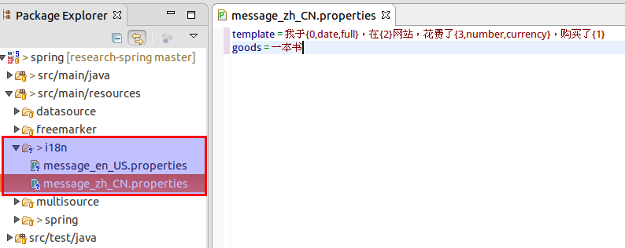

# Spring MVC国际化实现及原理


# 一、背景

很多网站的用户分布在世界各地，因此网站需要针对不同国家的用户展示不同语言的内容，因此就有了国际化实现的需求，大多数网站都会在网站的头部或尾部设置语言切换链接，这样就可以直接切换成相应的内容。其中有些网站是通过网站地址或参数进行区分，有些是通过设置cookie值进行进行区分。

 

# 二、解决思路

前面已经写过一篇[JDK的国际化支持](http://www.jianshu.com/p/459eb214d560)，讲解了JDK实现国际化的具体实现。那么网站的国际化实现具体如何做呢？

 

其实网站的国际化实现与前面介绍的JDK实现思路类似，只是本地化信息的获取需要从页面得到而已。得到了页面信息，再获取对应的数据并进行格式化处理，最后渲染到页面即可。这里主要说明后端的处理思路，前端的处理思路其实也类似，只是实现方式有区别而已。

 

那如何从页面获取本地化信息呢？这个是所有处理的首要环节，常用的几种方式有：

（1）直接根据Request.getLocale()方法得到本地化信息，实际就是从Http Request Headers里面取“accept-language”对应的值，该值拥有浏览器端的语言信息；
（2）在浏览器端保存一个自定义名字的cookie，默认情况下指定一个值，对应的切换通过语言切换链接的点击修改对应的值；
（3）在请求URL上面添加带本地化信息的参数或者地址里面包含本地化信息。

通过上面几种方式，在web程序中就可以直接从request中得到了本地化信息，然后根据本地化信息从相应的properties文件中获取数据（比如可以通过JDK的ResourceBundle类），得到数据后如果需要的化再对数据进行格式化处理（比如可以通过JDK的MessageFormat类），最后将处理过的数据展示到前台即完成了整个国际化操作。

思路已经有了，那么具体如何实现呢？下面以Spring MVC的实现为例，因为该框架做了很好的抽象和封装，是个非常好的参考例子。

 

# 三、Spring MVC实现及原理

## 3.1 本地化信息获取

### 3.1.1 概述

Spring MVC的DispatcherServlet类会在initLocaleResolver方法中查找一个locale resolver，如果没有找到就会用默认的AcceptHeaderLocaleResolver类。locale resolver会去根据请求Request设置当前的locale信息。

除了resolver类，还可以定义拦截器去设置locale信息，比如通过请求参数去设置，具体下面细讲。

Spring MVC相关的处理类都在org.springframework.web.servlet.i18n包下。而本地化信息的获取可以通过RequestContext.getLocale()方法得到。另外，RequestContext.getTimeZone()方法还可以得到时区信息。

### 3.1.2 AcceptHeaderLocaleResolver

这个从名字也能看出大概来，这个类是解析request的header中的accept-language值，这个值通常包含客户端支持的本地化信息，所以通过这个值可以获取本地化信息。不过这个类拿不到时区信息。这个类是默认配置的，所以使用的话不用额外配置。

### 3.1.3 CookieLocaleResolver

这个类是通过cookie去存取本地化信息，客户端可以在cookie中存储一个指定名字的值代表本地化信息，然后这个类获取后做相应的解析即可。具体的配置如下：

```
<bean id="localeResolver" class="org.springframework.web.servlet.i18n.CookieLocaleResolver">  
 <property name="cookieName" value="clientlanguage"/>  
 <property name="cookieMaxAge" value="100000"/>  
 <property name="cookiePath" value="/"/>  
</bean> 
```

这里对几个配置的属性做下说明：

|              |                            |                                                              |
| ------------ | -------------------------- | ------------------------------------------------------------ |
| cookieName   | 默认值：classname + LOCALE | cookie名字                                                   |
| cookieMaxAge | 默认值：Servlet容器默认值  | 这个值为cookie在客户端保留的时间，如果值为-1，则不保留；这个值会在关闭浏览器后无效。 |
| cookiePath   | 默认值：/                  | 这个值设置cookie的适用路径，如果这个值设置了，那么就表示cookie只对当前目录及其子目录可见。 |

### 3.1.4 SessionLocaleResolver

这个类是通过request获取本地化信息的，然后存在HttpSession中，所以本地化信息存取依赖于session的生命周期。具体配置如下：

```java
<bean id="localeResolver" 
    class="org.springframework.web.servlet.i18n.SessionLocaleResolver">  
</bean>
```

### 3.1.5 LocaleChangeInterceptor

这个拦截器会拦截请求中的参数，然后根据参数去调用LocaleResolver的setLocale()方法，改变当前的locale值。下面举个例子，有这个地址[http://www.sf.net/home.view?siteLanguage=nl](http://www.jianshu.com/p/52d62260f7dd)，参数siteLanguage代表locale信息，配置拦截修改locale值：

```java
<bean id="localeChangeInterceptor" class="org.springframework.web.servlet.i18n.LocaleChangeInterceptor">  
 <property name="paramName" value="siteLanguage"/></bean>  
<bean id="localeResolver" class="org.springframework.web.servlet.i18n.CookieLocaleResolver"/>  
```

这里配置CookieLocaleResolver是因为LocaleChangeInterceptor需要调用LocaleResolver的setLocale()方法，这个例子里面用到了CookieLocaleResolver，当然也可以用其他的LocaleResolver实现类。

## 3.2 数据获取与格式化

Spring MVC的数据处理定义了一个接口MessageSource，该接口定义了数据获取的方法。方法如下：

1. String getMessage(String code, Object[] args, String defaultMessage, Locale locale)；
   这里code为属性文件中的key值，args是文件中需要替换的参数值，defaultMessage是找不到内容时的默认内容，locale为本地化信息。
2. String getMessage(String code, Object[] args, Locale locale) throws NoSuchMessageException;
   这个方法与上面的方法类似，只是没有了默认内容，而是找不到内容时抛出异常。
3. String getMessage(MessageSourceResolvable resolvable, Locale locale) throws NoSuchMessageException;
   这里参数中有个新接口MessageSourceResolvable，对前面的参数进行了封装，locale为本地化信息。

对于MessageSource接口，Spring MVC的ApplicationContext和HierarchicalMessageSource都有继承，ApplicationContext在加载的时候，它会先去上下文里面查找bean名为messageSource的实现，找到后上面MessageSource方法的调用就用这个实现类； 如果找不到就会找包含MessageSource bean的类去使用； 再找不到就用DelegatingMessageSource去执行方法调用了。

MessageSource常见的实现主要有如下几个：

1. ResourceBundleMessageSource类：这个类实际是依赖的JDK的ResourceBundle类获取数据、MessageFormat去做格式化。
2. ReloadableResourceBundleMessageSource类：这个与上面的比较就多了可重新加载，即可以在不重新启动应用的情况下重新读取新的内容。具体实现方式也有区别，这个类是通过Spring的PropertiesPersister策略加载，依赖的是JDK的Properties类读取内容。
3. StaticMessageSource类：这个类提供了简单的实现，内容是需要先配置好的。使用比较少，适合在内容较少较简单情况下使用。

下面以最常用的ResourceBundleMessageSource类做个简单示例：

```xml
<bean id="messageSource" class="org.springframework.context.support.ResourceBundleMessageSource">  
 <property name="basenames">  
 <list>  
 <value>format</value>  
 <value>exceptions</value>  
 </list>  
 </property>  
 </bean> 
```

format与exceptions为文件基础名，对应内容配置在具体locale相应的文件名中即可。详细示例见下面部分。

 

## 3.3 小结与示例

上面两节主要讲了本地化信息获取，数据获取与格式化两部分，这两部分其实也是整个国际化过程最核心的两个部分，至于请求的匹配与接收，返回结果的页面渲染这个就不展开讲，与国际化不直接相关，属于Spring MVC的基础内容。

这里对整个Spring MVC的国际化过程做个大概的梳理，整个过程大概是这样：接收请求——>LocaleResolver获取/设置locale信息——>MessageSource获取数据并格式化——>内容展示到页面。

讲了半天，还是有点抽象，下面直接来个详细示例：

```java
@Controller  
public class I18nController {  
 @Autowired  
 private MessageSource messageSource;  
 @RequestMapping("i18n")  
 public String i18n(Model model){  
 //获取本地化信息，从LocaleContext中得到  
 Locale locale = LocaleContextHolder.getLocale();  
 //初始化参数，这里简便演示，真实参数可能是从数据库查询处理的。这里的参数是与i18n目录下的配置文件需要替换的内容对应的  
 Object [] objArr = new Object[4];  
 objArr[0] = new Date();  
 objArr[1] = messageSource.getMessage("goods", null, locale);//这个具体商品从配置中读取  
 objArr[2] = "taobao";  
 objArr[3] = new BigDecimal("39.20");  
 //获取格式化后的内容  
 String content = messageSource.getMessage("template", objArr, locale);  
 model.addAttribute("content", content);  
 return "/i18n/show";  
 }  
}  
```

LocaleResolver配置，这里以Cookie为例：

```xml
 <bean id="localeResolver" class="org.springframework.web.servlet.i18n.CookieLocaleResolver">  
 <property name="cookieName" value="clientlanguage"/>  
 <property name="cookieMaxAge" value="100000"/>  
 <property name="cookiePath" value="/"/>  
</bean>  
```

MessageSource配置，这里以ResourceBundleMessageSource为例：

```xml
<bean id="messageSource" class="org.springframework.context.support.ResourceBundleMessageSource">  
 <property name="basenames">  
 <list>  
 <value>/i18n/message</value>  
 </list>  
 </property>  
 </bean>  
```

Properties配置，这里统一放在/i18n目录下，message名字开头：

 

更详细的代码可以查看我的[Github项目](https://github.com/wdmcygah/research-spring)。

 

# 四、拓展介绍

## 4.1 LocaleResolver对应Bean是如何初始化的？

初始化工作是在DispatcherServlet类初始化时调用initLocaleResolver方法执行的。

```java
private void initLocaleResolver(ApplicationContext context) {
    try {
        this.localeResolver = context.getBean(LOCALE_RESOLVER_BEAN_NAME, LocaleResolver.class);
        if (logger.isDebugEnabled()) {
            logger.debug("Using LocaleResolver [" + this.localeResolver + "]");
        }
    }
    catch (NoSuchBeanDefinitionException ex) {
        // We need to use the default.  
        this.localeResolver = getDefaultStrategy(context, LocaleResolver.class);
        if (logger.isDebugEnabled()) {
            logger.debug("Unable to locate LocaleResolver with name '" + LOCALE_RESOLVER_BEAN_NAME +
                    "': using default [" + this.localeResolver + "]");
        }
    }
}
```

从代码里面可以看到处理化过程分为两步：

（1）先从当前上下文环境中取名字为localeResolver的bean；

（2）如果找不到就根据默认策略去取LocaleResolver这个Class名字的bean，即执行getDefaultStrategy方法，该方法实际是取DispatcherServlet.properties文件中的org.springframework.web.servlet.LocaleResolver对应的值，即默认的AcceptHeaderLocaleResolver类，再创建对应的bean。

所以如果上下文中自定义了LocaleResolver就用自定义的，没有定义会用默认的AcceptHeaderLocaleResolver类。这种写法在写公共逻辑且提供多种策略时很实用。

 

# 五、参考资料

1. [Spring MVC using locales官方教程](http://docs.spring.io/spring/docs/current/spring-framework-reference/htmlsingle/#mvc-localeresolver)
2. [Spring MVC using MessageSource官方教程](http://docs.spring.io/spring/docs/current/spring-framework-reference/htmlsingle/#context-functionality-messagesource)


http://wdmcygah.iteye.com/blog/2376389