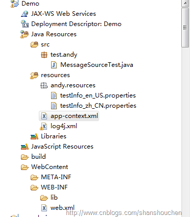

[TOC]


# spring  i18n多语言java获取

/Users/jerryye/backup/studio/AvailableCode/framework/spring/spring_i18n_国际化/springboot-i18n


Spring中可以使用两个类加载资源文件：

```
org.springframework.context.support.ReloadableResourceBundleMessageSource
```

和

```
org.springframework.context.support.ResourceBundleMessageSource
```

可配置如下：

ReloadableResourceBundleMessageSource：

```
<bean id="messageSource"
        class="org.springframework.context.support.ReloadableResourceBundleMessageSource">
        <property name="basenames">
            <list>
                <value>andy/resources/testInfo</value>
            </list>
        </property>
    </bean>
```

ResourceBundleMessageSource：

```
<bean id="messageSource"
        class="org.springframework.context.support.ResourceBundleMessageSource">
        <property name="basenames">
            <list>
                <value>andy/resources/testInfo</value>
            </list>
        </property>
    </bean>
```

Spring提供了一个接口MessageSource用于获取国际化信息，ReloadableResourceBundleMessageSource和ResourceBundleMessageSource都是继承了该接口的一个抽象实现类AbstractMessageSource，继承该抽象类的有四个类，分别是：

1、

```
public class StaticMessageSource extends AbstractMessageSource {
...
}
```

2、

```
public class SpringSecurityMessageSource extends ResourceBundleMessageSource {
...
}
```

3、

```
public class ReloadableResourceBundleMessageSource extends AbstractMessageSource
    implements ResourceLoaderAware
{
...
}
```

4、

```
public class ResourceBundleMessageSource extends AbstractMessageSource
    implements BeanClassLoaderAware
{
...
}
```

每个类的用处不同，StaticMessageSource主要用于测试环境，并不用于生产环境，SpringSecurityMessageSource用于Spring security的国际化信息

ApplicationContext实现了MessageSource接口，所以，ApplicationContext自身提供了国际化信息功能

例子如下:



> 在这里，我们测试Spring提供的国际化信息功能，文件名称为testInfo的Resource bundle中有两个文件，分别为英语，中文，国际化资源文件有一定的命名规范，只有符合命名规范的国际化资源文件才能正确的被Spring读取，国际化资源问及爱你命名规范遵循：\${filename}_${languagename}_\${countryname}，其中${}是需要替代的内容，下划线是必需的分隔符，所以如果你想要定义一个中文国际化文件应该是这样的 testInfo_zh_CN，至于language和countryname的取名请参见java.util.Locale类，里面有详细说明。
>
> Spring配置文件如下（app-context.xml）：
>
> 
>
> ```xml
> <?xml version="1.0" encoding="UTF-8"?>
> <beans xmlns="http://www.springframework.org/schema/beans"
>     xmlns:xsi="http://www.w3.org/2001/XMLSchema-instance" xmlns:context="http://www.springframework.org/schema/context"
>     xsi:schemaLocation="http://www.springframework.org/schema/beans http://www.springframework.org/schema/beans/spring-beans.xsd  http://www.springframework.org/schema/context
>     http://www.springframework.org/schema/context/spring-context-2.5.xsd">
> 
>     <bean id="messageSource"
>         class="org.springframework.context.support.ReloadableResourceBundleMessageSource">
>         <property name="basenames">
>             <list>
>                 <value>andy/resources/testInfo</value>
>             </list>
>         </property>
>     </bean>
> 
> </beans>
> ```
>
> 

> 这里定义了一个MessageSource的实现类ResourceBundleMessageSource用户提供国际化功能，为什么这里的id以messageSource命名呢？如果不明白可以查看AbstractApplicationContext的源代码，你会发现里面定义了一个messageSource的属性，并提供了set方法，也就是Spring在初始化时将Spring配置文件（app-context.xml）中id为messageSource的bean注入到ApplicationContext中，这样我们就可以使用ApplicationContext提供的国际化功能了，一下是测试类：
>
>
>
> ```java
> package test.andy;
> 
> import java.util.Locale;
> 
> import junit.framework.TestCase;
> 
> import org.springframework.context.MessageSource;
> import org.springframework.context.support.ClassPathXmlApplicationContext;
> 
> public class MessageSourceTest extends TestCase {
>     public void testResourceBundleMessageSource(){
>          //获取本地化信息，从LocaleContext中得到  
>  		Locale locale = LocaleContextHolder.getLocale();  
>         
>         
>         MessageSource messageSource=new ClassPathXmlApplicationContext("app-context.xml");
>         String username_us=messageSource.getMessage("userName_lable",new Object[1],Locale.US);
>         String username_chinese=messageSource.getMessage("userName_lable",new Object[0],Locale.CHINESE);
>         System.out.println("chinese:"+username_chinese);
>         System.out.println("english:"+username_us);
>     }
> }
> ```
>
>

运行结果：

```
chinese:用户名
english:userName
```

> ReloadableResourceBundleMessageSource和ResourceBundleMessageSource有着微小区别，从字面就可以看出，ReloadableResourceBundleMessageSource可以在不用重新启动服务器的情况下，读取更改后的资源文件


https://www.cnblogs.com/shanshouchen/archive/2012/08/08/2628394.html