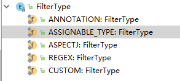

# spring注解@ComponentScan的@Filter中FilterType包含的类型及意义

 

```java
@ComponentScan(value = "com.annotation",useDefaultFilters = false,includeFilters = 
               {@ComponentScan.Filter(type = FilterType.ANNOTATION,classes = 
                                      {Controller.class,ControllerAdvice.class})})
```

上面的FilterType都包含了哪些类型呢？




```
ANNOTATION：注解类型
ASSIGNABLE_TYPE：指定的类型,就是指定一个类
ASPECTJ：按照Aspectj的表达式，基本上不会用到
REGEX：按照正则表达式
CUSTOM：自定义规则
```


下面说一下CUSTOMER类型的用法：

具体的配置可以这样写：

```java
@ComponentScan(value = "com.annotation",useDefaultFilters = false,
        includeFilters = {
//            @ComponentScan.Filter(type = FilterType.ANNOTATION,classes = {Controller.class,ControllerAdvice.class}),
//            @ComponentScan.Filter(type = FilterType.ASSIGNABLE_TYPE,classes = {PersonDao.class}),
            @ComponentScan.Filter(type = FilterType.CUSTOM,classes = {MyFilterType.class})
        }
)
```

 其中MyFilterType是我自己写的一个类，它需要实现TypeFilter接口，实现接口需要重写一个方法match（），当match（）方法返回true，则当前扫描的类被放入spring容器中，返回false则不放入容器中。我这里规定类名中包含“Employee”的返回true，即将其放入到容器中，否则返回false不放入到容器中：

```java
 
public class MyFilterType implements TypeFilter {
 
    @Override
    public boolean match(MetadataReader metadataReader, MetadataReaderFactory metadataReaderFactory) throws IOException {
 
        if (metadataReader.getClassMetadata().getClassName().contains("Department")){
            //获取当前类注解的信息
            AnnotationMetadata annotationMetadata = metadataReader.getAnnotationMetadata();
            for (String s : annotationMetadata.getAnnotationTypes()) {
                System.out.println("当前正在被扫描的类注解类型" + s);
            }
            //获取当前正在扫描类的信息
            ClassMetadata classMetadata = metadataReader.getClassMetadata();
            System.out.println("当前正在被扫描的类的类名" + classMetadata.getClassName());
            //获取当前类的资源信息（类存放的路径...）
            Resource resource = metadataReader.getResource();
            System.out.println("当前正在被扫描的类存放的地址" + resource.getURL());
            return true;
        }
        return false;
    }
}

```

以上配置打印出来的结果：

```
当前正在被扫描的类的类名com.annotation.entities.Department
当前正在被扫描的类存放的地址file:/D:/DevInstall/Project/annotation/target/classes/com/annotation/entities/Department.class
当前正在被扫描的类注解类型org.springframework.web.bind.annotation.ControllerAdvice
当前正在被扫描的类的类名com.annotation.handler.DepartmentHandler
当前正在被扫描的类存放的地址file:/D:/DevInstall/Project/annotation/target/classes/com/annotation/handler/DepartmentHandler.class
当前正在被扫描的类注解类型org.springframework.stereotype.Service
当前正在被扫描的类的类名com.annotation.service.DepartmentService
当前正在被扫描的类存放的地址file:/D:/DevInstall/Project/annotation/target/classes/com/annotation/service/DepartmentService.class

```


https://blog.csdn.net/qq_36722039/article/details/81572399