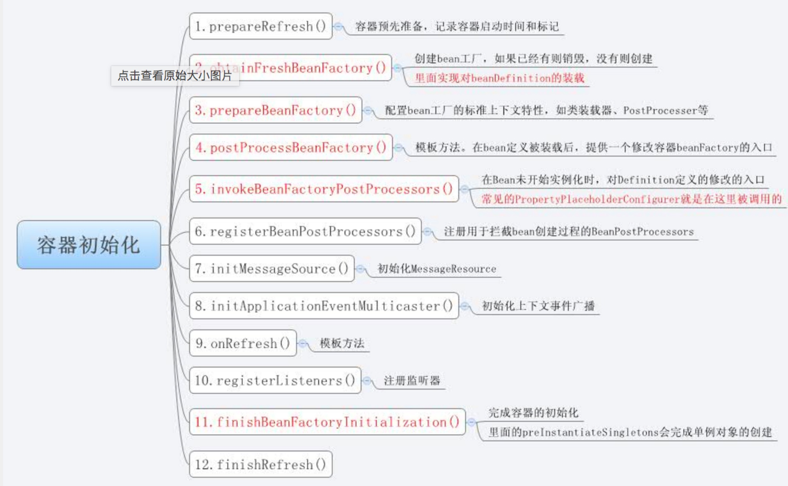
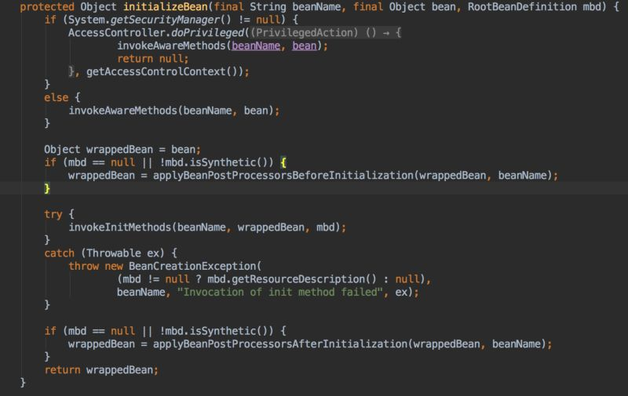

[TOC]


# Spring IOC源码分析二(Bean实例化)

 

## AbstractApplication.refresh

如下图，上一篇文章我们已经提到过refresh方法，spring容器启动的一系列步骤都是这个方法来实现的。上一篇文章我们主要基于obtainFreshBeanFactory()这个方法来分析IoC容器的resource资源定位，BeanDefinition的解析和载入以及最终向容器中注册。
下面我们重新审视下refresh方法，我们把整个IoC容器启动分为下图中的12个步骤。
对于步骤5和步骤6稍微解释下，步骤5涉及到了BeanFactoryPostProcessor，步骤6涉及到了BeanPostProcessor。下面比较下两者的异同点。
[](https://coding.net/u/lightoheaven/p/image/git/raw/master/posts/201604/spring2/refresh.jpg)

## BeanFactoryPostProcessor与BeanPostProcessor

- 从名字上看，两者都是一个后置的处理器，都提供了回调接口。

- BeanFactoryPostProcessor

  ```
  public interface BeanFactoryPostProcessor {
      void postProcessBeanFactory(ConfigurableListableBeanFactory beanFactory) throws BeansException;
  }
  ```

  可以对bean的定义（配置元数据）进行处理。也就是说，Spring IoC容器允许BeanFactoryPostProcessor在容器实际实例化任何其它的bean之前读取配置元数据，并有可能修改它。如果你愿意，你可以配置多个BeanFactoryPostProcessor。你还能通过设置’order’属性来控制BeanFactoryPostProcessor的执行次序。

- BeanPostProcessor

  ```
  public interface BeanPostProcessor {
      Object postProcessBeforeInitialization(Object bean, String beanName) throws BeansException;
      Object postProcessAfterInitialization(Object bean, String beanName) throws BeansException;
  }
  ```

  BeanPostProcessor，可以在spring容器实例化bean之后，在执行bean的初始化方法前后，添加一些自己的处理逻辑。这里说的初始化方法，指的是下面两种：
  1）bean实现了InitializingBean接口，对应的方法为afterPropertiesSet
  2）在bean定义的时候，通过init-method设置的方法
  注意：BeanPostProcessor是在spring容器加载了bean的定义文件并且实例化bean之后执行的。BeanPostProcessor的执行顺序是在BeanFactoryPostProcessor之后。另外从名字也可以看出，步骤6只是注册了定义的BeanPostProcessor，并没有触发。

## Bean的创建

我们主要关注refresh方法中的第11步finishBeanFactoryInitialization，这个是对spring容器中的非延迟加载的单例bean进行实例化的(步骤5和6也会通过getBean方法对一些processorBean进行实例化)。

### preInstantiateSingletons

DefaultListableBeanFactory类这个方法可以看到如果bean是单例，并且没有设置延时加载，那么就会调用getBean(beanName)方法(这里我们先不考虑FactoryBean)，这个方法就会完成bean的依赖注入

### doGetBean

上面getBean会调用到AbstractBeanFactory.doGetBean()方法。这个方法首先会在singleton缓存中去寻找需要的bean，如果这个bean是单例的，则直接返回这个bean。负责判断此bean是否在此beanfactory中定义（containsBeanDefinition(beanName)），如果没有递归至双亲beanfactory，以上条件不满足的话，接下来得到beandefination的定义（getMergedLocalBeanDefinition(beanName)），开始创建bean。首先分析该bean有没有dependsOn，若有依赖的bean，则分别对依赖的bean进行递归getBean。第二步判断bean的生命周期，如果是singleton的话，使用对应的singletonFactory来生成，如果是prototype的，使用createBean(beanName, mbd, args)方法生成。

### createBean

上一步会调用到AbstractAutowireCapableFactory的createBean方法。这个方法主要有2步骤:

- resolveBeforeInstantiation(beanName, mbdToUse)如果目标bean实现了InstantiationAwareBeanPostProcessor这个接口，在实例化目标bean之前，直接调用这个的postProcessBeforeInstantiation方法返回一个bean来代替目标bean。
- 若1中bean没有实现上述接口，则调用AbstractAutowireCapableFactory的doCreateBean方法。

### doCreateBean

- 会创建一个 BeanWrapper 对象 用于存放实例化对象。如果此bean配置了工厂方法（mbd.getFactoryMethodName() != null），则使用工厂类进行bean的创建，如果此bean注入了构造器参数（ctors != null），则使用非默认的构造器对应的方法autowireConstructor进行生成，最后一种情况是最常见的，非工厂类，且使用默认无参的构造方法，instantiateBean(beanName, mbd)，这一步只是生成了一个对象，但是对象的属性值都没有注入进来。

- applyMergedBeanDefinitionPostProcessors(mbd, beanType, beanName);第三个BeanPostProcessor扩展点，执行Bean定义的合并

- populateBean，根据注入方式进行注入。根据是否有依赖检查进行依赖检查。
  执行 bean 的注入里面会选择注入类型：AutowireByName，AutowireByType，接下来applyPropertyValues，把beanFactory中的字段属性值赋给步骤1中生成的对象。

- initializeBean(beanName, exposedObject, mbd);
  判断是否实现了 BeanNameAware 、 BeanClassLoaderAware 等 spring 提供的接口，如果实现了，进行默认的注入。同时判断是否实现了 InitializingBean 接口，如果是的话，调用 afterPropertySet 方法。
  [](https://coding.net/u/lightoheaven/p/image/git/raw/master/posts/201604/spring2/initializeBean.jpg)

  ## 参考

  [Spring开闭原则的表现-BeanPostProcessor扩展点](http://www.iteye.com/topic/1122859)
  [SpringIOC核心源码学习（二）：容器初始化过程](http://www.iteye.com/topic/1115391)
  [Spring源码浅析依赖注入](http://www.iteye.com/topic/743998)