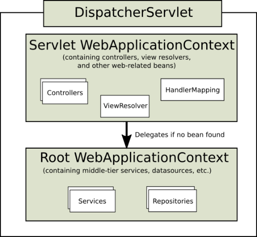
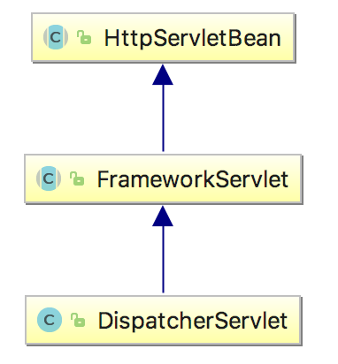
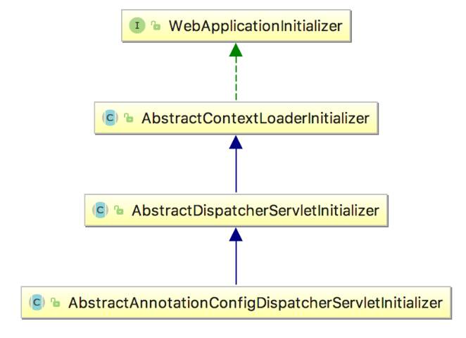

# spring与springmvc父子容器

 2016-08-03 23:18:42  7,741 [ 0](javascript:;)

## 1、spring和springmvc父子容器概念介绍

​    在spring和springmvc进行整合的时候，一般情况下我们会使用不同的配置文件来配置spring和springmvc，因此我们的应用中会存在至少2个`ApplicationContext`实例，由于是在web应用中，因此最终实例化的是ApplicationContext的子接口`WebApplicationContext`。如下图所示：




​    上图中显示了2个WebApplicationContext实例，为了进行区分，分别称之为：Servlet WebApplicationContext、Root WebApplicationContext。 其中：

​    Servlet WebApplicationContext：这是对J2EE三层架构中的web层进行配置，如控制器(controller)、视图解析器(view resolvers)等相关的bean。通过spring mvc中提供的`DispatchServlet`来加载配置，通常情况下，配置文件的名称为spring-servlet.xml。

​    Root WebApplicationContext：这是对J2EE三层架构中的service层、dao层进行配置，如业务bean，数据源(DataSource)等。通常情况下，配置文件的名称为applicationContext.xml。在web应用中，其一般通过`ContextLoaderListener`来加载。

​    以下是一个web.xml配置案例：

```xml
<?xml version="1.0" encoding="UTF-8"?>  
  
<web-app version="3.0" xmlns="http://java.sun.com/xml/ns/javaee"  
    xmlns:xsi="http://www.w3.org/2001/XMLSchema-instance"  
    xsi:schemaLocation="http://java.sun.com/xml/ns/javaeehttp://java.sun.com/xml/ns/javaee/web-app_3_0.xsd">  
    
    <!— 创建Root WebApplicationContext -->
    <context-param>  
        <param-name>contextConfigLocation</param-name>  
        <param-value>/WEB-INF/spring/applicationContext.xml</param-value>  
    </context-param>  
  
    <listener>  
        <listener-class>org.springframework.web.context.ContextLoaderListener</listener-class>  
    </listener>  
    
    <!—创建Servlet WebApplicationContext-->
    <servlet>  
        <servlet-name>dispatcher</servlet-name>  
        <servlet-class>org.springframework.web.servlet.DispatcherServlet</servlet-class>  
        <init-param>  
            <param-name>contextConfigLocation</param-name>  
            <param-value>/WEB-INF/spring/spring-servlet.xml</param-value>  
        </init-param>  
        <load-on-startup>1</load-on-startup>  
    </servlet>  
    <servlet-mapping>  
        <servlet-name>dispatcher</servlet-name>  
        <url-pattern>/*</url-pattern>  
    </servlet-mapping>  
  
</web-app>
```

​    在上面的配置中：

​    1、 ContextLoaderListener会被优先初始化时，其会根据\<context-param>元素中contextConfigLocation参数指定的配置文件路径，在这里就是"/WEB-INF/spring/applicationContext.xml”，来创建WebApplicationContext实例。 并调用ServletContext的setAttribute方法，将其设置到ServletContext中，属性的key为”org.springframework.web.context.WebApplicationContext.ROOT”，最后的”ROOT"字样表明这是一个 Root WebApplicationContext。

​    2、DispatcherServlet在初始化时，会根据\<init-param>元素中contextConfigLocation参数指定的配置文件路径，即"/WEB-INF/spring/spring-servlet.xml”，来创建Servlet WebApplicationContext。同时，其会调用ServletContext的getAttribute方法来判断是否存在Root WebApplicationContext。如果存在，则将其设置为自己的parent。这就是父子上下文(父子容器)的概念。

​        父子容器的作用在于，当我们尝试从child context(即：Servlet WebApplicationContext)中获取一个bean时，如果找不到，则会委派给parent context (即Root WebApplicationContext)来查找。

​        如果我们没有通过ContextLoaderListener来创建Root WebApplicationContext，那么Servlet WebApplicationContext的parent就是null，也就是没有parent context。 

## 2、为什么要有父子容器

​    笔者理解，父子容器的作用主要是划分框架边界。

​    在J2EE三层架构中，在service层我们一般使用spring框架， 而在web层则有多种选择，如spring mvc、struts等。因此，通常对于web层我们会使用单独的配置文件。例如在上面的案例中，一开始我们使用spring-servlet.xml来配置web层，使用applicationContext.xml来配置service、dao层。如果现在我们想把web层从spring mvc替换成struts，那么只需要将spring-servlet.xml替换成Struts的配置文件struts.xml即可，而applicationContext.xml不需要改变。

​    事实上，如果你的项目确定了只使用spring和spring mvc的话，你甚至可以将service 、dao、web层的bean都放到spring-servlet.xml中进行配置，并不是一定要将service、dao层的配置单独放到applicationContext.xml中，然后使用ContextLoaderListener来加载。在这种情况下，就没有了Root WebApplicationContext，只有Servlet WebApplicationContext。

## 3、Root WebApplicationContext创建过程源码分析

​        ContextLoaderListener用于创建ROOT WebApplicationContext，其实现了`ServletContextListener`接口的contextInitialized和contextDestroyed方法，在web应用启动和停止时，web容器(如tomcat)会负责回调这两个方法。而创建Root WebApplicationContext就是在contextInitialized中完成的，相关源码片段如下所示：

org.springframework.web.context.ContextLoaderListener 

```java
public class ContextLoaderListener extends ContextLoader implements ServletContextListener {
   //...
   @Override
   public void contextInitialized(ServletContextEvent event) {
      initWebApplicationContext(event.getServletContext());
   }
   //...
}
```

​    可以看到ContextLoaderListener继承了`ContextLoader`类，真正的创建在操作，是在ContextLoader的initWebApplicationContext方法中完成。

org.springframework.web.context.ContextLoader#initWebApplicationContext 

```java
public WebApplicationContext initWebApplicationContext(ServletContext servletContext) {
   //1、保证只能有一个ROOT WebApplicationContext
   //尝试以”org.springframework.web.context.WebApplicationContext.ROOT”为key从ServletContext中查找WebApplicationContext实例
   //如果已经存在，则抛出异常。
   //一个典型的异常场景是在web.xml中配置了多个ContextLoaderListener，那么后初始化的ContextLoaderListener就会抛出异常
   if (servletContext.getAttribute(WebApplicationContext.ROOT_WEB_APPLICATION_CONTEXT_ATTRIBUTE) != null) {
      throw new IllegalStateException(
            "Cannot initialize context because there is already a root application context present - " +
            "check whether you have multiple ContextLoader* definitions in your web.xml!");
   }
   
   //2、打印日志，注意日志中的提示内容："Initializing Spring root WebApplicationContext”
   //这验证了我们之前的说法，ContextLoaderListener创建的是root WebApplicationContext
   Log logger = LogFactory.getLog(ContextLoader.class);
   servletContext.log("Initializing Spring root WebApplicationContext");
   if (logger.isInfoEnabled()) {
      logger.info("Root WebApplicationContext: initialization started");
   }
   long startTime = System.currentTimeMillis();
   try {
     
      if (this.context == null) {
         // 3 创建WebApplicationContext实现类实例。其内部首先会确定WebApplicationContext实例类型。
        // 首先判断有没有<context-param>元素的<param-name>值为contextClass，如果有，则对应的<param-value>值，就是要创建的WebApplicationContext实例类型
        // 如果没有指定，则默认的实现类为XmlWebApplicationContext。这是在spring-web-xxx.jar包中的ContextLoader.properties指定的
        // 注意这个时候，只是创建了WebApplicationContext对象实例，还没有加载对应的spring配置文件
         this.context = createWebApplicationContext(servletContext);
      }
      //4 XmlWebApplicationContext实现了ConfigurableWebApplicationContext接口，因此会进入if代码块
      if (this.context instanceof ConfigurableWebApplicationContext) {
         ConfigurableWebApplicationContext cwac = (ConfigurableWebApplicationContext) this.context;
         // 4.1 由于WebApplicationContext对象实例还没有加载对应配置文件，spring上下文还没有被刷新，因此isActive返回false，进入if代码块
         if (!cwac.isActive()) {
            //4.2 当前ROOT WebApplicationContext的父context为null，则尝试通过loadParentContext方法获取父ApplicationContext，并设置到其中
            //由于loadParentContext方法目前写死返回null，因此可以忽略4.2这个步骤。
            if (cwac.getParent() == null) {
               ApplicationContext parent = loadParentContext(servletContext);
               cwac.setParent(parent);
            }
            //4.3 加载配置spring文件。根据<context-param>指定的contextConfigLocation，确定配置文件的位置。
            configureAndRefreshWebApplicationContext(cwac, servletContext);
         }
      }
      // 5、将创建的WebApplicationContext实例以”org.springframework.web.context.WebApplicationContext.ROOT”为key设置到ServletContext中
      servletContext.setAttribute(WebApplicationContext.ROOT_WEB_APPLICATION_CONTEXT_ATTRIBUTE, this.context);
      ClassLoader ccl = Thread.currentThread().getContextClassLoader();
      if (ccl == ContextLoader.class.getClassLoader()) {
         currentContext = this.context;
      }
      else if (ccl != null) {
         currentContextPerThread.put(ccl, this.context);
      }
      if (logger.isDebugEnabled()) {
         logger.debug("Published root WebApplicationContext as ServletContext attribute with name [" +
               WebApplicationContext.ROOT_WEB_APPLICATION_CONTEXT_ATTRIBUTE + "]");
      }
      if (logger.isInfoEnabled()) {
         long elapsedTime = System.currentTimeMillis() - startTime;
         logger.info("Root WebApplicationContext: initialization completed in " + elapsedTime + " ms");
      }
      return this.context;
   }
   catch (RuntimeException ex) {
      logger.error("Context initialization failed", ex);
      servletContext.setAttribute(WebApplicationContext.ROOT_WEB_APPLICATION_CONTEXT_ATTRIBUTE, ex);
      throw ex;
   }
   catch (Error err) {
      logger.error("Context initialization failed", err);
      servletContext.setAttribute(WebApplicationContext.ROOT_WEB_APPLICATION_CONTEXT_ATTRIBUTE, err);
      throw err;
   }
}
```

## 4、Servlet WebApplicationContext创建过程源码分析

​        DispatcherServlet负责创建Servlet WebApplicationContext，并尝试将ContextLoaderListener创建的ROOT WebApplicationContext设置为自己的parent。其类图继承关系如下所示： 



其中`HttpServletBean`继承了`HttpServlet`，因此在应用初始化时，其init方法会被调用，如下：

org.springframework.web.servlet.HttpServletBean#init 

```java
public final void init() throws ServletException {
   //...
   // 这个方法在HttpServletBean中是空实现
   initServletBean();
   if (logger.isDebugEnabled()) {
      logger.debug("Servlet '" + getServletName() + "' configured successfully");
   }
}
```

​    HttpServletBean的init方法中，调用了initServletBean()方法，在HttpServletBean中，这个方法是空实现。`FrameworkServlet`覆盖了HttpServletBean中的initServletBean方法，如下：

org.springframework.web.servlet.FrameworkServlet#initServletBean 

```java
@Override
protected final void initServletBean() throws ServletException {
   getServletContext().log("Initializing Spring FrameworkServlet '" + getServletName() + "'");
   if (this.logger.isInfoEnabled()) {
      this.logger.info("FrameworkServlet '" + getServletName() + "': initialization started");
   }
   long startTime = System.currentTimeMillis();
   try {
      // initWebApplicationContext方法中，创建了Servlet WebApplicationContext实例
      this.webApplicationContext = initWebApplicationContext();
      initFrameworkServlet();
   }
   catch (ServletException ex) {
      this.logger.error("Context initialization failed", ex);
      throw ex;
   }
   catch (RuntimeException ex) {
      this.logger.error("Context initialization failed", ex);
      throw ex;
   }
   if (this.logger.isInfoEnabled()) {
      long elapsedTime = System.currentTimeMillis() - startTime;
      this.logger.info("FrameworkServlet '" + getServletName() + "': initialization completed in " +
            elapsedTime + " ms");
   }
}
```

​    上述代码片段中，我们可以看到通过调用FrameworkServlet的另一个方法initWebApplicationContext()，来真正创建WebApplicationContext实例，其源码如下：

org.springframework.web.servlet.FrameworkServlet#initWebApplicationContext 

```java
protected WebApplicationContext initWebApplicationContext() {
   //1 通过工具类WebApplicationContextUtils来获取Root WebApplicationContext
   // 其内部以”org.springframework.web.context.WebApplicationContext.ROOT”为key从ServletContext中查找WebApplicationContext实例作为rootContext 
   WebApplicationContext rootContext =
         WebApplicationContextUtils.getWebApplicationContext(getServletContext());
   WebApplicationContext wac = null;
   
   //2、在我们的案例中是通过web.xml配置的DispatcherServlet，此时webApplicationContext为null，因此不会进入以下代码块
   if (this.webApplicationContext != null) {
      // A context instance was injected at construction time -> use it
      wac = this.webApplicationContext;
      if (wac instanceof ConfigurableWebApplicationContext) {
         ConfigurableWebApplicationContext cwac = (ConfigurableWebApplicationContext) wac;
         if (!cwac.isActive()) {
            // The context has not yet been refreshed -> provide services such as
            // setting the parent context, setting the application context id, etc
            if (cwac.getParent() == null) {
               // The context instance was injected without an explicit parent -> set
               // the root application context (if any; may be null) as the parent
               cwac.setParent(rootContext);
            }
            configureAndRefreshWebApplicationContext(cwac);
         }
      }
   }
   //3 经过第二步，wac依然为null，此时尝试根据FrameServlet的contextAttribute 字段的值，从ServletContext中获取Servlet WebApplicationContext实例，在我们的案例中，contextAttribute值为空，因此这一步过后，wac依然为null
   if (wac == null) {
      // No context instance was injected at construction time -> see if one
      // has been registered in the servlet context. If one exists, it is assumed
      // that the parent context (if any) has already been set and that the
      // user has performed any initialization such as setting the context id
      wac = findWebApplicationContext();
   }
  
   //4 开始真正的创建Servlet WebApplicationContext，并将rootContext设置为parent
   if (wac == null) {
      // No context instance is defined for this servlet -> create a local one
      wac = createWebApplicationContext(rootContext);
   }
   if (!this.refreshEventReceived) {
      // Either the context is not a ConfigurableApplicationContext with refresh
      // support or the context injected at construction time had already been
      // refreshed -> trigger initial onRefresh manually here.
      onRefresh(wac);
   }
   if (this.publishContext) {
      // Publish the context as a servlet context attribute.
      String attrName = getServletContextAttributeName();
      getServletContext().setAttribute(attrName, wac);
      if (this.logger.isDebugEnabled()) {
         this.logger.debug("Published WebApplicationContext of servlet '" + getServletName() +
               "' as ServletContext attribute with name [" + attrName + "]");
      }
   }
   return wac;
}
```

## 5 java方式配置

​    最后，对于Root WebApplicationContext和Servlet WebApplicationContext的创建，我们也可以通过java代码的方式进行配置。spring通过以下几个类对此提供了支持：

​    `AbstractContextLoaderInitializer`：其用于动态的往ServletContext中注册一个ContextLoaderListener，从而创建Root WebApplicationContext

​    `AbstractDispatcherServletInitializer`：其用于动态的往ServletContext中注册一个DispatcherServlet，从而创建Servlet WebApplicationContext

对应的类图继承关系如下所示： 




​    `AbstractAnnotationConfigDispatcherServletInitializer`用于提供AbstractContextLoaderInitializer和AbstractDispatcherServletInitializer所需要的配置。

​    AbstractAnnotationConfigDispatcherServletInitializer中有3个抽象方法需要实现： 

```java
public class MyWebAppInitializer extends AbstractAnnotationConfigDispatcherServletInitializer {
    //获得创建Root WebApplicationContext所需的配置类
    @Override
    protected Class<?>[] getRootConfigClasses() {
        return new Class<?[] { RootConfig.class };
    }
    //获得创建Servlet WebApplicationContext所需的配置类
    @Override
    protected Class<?>[] getServletConfigClasses() {
        return new Class<?[] { App1Config.class };
    }
    //获得DispatchServlet拦截的url
    @Override
    protected String[] getServletMappings() {
        return new String[] { "/app1/*" };
    }
}
```


http://www.tianshouzhi.com/api/tutorials/spring/311