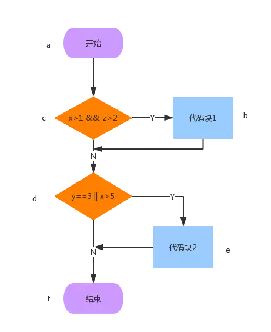

# SpringBoot单元测试

Spring Boot提供了一些注解和工具去帮助开发者测试他们的应用。相较于SpringBoot1.3，SpringBoot1.4对测试有了大的改进，以下示例适用SpringBoot1.4.1以及以上版本。在项目中使用Spring Boot Test支持，只需要在pom.xml引入如下配置即可：

```
<dependency>
    <groupId>org.springframework.boot</groupId>
    <artifactId>spring-boot-starter-test</artifactId>
    <scope>test</scope>
</dependency>
```

#### 1. spring-boot-start-test

SpringBoot提供了`spring-boot-start-test`启动器，该启动器提供了常见的单元测试库：

- [JUnit](https://link.jianshu.com/?t=http://junit.org/junit4/)： 一个Java语言的单元测试框架
- [Spring Test](https://link.jianshu.com/?t=http://docs.spring.io/spring/docs/4.3.5.RELEASE/spring-framework-reference/htmlsingle/#integration-testing.html) & Spring Boot Test：为Spring Boot应用提供集成测试和工具支持
- [AssertJ](https://link.jianshu.com/?t=https://joel-costigliola.github.io/assertj/)：支持流式断言的Java测试框架
- [Hamcrest](https://link.jianshu.com/?t=http://hamcrest.org/JavaHamcrest/)：一个匹配器库
- [Mockito](https://link.jianshu.com/?t=http://site.mockito.org/)：一个java mock框架
- [JSONassert](https://link.jianshu.com/?t=https://github.com/skyscreamer/JSONassert)：一个针对JSON的断言库
- [JsonPath](https://link.jianshu.com/?t=https://github.com/jayway/JsonPath)：JSON XPath库

#### 2. 常用注解

这里介绍一些Spring Boot单元测试常用的注解，更多详细请到Spring Boot官网[查看]
([http://docs.spring.io/spring-boot/docs/1.4.1.RELEASE/reference/htmlsingle/#boot-features-testing](https://link.jianshu.com/?t=http://docs.spring.io/spring-boot/docs/1.4.1.RELEASE/reference/htmlsingle/#boot-features-testing))。

- `@RunWith(SpringRunner.class)`

  JUnit运行使用Spring的测试支持。SpringRunner是SpringJUnit4ClassRunner的新名字，这样做的目的
  仅仅是为了让名字看起来更简单一点。

- `@SpringBootTest`

  该注解为SpringApplication创建上下文并支持Spring Boot特性，其`webEnvironment`提供如下配置：

  `Mock`-加载WebApplicationContext并提供Mock Servlet环境，嵌入的Servlet容器不会被启动。

  `RANDOM_PORT`-加载一个EmbeddedWebApplicationContext并提供一个真实的servlet环境。嵌入的Servlet容器将被启动并在一个随机端口上监听。

  `DEFINED_PORT`-加载一个EmbeddedWebApplicationContext并提供一个真实的servlet环境。嵌入的Servlet容器将被启动并在一个默认的端口上监听
  （application.properties配置端口或者默认端口8080）。

  `NONE`-使用SpringApplication加载一个ApplicationContext，但是不提供任何的servlet环境。

- `@MockBean`

  在你的ApplicationContext里为一个bean定义一个Mockito mock。

- `@SpyBean`

  定制化Mock某些方法。使用`@SpyBean`除了被打过桩的函数，其它的函数都将真实返回。

- `@WebMvcTest`

  该注解被限制为一个单一的controller，需要利用@MockBean去Mock合作者（如service）。

> 测试用例设计

#### 1. 测试用例设计方法

根据目前现状，单元测试主要用来进行程序核心逻辑测试。逻辑覆盖测试是通过对程序逻辑结构的遍历来实现程序逻辑覆盖。从对源代码的覆盖程度不同分为以下六种标准，本文只对其中的五种进行分析（路径覆盖除外），下面从一段代码开始。

```
    public int example(int x, int y, int z){
        if (x>1 && z>2){
            x = x + y;
        }
        if (y == 3 || x > 5){
            x = x - 2;
        }
        return x;
    }
```

一般单元测试不会根据代码来写用例，而是会根据流程图来编写测试用例，以上代码画出的流程图如下：



函数流程图

- `语句覆盖`

  ##### 1. 概念

  设计足够多的测试用例，使得被测试程序中的每条可执行语句至少被执行一次。

  ##### 2. 测试用例

##### 3. 测试的充分性

```
 假设语句`x1&&z>2`中的`&&`写成了`||`上面的测试用例是检查不出来的。
```

- `判定覆盖`

  ##### 1. 概念

  设计足够的测试用例使得代码中的判断`真`、`假`分支至少被执行一次。我们标记`x>1&&z>2` 为P1 `y==3 || x>5`为P2。

##### 2. 测试用例

##### 3. 测试的充分性

```
假设语句`y==3 || x>5`中的`||`写成了`&&`上面的测试用例是检查不出来的。和语句覆盖相比：由于判定覆盖不是在判断假分支就是在判断真分支，所以满足了判定覆盖就一定会满足语句覆盖。
```

- `条件覆盖`

##### 1. 概念

```
 设计足够多的测试用例，使得被测试程序每个判断语句中的每个逻辑条件的可能值至少满足一次。在本例中有两个判断分支`(x>1&&z>2)`和` (y == 3 || x > 5)`分别记为P1和P2。总共有三个条件`x>1`、`z>2`、`y==3`和`x>5`分别记为B1、B2、B3、B4。
```

##### 2. 测试用例

| 数据          | P1   | P2   | B1   | B2   | B3   | B4   | 执行路径   |
| ------------- | ---- | ---- | ---- | ---- | ---- | ---- | ---------- |
| {x=0;y=2;z=3} | F    | F    | F    | T    | F    | F    | a->c->d->f |
| {x=3;y=3;z=1} | F    | T    | T    | F    | T    | T    | a->c->d->f |

##### 3. 测试的充分性

```
从上面的结论看，条件覆盖没法满足100%的语句覆盖，当然没法满足100%的判定覆盖。
```

- `判定/条件覆盖`

##### 1. 概念

```
同时满足100%的条件覆盖和100%的判定覆盖。
```

##### 2. 测试用例

| 数据          | P1   | P2   | B1   | B2   | B3   | B4   | 执行路径         |
| ------------- | ---- | ---- | ---- | ---- | ---- | ---- | ---------------- |
| {x=0;y=2;z=1} | F    | F    | F    | F    | F    | F    | a->c->d->f       |
| {x=3;y=3;z=3} | T    | T    | T    | T    | T    | T    | a->c->b->d->e->f |

```
##### 3. 测试的充分性
达到100%判定-条件覆盖标准一定能够达到100%条件覆盖、100%判定覆盖和100%语句覆盖。
```

- `条件组合覆盖`

  ##### 1. 概念

  设计足够多的测试用例，使得被测试程序中的每个判断的所有可能条件取值的组合至少被满足一次。
  `注意`:

  - 条件组合只针对同一个判断语句内存在多个判断条件，让这些条件的取值进行笛卡尔乘积组合。
  - 不同判断语句内的条件无需组合
  - 对于单条件语句，只需要满足自己的所有取值即可

  本例中判断`(x>1&&z>2)`有如下组合：(1)x>1&&z>2 (2)x>1&&z<=2 (3)x<=1&&z>2 (4) x<=1&&z<=2;判断 `(y == 3 || x > 5)`有如下组合(1)y==3||x>5 (2)y==3||x<=5 (3)y!=3||x>5 (4)y!=3||x<=5

##### 2. 测试用例

| 条件组合                   | 数据          | 执行路径         |
| -------------------------- | ------------- | ---------------- |
| x>1 and z>2 y==3 or x>5    | {x=3;z=3;y=3} | a->c->b->d->e->f |
| x>1 and z<=2 y==3 or x<=5  | {x=2;z=3;y=3} | a->c->b->d->f    |
| x<=1 and z>2 y!=3 or x>5   | {x=1;z=3;y=5} | a->c->d->e->f    |
| x<=1 and z<=2 y!=3 or x<=5 | {x=1;z=2;y=3} | a->c->d->f       |

##### 3. 测试的充分性

```
100%满足条件组合标准一定满足100%条件覆盖标准和100%判定覆盖标准。
```

> 在单元测试中替代Get和Post请求测试方式

```
@RunWith(SpringRunner.class)
@SpringBootTest(webEnvironment = SpringBootTest.WebEnvironment.RANDOM_PORT)
public class ScoreControllerTestNew {
    @Autowired
    private TestRestTemplate restTemplate;
    @Test
    public void testScore(){
        String jsonStr = "{\"data\":{\"debit_account_balance_code\":40,\"credit_consume_count\":1,\"debit_start_age\":1,\"debit_consume_sum_code\":2,\"age\":38},\"modelProductId\":55}";
        String content = this.restTemplate.postForObject("/scoreApi/score", jsonStr, String.class );
        assertThat(content).isEqualTo("{\"result\":{\"score\":\"300\",\"logit\":21.144779999999997},\"response_code\":\"00\",\"response_msg\":\"success\"}");
    }
}
```

> 测试Controller

在测试Controller时需要进行隔离测试，这个时候需要Mock Service层的服务。

```java
@RunWith(SpringRunner.class)
@WebMvcTest(ScoreController.class)
public class ScoreControllerTestNew {
    @Autowired
    private MockMvc mockMvc;

    @MockBean
    private ICalculateService calculateService;
    @MockBean
    private IModelMonitorService modelMonitorService;
    @MockBean
    private IScoreConfigService scoreConfigService;
    @MockBean
    private IModelProductService modelProductService;
    @Before
    public void setUp(){
    }
    @Test
    public void testScore() throws Exception {
        given(this.modelProductService.get(anyLong()))
                .willReturn(null);
        String jsonStr = "{\"data\":{\"debit_account_balance_code\":40,\"credit_consume_count\":1,\"debit_start_age\":1,\"debit_consume_sum_code\":2,\"age\":38},\"modelProductId\":5}";
        RequestBuilder requestBuilder = null;
        requestBuilder = post("/scoreApi/score").contentType(MediaType.APPLICATION_JSON).content(jsonStr);
        this.mockMvc.perform(requestBuilder).andExpect(status().isOk()).andExpect(MockMvcResultMatchers.content().string("{}"));
    }
}
```

> 测试Service

测试Service和测试Controller类似，同样采用隔离法。

```java
@RunWith(SpringRunner.class)
@SpringBootTest
public class ServiceTest {
    @MockBean
    private ModelMonitorMapper modelMonitorMapper;
    @Autowired
    private IModelMonitorService modelServiceServiceImpl;
    @Test
    public void testModelServiceServiceImpl(){
        given(modelMonitorMapper.insert(anyObject()))
                .willReturn(0);
        int n =  modelServiceServiceImpl.insert(new ModelMonitor());
        assertThat(n).isEqualTo(0);
    }
}
```

> 测试Dao

测试的时候为了防止引入脏数据使用注解@Transactional和@Rollback在测试完成后进行回滚。

```java
@RunWith(SpringRunner.class)
@SpringBootTest
@Transactional
public class ScoreControllerTestNew {

    @Autowired
    private ModelMonitorMapper modelMonitorMapper;
    @Test
    @Rollback
    public void testDao() throws Exception {
        ModelMonitor modelMonitor = new ModelMonitor();
        modelMonitor.setModelProductId(Long.parseLong("5"));
        modelMonitor.setLogit(21.144779999999997);
        modelMonitor.setDerivedVariables("{\"debit_account_balance_code\":1.0,\"credit_consume_count\":1.0,\"debit_start_age\":1.0,\"debit_consume_sum_code\":1.0,\"age\":1.0}");
        modelMonitor.setScore("300");
        modelMonitor.setSrcData("{\"data\":{\"debit_account_balance_code\":40,\"credit_consume_count\":1,\"debit_start_age\":1,\"debit_consume_sum_code\":2,\"age\":38},\"modelProductId\":5}");
        int n = modelMonitorMapper.insert(modelMonitor);
        assertThat(n).as("检查数据是否成功插入").isEqualTo(0);
    }
}
```


https://www.jianshu.com/p/813fd69aabee