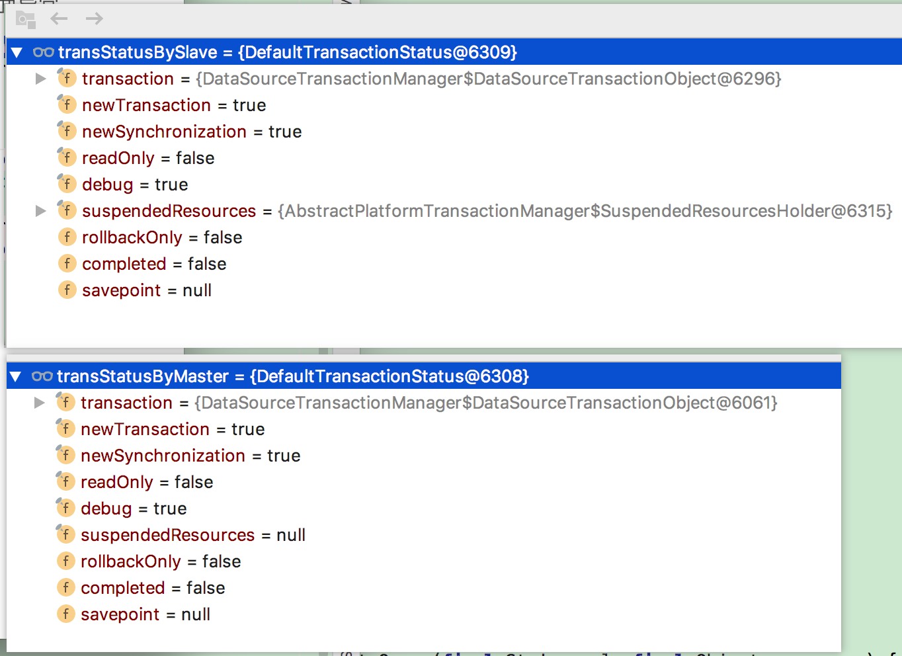

# spring 手动提交事务顺序问题导致的异常：java.lang.IllegalStateException: Cannot deactivate transaction synchronization - not active. 

2012年12月28日 14:12:02 [enjoyinwind](https://me.csdn.net/enjoyinwind) 阅读数：8007


使用spring在应用开发中出现如下异常：

```
java.lang.IllegalStateException: Cannot deactivate transaction synchronization - not active
        at org.springframework.transaction.support.TransactionSynchronizationManager.clearSynchronization(TransactionSynchronizationManager.java:313)
        at org.springframework.transaction.support.TransactionSynchronizationManager.clear(TransactionSynchronizationManager.java:451)
        at org.springframework.transaction.support.AbstractPlatformTransactionManager.cleanupAfterCompletion(AbstractPlatformTransactionManager.java:986)
        at org.springframework.transaction.support.AbstractPlatformTransactionManager.processCommit(AbstractPlatformTransactionManager.java:782)
        at org.springframework.transaction.support.AbstractPlatformTransactionManager.commit(AbstractPlatformTransactionManager.java:701)
```

上述异常是由于spring的事务处理是按照

LIFO/stack behavior的方式进行的，所以在多个事务进行提交时必须按照上述规则进行，否则就会报上面异常。


## 问题分析

问题重现示例

```
    /**
     * <B>Description:</B> 跨数据库事务管理,手动方式 <br>
     * <B>Create on:</B> 2019-01-25 19:36 <br>
     *
     * @author xiangyu.ye
     */
    public void updateMultiByManual(User record) {

        TransactionStatus transStatusByMaster = masterTransactionManager.getTransaction(new DefaultTransactionDefinition());
        TransactionStatus transStatusBySlave = slaveTransactionManager.getTransaction(new DefaultTransactionDefinition());
        try {


            userWriteDao.updateByPrimaryKeySelective(record);
            userReadOnlyDao.updateByPrimaryKeySelective(record);
            int a = 1/0;


            slaveTransactionManager.commit(transStatusBySlave);
            masterTransactionManager.commit(transStatusByMaster);
        } catch (Throwable e) {
            masterTransactionManager.rollback(transStatusByMaster);
            slaveTransactionManager.rollback(transStatusBySlave);
            //异常处理
            throw e;
        }
    }
```

报错位置:

org.springframework.transaction.support.TransactionSynchronizationManager#getSynchronizations

```java
	/**
	 * Return an unmodifiable snapshot list of all registered synchronizations
	 * for the current thread.
	 * @return unmodifiable List of TransactionSynchronization instances
	 * @throws IllegalStateException if synchronization is not active
	 * @see TransactionSynchronization
	 */
	public static List<TransactionSynchronization> getSynchronizations() throws IllegalStateException {
		Set<TransactionSynchronization> synchs = synchronizations.get();
		if (synchs == null) {
			throw new IllegalStateException("Transaction synchronization is not active");
		}
		// Return unmodifiable snapshot, to avoid ConcurrentModificationExceptions
		// while iterating and invoking synchronization callbacks that in turn
		// might register further synchronizations.
		if (synchs.isEmpty()) {
			return Collections.emptyList();
		}
		else {
			// Sort lazily here, not in registerSynchronization.
			List<TransactionSynchronization> sortedSynchs = new ArrayList<>(synchs);
			AnnotationAwareOrderComparator.sort(sortedSynchs);
			return Collections.unmodifiableList(sortedSynchs);
		}
	}
```

synchronizations.get() 第二次是null所以抛出异常

当masterTransactionManager.getTransaction(new DefaultTransactionDefinition()); 第一个打开事务,接着第二个slaveTransactionManager.getTransaction(new DefaultTransactionDefinition());打开事务,会把第一个suspend暂停,如下图: suspendenResources属性区别




然后在rollback里面org.springframework.transaction.support.AbstractPlatformTransactionManager#cleanupAfterCompletion

```
	private void cleanupAfterCompletion(DefaultTransactionStatus status) {
		status.setCompleted();
		if (status.isNewSynchronization()) {
			TransactionSynchronizationManager.clear();
		}
		if (status.isNewTransaction()) {
			doCleanupAfterCompletion(status.getTransaction());
		}
		if (status.getSuspendedResources() != null) {
			if (status.isDebug()) {
				logger.debug("Resuming suspended transaction after completion of inner transaction");
			}
			Object transaction = (status.hasTransaction() ? status.getTransaction() : null);
			resume(transaction, (SuspendedResourcesHolder) status.getSuspendedResources());
		}
	}
```

if (status.getSuspendedResources() != null) {这段话判断 状态是否有暂定的资源,如果有执行resume方法,最终执行到org.springframework.transaction.support.TransactionSynchronizationManager#initSynchronization

```
	public static void initSynchronization() throws IllegalStateException {
		if (isSynchronizationActive()) {
			throw new IllegalStateException("Cannot activate transaction synchronization - already active");
		}
		logger.trace("Initializing transaction synchronization");
		synchronizations.set(new LinkedHashSet<>());
	}
```

这个时候synchronizations.get() 第二次就不会null异常出现了.所以事务的最后一个开启需要第一个rollback和commit才不会报错.

https://blog.csdn.net/enjoyinwind/article/details/8447383