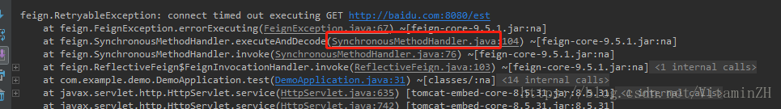
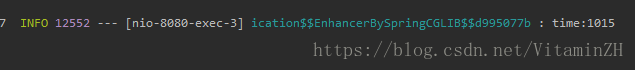

[TOC]


# Feign的超时与重试设置（SpringCloud2.0）

2018年07月03日 00:22:47 [VitaminZH](https://me.csdn.net/VitaminZH) 阅读数：6381

## 1.Feign的依赖

```
        <dependency>
            <groupId>org.springframework.cloud</groupId>
            <artifactId>spring-cloud-starter-openfeign</artifactId>
            <version>2.0.0.RELEASE</version>
        </dependency>12345
```

## 2. 开启feign的使用注解

> `@EnableFeignClients`

## 3 编写测试样例，主机可以调通，接口不可用

```
package com.example.demo;

import org.springframework.cloud.openfeign.FeignClient;
import org.springframework.web.bind.annotation.RequestMapping;

@FeignClient(name = "service",url = "http://baidu.com:8080")
public interface FeignTestService {

    @RequestMapping("/est")
    String get();
} 
```

```
package com.example.demo;

import org.slf4j.Logger;
import org.slf4j.LoggerFactory;
import org.springframework.beans.factory.annotation.Autowired;
import org.springframework.boot.SpringApplication;
import org.springframework.boot.autoconfigure.SpringBootApplication;
import org.springframework.cloud.openfeign.EnableFeignClients;
import org.springframework.web.bind.annotation.RequestMapping;
import org.springframework.web.bind.annotation.RestController;

@SpringBootApplication
@RestController
@RequestMapping("/feign")
@EnableFeignClients
public class DemoApplication {

    private Logger logger = LoggerFactory.getLogger(getClass());

    @Autowired
    private FeignTestService feignTestService;

    public static void main(String[] args) {
        SpringApplication.run(DemoApplication.class, args);
    }

    @RequestMapping("/test")
    public String test() {
        long start = System.currentTimeMillis();
        try {
            feignTestService.get();
        } catch (Exception e) {
            logger.error("", e);
            logger.info("time:" + (System.currentTimeMillis() - start));
            return "error";
        }
        return "test";
    }
} 
```


 
`观察发现，总的超时时间是10s。`

## 4.Feign的重试、超时自定义

`FeignClient的默认超时时间为10s，不会开启重试机制，需要自定义配置。`

```
//超时时间设置,开启重试机制，默认为5次（包含首次请求）
package com.example.demo;

import feign.Request;
import feign.Retryer;
import org.springframework.context.annotation.Bean;
import org.springframework.context.annotation.Configuration;

@Configuration
public class FeignConfigure {
     public static int connectTimeOutMillis = 12000;//超时时间
     public static int readTimeOutMillis = 12000;
     @Bean
     public Request.Options options() {
            return new Request.Options(connectTimeOutMillis, readTimeOutMillis);
     }

     @Bean
     public Retryer feignRetryer() {
          return new Retryer.Default();
     }
} 
```

```
     //自定义重试次数
 	 @Bean
     public Retryer feignRetryer(){
          Retryer retryer = new Retryer.Default(100, 1000, 4);
          return retryer;
     } 
```

## 5.通过配置文件修改feign的超时时间

`yml文件配置：`

```
feign:
  client:
    config:
      remote-service:           #服务名，填写default为所有服务
        connectTimeout: 1000
        readTimeout: 12000 
```

 
<https://cloud.spring.io/spring-cloud-netflix/multi/multi_spring-cloud-feign.html>

## 6.重试、超时相关源码

```
/*
 * Copyright 2013 Netflix, Inc.
 *
 * Licensed under the Apache License, Version 2.0 (the "License");
 * you may not use this file except in compliance with the License.
 * You may obtain a copy of the License at
 *
 *     http://www.apache.org/licenses/LICENSE-2.0
 *
 * Unless required by applicable law or agreed to in writing, software
 * distributed under the License is distributed on an "AS IS" BASIS,
 * WITHOUT WARRANTIES OR CONDITIONS OF ANY KIND, either express or implied.
 * See the License for the specific language governing permissions and
 * limitations under the License.
 */
package feign;

import static java.util.concurrent.TimeUnit.SECONDS;

/**
 * Cloned for each invocation to {@link Client#execute(Request, feign.Request.Options)}.
 * Implementations may keep state to determine if retry operations should continue or not.
 */
public interface Retryer extends Cloneable {

  /**
   * if retry is permitted, return (possibly after sleeping). Otherwise propagate the exception.
   */
  void continueOrPropagate(RetryableException e);

  Retryer clone();

  public static class Default implements Retryer {

    private final int maxAttempts;
    private final long period;
    private final long maxPeriod;
    int attempt;
    long sleptForMillis;

    //默认重试次数
    public Default() {
      this(100, SECONDS.toMillis(1), 5);
    }

    public Default(long period, long maxPeriod, int maxAttempts) {
      this.period = period;
      this.maxPeriod = maxPeriod;
      this.maxAttempts = maxAttempts;
      this.attempt = 1;
    }

    // visible for testing;
    protected long currentTimeMillis() {
      return System.currentTimeMillis();
    }

    //重试规则
    public void continueOrPropagate(RetryableException e) {
      if (attempt++ >= maxAttempts) {
        throw e;
      }

      long interval;
      if (e.retryAfter() != null) {
        interval = e.retryAfter().getTime() - currentTimeMillis();
        if (interval > maxPeriod) {
          interval = maxPeriod;
        }
        if (interval < 0) {
          return;
        }
      } else {
        interval = nextMaxInterval();
      }
      try {
        Thread.sleep(interval);
      } catch (InterruptedException ignored) {
        Thread.currentThread().interrupt();
      }
      sleptForMillis += interval;
    }

    /**
     * Calculates the time interval to a retry attempt. <br> The interval increases exponentially
     * with each attempt, at a rate of nextInterval *= 1.5 (where 1.5 is the backoff factor), to the
     * maximum interval.
     *
     * @return time in nanoseconds from now until the next attempt.
     */
     //重试等待时间算法
    long nextMaxInterval() {
      long interval = (long) (period * Math.pow(1.5, attempt - 1));
      return interval > maxPeriod ? maxPeriod : interval;
    }

    @Override
    public Retryer clone() {
      return new Default(period, maxPeriod, maxAttempts);
    }
  }

  /**
   * Implementation that never retries request. It propagates the RetryableException.
   */
   //默认不重试
  Retryer NEVER_RETRY = new Retryer() {

    @Override
    public void continueOrPropagate(RetryableException e) {
      throw e;
    }

    @Override
    public Retryer clone() {
      return this;
    }
  };
}

//超时相关
public static class Options {

    private final int connectTimeoutMillis;
    private final int readTimeoutMillis;

    public Options(int connectTimeoutMillis, int readTimeoutMillis) {
      this.connectTimeoutMillis = connectTimeoutMillis;
      this.readTimeoutMillis = readTimeoutMillis;
    }

    public Options() {
      this(10 * 1000, 60 * 1000);
    }

    /**
     * Defaults to 10 seconds. {@code 0} implies no timeout.
     *
     * @see java.net.HttpURLConnection#getConnectTimeout()
     */
    public int connectTimeoutMillis() {
      return connectTimeoutMillis;
    }

    /**
     * Defaults to 60 seconds. {@code 0} implies no timeout.
     *
     * @see java.net.HttpURLConnection#getReadTimeout()
     */
    public int readTimeoutMillis() {
      return readTimeoutMillis;
    }
  }
```


https://blog.csdn.net/VitaminZH/article/details/80892395