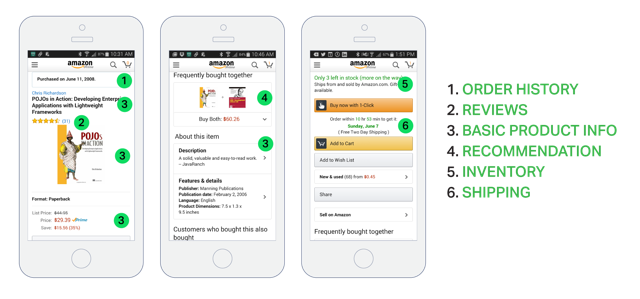
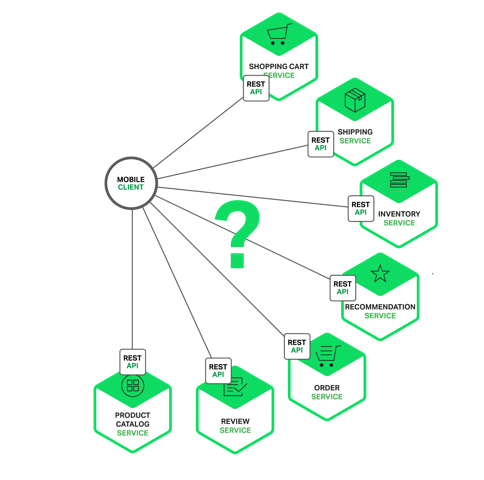

[TOC]

# zuul 使用 API 网关构建微服务

Posted on [2016年5月12日](http://blog.daocloud.io/microservices-2/)

> **编者的话｜**本文来自 Nginx 官方博客，是微服务系列文章的第二篇，本文将探讨：微服务架构是如何影响客户端到服务端的通信，并提出一种使用 API 网关的方法。

**作者介绍：**Chris Richardson，是世界著名的软件大师，经典技术著作《POJOS IN ACTION》一书的作者，也是 cloudfoundry.com 最初的创始人，Chris Richardson 与 Martin Fowler、Sam Newman、Adrian Cockcroft 等并称为世界十大软件架构师。

**Chris Richardson 微服务系列全 7 篇：**

> 1.[微服务架构的优势与不足](http://blog.daocloud.io/microservices-1/)
>
> \2. 使用 API 网关构建微服务
>
> 3. 深入微服务架构的进程间通信
>
> 4. 服务发现的可行方案以及实践案例
>
> 5. 微服务的事件驱动数据管理
>
> 6. 选择微服务部署策略
>
> \7. 将单体应用改造为微服务

**Chris Richardson 所著所有文章已独家授权 DaoCloud 翻译并刊载。**

## 本期内容

微服务系列文章的第一篇介绍了微服务架构模式，讨论了使用微服务的优缺点，以及为什么微服务虽然复杂度高却是复杂应用程序的理想选择。

在决定以一组微服务来构建自己的应用时，你需要确定应用客户端如何与微服务交互。

在单体式程序中，通常只有一组冗余的或者负载均衡的服务提供点。在微服务架构中，每一个微服务暴露一组细粒度的服务提供点。在本篇文章中，我们来看它如何影响客户端到服务端通信，并提出一种使用 API 网关的方法。

## 简要概述

让我们想象一下，你要为一个购物应用程序开发一个原生移动客户端。你很可能需要实现一个产品详情页面，展示任何指定商品的信息。

下图展示了 Amazon Android 应用在商品详情页显示的内容。

 

即使只是个智能手机应用，产品详情页面也显示了大量的信息。该页面不仅包含基本的产品信息（如名称、描述、价格），而且还显示了如下内容：

> - 购物车中的商品数量
> - 历史订单
> - 客户评论
> - 低库存预警
> - 送货选项
> - 各种推荐，包括经常与该商品一起购买的其它商品、购买该商品的客户购买的其它商品、购买该商品的客户看过的其它商品
> - 其它的购物选择

使用单体应用程序架构时，移动客户端通过向应用程序发起一次 REST 调用（GET api.company.com/productdetails/）来获取这些数据。负载均衡器将请求路由给 N 个相同的应用程序实例中的其中之一。然后，应用程序会查询各种数据库表，并将响应返回给客户端。

相反，若是采用微服务架构，显示在产品页上的数据会分布在不同的微服务上。下面列举了可能与产品详情页数据有关的一些微服务：

> - 购物车服务——购物车中的件数
> - 订单服务——历史订单
> - 目录服务——商品基本信息，如名称、图片和价格
> - 评论服务——客户的评论
> - 库存服务——低库存预警
> - 送货服务——送货选项、期限和费用，这些信息单独从送货方 API 获取
> - 推荐服务——推荐商品

我们需要决定移动客户端如何访问这些服务。让我们看看有哪些方法。

## 客户端与微服务直接通信

从理论上讲，客户端可以直接向每个微服务发送请求。每个微服务都有一个公开的端点(https ://.api.company.name）。该 URL 映射到微服务的负载均衡器，由后者负责在可用实例之间分发请求。为了获取产品详情，移动客户端将逐一向上文列出的 N 个服务发送请求。

遗憾的是，这种方法存在挑战和局限。**问题之一是客户端需求和每个微服务暴露的细粒度 API 不匹配。**在这个例子中，客户端需要发送 7 个独立请求。在更复杂的应用程序中，可能要发送更多的请求；按照 Amazon 的说法，他们在显示他们的产品页面时就调用了数百个服务。然而，客户端通过 LAN 发送许多请求，这在公网上可能会很低效，在移动网络上就根本不可行。这种方法还使得客户端代码非常复杂。

**客户端直接调用微服务的另一个问题是，部分服务使用的协议对 web 并不友好。**一个服务可能使用 Thrift 二进制 RPC，而另一个服务可能使用 AMQP 消息传递协议。不管哪种协议对于浏览器或防火墙都不够友好，最好是内部使用。在防火墙之外，应用程序应该使用诸如 HTTP 和 WebSocket 之类的协议。

**这种方法的另一个缺点是，它会使得微服务难以重构。**随着时间推移，我们可能想要更改系统拆分成服务的方式。例如，我们可能合并两个服务，或者将一个服务拆分成两个或更多服务。然而，如果客户端与微服务直接通信，那么执行这类重构就非常困难了。

由于上述三种问题的原因，客户端直接与服务器端通信的方式很少在实际中使用。

## 使用 API 网关构建微服务

通常来说，使用 API 网关是更好的解决方式。API 网关是一个服务器，也可以说是进入系统的唯一节点。这与面向对象设计模式中的 Facade 模式很像。API 网关封装内部系统的架构，并且提供 API 给各个客户端。它还可能还具备授权、监控、负载均衡、缓存、请求分片和管理、静态响应处理等功能。下图展示了一个适应当前架构的 API 网关。

API 网关负责服务请求路由、组合及协议转换。客户端的所有请求都首先经过 API 网关，然后由它将请求路由到合适的微服务。API 网关经常会通过调用多个微服务并合并结果来处理一个请求。它可以在 web 协议（如 HTTP 与 WebSocket）与内部使用的非 web 友好协议之间转换。

API 网关还能为每个客户端提供一个定制的 API。通常，它会向移动客户端暴露一个粗粒度的 API。以产品详情的场景为例，API 网关可以提供一个端点（/productdetails?productid=xxx），使移动客户端可以通过一个请求获取所有的产品详情。API 网关通过调用各个服务（产品信息、推荐、评论等等）并合并结果来处理请求。

**Netflix API 网关是一个很好的 API 网关实例。**Netflix 流媒体服务提供给成百上千种类型的设备使用，包括电视、机顶盒、智能手机、游戏系统、平板电脑等等。

最初，Netflix 试图为他们的流媒体服务提供一个通用的 API。然而他们发现，由于各种各样的设备都有自己独特的需求，这种方式并不能很好地工作。如今，他们使用一个 API 网关，通过运行与针对特定设备的适配器代码，来为每种设备提供定制的 API。通常，一个适配器通过调用平均 6 到 7 个后端服务来处理每个请求。Netflix API 网关每天处理数十亿请求。

## API 网关的优点和缺点

如你所料，使用 API 网关有优点也有不足。**使用 API 网关的最大优点是，它封装了应用程序的内部结构。**客户端只需要同网关交互，而不必调用特定的服务。API 网关为每一类客户端提供了特定的 API，这减少了客户端与应用程序间的交互次数，还简化了客户端代码。

**API 网关也有一些不足。它增加了一个我们必须开发、部署和维护的高可用组件。还有一个风险是，API 网关变成了开发瓶颈。**为了暴露每个微服务的端点，开发人员必须更新 API 网关。API网关的更新过程要尽可能地简单，这很重要；否则，为了更新网关，开发人员将不得不排队等待。不过，虽然有这些不足，但对于大多数现实世界的应用程序而言，使用 API 网关是合理的。

## 实现 API 网关

到目前为止，我们已经探讨了使用 API 网关的动力及其优缺点。下面让我们看一下需要考虑的各种设计问题。

### **性能和可扩展性**

只有少数公司拥有 Netflix 这样的规模，需要每天处理每天需要处理数十亿请求。不管怎样，对于大多数应用程序而言，API 网关的性能和可扩展性都非常重要。**因此，将 API 网关构建在一个支持异步、I/O 非阻塞的平台上是合理的。**有多种不同的技术可以实现一个可扩展的 API 网关。在 JVM 上，可以使用一种基于 NIO 的框架，比如 Netty、Vertx、Spring Reactor 或 JBoss Undertow 中的一种。一个非常流行的非 JVM 选项是 Node.js，它是一个基于 Chrome JavaScript 引擎构建的平台。

另一个方法是使用 NGINX Plus。NGINX Plus 提供了一个成熟的、可扩展的、高性能 web 服务器和一个易于部署的、可配置可编程的反向代理。NGINX Plus 可以管理身份验证、访问控制、负载均衡请求、缓存响应，并提供应用程序可感知的健康检查和监控。

### **使用响应式编程模型**

API 网关通过简单地将请求路由给合适的后端服务来处理部分请求，而通过调用多个后端服务并合并结果来处理其它请求。对于部分请求，比如产品详情相关的多个请求，它们对后端服务的请求是独立于其它请求的。为了最小化响应时间，API 网关应该并发执行独立请求。

然而，有时候，请求之间存在依赖。在将请求路由到后端服务之前，API 网关可能首先需要调用身份验证服务验证请求的合法性。类似地，为了获取客户心愿单中的产品信息，API 网关必须首先获取包含这些信息的客户资料，然后再获取每个产品的信息。关于 API 组合，另一个有趣的例子是 Netflix Video Grid。

使用传统的异步回调方法编写 API 组合代码会让你迅速坠入回调地狱。代码会变得混乱、难以理解且容易出错。一个更好的方法是使用响应式方法，以一种声明式样式编写 API 网关代码。响应式抽象概念的例子有 Scala 中的 Future、Java 8 中的 CompletableFuture 和 JavaScript 中的P romise，还有最初微软为 .NET 平台开发的 Reactive Extensions（RX）。Netflix 创建了 RxJava for JVM，专门用于他们的 API 网关。此外，还有 RxJS for JavaScript，它既可以在浏览器中运行，也可以在 Node.js 中运行。使用响应式方法能让你编写简单但高效的 API 网关代码。

### **服务调用**

基于微服务的应用程序是一个分布式系统，必须使用一种进程间通信机制。有两种类型的进程间通信机制可供选择。**一种是使用异步的、基于消息传递的机制。**有些实现使用诸如 JMS 或 AMQP 那样的消息代理，而其它的实现（如 Zeromq）则没有代理，服务间直接通信。

**另一种进程间通信类型是诸如 HTTP 或 Thrift 那样的同步机制。**通常，一个系统会同时使用异步和同步两种类型。它甚至还可能使用同一类型的多种实现。总之，API 网关需要支持多种通信机制。

### **服务发现**

API 网关需要知道它与之通信的每个微服务的位置（IP 地址和端口）。在传统的应用程序中，或许可以硬连线这个位置，但在现代的、基于云的微服务应用程序中，这并不是一个容易解决的问题。基础设施服务（如消息代理）通常会有一个静态位置，可以通过 OS 环境变量指定。但是，确定一个应用程序服务的位置没有这么简单。应用程序服务的位置是动态分配的，而且，单个服务的一组实例也会随着自动扩展或升级而动态变化。

**总之，像系统中的其它服务客户端一样，API 网关需要使用系统的服务发现机制，可以是服务器端发现，也可以是客户端发现。**下一篇文章将更详细地描述服务发现。现在，需要注意的是，如果系统使用客户端发现，那么 API 网关必须能够查询服务注册中心，这是一个包含所有微服务实例及其位置的数据库。

### **处理局部失败**

在实现 API 网关时，还需要处理局部失败的问题。该问题出现在所有的分布式系统中。当一个服务调用另一个服务，而后者响应慢或不可用的时候，就会出现这个问题。API 网关不能因为无限期地等待下游服务而阻塞。不过，如何处理失败取决于特定的场景以及哪个服务失败。例如，在产品详情场景下，如果推荐服务无响应，那么 API 网关应该向客户端返回产品详情的其它内容，因为它们对用户依然有用。推荐内容可以为空，也可以用一个固定的 TOP 10 列表取代。不过，如果产品信息服务无响应，那么 API 网关应该向客户端返回一个错误信息。

如果缓存数据可用，那么 API 网关还可以返回缓存数据。例如，鉴于产品价格不会频繁变动，如果价格服务不可用，API 网关可以返回缓存的价格数据。数据可以由 API 网关自己缓存，也可以存储在像 Redis 或 Memcached 之类的外部缓存中。通过返回默认数据或者缓存数据，API 网关可以确保系统故障不影响用户体验。

在编写代码调用远程服务方面，Netflix Hystrix 是一个格外有用的库。Hystrix 会暂停超出特定阈限的调用。它实现了一个“断路器（circuit breaker）”模式，可以防止客户端对无响应的服务进行不必要的等待。如果服务的错误率超出了设定的阈值，那么 Hystrix 会启动断路器，所有请求会立即失败并持续一定时间。Hystrix 允许用户定义一个请求失败后的后援操作，比如从缓存读取数据，或者返回一个默认值。如果你正在使用 JVM，那么你应该考虑使用 Hystrix；如果你正在使用一个非 JVM 环境，那么可以使用一个功能相同的库。

## 总结

对于大多数基于微服务的应用程序而言，实现 API 网关，将其作为系统的唯一入口很有必要。API 网关负责服务请求路由、组合及协议转换。它为每个应用程序客户端提供一个定制的 API。API 网关还可以通过返回缓存数据或默认数据屏蔽后端服务失败。在本系列的下一篇文章中，我们将探讨服务间通信。

**下期题目：深入微服务架构的进程间通信 ，敬请期待！**

点击“[Building Microservices: Using an API Gateway](https://www.nginx.com/blog/building-microservices-using-an-api-gateway/#rd?sukey=fa67fe3435f5c4be6421e18baad6a2d40a99d952ea34ddbdbd8de1d300544a8e37b45ad97ffee186e8d6fdbc549097c0)”，查看英文原文

http://blog.daocloud.io/microservices-2/