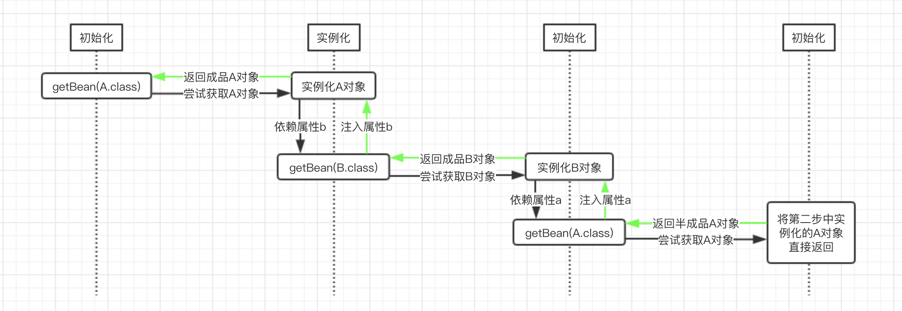

[TOC]


## spring如何解决循环依赖的问题

发布于 2019/08/22 23:25

​    在关于Spring的面试中，我们经常会被问到一个问题，就是Spring是如何解决循环依赖的问题的。这个问题算是关于Spring的一个高频面试题，因为如果不刻意研读，相信即使读过源码，面试者也不一定能够一下子思考出个中奥秘。本文主要针对这个问题，从源码的角度对其实现原理进行讲解。

### 1. 过程演示

​    关于Spring bean的创建，其本质上还是一个对象的创建，既然是对象，读者朋友一定要明白一点就是，一个完整的对象包含两部分：当前对象实例化和对象属性的实例化。在Spring中，对象的实例化是通过反射实现的，而对象的属性则是在对象实例化之后通过一定的方式设置的。这个过程可以按照如下方式进行理解：


​    理解这一个点之后，对于循环依赖的理解就已经帮助一大步了，我们这里以两个类A和B为例进行讲解，如下是A和B的声明：

```java
@Component
public class A {
	@Autowired
  private B b;
}
@Component
public class B {
	@Autowired
  private A a;
}
```

​    可以看到，这里A和B中各自都以对方为自己的全局属性。这里首先需要说明的一点是，Spring实例化bean是通过`ApplicationContext.getBean()`方法来进行的。如果要获取的对象依赖了另一个对象，那么其首先会创建当前对象，然后通过递归的调用`ApplicationContext.getBean()`方法来获取所依赖的对象，最后将获取到的对象注入到当前对象中。这里我们以上面的首先初始化A对象实例为例进行讲解。首先Spring尝试通过`ApplicationContext.getBean()`方法获取A对象的实例，由于Spring容器中还没有A对象实例，因而其会创建一个A对象，然后发现其依赖了B对象，因而会尝试递归的通过`ApplicationContext.getBean()`方法获取B对象的实例，但是Spring容器中此时也没有B对象的实例，因而其还是会先创建一个B对象的实例。读者需要注意这个时间点，此时A对象和B对象都已经创建了，并且保存在Spring容器中了，只不过A对象的属性b和B对象的属性a都还没有设置进去。在前面Spring创建B对象之后，Spring发现B对象依赖了属性A，因而此时还是会尝试递归的调用`ApplicationContext.getBean()`方法获取A对象的实例，因为Spring中已经有一个A对象的实例，虽然只是半成品（其属性b还未初始化），但其也还是目标bean，因而会将该A对象的实例返回。此时，B对象的属性a就设置进去了，然后还是`ApplicationContext.getBean()`方法递归的返回，也就是将B对象的实例返回，此时就会将该实例设置到A对象的属性b中。这个时候，注意A对象的属性b和B对象的属性a都已经设置了目标对象的实例了。读者朋友可能会比较疑惑的是，前面在为对象B设置属性a的时候，这个A类型属性还是个半成品。但是需要注意的是，这个A是一个引用，其本质上还是最开始就实例化的A对象。而在上面这个递归过程的最后，Spring将获取到的B对象实例设置到了A对象的属性b中了，这里的A对象其实和前面设置到实例B中的半成品A对象是同一个对象，其引用地址是同一个，这里为A对象的b属性设置了值，其实也就是为那个半成品的a属性设置了值。下面我们通过一个流程图来对这个过程进行讲解：



​    图中`getBean()`表示调用Spring的`ApplicationContext.getBean()`方法，而该方法中的参数，则表示我们要尝试获取的目标对象。图中的黑色箭头表示一开始的方法调用走向，走到最后，返回了Spring中缓存的A对象之后，表示递归调用返回了，此时使用绿色的箭头表示。从图中我们可以很清楚的看到，B对象的a属性是在第三步中注入的半成品A对象，而A对象的b属性是在第二步中注入的成品B对象，此时半成品的A对象也就变成了成品的A对象，因为其属性已经设置完成了。

### 2. 源码讲解

​    对于Spring处理循环依赖问题的方式，我们这里通过上面的流程图其实很容易就可以理解，需要注意的一个点就是，Spring是如何标记开始生成的A对象是一个半成品，并且是如何保存A对象的。这里的标记工作Spring是使用ApplicationContext的属性`Set singletonsCurrentlyInCreation`来保存的，而半成品的A对象则是通过`Map> singletonFactories`来保存的，这里的`ObjectFactory`是一个工厂对象，可通过调用其`getObject()`方法来获取目标对象。在`AbstractBeanFactory.doGetBean()`方法中获取对象的方法如下：

```java
protected <T> T doGetBean(final String name, @Nullable final Class<T> requiredType,
    @Nullable final Object[] args, boolean typeCheckOnly) throws BeansException {
  // 尝试通过bean名称获取目标bean对象，比如这里的A对象
  Object sharedInstance = getSingleton(beanName);
  
  // 我们这里的目标对象都是单例的
  if (mbd.isSingleton()) {
    // 这里就尝试创建目标对象，第二个参数传的就是一个ObjectFactory类型的对象，这里是使用Java8的lamada
    // 表达式书写的，只要上面的getSingleton()方法返回值为空，则会调用这里的getSingleton()方法来创建
    // 目标对象
    sharedInstance = getSingleton(beanName, () -> {
      try {
        // 尝试创建目标对象
        return createBean(beanName, mbd, args);
      } catch (BeansException ex) {
        throw ex;
      }
    });
  }
  return (T) bean;
}
```

​    这里的`doGetBean()`方法是非常关键的一个方法（中间省略了其他代码），上面也主要有两个步骤，第一个步骤的`getSingleton()`方法的作用是尝试从缓存中获取目标对象，如果没有获取到，则尝试获取半成品的目标对象；如果第一个步骤没有获取到目标对象的实例，那么就进入第二个步骤，第二个步骤的`getSingleton()`方法的作用是尝试创建目标对象，并且为该对象注入其所依赖的属性。

​    这里其实就是主干逻辑，我们前面图中已经标明，在整个过程中会调用三次`doGetBean()`方法，第一次调用的时候会尝试获取A对象实例，此时走的是第一个`getSingleton()`方法，由于没有已经创建的A对象的成品或半成品，因而这里得到的是`null`，然后就会调用第二个`getSingleton()`方法，创建A对象的实例，然后递归的调用`doGetBean()`方法，尝试获取B对象的实例以注入到A对象中，此时由于Spring容器中也没有B对象的成品或半成品，因而还是会走到第二个`getSingleton()`方法，在该方法中创建B对象的实例，创建完成之后，尝试获取其所依赖的A的实例作为其属性，因而还是会递归的调用`doGetBean()`方法，此时需要注意的是，在前面由于已经有了一个半成品的A对象的实例，因而这个时候，再尝试获取A对象的实例的时候，会走第一个`getSingleton()`方法，在该方法中会得到一个半成品的A对象的实例。然后将该实例返回，并且将其注入到B对象的属性a中，此时B对象实例化完成。然后将实例化完成的B对象递归的返回，此时就会将该实例注入到A对象中，这样就得到了一个成品的A对象。我们这里可以阅读上面的第一个`getSingleton()`方法：

```java
@Nullable
protected Object getSingleton(String beanName, boolean allowEarlyReference) {
  // 尝试从缓存中获取成品的目标对象，如果存在，则直接返回
  Object singletonObject = this.singletonObjects.get(beanName);
  // 如果缓存中不存在目标对象，则判断当前对象是否已经处于创建过程中，在前面的讲解中，第一次尝试获取A对象
  // 的实例之后，就会将A对象标记为正在创建中，因而最后再尝试获取A对象的时候，这里的if判断就会为true
  if (singletonObject == null && isSingletonCurrentlyInCreation(beanName)) {
    synchronized (this.singletonObjects) {
      singletonObject = this.earlySingletonObjects.get(beanName);
      if (singletonObject == null && allowEarlyReference) {
        // 这里的singletonFactories是一个Map，其key是bean的名称，而值是一个ObjectFactory类型的
        // 对象，这里对于A和B而言，调用图其getObject()方法返回的就是A和B对象的实例，无论是否是半成品
        ObjectFactory<?> singletonFactory = this.singletonFactories.get(beanName);
        if (singletonFactory != null) {
          // 获取目标对象的实例
          singletonObject = singletonFactory.getObject();
          this.earlySingletonObjects.put(beanName, singletonObject);
          this.singletonFactories.remove(beanName);
        }
      }
    }
  }
  return singletonObject;
}
```

​    这里我们会存在一个问题就是A的半成品实例是如何实例化的，然后是如何将其封装为一个`ObjectFactory`类型的对象，并且将其放到上面的`singletonFactories`属性中的。这主要是在前面的第二个`getSingleton()`方法中，其最终会通过其传入的第二个参数，从而调用`createBean()`方法，该方法的最终调用是委托给了另一个`doCreateBean()`方法进行的，这里面有如下一段代码：

```java
protected Object doCreateBean(final String beanName, final RootBeanDefinition mbd, final @Nullable Object[] args)
  throws BeanCreationException {

  // 实例化当前尝试获取的bean对象，比如A对象和B对象都是在这里实例化的
  BeanWrapper instanceWrapper = null;
  if (mbd.isSingleton()) {
    instanceWrapper = this.factoryBeanInstanceCache.remove(beanName);
  }
  if (instanceWrapper == null) {
    instanceWrapper = createBeanInstance(beanName, mbd, args);
  }
  
  // 判断Spring是否配置了支持提前暴露目标bean，也就是是否支持提前暴露半成品的bean
  boolean earlySingletonExposure = (mbd.isSingleton() && this.allowCircularReferences 
    && isSingletonCurrentlyInCreation(beanName));
  if (earlySingletonExposure) {
    // 如果支持，这里就会将当前生成的半成品的bean放到singletonFactories中，这个singletonFactories
    // 就是前面第一个getSingleton()方法中所使用到的singletonFactories属性，也就是说，这里就是
    // 封装半成品的bean的地方。而这里的getEarlyBeanReference()本质上是直接将放入的第三个参数，也就是
    // 目标bean直接返回
    addSingletonFactory(beanName, () -> getEarlyBeanReference(beanName, mbd, bean));
  }

  try {
    // 在初始化实例之后，这里就是判断当前bean是否依赖了其他的bean，如果依赖了，
    // 就会递归的调用getBean()方法尝试获取目标bean
    populateBean(beanName, mbd, instanceWrapper);
  } catch (Throwable ex) {
    // 省略...
  }
  
  return exposedObject;
}
```

​    到这里，Spring整个解决循环依赖问题的实现思路已经比较清楚了。对于整体过程，读者朋友只要理解两点：

- Spring是通过递归的方式获取目标bean及其所依赖的bean的；
- Spring实例化一个bean的时候，是分两步进行的，首先实例化目标bean，然后为其注入属性。

​    结合这两点，也就是说，Spring在实例化一个bean的时候，是首先递归的实例化其所依赖的所有bean，直到某个bean没有依赖其他bean，此时就会将该实例返回，然后反递归的将获取到的bean设置为各个上层bean的属性的。

### 3. 小结

​    本文首先通过图文的方式对Spring是如何解决循环依赖的问题进行了讲解，然后从源码的角度详细讲解了Spring是如何实现各个bean的装配工作的。

https://my.oschina.net/zhangxufeng/blog/3096394