[TOC]


# Spring中你可能不知道的事

## 第一节

Spring作为Java的王牌开源项目，相信大家都用过，但是可能大家仅仅用到了Spring最常用的功能，Spring实在是庞大了，很多功能可能一辈子都不会用到，今天我就罗列下Spring中你可能不知道的事。一是可以帮助大家以后阅读源码，知道Spring为什么会这么写，二是可以作为知识储备，当人家不会的时候，你正好知道这个点，三下五除二就搞定了，嘿嘿。三是平时吹牛的时候可以更有资本。。。当然最重要的就是可以对Spring有一个更全面的认识。

### register

现在官方推荐应该就是用JavaConfig的风格来完成Spring的配置，也是现在的主流用法。我们经常这么写：

```JAVA
@Configuration
@ComponentScan
public class AppConfig {
}

AnnotationConfigApplicationContext context
=new AnnotationConfigApplicationContext(AppConfig.class);

```

这段代码太简单，就不再解释了，但是我们可以把方法拆分下：

```java
AnnotationConfigApplicationContext context=new AnnotationConfigApplicationContext();
context.register(AppConfig.class); 
```

在第二行代码才去注册配置类。

效果是一样的，我们除了可以注册配置类，还可以单独注册一个 bean：

```java
@Component
public class Service {
}

public class Main {
    public static void main(String[] args) {
        AnnotationConfigApplicationContext context = new AnnotationConfigApplicationContext();
        context.register(Service.class);
        context.refresh();//很重要        
        System.out.println(context.getBean(Service.class).getClass().getSimpleName());
    }
}

```

这样我们就可以完成对bean的注入，这里面有一个细节很重要，需要调用refresh方法，不然会报错：

```java
public class Main {
    public static void main(String[] args) {
        AnnotationConfigApplicationContext context = new AnnotationConfigApplicationContext();
        context.register(Service.class);
        System.out.println(context.getBean(Service.class).getClass().getSimpleName());
    }
} 
```

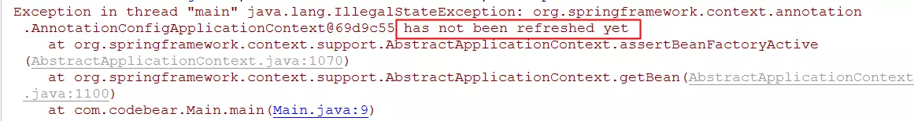


如果选择先实例化AnnotationConfigApplicationContext ，再去注册，当注册配置类的时候，不需要调用refresh方法，但是注册bean的时候，需要调用refresh方法。

### registerBean

上面的方法虽然可以单独注册一个bean，但是在bean的类上，你必须打上@Component或者@Service或者@Repository，如果你不想用默认的作用域，也得打上@Scope，有没有一种方法，可以不用在bean的类上打各种注解？此时registerBean出场了：

```java
public class Service {
    public Service(String str){
        System.out.println(str);
    }
}

public class Main {
    public static void main(String[] args) {
        AnnotationConfigApplicationContext context = new AnnotationConfigApplicationContext();
        context.registerBean("myService", Service.class, () -> new Service("Hello"), z -> {
            z.setScope("prototype");
        });
        context.refresh();
        System.out.println(context.getBean("myService").getClass().getSimpleName());
        System.out.println(context.getBeanDefinition("myService").getScope());
    }
}
```

我注册了名为myService的Bean，类是Service，并且作用域为prototype，且会调用带参的构造方法：

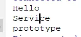


### BeanPostProcessor

如果说上面两个小点不重要，那么这一个就是重磅级的了，BeanPostProcessor是Spring扩展点之一，BeanPostProcessor是一个接口，程序员可以通过实现它，插手bean的实例化过程，在bean创建前后做一些事情。在Spring内部，也大量的运用了BeanPostProcessor来完成各种功能。我们可以看下Spring内部有多少类实现了BeanPostProcessor接口(注意，注意，前方高能)。

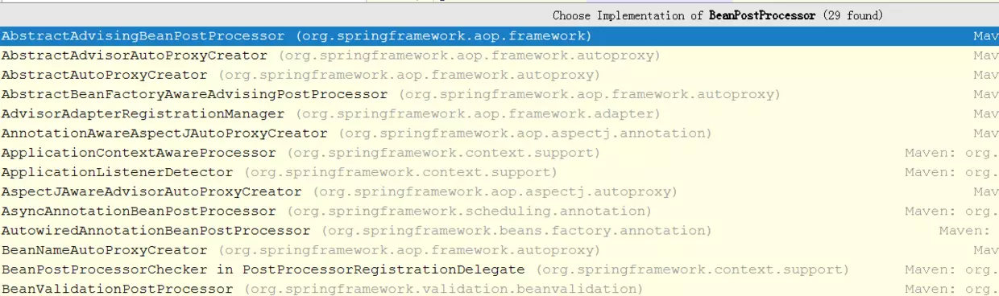

Spring内部有这么多类（间接）实现了BeanPostProcessor接口，可想而知这个接口的重要性，那么这个接口应该怎么使用呢，很简单，我们只需要写一个类去实现BeanPostProcessor接口就可以。

在这里，我利用这个接口，来完成一个阉割版的JDK动态代理的注入：

首先定义一个接口：

```
public interface Service {
    void query();
} 
```

实现类：

```
@Component
public class ServiceImpl implements  Service {
    @Override
    public void query() {
        System.out.println("正在查询中");
    }
} 
```

实现InvocationHandler接口：

```
public class MyInvationHandler implements InvocationHandler {
    private Object target;

    public MyInvationHandler(Object target){
        this.target=target;
    }
    @Override
    public Object invoke(Object proxy, Method method, Object[] args) throws Throwable {
        System.out.println("进来了");
        Object obj = method.invoke(target, args);
        System.out.println("出去了");
        return obj;
    }
} 
```

实现BeanPostProcessor 接口：

```java
@Component
public class MyBeanPostProcess implements BeanPostProcessor {
    @Override
    public Object postProcessBeforeInitialization(Object bean, String beanName) throws BeansException {
        Object o = Proxy.newProxyInstance(MyBeanPostProcess.class.getClassLoader(),
                bean.getClass().getInterfaces(), new MyInvationHandler(bean));
        return o;
    }

    @Override
    public Object postProcessAfterInitialization(Object bean, String beanName) throws BeansException {
        return bean;
    }
} 
```

配置类

```
@Configuration
@ComponentScan
public class AppConfig {
} 
```

测试方法：

```
public class Main {
    public static void main(String[] args) {
        AnnotationConfigApplicationContext context = new AnnotationConfigApplicationContext(AppConfig.class);
        context.getBean(Service.class).query();
    }
} 
```

运行结果：

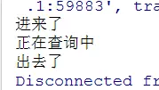


有木有很神奇，不管在main方法，还是业务的实现类，都没有看到JDK动态代理的影子，但是动态代理真真实实生效了，这就是BeanPostProcessor接口的神奇所在，事实上，Spring内部也是通过实现BeanPostProcessor接口来完成动态代理的，这个暂时不表。

### BeanFactoryPostProcessor

BeanFactoryPostProcessor也是Spring的扩展点，程序员可以通过实现它，读取bean的定义，然后对其进行修改，比如我需要修改bean的作用域为prototype，可以这么做：

```java
@Component
public class MyBeanFactoryPostProcessor implements BeanFactoryPostProcessor {
    @Override
    public void postProcessBeanFactory(ConfigurableListableBeanFactory factory) throws BeansException {
        factory.getBeanDefinition("repo").setScope("prototype");
    }
}

@Repository
public class Repo {
}

public class Main {
    public static void main(String[] args) {
        AnnotationConfigApplicationContext context = new AnnotationConfigApplicationContext(AppConfig.class);
        System.out.println(context.getBeanDefinition("repo").getScope());
    }
}
```


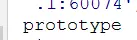

大家都知道bean的默认作用域为singleton，这里就通过实现BeanFactoryPostProcessor接口，把作用域改成了prototype。


***BeanFactoryPostProcessor 在 BeanPostProcessor之前。***

### 单例bean中有原型bean

如果一个单例的bean中，包含原型的bean，会发生什么事情呢？我们写一个例子看一下：

```java
@Configuration
@ComponentScan
public class AppConfig {
    @Bean
    @Scope("singleton")
    public Single singleton(){
        return new Single();
    }
    @Bean
    @Scope("prototype")
    public Prototype prototype(){
        return new Prototype();
    }
}

public class Single {
    public Single(){
        System.out.println("Single构造方法");
    }
    @Autowired
    private Prototype prototype;
    public Prototype getPrototype() {
        return prototype;
    }
    public void setPrototype(Prototype prototype) {
        this.prototype = prototype;
    }
    public void say() {
        System.out.println(this);
        prototype.say();
    }
}

public class Prototype {
    public Prototype(){
        System.out.println("Prototype构造方法");
    }
    public void say() {
        System.out.println(this);
    }
}

@Component
public class Test {
    @Autowired
    Single single;
    public void run() {
        for (int i = 0; i < 5; i++) {
            single.say();
        }
    }
}
```

因为代码比较长，避免大家上下来回滚动，我简单的说明下这段代码：Single类是单例的，Prototype是原型的，Single类依赖Prototype，分别给两个类添加一个构造方法，打印一句话，Single类中的方法调用Prototype类的方法，两个方法都打印this。然后再测试方法中自动注入Single，循环5次，调用Single类中的方法。

运行结果：

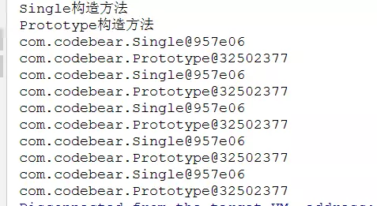


这结果明显有问题，Single因为是单例的，只能执行到一次构造方法，每次打印出来的对象也相同，这是没有问题的，但是Prototype是原型的，也只运行了一次构造函数，打印出来的对象也相同，这就有问题了。

这问题怎么解决呢？

#### ApplicationContextAware

对Single类进行改造，让它实现ApplicationContextAware接口中的setApplicationContext方法：

```
public class Single implements ApplicationContextAware {
    public Single() {
        System.out.println("Single构造方法");
    }

    private ApplicationContext context;

    public void say() {
        System.out.println(this);
        context.getBean(Prototype.class).say();
    }

    @Override
    public void setApplicationContext(ApplicationContext applicationContext) throws BeansException {
        this.context = applicationContext;
    }
}
复制代码
```

运行结果：

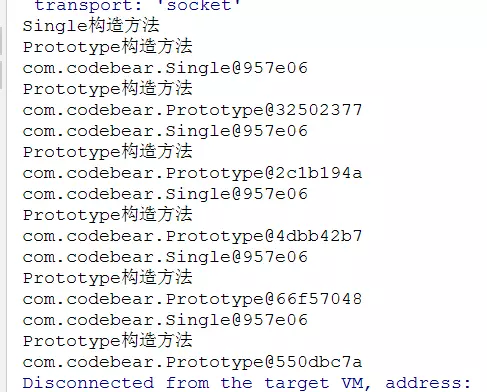


说的简单点，就是通过ApplicationContextAware接口中的setApplicationContext方法，获得ApplicationContext ，赋值给类中的变量ApplicationContext context， 然后从context中获得Prototype Bean。

此方法需要依赖ApplicationContext。

#### lookup

```
@Component
@Scope("singleton")
public class Single {
    public Single() {
        System.out.println("Single构造方法");
    }
    public void say() {
        System.out.println(this);
        getPrototype().say();
    }
    @Lookup
    public Prototype getPrototype() {
        return null;
    }
}
复制代码
@Component
@Scope("prototype")
public class Prototype {
    public Prototype(){
        System.out.println("Prototype构造方法");
    }

    public void say() {
        System.out.println(this);
    }
}
复制代码
```

运行结果：

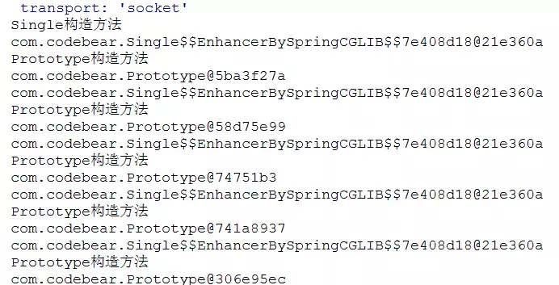


此方法需要把配置类中的定义bean改为在类上加注解的方式。

### Import

Import是Spring提供的注解，可以通过这个注解，在一个类引入另外一个类, 并且自动完成另外一个类的注册：

```
@Configuration
@Import(ServiceImpl.class)
public class AppConfig {
}
复制代码
public class ServiceImpl  {
    public void query() {
        System.out.println("正在查询中");
    }
}
复制代码
public class Main {
    public static void main(String[] args) {
        AnnotationConfigApplicationContext context = new AnnotationConfigApplicationContext(AppConfig.class);
        context.getBean(ServiceImpl.class).query();
    }
}
复制代码
```

运行结果：

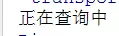

可以看到虽然ServiceImpl类上没有打上任何注解，但是在AppConfig配置类上通过Import注解，把ServiceImpl给引入进来了，并且自动注册了ServiceImpl。

也许，单单使用Import注解，会把代码搞得更复杂，所以需要搭配使用，才能把它的能力发挥出来，下面让我们有请ImportSelector。

#### ImportSelector

让我们把目光回到介绍BeanPostProcessor的这一段中，在其中，我们定义了一个MyBeanPostProcess来完成JDK动态代理，但是让我们想一个问题，如果我们不需要使用这个MyBeanPostProcess了，怎么办？我们需要把MyBeanPostProcess类上的Component注解删除，哪天又需要使用了，还得加上，如果只有一个类，还不算糟糕，但是如何有几十个类呢？相当麻烦，我们能不能在一个类中统一处理，需要启动哪些Bean就像Spring Boot 一样？当然可以。我们可以借助于ImportSelector来完成：

首先我们需要定义一个类，实现ImportSelector 中的 selectImports方法，这个方法返回的是需要与此类绑定的bean的名称的数组：

```
public class AspectSelector implements ImportSelector {
    @Override
    public String[] selectImports(AnnotationMetadata importingClassMetadata) {
        return new String[]{MyBeanPostProcess.class.getName()};
    }
}
```

我们再自定义一个注解，打上Import注解，引入上面的类：

```
@Import(AspectSelector.class)
@Retention(RetentionPolicy.RUNTIME)
public @interface EnableAspect{
} 
```

注意看AppConfig 的注解，多了一个EnableAspect注解：

```
@Configuration
@ComponentScan
@EnableAspect
public class AppConfig {
}
 
public class Main {
    public static void main(String[] args) {
        AnnotationConfigApplicationContext context = new AnnotationConfigApplicationContext(AppConfig.class);
        context.getBean(Service.class).query();
    }
}
 
```

然后我们把MyBeanPostProcess上的注解删除，运行：

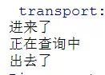


当我们不需要使用MyBeanPostProcess了，只要在AppConfig删除EnableAspect注解就OK了。

这是相当炫酷的一个技巧，在SpringBoot大量使用，比如开启事务管理EnableTransactionManagement。

### FactoryBean

FactoryBean经常会和BeanFactory放在一起比较，因为他们太像了，不过仅仅是长得像，其实它们完全不是同一个东西。

FactoryBean，是一种特殊的Bean，特殊在它除了自身是Baen，还可以生产Bean，是不是很符合FactoryBean这个名称？

FactoryBean是一个接口，我们需要实现它：

```java
@Component
public class MyFactoryBean implements FactoryBean {

    public Object getObject() throws Exception {
        return new DataSource();
    }
    @Override
    public Class<?> getObjectType() {
        return null;
    }
}

public class DataSource {
}

@Configuration
@ComponentScan
public class AppConfig {
}

public class Main {
    public static void main(String[] args) {
        AnnotationConfigApplicationContext context = new AnnotationConfigApplicationContext(AppConfig.class);
        System.out.println(context.getBean("myFactoryBean").getClass().getSimpleName());
        System.out.println(context.getBean("&myFactoryBean").getClass().getSimpleName());
    }
}

```

运行结果：

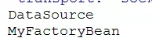


我们可以看到MyFactoryBean上打了一个Component，它可以被扫描到，但是DataSource上什么都没有加，按理来说，是没有被扫描到的，但是它就是被注册进去了，因为它实现了FactoryBean接口，在getObject方法返回了DataSource的实例，可以理解为DataSource是MyFactoryBean生产出来的一个Bean。

让我们仔细看下main方法和运行结果，可以看到 MyFactoryBean本身的BeanName是&myFactoryBean，MyFactoryBean生产出来的Bean的BeanName是myFactoryBean。

这有什么用呢？可以隐藏构建Bean的细节。如果我们的DataSource是第三方提供的，里面有一堆的字段需要配置，还有一堆的依赖，如果我们来配置的话，根本无法完成，最好的办法就是还是交给维护第三方去配置，但是DataSource是不能去修改的。这个时候，就可以用FactoryBean来完成，在getObject配置好DataSource，并且返回。我们经常使用的Mybatis也利用了FactoryBean接口。

Spring实在是太庞大了，很多功能都不是经常用，我在这里只是稍微罗列了几个小点，加上我们经常用的那些，可能还不及Spring的十分之一，这已经是乐观的了。

限于篇幅关系，这一章的内容到这里就结束了，其中BeanPostProcessor，BeanFactoryPostProcessor，FactoryBean，Import，ImportSelector这几块内容非常重要，正在由于这些，才让Spring变的更加灵活，更加好用。


https://juejin.im/post/5c637d1ef265da2d8a559586


## 第二节

在上一节中，我介绍了Spring中极为重要的BeanPostProcessor BeanFactoryPostProcessor Import ImportSelector，还介绍了一些其他的零碎知识点，正如我上一节所说的，Spring实在是太庞大了，是众多Java开发大神的结晶，很多功能，很多细节，可能一辈子都不会用到，不会发现，作为普通开发的我们，只能尽力去学习，去挖掘，也许哪天可以用到呢。

让我们进入正题吧。

### Full Lite

在上一节中的第一块内容，我们知道了Spring中除了可以注册我们最常用的配置类，还可以注册一个普通的Bean，今天我就来做一个补充说明。

如果你接到一个需求，要求写一个配置类，完成扫描，你会怎么写？

作为经常使用Spring的来说，这是一个入门级别的问题，并且在20秒钟之内就可以完成编码：

```
@Configuration
@ComponentScan
public class AppConfig {
}

public class Main {
    public static void main(String[] args) {
       AnnotationConfigApplicationContext context = new AnnotationConfigApplicationContext(AppConfig.class);
       context.getBean(ServiceImpl.class).query();
    }
}

@Component
public class ServiceImpl{
    public void query() {
        System.out.println("正在查询中");
    }
}

```

运行：

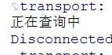


但是你有没有尝试过把AppConfig类上的@Configuration注解给去除？你在心里肯定会犯嘀咕，这不能去除啊，这个@Configuration注解申明了咱们的AppConfig是一个Spring配置类，去除了@Configuration注解，怎么可能可以呢？但是事实胜于雄辩，当我们把@Configuration注解给删除，再次运行，你会见证到奇迹：

```
@ComponentScan
public class AppConfig {
}

public class Main {
    public static void main(String[] args) {
       AnnotationConfigApplicationContext context = new AnnotationConfigApplicationContext(AppConfig.class);
       context.getBean(ServiceImpl.class).query();
    }
}

```

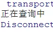

一点问题都没有！！！是不是到这里已经颠覆了你对Spring的认知。

其实，在Spring内部，把带上了@Configuration的配置类称之为Full配置类，把没有带上@Configuration，但是带上了@Component @ComponentScan @Import @ImportResource等注解的配置类称之为Lite配置类。

原谅我，实在找不到合适的中文翻译来表述这里的Full和Lite。

也许你会觉得这并没什么用，只是“茴的四种写法”而已。

别急，让我们看下去，将会继续刷新你的三观：

```
@ComponentScan
public class AppConfig {
}

```

注意现在的AppConfig类上没有加上@Configuration注解。

```
public class Main {
    public static void main(String[] args) {
        AnnotationConfigApplicationContext context = new AnnotationConfigApplicationContext(AppConfig.class);
        System.out.println(context.getBean(AppConfig.class).getClass().getSimpleName());
    }
}

```

我们注册了Lite配置类，并且从Spring容器中取出了Lite配置类，打印出它的类名。

运行：

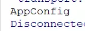


可以看到从容器取出来的就是AppConfig类，各位看官肯定会想，这不是废话吗，难道从容器取出来会变成了一只老母鸡？

别急嘛，让我们继续。

我们再在AppConfig类加上@Configuration注解，使其变成Full配置类，然后还是一样，注册这个配置类，取出这个配置类，打印类名：

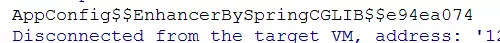


你会惊讶的发现，的确从容器里取出了一个老母鸡，哦，不，是一个奇怪的类，从类名我们可以看到CGLIB这个关键字，CGLIB是动态代理的一种实现方式，也就是说我们的Full配置类被CGLIB代理了。

你是不是从来都没有注意过，竟然会有如此奇怪的设定，但是更让人惊讶的事情还在后头，让我们想想，为什么好端端的类，Spring要用Cglib代理？这又不是AOP。Spring内部肯定做了一些什么！没错，确实做了！！！

下面让我们看看Spring到底做了什么：

```
public class ServiceImpl {
    public ServiceImpl() {
        System.out.println("ServiceImpl类的构造方法");
    }
}
```

ServiceImpl类中有一个构造方法，打印了一句话。

```
public class OtherImpl {
}
复制代码
```

再定义一个OtherImpl类，里面什么都没有。

```
public class AppConfig {
    @Bean
    public ServiceImpl getServiceImpl() {
        return new ServiceImpl();
    }

    @Bean
    public OtherImpl getOtherImpl() {
        getServiceImpl();
        return new OtherImpl();
    }
}
复制代码
```

这个AppConfig没有加上@Configuration注解，是一个Lite配置类，里面定义了两个@Bean方法，其中getServiceImpl方法创建并且返回了ServiceImpl类的对象，getOtherImpl方法再次调用了getServiceImpl方法。

然后我们注册这个配置类：

```
public class Main {
    public static void main(String[] args) {
        AnnotationConfigApplicationContext context = new AnnotationConfigApplicationContext(AppConfig.class);
    }
}
```

运行：

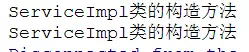

发现打印了两次"ServiceImpl类的构造方法"，这也很好理解，因为new了两次ServiceImpl嘛，肯定会执行两次ServiceImpl构造方法呀。

我们在把@Configuration注解给加上，让AppConfig称为一个Full配置类，再次运行：


你会惊讶的发现只打印了一次"ServiceImpl类的构造方法"，说明只调用了一次ServiceImpl类的构造方法，其实这也说的通啊，因为Bean默认是Singleton的，所以只会创建一次对象嘛。

但是问题来了，为什么我们明明new了两次ServiceImpl类，但是真正只new了一次？结合上面的内容，很容易知道答案，因为Full配置类被Cglib代理了，它已经不是我们原先定义的AppConfig类了，最终执行的是代理对象。

好了，这个问题就讨论到这里，至于为什么说（如何证明）带上@Configuration注解的配置类称之为Full配置类，不带的称之为Lite配置类，Cglib是怎么代理Full配置类的，代理的规则又是什么，这就涉及到Spring的源码解析了，就不在今天的讨论内容之中了。

### ImportBeanDefinitionRegistrar

大家一定使用过Mybatis，甚至使用过Mybatis的扩展，我在使用的时候，觉得太特么的神奇了，只要在配置类上打一个MapperScan注解，指定需要扫描哪些包。然后这些包里面只有接口，根本没有实现类，为什么可以完成数据库的一系列操作，不知道大家有没有和我一样的疑惑，直到我知道了ImportBeanDefinitionRegistrar这个神奇的接口，关于这个接口，我不知道该怎么去描述这个接口的作用，因为这个接口实在是太强大了，实在不是用简单的文字可以描述清楚的。下面我就利用这个接口来完成一个假的MapperScan，从中慢慢体验这个接口的强大，对了，这个接口要和Import注解配合使用。

首先需要定义一个注解：

```
@Import(CodeBearMapperScannerRegistrar.class)
@Retention(RetentionPolicy.RUNTIME)
public @interface CodeBearMapperScanner {
    String value();
}
复制代码
```

其中value就是需要扫描的包名，在这个注解类中又打了一个Import注解，来引ImportBeanDefinitionRegistrar类。

再定义一个注解：

```
@Retention(RetentionPolicy.RUNTIME)
public @interface CodeBearSql {
    String value();
}
复制代码
```

这个注解是打在方法上的，接收的是一个sql语句。

然后要定义一个类，去实现ImportBeanDefinitionRegistrar接口，重写提供的方法。

```
public class CodeBearMapperScannerRegistrar implements ImportBeanDefinitionRegistrar, ResourceLoaderAware {
    private ResourceLoader resourceLoader;

    @Override
    public void registerBeanDefinitions(AnnotationMetadata importingClassMetadata, BeanDefinitionRegistry registry) {
        try {
            AnnotationAttributes annoAttrs =
                    AnnotationAttributes.fromMap(importingClassMetadata.getAnnotationAttributes(CodeBearMapperScanner.class.getName()));
            String packageValue = annoAttrs.getString("value");
            String pathValue = packageValue.replace(".", "/");

            File[] files = resourceLoader.getResource(pathValue).getFile().listFiles();
            for (File file : files) {
                String name = file.getName().replace(".class", "");

                Class<?> aClass = Class.forName(packageValue + "." + name);
                if (aClass.isInterface()&&!aClass.isAnnotation()) {
                    BeanDefinitionBuilder beanDefinitionBuilder = BeanDefinitionBuilder.genericBeanDefinition();
                    AbstractBeanDefinition beanDefinition = beanDefinitionBuilder.getBeanDefinition();
                    beanDefinition.setBeanClass(CodeBeanFactoryBean.class);
                    beanDefinition.getConstructorArgumentValues().addGenericArgumentValue(packageValue + "." + name);
                    registry.registerBeanDefinition(name, beanDefinition);
                }
            }
        } catch (Exception ex) {
        }
    }

    @Override
    public void setResourceLoader(ResourceLoader resourceLoader) {
        this.resourceLoader = resourceLoader;
    }
}
复制代码
```

其中ResourceLoaderAware接口的作用不大，我只是利用这个接口，获得了ResourceLoader ，然后通过ResourceLoader去获得包下面的类而已。这方法的核心就是循环文件列表，根据包名和文件名，反射获得Class，接着判断Class是不是接口，如果是接口的话，动态注册Bean。如何动态去注册Bean呢？我在这里利用的是BeanDefinitionBuilder，通过BeanDefinitionBuilder获得一个BeanDefinition，此时BeanDefinition是一个很纯净的BeanDefinition，经过一些处理，再把最终的BeanDefinition注册到Spring容器。

关键就在于处理的这两行代码了，这里可能还看不懂，我们继续看下去。

我们需要再定义一个类，去实现FactoryBean，InvocationHandler两个接口：

```
public class CodeBeanFactoryBean implements FactoryBean, InvocationHandler {
    private Class clazz;

    public CodeBeanFactoryBean(Class clazz) {
        this.clazz = clazz;
    }

    @Override
    public Object invoke(Object proxy, Method method, Object[] args) throws Throwable {
        CodeBearSql annotation = method.getAnnotation(CodeBearSql.class);
        String sql= annotation.value();
        System.out.println(sql);
        return sql;
    }

    @Override
    public Object getObject() throws Exception {
        Object o = Proxy.newProxyInstance(this.getClass().getClassLoader(), new Class[]{clazz}, this);
        return o;
    }

    @Override
    public Class<?> getObjectType() {
        return clazz;
    }
}
复制代码
```

关于FactoryBean接口，在上一节中有介绍，这里就不再阐述了。

这个类有一个构造方法，接收的是一个Class，这里接收的就是用来进行数据库操作的接口。getObject方法中，就利用传进来的接口和动态代理来创建一个代理对象，此时这个代理对象就是FactoryBean生产的一个Bean了，只要对JDK动态代理有一定了解的人都知道，返回出来的代理对象实现了我们用来进行数据库操作的接口。

我们需要把这个Bean交给Spring去管理，所以就有了CodeBearMapperScannerRegistrar中的这行代码：

```
beanDefinition.setBeanClass(CodeBeanFactoryBean.class);
复制代码
```

因为创建CodeBeanFactoryBean对象需要一个Class参数。所以就有了CodeBearMapperScannerRegistrar中的这行代码：

```
//packageValue + "." +name  就是接口的全名称
beanDefinition.getConstructorArgumentValues().addGenericArgumentValue(packageValue + "." + name);
复制代码
```

invoke方法比较简单，就是获得CodeBearSql注解上的sql语句，然后打印一下，当然这里只是模拟下，所以并没有去查询数据库。

下面让我们测试一下吧：

```
public interface UserRepo {
    @CodeBearSql(value = "select * from user")
    void get();
}
复制代码
@Configuration
@CodeBearMapperScanner("com.codebear")
@ComponentScan
public class AppConfig {
}
复制代码
@Service
public class Test {

    @Autowired
    UserRepo userRepo;

    public  void get(){
        userRepo.get(); 
    }
}
复制代码
```

运行结果：


可以看到我们的功能已经实现了。其实Mybatis的MapperScan注解也是利用了ImportBeanDefinitionRegistrar接口去实现的。


可以看到第二块内容，其实已经比较复杂了，不光光有ImportBeanDefinitionRegistrar，还整合FactoryBean，还融入了动态代理。如果我们不知道FactoryBean，可能这个需求就很难实现了。所以每一块知识点都很重要。

这一节的内容到这里就结束了。


https://juejin.im/post/5c637d65f265da2dc6759b4a