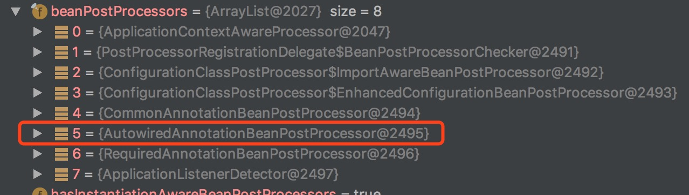
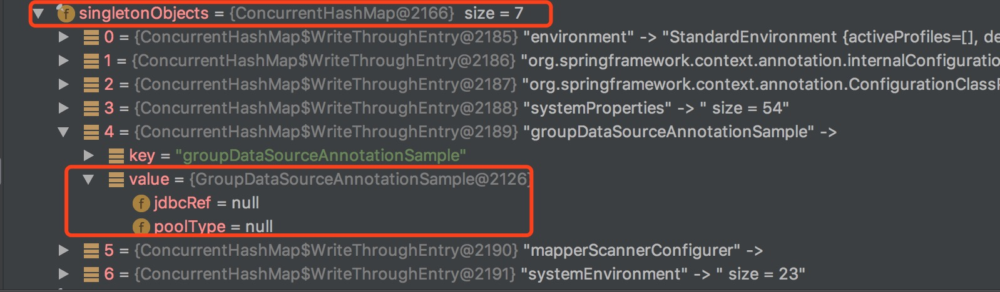

[TOC]


# spring容器启动@Value属性无法注入

 

## 问题

一个同事基于Annotation配置了一段代码，结果有一个Configuration类的两个@Value标注的属性值没有注入进来，代码如下:

```java
@Configuration
@PropertySource("mysql.properties")
public class GroupDataSourceAnatationSample {
    @Value("${zebra.jdbcref}")
    private String jdbcRef;

    @Value("${zebra.pooltype}")
    private String poolType;

    @Bean(destroyMethod = "close")
    public DataSource dataSource() {
        。。。。。。
    }

    @Bean
    public ZebraMapperScannerConfigurer mapperScannerConfigurer() {
        ZebraMapperScannerConfigurer mapperScannerConfigurer = new ZebraMapperScannerConfigurer();
        mapperScannerConfigurer.setBasePackage("com.sankuai.flight.flagship.mapper");
        return mapperScannerConfigurer;
    }

    @Bean
    public SqlSessionFactory sqlSessionFactoryBean() throws Exception {
        。。。。。。
    }
}
```

## 原因

上面这段代码是基于java Annotation注解配置的zebra-dao的demo，上述存在一个问题，就是Value注解标注的两个属性jdbcType和poolType的值不能被注入进来。这个原因有点复杂，需要对spring容器的加载比较熟悉，之前我有两篇博客已经分析了spring容器加载的源码，有兴趣可以看一下《[SpringIOC源码分析](http://yeming.me/2016/04/16/spring/)》《[SpringIOC源码分析二(Bean实例化)](http://yeming.me/2016/04/26/spring2/)》。这里稍微提一下。

[.jpg)](https://coding.net/u/lightoheaven/p/image/git/raw/master/posts/201604/spring2/refresh.jpg)

上面这个图是spring容器的加载顺序。ZebraMapperScannerConfigurer这个类实现了BeanDefinitionRegistryPostProcessor，这是一个BeanFactoryPostProcessor可以看到若实现了这个processor，那么会在第5步调用的时候触发这个processor，所以ZebraMapperScannerConfigurer这个类会先初始化。(本来初始化是第完成第6个步骤向spring容器注册了若干个BeanPostProcessor）

[](https://coding.net/u/lightoheaven/p/image2/git/raw/master/201704/WechatIMG3.jpeg)

注意第5个BeanPostProcessor，有了这个processor，才会在bean被实例化的时候调用这个processor来完成对@Value标注属性值的注入)。正因为现在在完成spring容器初始化第5个步骤的时候，由于实现了BeanDefinitionRegistryPostProcessor这个接口，会提前触发对ZebraMapperScannerConfigurer的实例化，可以把ZebraMapperScannerConfigurer看做GroupDataSourceAnatationSample的一个成员属性，所以也会提前触发GroupDataSourceAnatationSample的实例化，因为没有注册上述红框圈出的第5个BeanPostProcessor所以jdbcRef和poorType不会被注入。

[](https://coding.net/u/lightoheaven/p/image2/git/raw/master/201704/WechatIMG4.jpeg)

这个图是在ZebraMapperScannerConfigurer(singletonObject的第5个属性)初始化过程中debug出来的数据，证明了上述分析。**所以总结原因，就是因为ZebraMapperScannerConfigurer实现了BeanDefinitionRegistryPostProcessor这个接口造成后续spring容器的执行的一些顺序问题,引起了上述@Value属性不能注入**

## 解决问题

那么我们该怎么解决，我提供以下3种解决方案，下述三种方法都可以解决问题，大家有兴趣可以去尝试一下。

### 嵌套Configuration

```java
@Configuration
@PropertySource("annotation/mysql.properties")
public class GroupDataSourceAnnotationSample {

    @Configuration
    static class DataSourceConfig{
        @Value("${zebra.jdbcref}")
        //@Value("flagshipbiz_flagship_test")
        private String jdbcRef;

        @Value("${zebra.pooltype}")
        //@Value("tomcat-jdbc")
        private String poolType;

        @Bean(destroyMethod = "close")
        public DataSource dataSource() {
           。。。。。。
        }

        @Bean
        public SqlSessionFactory sqlSessionFactoryBean() throws Exception {
            。。。。。。
        }
    }

    @Bean
    public ZebraMapperScannerConfigurer mapperScannerConfigurer() {
        ZebraMapperScannerConfigurer mapperScannerConfigurer = new ZebraMapperScannerConfigurer();
        mapperScannerConfigurer.setBasePackage("com.dianping.zebra.sample.dao");
        return mapperScannerConfigurer;
    }
}
```

### 非单例(多例模式)

第二种方法@Scope(“protoType”)多例模式(这只是一个纯粹解决问题的方法，线上不推荐这里使用多例，还请注意)

```java
@Configuration
@Scope("protoType")
@PropertySource("mysql.properties")
public class GroupDataSourceAnatationSample {
    @Value("${zebra.jdbcref}")
    private String jdbcRef;

    @Value("${zebra.pooltype}")
    private String poolType;

    @Bean(destroyMethod = "close")
    public DataSource dataSource() {
        。。。。。。
    }

    @Bean
    public ZebraMapperScannerConfigurer mapperScannerConfigurer() {
        ZebraMapperScannerConfigurer mapperScannerConfigurer = new ZebraMapperScannerConfigurer();
        mapperScannerConfigurer.setBasePackage("com.sankuai.flight.flagship.mapper");
        return mapperScannerConfigurer;
    }

    @Bean
    public SqlSessionFactory sqlSessionFactoryBean() throws Exception {
        。。。。。。
    }
}
```

### 拆分配置类

把ZebraMapperScannerConfigurer这个bean的配置从上述DataSource中抽出来，单独放到另外一个独立的@Configuration类里面。

## 参考

- [SpringIOC源码分析](http://yeming.me/2016/04/16/spring/)
- [SpringIOC源码分析二(Bean实例化)](http://yeming.me/2016/04/26/spring2/)


http://yeming.me/2017/04/16/springValueAnnotation/