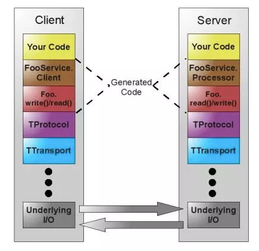
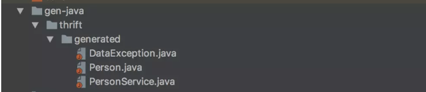

[toc]

# Apache Thrift 安装及快速入门

## Apache Thrift是什么？

> The Apache Thrift software framework, for scalable cross-language services development, combines a software stack with a code generation engine to build services that work efficiently and seamlessly between C++, Java, Python, PHP, Ruby, Erlang, Perl, Haskell, C#, Cocoa, JavaScript, Node.js, Smalltalk, OCaml and Delphi and other languages.

Apache Thrift软件框架用于可扩展的跨语言服务开发，将软件堆栈与代码生成引擎相结合，构建可在C ++，Java，Python，PHP，Ruby，Erlang，Perl，Haskell，C＃之间高效无缝工作的服务， Cocoa，JavaScript，Node.js，Smalltalk，OCaml和Delphi等语言。

Thrift最初由facebook研发，主要用于各个服务之间的RPC通信，支持跨语言，支持的语言有C++，Java，Python，PHP，Ruby，Erlang，PErl，Haskell，C#，Cocoa，JavaScript，Node.js,
Smalltalk,and OCaml都支持。

Thrift是一个典型的CS（客户端/服务端）结构，客户端和服务端可以使用不同的语言开发。既然客户端和服务器端能使用不同的语言开发，那么一定就要有一种中间语言来关联客户端和服务器端的语言。这种语言就是IDL（Interface Description Language）。

Thrift不支持无符号类型，因为很多编程语言不存在无符号类型，比如说java。一个RPC框架如果支持多种语言，那么这个RPC框架所支持的数据类型一定是这个RPC框架多语言支持的数据类型的交集。

## Apache Thrift的一些概念

### Thrift支持的数据类型

bool: 布尔类型（true或者false）

byte: 有符号字节

i16: 16位有符号整数

i32: 32位有符号整数

i64: 64位有符号整数

double: 64位浮点数

string: 字符串

集合中的元素可以是除了service之外的任何类型，包括exception。这边的service和exception是Thrift支持的组件，Thrift支持三种组件，分别是Structs（结构体），Service（客户端和服务端通信的接口），exception（客户端和服务端通信接口抛出的异常）

**结构体（struct）**
就像C语言一样，Thrift支持struct类型，目的就是将一些数据聚合在一起，方便传输管理，struct的定义形式如下：

```
struct People{
    1:string name;
    2:i32 age;
    3:string gender;
 }
```

**枚举（enum）**
枚举的定义形式和Java的Enum定义类似

```
enum Gender{
    MALE,
    FEMALE
}
```

**异常(exception)**
Thrift支持自定义exception，规则与struct一样

```
exception RequestException{
    1: i32 code;
    2: string reason;
 }
```

**服务(service)**
Thrift定义服务相当于Java中创建Interface一样，创建的service经过代码生成命令之后就会生成客户端和服务器端的框架代码。定义形式如下：

```
service HelloWorldService{
    //service中定义的函数，相当于Java Interface中定义的方法
    string doAction(1:string name,2:i32 age);
}
```

**类型定义**
Thrift支持类似C++一样的typedef定义，比如我们对i32不熟悉，我们就使用int类代替i32，比如我们对i64不熟悉，我们就使用long代替i64

```
typedef i32 int 
typedef i64 long
```

**常量(const)**
Thrift也支持常量定义，使用const关键字

```
const i32 MIN_GATE=30
const string MY_WEBSITE="http://facebook.com"
```

**命名空间**
Thrift的命名空间相当于java中的package的意思，主要目的是组织代码。Thift使用关键字namespave定义命名空间：

```
namespace java com.test.thift.demo
```

格式是：namespace 语言名 路径

**文件包含**
Thrift也支持文件包含，相当于C/C++中的include，java中的import。使用关键字include定义:

```
include "global.thift"
```

**注释**
Thrift注释方式支持shell风格的注释，支持C/C++风格的注释，即#和开头的语句都当作注释，/**/包裹的语句也是注释。

**可选与必选**
Thrift提供两个关键字required，optional，分别用于表示对应的字段是必填的还是可选的

```
struct People{
    1:required string name;
    2:optional i32 age;
}
```

**Thrift传输格式（协议)**

1. TBinaryProtocal-二进制格式
2. TCompactProtocol-压缩格式
3. TJSONProtocol-JSON格式
4. TSimpleJSONProtocol-提供JSON只写协议，生成的文件很容易通过脚本语言解析
5. TDebugProtocol-使用易懂的可读文本格式，以便于debug

**Thrift数据传输方式**

1. TSocket-阻塞式socket
2. TFramedTransport-以frame为单位进行传输，非阻塞式服务中使用
3. TFileTransport-以文件形式进行传输
4. TMemoryInputTransport-将内存用语I/O，Java实现时内部实际使用了简单的ByteArrayOutputStream。
5. TZlibTransport-使用zlib进行压缩，与其他传输方式联合使用。当前无java实现。

**Thrift支持的服务模型**

1. TThreadPoolServer - 简单的单线程服务模型，常用于测试
2. TSimpleServer - 多线程服务模型，使用标准的阻塞式IO
3. TNonblockingServer - 多线程服务模型，使用非阻塞式IO（需要使用TFramedTransport数据传输方式）
4. THsHaServer-THsHa引入了线程池去处理，其模型把读写任务放到线程池处理;Half-sync/Half-async的处理模式，Half-async是在处理IO事件上
   （accept/read/write io),Half-sync用于handler对rpc的同步处理。

**注意**
一般在工作中使用TCompactProtocol传输协议，使用TFramedTransport数据传输方式，使用THsHaServer服务模型。

### Thrift支持的容器类型

list：一系列由T类型的数据组成的有序列表，元素可以重复。
set：一系列由T类型的数据组成的无序集合，元素不可重复。
map：一个字典结构，key为k类型，value为V类型，相当于java中的HashMap
以上集合容器都可以使用泛型的。

## Thrift工作原理

**如何实现多语言之间的通信？**
数据传输实现socket（多种语言均支持），数据再以特定的格式（String等）发送，接收方语言进行解析。
Apache Thrift定义的thrift的文件（IDL），由thrift文件（IDL）生成双方语言的接口，model，在生成的model以及接口中会有解码编码的代码。

## Thrift 架构



Thrift架构图

## Thrift的安装

官方网站提供的[下载安装地址](https://link.jianshu.com/?t=http://thrift.apache.org/docs/install/)，根据不同的操作系统选择自己的安装方式

mac电脑推荐使用更简单的安装方式Homebrew工具，
[Homebrew官方网址](https://link.jianshu.com/?t=https://brew.sh/)

先安装Homebrew：

```
/usr/bin/ruby -e "$(curl -fsSL https://raw.githubusercontent.com/Homebrew/install/master/install)"
```

安装成功之后，检测Homebrew：

```
➜  ~ which brew
/usr/local/bin/brew
```

安装Apache Thrift

```
➜  ~ brew install thrift
```

安装完成之后：
查看具体安装信息：

```
➜  ~ which thrift
/usr/local/bin/thrift
➜  ~ thrift --version
Thrift version 0.10.0
thrift --help
```

## 快速入门

### 定义idl文件

先定义一个idl文件（接口描述文件），定义了结构体（struct），异常（exception）和服务（service）

```
namespace java thrift.generated

typedef i16 short
typedef i32 int
typedef i64 long
typedef bool boolean
typedef string String

struct Person{
    1: optional String username,
    2: optional int age,
    3: optional boolean married
}

exception DataException{
    1: optional String message,
    2: optional String callStack,
    3: optional String date
}

service PersonService{
    Person getPersonByUsername(1: required String username) throws (1: DataException dateException),

    void savePerson(1: required Person person) throws (1: DataException dataException)
}
```

### 使用thrift编译器生成编译文件

```
thrift --gen java src/thrift/data.thrift
```




java生成的代码

将生成的代码复制到src/main目录下，发现报错，加入java的依赖pom文件：

```
<dependency>
    <groupId>org.apache.thrift</groupId>
    <artifactId>libthrift</artifactId>
    <version>0.10.0</version>
</dependency>
```

### 使用java编写客户端与服务器端的代码

编写接口实现类，实际开发中放在服务端

```
import org.apache.thrift.TException;
import thrift.generated.DataException;
import thrift.generated.Person;
import thrift.generated.PersonService;

public class PersonServiceImpl implements PersonService.Iface{

    @Override
    public Person getPersonByUsername(String username) throws DataException, TException {
        System.out.println("Got client Param:" + username);

        Person person = new Person();
        person.setUsername(username);
        person.setAge(32);
        person.setMarried(true);

        return person;
    }

    @Override
    public void savePerson(Person person) throws DataException, TException {
        System.out.println("Got Client Param: ");

        System.out.println(person.getUsername());
        System.out.println(person.getAge());
        System.out.println(person.isMarried());
    }
}
```

服务器端代码：

```
import org.apache.thrift.TProcessorFactory;
import org.apache.thrift.protocol.TCompactProtocol;
import org.apache.thrift.server.THsHaServer;
import org.apache.thrift.server.TServer;
import org.apache.thrift.transport.TFramedTransport;
import org.apache.thrift.transport.TNonblockingServerSocket;
import thrift.generated.PersonService;

public class ThriftServer {
    public static void main(String[] args) throws Exception{

        TNonblockingServerSocket socket = new TNonblockingServerSocket(8899);
        THsHaServer.Args arg = new THsHaServer.Args(socket).minWorkerThreads(2).maxWorkerThreads(4);
        //范型就是实现的接收类
        PersonService.Processor<PersonServiceImpl> processor = new PersonService.Processor<>(new PersonServiceImpl());

        //表示协议层次（压缩协议）
        arg.protocolFactory(new TCompactProtocol.Factory());
        //表示传输层次
        arg.transportFactory(new TFramedTransport.Factory());
        arg.processorFactory(new TProcessorFactory(processor));

        //半同步半异步的server
        TServer server = new THsHaServer(arg);

        System.out.println("Thrift Server started!");

        //死循环，永远不会退出
        server.serve();
    }
}
```

客户端代码：

```
import org.apache.thrift.protocol.TCompactProtocol;
import org.apache.thrift.protocol.TProtocol;
import org.apache.thrift.transport.TFastFramedTransport;
import org.apache.thrift.transport.TSocket;
import org.apache.thrift.transport.TTransport;
import thrift.generated.Person;
import thrift.generated.PersonService;

//服务端的协议和客户端的协议要一致
public class ThriftClient {
    public static void main(String[] args) {

        TTransport tTransport = new TFastFramedTransport(new TSocket("localhost",8899),600);
        TProtocol tProtocol = new TCompactProtocol(tTransport);
        PersonService.Client client = new PersonService.Client(tProtocol);

        try{
            tTransport.open();

            Person person = client.getPersonByUsername("张三");

            System.out.println(person.getUsername());
            System.out.println(person.getAge());
            System.out.println(person.isMarried());

            System.out.println("............");

            Person person2 = new Person();

            person2.setUsername("李四");
            person2.setAge(30);
            person2.setMarried(true);

            client.savePerson(person2);
        }catch (Exception ex){
            throw new  RuntimeException(ex.getMessage(),ex);
        }finally {
            tTransport.close();
        }
    }
}
```

启动服务器，再启动客户端，
客户端打印：

```
Received 1
张三
32
true
............
Received 2
```

服务器端打印：

```
Thrift Server started!
Got client Param:张三
Got Client Param: 
李四
30
true
```

跟我们之前的Google Protobuf相比，Google Protobuf只是进行编解码（序列化与反序列）操作，使用netty作为网络载体，进行远程方法调用。而Thrift不仅仅既可以进行编解码工作，还提供传输对象功能，并且可以自己定义业务接口。

## 参考资料

[官网](https://link.jianshu.com/?t=http://thrift.apache.org/)


<https://www.jianshu.com/p/bfcba5f0eaa1>